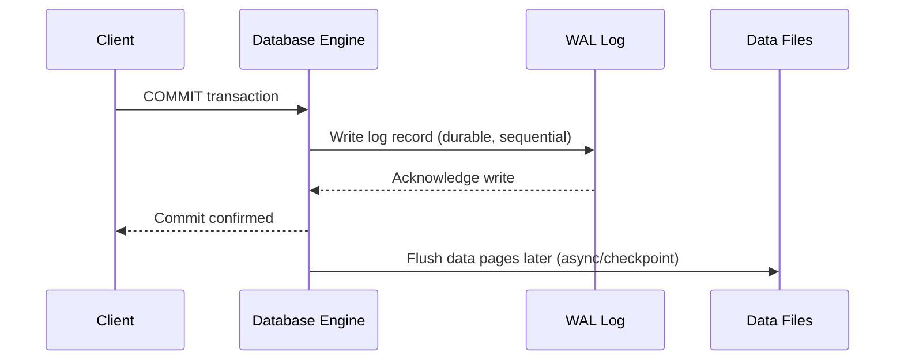

# Backup and Recovery

## Theory

### Full Backup

A full backup captures the entire database — all data files, schema, and typically enough metadata to restore the database to a standalone, consistent state. It's the simplest recovery method (one file/set to restore from) but the most time- and storage-intensive to create repeatedly.

```bash
# Example: full backup with pg_dump
pg_dump -U postgres -F c -f full_backup.dump mydatabase
```

### Incremental Backup

An incremental backup captures only the data that has changed since the **last backup of any type** (full or incremental). This makes incremental backups fast and small, but restoring requires the last full backup plus every incremental backup taken since, applied in sequence.

### Differential Backup

A differential backup captures all changes made since the **last full backup** (not since the last differential). This means differential backups grow larger over time until the next full backup, but restoring only requires the last full backup plus the single most recent differential.

| Aspect | Full | Incremental | Differential |
|---|---|---|---|
| Captures | Entire database | Changes since last backup (any type) | Changes since last full backup |
| Backup size/time | Largest | Smallest | Medium, grows until next full |
| Restore complexity | Simplest (1 file) | Most complex (full + all incrementals in order) | Moderate (full + latest differential) |
| Restore speed | Fast | Slowest | Faster than incremental |

### Point-in-Time Recovery

Point-in-time recovery (PITR) restores a database to a specific moment in time (e.g., just before an accidental `DROP TABLE`), rather than only to the moment of the last backup. It works by combining a base backup with the transaction/write-ahead log replayed up to the desired timestamp.

```bash
# Conceptual PITR flow with PostgreSQL
# 1. Restore base backup
# 2. Configure recovery_target_time in postgresql.conf / recovery.conf
recovery_target_time = '2026-08-01 14:30:00'
```

- **Advantages:** precise recovery from human error or corruption, minimizes data loss window
- **Disadvantages:** requires continuous log archiving (storage/operational overhead), replay time can be long for large logs

### Crash Recovery

Crash recovery is the automatic process a database performs on restart after an unexpected shutdown (power loss, crash) to restore the database to a consistent state. It typically uses the write-ahead log to redo committed transactions that weren't yet flushed to disk and undo uncommitted transactions that were partially applied.

### Write-Ahead Logging (WAL)

WAL is a technique where changes to data are first recorded in a durable log before being applied to the actual data files. This guarantees durability and enables crash recovery — since even if the database crashes before writing changes to disk, the log can be replayed to reconstruct the correct state.



- **Advantages:** durability guarantee without requiring every data page write to be synchronous, faster commits (sequential log writes vs random data writes), enables crash recovery and replication
- **Disadvantages:** additional storage for logs, log management/archiving complexity

### Recovery Models

A recovery model defines how much transaction log history a database retains and how it's used for recovery — common models include Simple (minimal logging, no PITR, log space reused quickly), Full (all transactions logged, supports PITR, requires log backups), and Bulk-Logged (minimal logging for bulk operations, otherwise like Full). Choosing a recovery model is a trade-off between storage/performance overhead and recovery granularity.

- **Advantages of Full recovery model:** point-in-time recovery, minimal data loss
- **Disadvantages of Full recovery model:** requires regular log backups or the log file grows unbounded

### Interview Questions

- **Q: What's the difference between an incremental and a differential backup?**
  A: Incremental backs up changes since the last backup of any kind (chained, smaller each time), while differential backs up all changes since the last full backup (grows over time but simpler to restore).
- **Q: If you need the fastest possible restore time, which backup strategy would you choose and why?**
  A: Full backups restore fastest since only one file is needed; if using incremental/differential strategies for storage efficiency, differential offers a faster restore than incremental since only two backups (full + latest differential) are needed.
- **Q: How does point-in-time recovery work?**
  A: It restores a base backup and then replays the write-ahead log up to a specific timestamp, allowing recovery to a moment just before a problematic event like accidental data deletion.
- **Q: Why is write-ahead logging important for durability?**
  A: By writing changes to a durable log before applying them to data files, the database guarantees committed transactions survive a crash — recovery simply replays the log rather than relying on data files always being fully up to date.
- **Q: What happens during crash recovery when the database restarts unexpectedly?**
  A: The engine reads the WAL, redoes committed transactions not yet flushed to disk, and undoes any uncommitted/partial transactions, bringing the database back to a consistent state.
- **Q: An engineer accidentally runs `DELETE FROM orders` without a WHERE clause at 2:15 PM. How would you recover the data?**
  A: Use point-in-time recovery — restore the most recent base backup and replay the WAL/transaction log up to just before 2:15 PM, then validate and cut over.
- **Q: What's the trade-off of choosing the Simple recovery model over Full?**
  A: Simple has lower log storage/management overhead but sacrifices point-in-time recovery — you can only restore to the last full/differential backup, not to an arbitrary moment.
- **Q: Why might a full backup every night still not be sufficient for a critical production database?**
  A: A full nightly backup only allows recovery to the last backup point, potentially losing up to a day's data on failure; combining it with continuous WAL archiving enables point-in-time recovery to minimize data loss.

