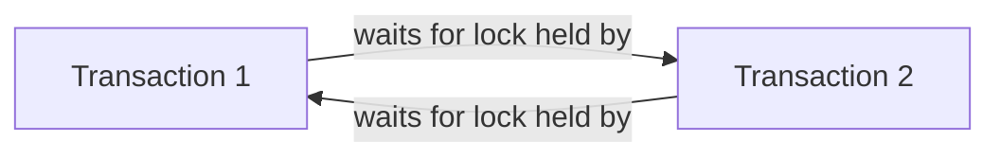

# Concurrency Control

## Theory

### Concurrent Transactions

Concurrent transactions are multiple transactions executing at (or near) the same time against a shared database. Concurrency improves throughput and resource utilization, but without proper control it can lead to anomalies like lost updates, dirty reads, and inconsistent results — which is why databases use locking, isolation levels, and MVCC to manage it.

### Lost Update Problem

The lost update problem occurs when two transactions read the same value, then both write back an updated value based on what they read — the second write overwrites the first, silently discarding one of the updates.

**Real-life scenario:** Two customers try to book the last seat on a flight at the same time. Both read "1 seat available," both proceed to book, and both writes succeed sequentially — the seat gets oversold because neither transaction saw the other's update.

```sql
-- Transaction 1                      -- Transaction 2
SELECT seats_available FROM flight    SELECT seats_available FROM flight
WHERE flight_id = 1;  -- reads 1      WHERE flight_id = 1;  -- reads 1
UPDATE flight SET seats_available = 0 UPDATE flight SET seats_available = 0
WHERE flight_id = 1;                  WHERE flight_id = 1;
-- Both bookings succeed; one seat oversold
```

### Dirty Read

A dirty read occurs when a transaction reads data written by another transaction that has not yet committed. If the writing transaction later rolls back, the reader has used data that never actually existed in the database.

### Non-Repeatable Read

A non-repeatable read occurs when a transaction reads the same row twice and gets different values, because another transaction updated and committed a change to that row in between the two reads.

### Phantom Read

A phantom read occurs when a transaction re-runs a query with a filter condition and gets a different *set of rows* than before, because another transaction inserted or deleted rows matching that condition in between.

**Differences: Dirty Read vs Non-Repeatable Read vs Phantom Read**

| Anomaly | What changes between two reads | Cause |
|---|---|---|
| Dirty Read | Reads uncommitted data from another transaction | Reading before the writer commits |
| Non-Repeatable Read | Same row's value changes | Another transaction updates and commits that row |
| Phantom Read | The set of rows matching a query changes | Another transaction inserts/deletes matching rows |

### Isolation Levels

Isolation levels control the trade-off between consistency and concurrency by determining which of the above anomalies are allowed to occur.

| Isolation Level | Dirty Read | Non-Repeatable Read | Phantom Read |
|---|---|---|---|
| Read Uncommitted | Possible | Possible | Possible |
| Read Committed | Prevented | Possible | Possible |
| Repeatable Read | Prevented | Prevented | Possible (varies by DB) |
| Serializable | Prevented | Prevented | Prevented |

```sql
SET TRANSACTION ISOLATION LEVEL READ COMMITTED;
START TRANSACTION;
SELECT balance FROM account WHERE account_id = 'A';
COMMIT;
```

### Locking

Locking is a concurrency control mechanism where a transaction acquires a lock on a data item before accessing it, preventing other transactions from making conflicting accesses until the lock is released. Locks are the primary tool pessimistic concurrency control uses to enforce isolation.

### Shared Locks

A shared (S) lock is acquired for reading a data item, and multiple transactions can hold a shared lock on the same item simultaneously — reads don't block other reads.

### Exclusive Locks

An exclusive (X) lock is acquired for writing a data item, and no other transaction can hold any lock (shared or exclusive) on that item while it's held — writes block all other reads and writes on that item.

**Differences: Shared Lock vs Exclusive Lock**

| Aspect | Shared Lock (S) | Exclusive Lock (X) |
|---|---|---|
| Purpose | Reading data | Writing data |
| Compatibility | Multiple shared locks allowed together | Blocks all other locks |
| Typical use | `SELECT` | `UPDATE`, `DELETE`, `INSERT` |

```sql
-- Pessimistic locking: acquire an exclusive lock on the row before updating
START TRANSACTION;
SELECT * FROM account WHERE account_id = 'A' FOR UPDATE;
UPDATE account SET balance = balance - 100 WHERE account_id = 'A';
COMMIT;
```

### Optimistic Locking

Optimistic locking assumes conflicts are rare: transactions proceed without acquiring locks, and instead a version number (or timestamp) is checked at commit time — if the row changed since it was read, the update is rejected and must be retried.

```sql
UPDATE account
SET balance = balance - 100, version = version + 1
WHERE account_id = 'A' AND version = 5;
-- if 0 rows affected, another transaction updated it first; retry
```

### Pessimistic Locking

Pessimistic locking assumes conflicts are likely: a transaction acquires a lock on data before working with it, blocking other transactions from conflicting access until it's done (e.g., `SELECT ... FOR UPDATE`).

**Differences: Optimistic vs Pessimistic Locking**

| Aspect | Optimistic Locking | Pessimistic Locking |
|---|---|---|
| Assumption | Conflicts are rare | Conflicts are common |
| Mechanism | Version/timestamp check at commit | Locks acquired up front |
| Concurrency | Higher (no blocking while reading) | Lower (readers/writers may block) |
| Failure mode | Retry on conflict at commit time | Blocks/waits, or deadlocks |
| Best for | Low-contention, high-read workloads | High-contention, write-heavy workloads |

### Deadlocks

A deadlock occurs when two or more transactions are each waiting for a lock held by the other, so none of them can ever proceed. The database must detect this cycle and forcibly abort one of the transactions (the "victim") to break it.

**Real-life scenario:** Transaction 1 locks Account A and then wants to lock Account B; Transaction 2 has already locked Account B and wants to lock Account A. Each waits forever for the other to release its lock.



### Deadlock Prevention

Deadlock prevention avoids deadlocks before they happen, typically by imposing a strict ordering on how locks are acquired (e.g., always lock accounts in ascending `account_id` order) or by using timeouts/wait-die schemes based on transaction age.

### Deadlock Detection

Deadlock detection lets deadlocks occur but periodically checks for cycles in a wait-for graph of transactions blocked on each other's locks; when a cycle is found, the database aborts one transaction (rolls it back) to let the others proceed.

### Multiversion Concurrency Control (MVCC)

MVCC allows readers and writers to avoid blocking each other by keeping multiple versions of a row: each transaction sees a consistent snapshot of the data as of when it started (or as of each statement), while writers create new row versions rather than overwriting in place. This is how databases like PostgreSQL and MySQL/InnoDB provide high concurrency without readers blocking writers.

**Advantages**

- Readers never block writers and vice versa, improving concurrency.
- Provides consistent snapshots for repeatable-read/serializable isolation without heavy locking.

**Disadvantages**

- Requires storing multiple row versions, increasing storage and requiring periodic cleanup (e.g., PostgreSQL's `VACUUM`).
- Write-write conflicts still need to be resolved (e.g., via optimistic checks or locks).

### Interview Questions

- **Q: What is the difference between a dirty read and a non-repeatable read?**
  A: A dirty read sees another transaction's uncommitted data; a non-repeatable read sees a row change value between two reads within the same transaction because the other transaction committed in between.
- **Q: Describe a real deadlock scenario and how you would prevent it.**
  A: Transaction 1 locks Account A then waits for Account B, while Transaction 2 locks Account B then waits for Account A — a circular wait. Prevention: always acquire locks in a consistent global order (e.g., by ascending account ID) so a cycle can't form.
- **Q: What's the difference between optimistic and pessimistic locking, and when would you choose each?**
  A: Optimistic locking checks for conflicts at commit time using a version column, best for low-contention reads; pessimistic locking acquires locks upfront, best for high-contention writes where retries would be costly.
- **Q: How does MVCC allow readers and writers to avoid blocking each other?**
  A: By keeping multiple versions of each row, readers see a consistent snapshot from when their transaction/statement began while writers create new versions, so reads never need to wait for writes to finish.
- **Q: What isolation level would you choose to prevent phantom reads, and what's the trade-off?**
  A: Serializable, since it prevents dirty reads, non-repeatable reads, and phantom reads — the trade-off is reduced concurrency due to more locking/serialization overhead.
- **Q: What is the lost update problem, and how can it be prevented?**
  A: It's when two transactions read the same value and both write back an update, causing one update to silently overwrite the other; it can be prevented with pessimistic locking (`SELECT ... FOR UPDATE`) or optimistic locking with version checks.
- **Q: What's the difference between deadlock prevention and deadlock detection?**
  A: Prevention avoids deadlocks proactively (e.g., strict lock ordering); detection allows them to occur but periodically scans for wait-for cycles and aborts a transaction to resolve it.
- **Q: Can a shared lock and an exclusive lock be held on the same row at the same time?**
  A: No — an exclusive lock is incompatible with any other lock (shared or exclusive) on the same item; only multiple shared locks can coexist.
- **Q: Why might repeatable read still allow phantom reads in some databases?**
  A: Because repeatable read guarantees that already-read *rows* won't change, but doesn't necessarily lock the range of rows a query could match, so newly inserted rows matching the query's filter can still appear (implementation-dependent; some databases like PostgreSQL prevent phantoms at this level via snapshot isolation).
- **Q: How would you handle a high-contention "seat booking" feature to avoid overselling?**
  A: Use pessimistic locking (`SELECT ... FOR UPDATE`) on the seat/inventory row during booking, or optimistic locking with a version/quantity check on update, combined with a unique constraint to guarantee at most one booking per seat.

