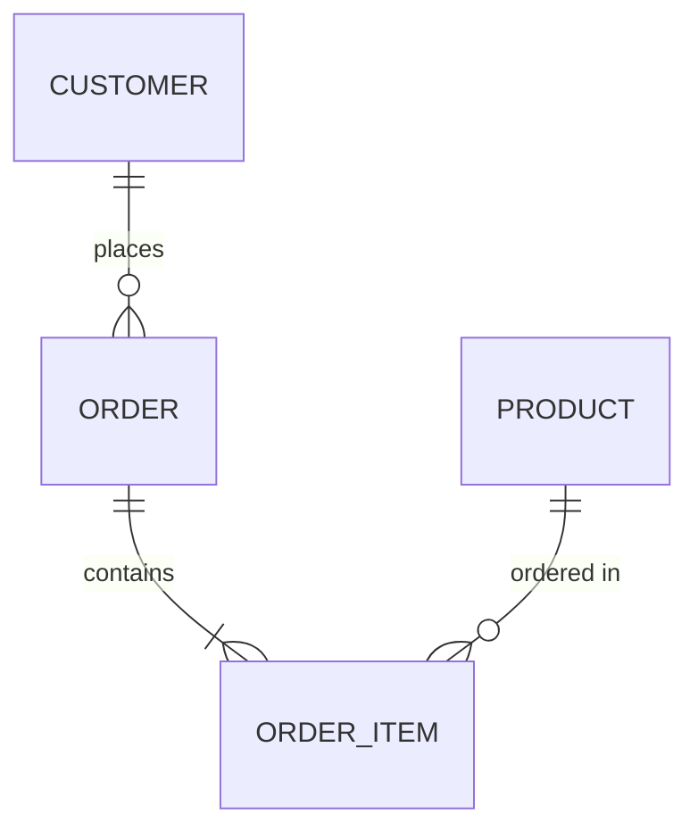

# Database Design

## Theory

### Requirement Analysis

Requirement analysis is the initial phase of database design where the designer gathers business needs from stakeholders — what data must be stored, how it will be used, expected volume/growth, and query patterns. Poor requirement analysis is one of the most common root causes of database designs that fail to scale or meet business needs later on.

### Conceptual Design

Conceptual design produces a high-level, technology-independent model of the data, typically an Entity-Relationship (ER) diagram identifying entities, attributes, and relationships (one-to-one, one-to-many, many-to-many) without worrying about how it will be implemented in a specific DBMS. This model is meant to be understandable by both technical and non-technical stakeholders.

### Logical Design

Logical design translates the conceptual ER model into a structured schema — typically relational tables, columns, data types, primary/foreign keys, and constraints — while remaining independent of any specific database product. Normalization (1NF, 2NF, 3NF, BCNF) is applied at this stage to eliminate redundancy and update anomalies.

### Physical Design

Physical design determines how the logical schema is actually implemented and stored on a specific DBMS: choice of indexes, partitioning strategy, storage engine, file organization, and denormalization decisions made for performance. This stage is where trade-offs between normalization (data integrity) and performance (query speed) are made concretely.

### Schema Design Best Practices

- Normalize to at least 3NF to avoid update/insert/delete anomalies, then selectively denormalize only where performance profiling justifies it.
- Choose appropriate data types and constraints (`NOT NULL`, `CHECK`, foreign keys) to enforce integrity at the database level rather than relying solely on application code.
- Use surrogate keys (auto-increment/UUID) for primary keys when natural keys are unstable, composite, or may change.
- Index foreign key columns, since joins and cascading deletes commonly filter on them.
- Plan for growth: consider partitioning/sharding strategy and archival policy before the table grows too large to migrate easily.

### Interview Questions

- **Q: What are the main phases of database design, in order?**
  A: Requirement analysis → conceptual design (ER model) → logical design (normalized relational schema) → physical design (indexes, partitioning, storage-specific decisions).
- **Q: What is the difference between conceptual and logical design?**
  A: Conceptual design is a technology-independent, high-level model of entities and relationships (e.g., an ER diagram), while logical design translates that model into a concrete relational schema with tables, columns, and normalization applied.
- **Q: Why might a designer intentionally denormalize a schema during physical design?**
  A: To improve read performance for specific, frequent queries (e.g., avoiding expensive joins) at the cost of some data redundancy and more complex update logic.
- **Q: What could go wrong if requirement analysis is skipped or done poorly?**
  A: The resulting schema may not support required query patterns or scale, leading to costly redesigns, migrations, or workarounds later in the project.
- **Q: Why should foreign key columns typically be indexed?**
  A: Because joins, and cascading updates/deletes on the referenced table, frequently filter or look up rows by the foreign key column, and without an index this requires a full scan of the child table.
- **Q: What is a surrogate key and when would you prefer it over a natural key?**
  A: A surrogate key is an artificial identifier (e.g., auto-increment integer or UUID) with no business meaning; it's preferred when natural keys are composite, unstable, or subject to change, since changing a primary key value is disruptive.
- **Q: How does normalization relate to database design phases?**
  A: Normalization rules (1NF–BCNF) are primarily applied during logical design to structure the relational schema and prevent data anomalies, before physical performance considerations are layered on top.

