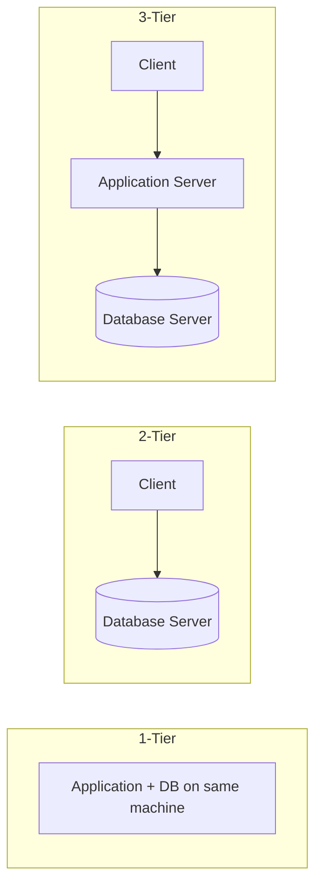

# Database Fundamentals

## Theory

### What is a DBMS?

A Database Management System (DBMS) is software that provides a systematic way to create, store, retrieve, update, and manage data. It sits between applications and the physical data, offering abstraction, concurrency control, integrity enforcement, and security, so applications don't need to manage raw files directly. Popular examples include MySQL, PostgreSQL, Oracle, SQL Server, and MongoDB.

- **Advantages**: data abstraction, reduced redundancy, concurrent access control, enforced integrity/security, backup and recovery support.
- **Disadvantages**: cost of licensing/hardware, complexity to administer, performance overhead compared to raw file access.

### Types of Databases (Relational vs NoSQL)

Relational databases (RDBMS) organize data into tables with fixed schemas and relationships enforced via keys, using SQL for querying (e.g., PostgreSQL, MySQL). NoSQL databases store data in flexible formats — documents, key-value pairs, wide-column, or graphs — and are designed for horizontal scalability and schema flexibility (e.g., MongoDB, Cassandra, Redis, Neo4j).

| Aspect | Relational (SQL) | NoSQL |
|---|---|---|
| Schema | Fixed, predefined | Dynamic/flexible |
| Scaling | Vertical (mostly) | Horizontal |
| Consistency | Strong (ACID) | Often eventual (BASE) |
| Query language | SQL | Varies (API/JSON queries) |
| Best fit | Structured, relational data | Unstructured/semi-structured, high-volume data |

### Database Architecture (1-tier, 2-tier, 3-tier)

Database architecture describes how the database, application logic, and presentation layer are distributed across systems. A 1-tier architecture runs the DB and application on the same machine (e.g., local development databases). A 2-tier (client-server) architecture has the client directly communicating with the database server. A 3-tier architecture introduces a middle application/business-logic layer between the client and the database, improving scalability, security, and separation of concerns.



### Database Components

A DBMS is made up of several core components: the **query processor** (parses and optimizes SQL), the **storage manager** (handles data files, indexes, and buffers), the **transaction manager** (ensures ACID properties), and the **catalog/metadata manager** (stores schema information). Together these components translate high-level SQL statements into efficient, safe, and durable operations on disk.

### Database Users and Roles

Different classes of users interact with a DBMS: **database administrators (DBAs)** manage security, backups, and performance; **application developers** write programs that access the database; **end users** interact through applications without knowing SQL; and **sophisticated users** (analysts) write ad-hoc queries directly. Roles and privileges (e.g., `GRANT`, `REVOKE`) control what each user or group can do.

```sql
-- Create a role and grant read-only access
CREATE ROLE analyst;
GRANT SELECT ON employees TO analyst;
GRANT analyst TO 'jane';
```

### Database Instances vs Databases

A **database** is the persistent collection of data and its schema stored on disk. An **instance** is the snapshot of that data at a given moment in time, or (in systems like Oracle) the set of running processes and memory structures (background processes, buffer cache, SGA) that manage access to the database files. In simpler terms: the database is the data; the instance is the running software plus in-memory state operating on that data.

### Data Models (Relational Model)

A data model defines how data is logically structured, related, and manipulated. The **relational model**, proposed by E.F. Codd, represents data as a collection of relations (tables), each a set of tuples (rows) with attributes (columns), with relationships expressed through shared key values rather than physical pointers. Its mathematical foundation (relational algebra/calculus) makes it predictable and well-suited to declarative querying via SQL. Other data models include hierarchical, network, object-oriented, and document models.

### OLTP vs OLAP

**OLTP (Online Transaction Processing)** systems handle high volumes of short, frequent read/write transactions — e.g., order entry, banking transfers — and prioritize consistency and speed of individual operations. **OLAP (Online Analytical Processing)** systems handle complex, read-heavy analytical queries over large historical datasets — e.g., data warehouses used for reporting and business intelligence — prioritizing throughput on aggregations over many rows.

| Aspect | OLTP | OLAP |
|---|---|---|
| Purpose | Day-to-day transactions | Analysis & reporting |
| Query type | Simple, short | Complex, long-running |
| Data volume per query | Small | Large (aggregations) |
| Schema | Normalized | Denormalized/star schema |
| Example | E-commerce checkout | Sales trend dashboard |

### Interview Questions

- **Q: What is the difference between a file system and a DBMS?**
  A: A file system stores raw, unstructured data with no built-in concurrency control, integrity enforcement, or query capability; a DBMS adds structure, ACID transactions, security, and a query language on top of the data.
- **Q: When would you choose NoSQL over a relational database?**
  A: When the schema is highly variable, horizontal scalability across many nodes is required, or the workload favors availability/partition tolerance over strict consistency (e.g., large-scale document or event storage).
- **Q: Why is a 3-tier architecture generally preferred for enterprise applications?**
  A: It decouples presentation, business logic, and data layers, enabling independent scaling, better security (DB not directly exposed to clients), and easier maintenance.
- **Q: What is the role of the query processor in a DBMS?**
  A: It parses SQL, validates it against the schema, generates an optimized execution plan, and hands it off to the storage engine for execution.
- **Q: Explain the difference between a database instance and a database.**
  A: The database is the persisted data and schema on disk; the instance is the running memory structures and background processes that manage access to that data at a point in time.
- **Q: Why does the relational model use keys instead of physical pointers to represent relationships?**
  A: Keys provide logical, value-based relationships that are independent of physical storage, making the model resilient to reorganization and easier to reason about declaratively.
- **Q: Give a real-world example each of OLTP and OLAP.**
  A: OLTP: an ATM withdrawal updating an account balance instantly. OLAP: a quarterly sales report aggregating millions of transactions across regions.
- **Q: Can a single database serve both OLTP and OLAP workloads well?**
  A: Generally no — their access patterns conflict (many small writes vs. large scans), so organizations typically replicate OLTP data into a separate OLAP/warehouse system (via ETL) for analytics.

