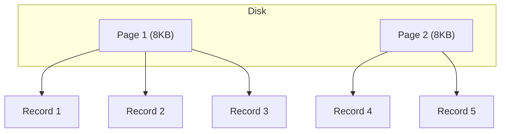

# Database Storage

## Theory

### Pages

A page is the fundamental unit of storage that a database reads from and writes to disk, typically a fixed size such as 8 KB (PostgreSQL, SQL Server) or 16 KB (MySQL InnoDB default). Rather than reading a single row, the database always reads/writes a whole page, which contains one or more rows plus metadata (headers, free space information, row pointers). Pages are cached in a buffer pool in memory to minimize disk I/O.

### Blocks

A block is the operating system's or storage device's fundamental unit of I/O (e.g., 4 KB on many filesystems). Databases align their page size to be a multiple of the OS block size for I/O efficiency, so that a single disk read/write operation transfers a whole number of blocks without wasted or fragmented I/O.

### Records

A record (or tuple/row) is a single unit of data stored within a page, representing one row of a table. Each record typically consists of a header (metadata like null bitmaps, length information) followed by the actual column values, serialized according to the table's schema.

### Heap Files

A heap file is an unordered collection of records stored in no particular order — new rows are simply appended wherever free space exists (or at the end of the file). Heap storage offers fast inserts since the engine doesn't need to maintain any ordering, but lookups require a full table scan unless supported by a separate index.

- **Advantages**
  - Very fast inserts (no reordering needed).
  - Simple to implement and manage.
- **Disadvantages**
  - Slow point/range lookups without an index (full scan required).
  - Can suffer from fragmentation as rows are deleted and reinserted.

### Clustered Storage

Clustered storage physically stores table rows sorted according to a key (usually the primary key), so that rows with nearby key values are physically adjacent on disk. This is the storage model used when a table has a clustered index — it makes range scans on the clustering key very fast since related rows are read together in fewer I/O operations.

### Row-Oriented Storage

In row-oriented (row-store) storage, all columns of a single row are stored contiguously on disk/in a page. This layout is efficient for transactional (OLTP) workloads that read or write entire rows at a time — e.g., fetching a full customer record or inserting a new order.

### Column-Oriented Storage (Overview)

In column-oriented (columnar) storage, values from the same column across all rows are stored contiguously instead. This layout is highly efficient for analytical (OLAP) workloads that scan a few columns across millions of rows (e.g., `SUM(amount)` over a sales table), because only the needed columns are read from disk, and similar values compress very well together.

**Differences: Row-Oriented vs Column-Oriented Storage**

| Aspect | Row-Oriented | Column-Oriented |
|---|---|---|
| Physical layout | Full row stored together | Each column stored together |
| Best for | OLTP (frequent row reads/writes) | OLAP (aggregations over few columns) |
| Read efficiency | Reads entire row even if few columns needed | Reads only the columns queried |
| Write efficiency | Fast single-row inserts/updates | Slower single-row writes (scattered across column files) |
| Compression | Less effective (mixed data types per page) | Very effective (similar values grouped) |
| Examples | PostgreSQL, MySQL (default) | Amazon Redshift, ClickHouse, Apache Parquet |

### Interview Questions

- **Q: What is the relationship between a page and a block?**
  A: A page is the database's logical unit of I/O, while a block is the OS/disk's physical unit of I/O; database page sizes are chosen as multiples of the block size for efficient, aligned disk access.
- **Q: Why do databases read/write whole pages instead of individual rows?**
  A: Disk I/O is far more efficient in fixed-size chunks; reading a whole page amortizes the cost of a disk seek/transfer across multiple rows and enables effective buffer pool caching.
- **Q: What is a heap file and what is its main drawback?**
  A: An unordered collection of rows appended without any sort order; its main drawback is that queries without a supporting index require a full table scan.
- **Q: When would you choose column-oriented storage over row-oriented storage?**
  A: When workloads are analytical — aggregating or scanning a small number of columns across huge numbers of rows (e.g., data warehousing, BI dashboards) — column storage minimizes I/O and compresses better.
- **Q: Why is column-oriented storage generally slower for single-row inserts?**
  A: Because each column of the new row must be appended to a different physical column file/segment, requiring multiple scattered writes instead of one contiguous write.
- **Q: How does clustered storage improve range query performance?**
  A: Because rows are physically sorted by the clustering key, a range query can read a contiguous sequence of pages instead of jumping around the disk to find scattered rows.
- **Q: What's stored in a database "record" besides the column values?**
  A: A header containing metadata such as null bitmaps, variable-length column offsets, and row versioning/transaction information used for concurrency control.
- **Q: Why might a heap table become fragmented over time?**
  A: As rows are deleted and new rows of different sizes are inserted into the freed space, the physical layout becomes non-contiguous and scattered, hurting sequential scan performance.

