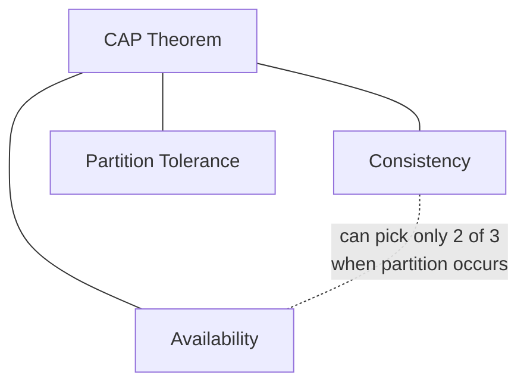
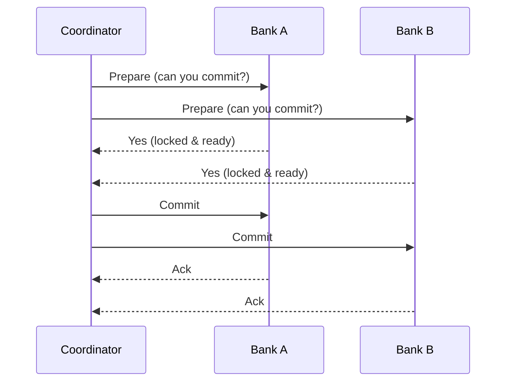

# Distributed Databases

## Theory

### Distributed Database Basics

A distributed database spans multiple physical nodes (often across different machines, racks, or geographic regions) while presenting a logical view to applications, as opposed to a single-node database. Key challenges unique to distributed systems include network partitions, clock synchronization, coordinating consistency across nodes, and handling partial failures gracefully.

- **Advantages:** high availability, fault tolerance, geographic scalability, no single point of failure
- **Disadvantages:** increased complexity, network latency between nodes, harder to reason about consistency and debugging

### CAP Theorem

The CAP theorem states that a distributed system can only guarantee two of the following three properties simultaneously during a network partition: **C**onsistency (every read receives the most recent write), **A**vailability (every request receives a non-error response), and **P**artition tolerance (the system continues operating despite network partitions). Since network partitions are unavoidable in real distributed systems, the practical choice is really between CP (consistent but may reject requests during a partition) and AP (available but may return stale data during a partition).

- **Advantages of understanding CAP:** guides correct database choice for use case (e.g., banking vs social media feed)
- **Disadvantages/limitations:** CAP is often oversimplified — real systems make nuanced trade-offs (see PACELC) rather than a strict binary choice

### Consistency Models

A consistency model defines the guarantees a distributed system provides about the order and visibility of reads/writes across nodes. Common models range from strong consistency (all nodes see the same data at the same time, as if there were only one copy) to eventual consistency (nodes converge to the same value over time but may temporarily diverge), with intermediate models like causal consistency and read-your-writes consistency in between.

### Eventual Consistency

Eventual consistency guarantees that, if no new updates are made, all replicas will eventually converge to the same value — but at any given moment, different nodes might return different (stale) results. This model favors availability and low latency over immediate consistency, and is common in systems like DNS, shopping cart services, and many NoSQL databases.

**Real-life scenario:** When you like a post on a social media app, your friend on the other side of the world might not see the updated like count for a second or two — the system prioritizes fast, always-available responses over instant global consistency.

- **Advantages:** high availability, low latency, better partition tolerance
- **Disadvantages:** applications must tolerate temporarily stale/conflicting reads, requires conflict resolution strategies (e.g., last-write-wins, vector clocks)

### Two-Phase Commit (2PC)

Two-phase commit is a protocol for achieving atomic commitment of a transaction across multiple distributed nodes. In the **prepare phase**, a coordinator asks all participants if they can commit; each participant locks resources and replies yes/no. In the **commit phase**, if all participants voted yes, the coordinator tells everyone to commit; if any voted no (or timed out), the coordinator tells everyone to abort.

**Real-life scenario:** Transferring money between two different banks requires debiting Bank A's account and crediting Bank B's account atomically — 2PC ensures either both operations succeed or both are rolled back, preventing money from vanishing or being duplicated.

- **Advantages:** strong atomicity guarantee across distributed participants
- **Disadvantages:** blocking protocol (if coordinator crashes after prepare, participants can be stuck holding locks), poor performance/latency, single point of failure at the coordinator

### Distributed Transactions (Overview)

A distributed transaction spans multiple databases or services and must satisfy ACID properties across all of them as a single logical unit of work. This is significantly harder than single-node transactions because it requires coordination protocols (like 2PC) or compensating mechanisms (like the Saga pattern) to handle partial failures across network boundaries.

- **Advantages:** enables consistent multi-service/multi-database operations
- **Disadvantages:** higher latency, reduced availability during coordination, complex failure handling; many modern microservice architectures avoid them in favor of eventual consistency + compensating transactions (Sagas)

### Consensus Algorithms (Overview)

Consensus algorithms (such as Paxos and Raft) allow a group of distributed nodes to agree on a single value or sequence of operations, even in the presence of node failures or network issues, without a single point of failure like a 2PC coordinator. They typically work by electing a leader and requiring a majority (quorum) of nodes to agree before a value is considered committed, which is how distributed databases and coordination systems (e.g., etcd, ZooKeeper, many replicated databases) maintain a consistent replicated log.

- **Advantages:** fault-tolerant agreement without a single coordinator bottleneck, well-understood formal correctness guarantees
- **Disadvantages:** requires a majority of nodes to be available (quorum), added latency from multi-node coordination, complex to implement correctly

### Interview Questions

- **Q: Explain the CAP theorem and why you can't have all three guarantees at once during a partition.**
  A: During a network partition, a node must choose between responding with potentially stale data (favoring Availability) or refusing to respond until it can confirm consistency (favoring Consistency) — it cannot guarantee both simultaneously while the partition persists, though Partition tolerance itself is a given in real distributed systems.
- **Q: Would you choose a CP or AP system for a banking ledger, and why?**
  A: CP — banking requires strong consistency (accurate balances) even at the cost of temporary unavailability during a partition, since serving stale/incorrect balance data could cause serious financial errors.
- **Q: Would you choose a CP or AP system for a social media "like" counter, and why?**
  A: AP — availability and low latency matter more than perfect real-time accuracy; eventual consistency is an acceptable trade-off since a slightly stale like count has no serious consequence.
- **Q: What is the main weakness of the two-phase commit protocol?**
  A: It's a blocking protocol — if the coordinator crashes after participants have voted "yes" and locked resources but before sending the commit/abort decision, participants can be left blocked holding locks indefinitely.
- **Q: How does eventual consistency differ from strong consistency, and where is it acceptable?**
  A: Eventual consistency allows temporary divergence between replicas that converges over time, trading immediate accuracy for availability/performance; it's acceptable for data where slight staleness has low impact, like view counts or non-critical caches, but not for financial balances.
- **Q: How do consensus algorithms like Raft avoid the single-point-of-failure problem seen in 2PC?**
  A: They use leader election and majority quorum agreement rather than depending on a single fixed coordinator — if a leader fails, a new leader is elected and the cluster continues operating as long as a majority of nodes are reachable.
- **Q: Scenario: You need to transfer inventory between two microservices' separate databases atomically. Would you use 2PC or an alternative?**
  A: In modern microservice architectures, the Saga pattern (a sequence of local transactions with compensating actions on failure) is generally preferred over 2PC, since 2PC's blocking nature and tight coupling hurt availability and scalability.
- **Q: What is a quorum in the context of consensus algorithms, and why is majority used rather than requiring all nodes?**
  A: A quorum is the minimum number of nodes that must agree for a decision to be committed; requiring only a majority (not all nodes) allows the system to keep operating and making progress even if a minority of nodes are down or unreachable.

