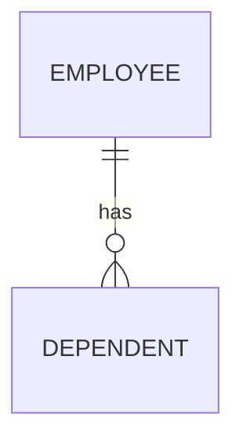
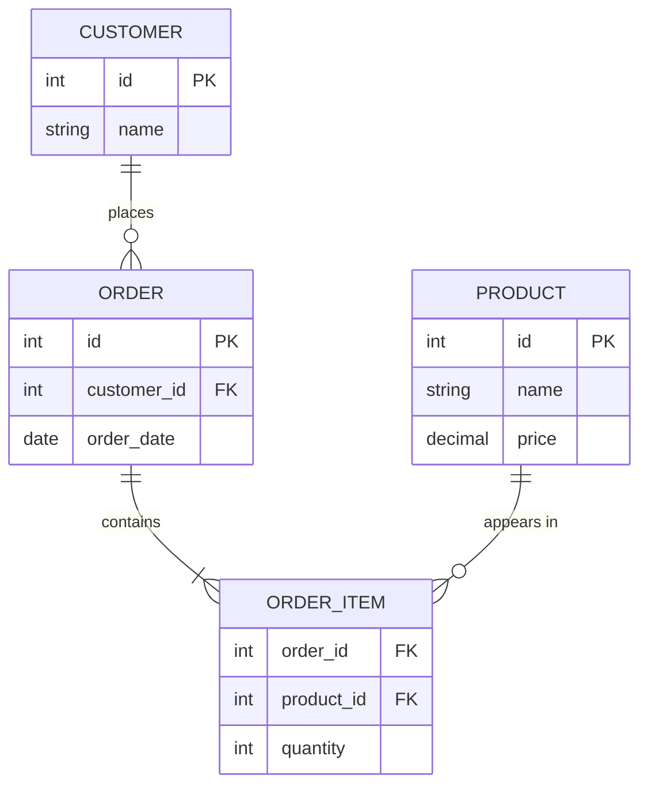
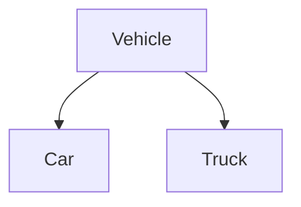

# Entity Relationship (ER) Modeling

## Theory

### Entities

An entity is a real-world object or concept that can be distinctly identified and stored as data — e.g., a `Student`, `Product`, or `Order`. In an ER diagram, entities are typically drawn as rectangles, and they become tables when the model is translated into a relational schema. An **entity set** is a collection of similar entities (e.g., all students).

### Attributes

Attributes are properties that describe an entity — e.g., a `Student` entity might have `student_id`, `name`, and `date_of_birth` attributes. Attributes can be **simple** (atomic, like `age`), **composite** (divisible, like `address` → street/city/zip), **single-valued** (`ssn`), **multi-valued** (`phone_numbers`), or **derived** (computed from another attribute, like `age` derived from `date_of_birth`).

### Relationships

In ER modeling, a relationship represents an association between two or more entities — e.g., a `Student` **enrolls in** a `Course`. Relationships are drawn as diamonds connecting related entities and can themselves carry attributes (e.g., `enrollment_date` on the enrolls relationship), which get resolved into columns on the junction table during logical design.

### Weak Entities

A weak entity is an entity that cannot be uniquely identified by its own attributes alone and depends on a related **identifying (owner) entity** for identification — it borrows part of its primary key (a partial key plus the owner's key). For example, a `Dependent` entity might only be identifiable in combination with the `Employee` it belongs to.

### Strong Entities

A strong entity has its own primary key and can be uniquely identified independently of any other entity — e.g., `Employee` with `employee_id` as its key. Most entities in a typical schema are strong entities; weak entities are the exception, used only when an entity's existence is inherently tied to another.

### Participation Constraints

Participation constraints specify whether every entity instance in an entity set must participate in a relationship. **Total participation** (double line in ER diagrams) means every entity instance must be involved in the relationship (e.g., every `Dependent` must be linked to an `Employee`). **Partial participation** (single line) means participation is optional (e.g., not every `Employee` needs to manage a project).

### Cardinality Constraints

Cardinality constraints in ER modeling specify the numeric limits on how entity instances relate through a relationship — expressed as 1:1, 1:N, or M:N (as covered in the "Relationships" section). They're often annotated on ER diagram connectors using notations like `(1,1)`, `(0,N)`, or crow's foot symbols to indicate minimum and maximum participation.

### ER Diagrams

An ER diagram (ERD) is a visual representation of entities, their attributes, and the relationships between them, used during the conceptual/logical design phase before creating the physical database schema. Rectangles represent entities, ellipses represent attributes, and diamonds represent relationships (in Chen notation), while "crow's foot" notation is a common alternative for showing cardinality directly on the connecting lines.

### Enhanced ER (EER) Concepts

Enhanced ER (EER) modeling extends basic ER concepts with object-oriented ideas to handle more complex scenarios: **generalization** (combining lower-level entities into a higher-level one, e.g., `Car` and `Truck` → `Vehicle`), **specialization** (the reverse — splitting a higher-level entity into specialized subtypes, e.g., `Employee` → `Manager`, `Engineer`), and **aggregation** (treating a relationship itself as a higher-level entity so it can participate in further relationships). These constructs help model inheritance-like hierarchies before mapping them to relational tables.

### Interview Questions

- **Q: What is the difference between a strong entity and a weak entity?**
  A: A strong entity has its own primary key and can be identified independently; a weak entity lacks a full primary key of its own and relies on a partial key combined with the identifying owner entity's key.
- **Q: What does "total participation" mean in an ER diagram, and how is it shown?**
  A: It means every instance of an entity must participate in the relationship; it's shown using a double line connecting the entity to the relationship diamond.
- **Q: What is a derived attribute? Give an example.**
  A: An attribute whose value can be computed from other stored attributes rather than stored directly — e.g., `age` derived from `date_of_birth`.
- **Q: How would you translate a weak entity into a relational table?**
  A: Create a table for the weak entity whose primary key is a composite of the owner entity's foreign key plus the weak entity's partial key.
- **Q: Explain generalization vs. specialization in EER modeling.**
  A: Generalization is a bottom-up process combining common attributes of multiple entities into a single higher-level entity; specialization is top-down, splitting a general entity into more specific subtypes with additional attributes.
- **Q: How is a many-to-many relationship with its own attributes handled in ER modeling and its relational translation?**
  A: The relationship is modeled as a diamond with its own attributes (e.g., `enrollment_date`), and it translates into a junction table containing both foreign keys plus columns for those relationship attributes.
- **Q: What's the difference between an entity and an entity set?**
  A: An entity is a single instance (e.g., one specific student); an entity set is the collection of all such instances of the same type (e.g., all students).
- **Q: How do you represent a composite attribute in an ER diagram?**
  A: As an oval attribute node connected to sub-oval nodes representing its components — e.g., `Address` connecting to `Street`, `City`, and `Zip`.
- **Q: Why might a database designer choose aggregation in EER modeling?**
  A: To let a relationship (e.g., an employee working on a project) itself participate in another relationship (e.g., that assignment being reviewed by a manager), which basic ER relationships cannot directly express.

