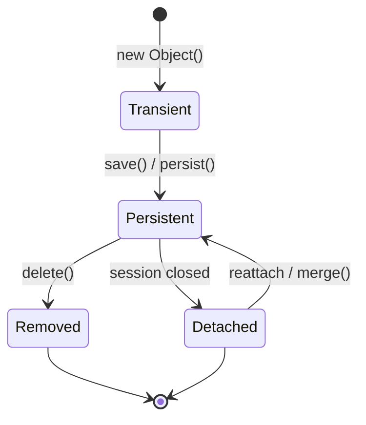
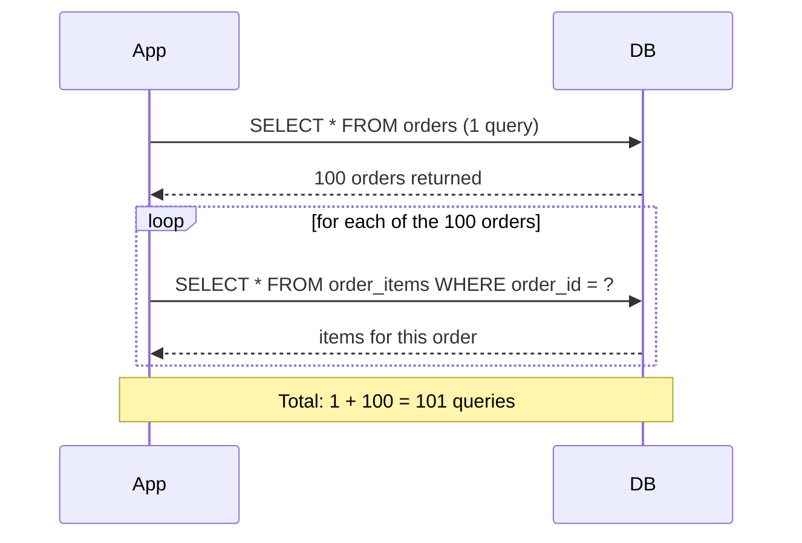

# Object Relational Mapping (ORM Concepts)

## Theory

### Object-Relational Impedance Mismatch

The object-relational impedance mismatch describes the fundamental conceptual differences between object-oriented programming models (objects, inheritance, references, graphs) and relational database models (tables, rows, foreign keys, normalized data). For example, object inheritance has no direct equivalent in relational schemas, and object graphs with circular references don't map cleanly to normalized tables — this mismatch is the core problem ORMs try to solve.

### Mapping Objects to Tables

Mapping objects to tables is the process of defining how a class's fields correspond to a table's columns, how object references correspond to foreign keys, and how collections correspond to child tables or join tables. Strategies include table-per-class, table-per-hierarchy (single table for a class hierarchy with a discriminator column), and table-per-subclass (separate tables joined by primary key).

```sql
-- Simple object-to-table mapping example
-- Class: Order { id, customerId, amount, status }
CREATE TABLE orders (
  id BIGINT PRIMARY KEY,
  customer_id BIGINT REFERENCES customers(id),
  amount DECIMAL(10,2),
  status VARCHAR(20)
);
```

### Identity vs Equality

Identity refers to whether two references point to the exact same object instance in memory (`==` in Java), while equality refers to whether two objects are considered logically equivalent based on their state (`.equals()`). In an ORM context, this gets more nuanced: two different object instances loaded from the same database row (same primary key) are equal in the database sense but might not be the same Java object instance unless the ORM's identity map/session ensures it.

| Aspect | Identity | Equality |
|---|---|---|
| Meaning | Same object instance in memory | Same logical value/state |
| Java operator | `==` | `.equals()` |
| Database analog | Same primary key within one session/identity map | Same column values |

### Entity Lifecycle (Concept)

An entity's lifecycle describes the states it moves through in relation to a persistence context: **Transient** (a plain object not yet associated with any database row or session), **Persistent/Managed** (associated with an active session and tracked for changes), **Detached** (was persistent but the session has closed, so changes are no longer tracked), and **Removed** (marked for deletion).



### Lazy Loading (Concept)

Lazy loading defers fetching related/associated data until it is actually accessed, rather than loading everything upfront. For example, loading an `Order` object might not immediately fetch its list of `OrderItems` from the database — those are fetched only when the `.getItems()` accessor is called. This improves initial load performance but requires an active session/connection at the time of access, or it fails (a common "LazyInitializationException"-style issue).

- **Advantages:** faster initial object loading, avoids fetching unused data, reduces memory footprint
- **Disadvantages:** risk of the N+1 query problem, requires the session to still be open when lazy data is accessed

### Eager Loading (Concept)

Eager loading fetches an object along with all its related/associated data immediately, typically in a single query (often using a JOIN). This guarantees the data is available even after the session closes, but can waste resources fetching data the caller never uses, and can produce very large result sets for deeply nested object graphs.

| Aspect | Lazy Loading | Eager Loading |
|---|---|---|
| When data is fetched | On first access | Immediately, upfront |
| Initial query cost | Lower | Higher (joins/multiple fetches) |
| Risk | N+1 queries, stale session errors | Over-fetching unused data |
| Best for | Rarely-accessed associations | Associations almost always needed together |

### N+1 Query Problem (Concept)

The N+1 query problem occurs when code fetches a list of N parent entities with one query, then triggers a separate query for each parent's related data (lazily loaded), resulting in 1 + N total queries instead of a single efficient join. This is one of the most common ORM performance pitfalls, especially in loops that access lazy associations.



**Fix approaches:** use eager fetch joins for known access patterns, batch fetching (`@BatchSize`-style hints), or explicit `JOIN FETCH` queries to collapse N+1 queries into one or a few.

### Cascading Operations (Concept)

Cascading operations propagate a persistence action (save, update, delete) from a parent entity to its related child entities automatically, so the application doesn't need to manually manage each related entity. For example, deleting an `Order` with cascade delete configured would automatically delete its associated `OrderItems`.

- **Advantages:** less boilerplate code, ensures referential consistency for owned/dependent entities
- **Disadvantages:** can cause unintended mass deletes/updates if misconfigured, makes the true scope of an operation less visible at the call site

### Interview Questions

- **Q: What is the object-relational impedance mismatch, and why do ORMs exist?**
  A: It's the mismatch between object-oriented concepts (inheritance, object graphs, references) and relational concepts (flat tables, foreign keys, normalized rows); ORMs exist to bridge this gap so developers can work with objects while data is persisted relationally.
- **Q: Explain the difference between identity and equality in the context of an ORM session.**
  A: Identity means two references point to the literal same object instance; equality means two objects have the same logical state. Within a single ORM session/identity map, loading the same row twice typically returns the same object instance (identity holds), but across sessions you may get equal-but-not-identical objects.
- **Q: Describe the lifecycle states of a persistent entity.**
  A: Transient (not yet persisted), Persistent/Managed (tracked by an active session), Detached (was persisted, session now closed, changes untracked), and Removed (marked for deletion) — transitions occur via save/persist, session close, merge/reattach, and delete.
- **Q: What is the N+1 query problem and how would you detect it?**
  A: It's when fetching N parent rows triggers N additional queries for lazily-loaded child associations instead of one combined query; it's detected by enabling SQL logging/query counting in tests or profiling and seeing a suspiciously high query count proportional to result set size.
- **Q: How would you fix an N+1 query problem in a reporting endpoint that loads 1000 orders and their items?**
  A: Replace the lazy per-order fetch with a single `JOIN FETCH` query (or equivalent eager join) that retrieves orders and their items together, or use a batch-fetch size hint so items are fetched in grouped batches rather than one query per order.
- **Q: When would you choose lazy loading over eager loading for an association?**
  A: When the association is large, expensive to fetch, and not needed in most use cases (e.g., a user's full activity history) — lazy loading avoids the cost until it's actually required.
- **Q: What risk does lazy loading introduce if you try to access an association after the session has closed?**
  A: It typically throws a lazy-initialization error because the session needed to fetch the data on demand is no longer available — the fix is to eager-fetch known-needed associations or keep the session open (with care) for the required scope.
- **Q: Why can cascading deletes be dangerous if misconfigured?**
  A: A cascade delete on a parent can silently delete far more data than intended (e.g., deleting a category cascades to delete all products in it), so cascade rules must be deliberately scoped to true parent-owned/dependent relationships.
