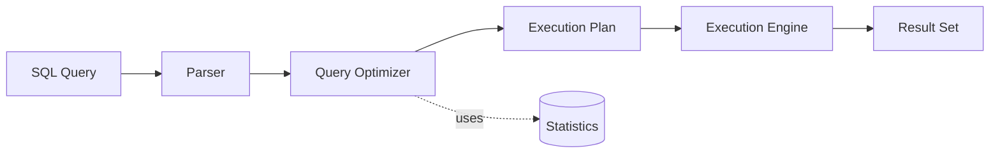

# Query Processing

## Theory

### Query Parsing

Parsing is the first stage of query processing: the database's parser checks the SQL statement for correct syntax and validates that referenced tables, columns, and functions actually exist and that the user has appropriate permissions. The output is an internal representation (a parse tree / query tree) that later stages operate on rather than raw text.

### Query Optimization

The query optimizer takes the parsed query and determines the most efficient way to execute it, evaluating alternative strategies such as which indexes to use, the join order, and the join algorithm (nested loop, hash join, merge join). Because the number of possible execution strategies grows combinatorially with the number of joined tables, the optimizer uses heuristics and cost estimates rather than exhaustively evaluating every plan.

### Execution Plan

An execution plan (or query plan) is the concrete, ordered sequence of physical operations (table scans, index seeks, joins, sorts, aggregations) the database engine will perform to execute a query. Developers can inspect it using `EXPLAIN` (PostgreSQL, MySQL) or `EXPLAIN ANALYZE` to diagnose slow queries and verify whether indexes are actually being used.



```sql
EXPLAIN ANALYZE
SELECT * FROM orders WHERE customer_id = 42;
```

### Cost-Based Optimization

Cost-Based Optimization (CBO) chooses among candidate execution plans by estimating each plan's "cost" — typically a weighted combination of estimated disk I/O, CPU usage, and memory — and selecting the lowest-cost plan. This is in contrast to older rule-based optimizers that applied fixed heuristics regardless of actual data distribution; CBO relies heavily on accurate table/index statistics to make good estimates.

### Statistics

Statistics are metadata the database maintains about tables and indexes — row counts, distinct value counts, data distribution histograms, and average row size — used by the cost-based optimizer to estimate how many rows a step in a plan will produce. Stale or missing statistics (e.g., after a bulk data load without an update) can cause the optimizer to pick a poor plan, so databases provide commands like `ANALYZE` (PostgreSQL) or `UPDATE STATISTICS` (SQL Server) to refresh them.

### Interview Questions

- **Q: What are the main stages a SQL query goes through before execution?**
  A: Parsing (syntax/semantic validation) → query optimization (choosing a plan) → execution plan generation → execution by the engine, returning the result set.
- **Q: What is the difference between `EXPLAIN` and `EXPLAIN ANALYZE`?**
  A: `EXPLAIN` shows the estimated execution plan without running the query, while `EXPLAIN ANALYZE` actually executes the query and reports real timing and row counts alongside the plan.
- **Q: Why can stale statistics cause slow queries even with the right indexes in place?**
  A: The optimizer relies on statistics to estimate row counts and selectivity; if stats are outdated, it may misjudge which index or join strategy is cheapest, picking an inefficient plan despite a good index existing.
- **Q: What is cost-based optimization and what factors typically make up the 'cost'?**
  A: An approach where the optimizer estimates and compares the resource cost (I/O, CPU, memory) of multiple candidate plans and picks the cheapest one, rather than relying purely on fixed rules.
- **Q: What would you check first if a query that used to be fast suddenly becomes slow?**
  A: Check the execution plan for changes (e.g., index no longer used, table scan appearing) and verify whether table statistics are outdated, especially after large data changes.
- **Q: Why might the query optimizer choose a full table scan over an available index?**
  A: If the optimizer estimates (via statistics) that the query will return a large fraction of the table's rows, a sequential scan can be cheaper than many random index lookups.
- **Q: What is the difference between a nested loop join and a hash join, at a conceptual level?**
  A: A nested loop join iterates one table's rows and searches the other table for matches per row (efficient for small/indexed inputs), while a hash join builds an in-memory hash table from one input and probes it with the other (efficient for large, unsorted inputs without indexes).
- **Q: Why does the number of possible execution plans grow so quickly with more joined tables?**
  A: Because the optimizer must consider different join orders, join algorithms, and access paths for each table, and the number of possible join orderings grows factorially with the number of tables.

