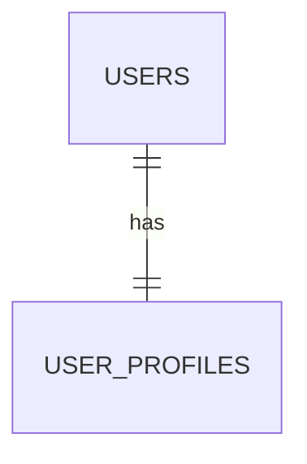
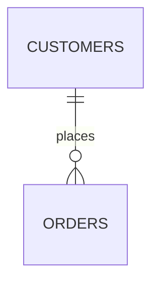
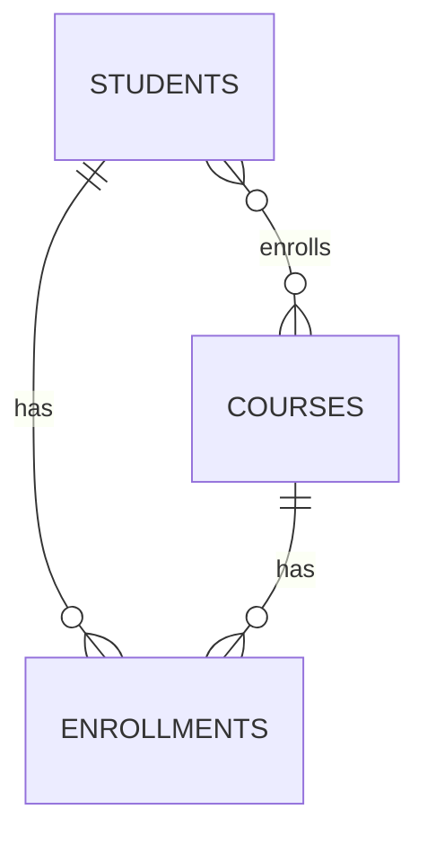

# Table Relationships

## Theory

### One-to-One (1:1)

In a one-to-one relationship, each row in Table A relates to exactly one row in Table B, and vice versa. It's typically implemented by placing a unique (and often foreign key) column in one of the tables. Common uses include splitting sensitive or optional data into a separate table — e.g., `users` and `user_profiles`.



```sql
CREATE TABLE user_profiles (
    user_id INT PRIMARY KEY,
    bio TEXT,
    FOREIGN KEY (user_id) REFERENCES users(id)
);
```

### One-to-Many (1:N)

A one-to-many relationship means a single row in Table A can relate to multiple rows in Table B, but each row in Table B relates to only one row in Table A. This is the most common relational relationship — e.g., one `customer` can have many `orders`, but each order belongs to exactly one customer. It's implemented by placing the foreign key on the "many" side.



### Many-to-One (N:1)

Many-to-one is simply the one-to-many relationship viewed from the opposite side — many rows in Table B reference a single row in Table A. For example, "many orders belong to one customer" is the same physical relationship as "one customer has many orders"; only the perspective changes.

### Many-to-Many (M:N)

In a many-to-many relationship, multiple rows in Table A can relate to multiple rows in Table B. Since relational databases can't directly express M:N with foreign keys alone, a **junction (associative) table** is introduced, holding foreign keys to both tables (often as a composite primary key). Example: `students` and `courses`, linked via an `enrollments` table.



```sql
CREATE TABLE enrollments (
    student_id INT,
    course_id INT,
    PRIMARY KEY (student_id, course_id),
    FOREIGN KEY (student_id) REFERENCES students(id),
    FOREIGN KEY (course_id) REFERENCES courses(id)
);
```

| Relationship | Implementation |
|---|---|
| 1:1 | Unique FK on either table |
| 1:N | FK on the "many" side |
| M:N | Junction table with composite key |

### Self Referencing Relationships

A self-referencing (recursive) relationship occurs when a table has a foreign key that references its own primary key. A classic example is an `employees` table with a `manager_id` column referencing `employees.id`, modeling an organizational hierarchy.

```sql
CREATE TABLE employees (
    id INT PRIMARY KEY,
    name VARCHAR(100),
    manager_id INT,
    FOREIGN KEY (manager_id) REFERENCES employees(id)
);
```

### Identifying vs Non-Identifying Relationships

In an **identifying relationship**, the child entity's primary key includes the foreign key from the parent — meaning the child cannot exist, or be uniquely identified, without the parent (e.g., `order_items` depends on `orders`). In a **non-identifying relationship**, the foreign key is just a regular (non-key) column in the child table — the child has its own independent primary key and can conceptually exist without a specific parent row (though referential integrity may still require a valid reference), e.g., an `employee` referencing a `department`.

### Interview Questions

- **Q: How do you implement a one-to-one relationship in a relational schema?**
  A: Add a foreign key column in one table that also has a unique constraint (or make it the primary key of that table), ensuring at most one matching row on each side.
- **Q: Why can't many-to-many relationships be modeled with a simple foreign key?**
  A: A single foreign key column can only reference one row on the "one" side, so it can't express multiple associations in both directions; a junction table is needed to hold pairs of foreign keys.
- **Q: What's the difference between one-to-many and many-to-one?**
  A: They describe the same relationship from opposite viewpoints — 1:N from the parent's perspective is N:1 from the child's perspective.
- **Q: Give a real-world example of a self-referencing relationship.**
  A: An `employees` table where each row has a `manager_id` pointing to another row in the same table, modeling reporting hierarchy.
- **Q: What is a junction table, and what should its primary key typically be?**
  A: A table that resolves a many-to-many relationship by storing foreign keys to both related tables; its primary key is typically a composite of those two foreign keys.
- **Q: What's the difference between an identifying and non-identifying relationship?**
  A: In an identifying relationship, the child's primary key incorporates the parent's key (child can't be uniquely identified without the parent); in a non-identifying relationship, the foreign key is a normal attribute and the child has its own independent primary key.
- **Q: How would you model "a book can have multiple authors, and an author can write multiple books"?**
  A: A many-to-many relationship via a junction table, e.g., `book_authors(book_id, author_id)`.
- **Q: In a 1:N relationship between `departments` and `employees`, which table holds the foreign key?**
  A: The `employees` table (the "many" side) holds a `department_id` foreign key referencing `departments`.

