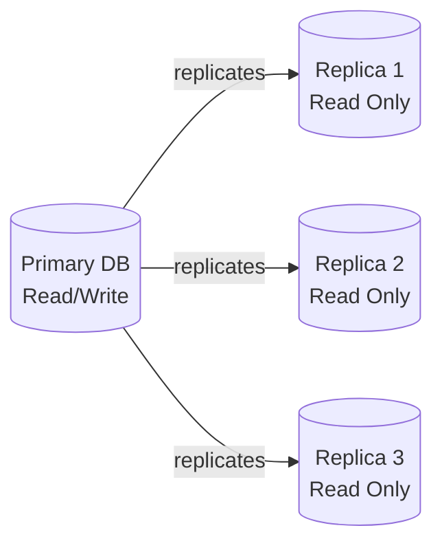

# Database Scaling


## Medium

- [Leaderless Replication In Distributed System](https://medium.com/the-developers-diary/leaderless-replication-unveiled-5f6910dd9825)


## Theory

### What is Database Scaling?

**Database scaling** is the process of increasing a database system's capacity to handle growing amounts of data, users, and queries. As applications grow, a single database server eventually becomes a bottleneck — scaling addresses this by distributing load across resources.

```
Single Server (Before Scaling):
┌──────────────────────────────────────┐
│           Application                │
│         (1000 req/sec)               │
└──────────────┬───────────────────────┘
               ↓
┌──────────────────────────────────────┐
│        Single Database               │
│   CPU: 95%  |  Disk I/O: 90%        │
│   Connections: 500/500 (maxed out)   │
│   Query latency: 2-5 seconds        │
└──────────────────────────────────────┘
❌ Bottleneck! Can't handle more load.
```

---

### Vertical Scaling vs Horizontal Scaling

The two fundamental approaches to scaling any system:

```
┌─────────────────────────────────────────────────────────────────────┐
│                    SCALING STRATEGIES                                │
├────────────────────────────┬────────────────────────────────────────┤
│   VERTICAL SCALING         │   HORIZONTAL SCALING                   │
│   (Scale UP)               │   (Scale OUT)                          │
│                            │                                        │
│   ┌──────────┐             │   ┌────┐  ┌────┐  ┌────┐  ┌────┐     │
│   │          │             │   │ DB │  │ DB │  │ DB │  │ DB │     │
│   │  Bigger  │             │   │  1 │  │  2 │  │  3 │  │  4 │     │
│   │  Server  │             │   └────┘  └────┘  └────┘  └────┘     │
│   │          │             │        ↑ Add more machines              │
│   │ More CPU │             │                                        │
│   │ More RAM │             │   Each node handles a portion          │
│   │ More SSD │             │   of the total load                    │
│   └──────────┘             │                                        │
│        ↑ Upgrade hardware  │                                        │
├────────────────────────────┼────────────────────────────────────────┤
│ ✅ Simple — no code change │ ✅ Theoretically unlimited             │
│ ✅ No data distribution    │ ✅ Fault tolerant                      │
│ ❌ Hardware limits (max)   │ ✅ Cost-effective (commodity HW)       │
│ ❌ Single point of failure │ ❌ Complex — distributed systems       │
│ ❌ Expensive at high end   │ ❌ Data consistency challenges         │
│ ❌ Downtime during upgrade │ ❌ Network latency between nodes       │
└────────────────────────────┴────────────────────────────────────────┘
```

**Vertical Scaling** means upgrading the existing server — more CPU cores, RAM, faster SSDs. It's simple but has a hard ceiling (you can't buy a machine with 10TB RAM forever) and creates a single point of failure.

**Horizontal Scaling** means adding more servers. This is where **replication** and **sharding** come in. It's the foundation of modern distributed databases.

| Aspect | Vertical Scaling | Horizontal Scaling |
|--------|-----------------|-------------------|
| **Approach** | Bigger machine | More machines |
| **Cost curve** | Exponential (high-end HW) | Linear (commodity HW) |
| **Limit** | Hardware ceiling | Theoretically unlimited |
| **Downtime** | Usually required | Rolling upgrades possible |
| **Complexity** | Low | High (distributed systems) |
| **SPOF** | Yes | No (with proper replication) |
| **Examples** | Upgrade RDS instance size | Add read replicas, shard |

---

### What is Database Replication?

**Database replication** is the process of copying and maintaining data across multiple database servers (nodes) so they all contain the same data. It's the primary mechanism for achieving **high availability**, **fault tolerance**, and **read scalability**.

```
Replication Overview:
┌──────────────────┐
│  Primary (Write)  │
│  ┌──────────────┐│
│  │ users table  ││──────┐
│  │ orders table ││      │  Data changes propagated
│  │ products     ││      │  to all replicas
│  └──────────────┘│      │
└──────────────────┘      │
                          │
          ┌───────────────┼───────────────┐
          ↓               ↓               ↓
┌─────────────────┐ ┌─────────────────┐ ┌─────────────────┐
│  Replica 1      │ │  Replica 2      │ │  Replica 3      │
│  (Read-only)    │ │  (Read-only)    │ │  (Read-only)    │
│  ┌─────────────┐│ │  ┌─────────────┐│ │  ┌─────────────┐│
│  │ Same data   ││ │  │ Same data   ││ │  │ Same data   ││
│  └─────────────┘│ │  └─────────────┘│ │  └─────────────┘│
│  US-East        │ │  EU-West        │ │  Asia-Pacific   │
└─────────────────┘ └─────────────────┘ └─────────────────┘
```

---

### Replication Topologies

#### 1. Master-Slave (Primary-Replica) Replication

The most common replication topology. **One node** (primary/master) handles all writes. Changes are propagated to one or more **read-only replicas** (slaves).

```
                    ┌───────────────────────┐
                    │      PRIMARY          │
     Writes ──────→ │  (Master / Leader)    │
                    │                       │
                    └──────────┬────────────┘
                               │
                    WAL / Binlog Stream
                               │
              ┌────────────────┼────────────────┐
              ↓                ↓                ↓
     ┌────────────────┐ ┌────────────────┐ ┌────────────────┐
     │   REPLICA 1    │ │   REPLICA 2    │ │   REPLICA 3    │
     │  (Slave/       │ │  (Slave/       │ │  (Slave/       │
     │   Follower)    │ │   Follower)    │ │   Follower)    │
     └────────────────┘ └────────────────┘ └────────────────┘
          ↑                   ↑                   ↑
       Reads               Reads               Reads

     Application distributes reads across replicas
```

**How it works:**

1. Client sends a write (INSERT/UPDATE/DELETE) to the primary
2. Primary writes to its local storage and **Write-Ahead Log (WAL)** or **binary log**
3. The log is streamed to all replicas
4. Replicas apply the log entries to their local storage
5. Clients read from any replica

**PostgreSQL — Setting up Primary-Replica:**

Primary (`postgresql.conf`):
```ini
# Enable WAL shipping
wal_level = replica
max_wal_senders = 5          # Max number of replicas
wal_keep_size = 1024         # MB of WAL to retain
```

Primary (`pg_hba.conf`):
```
# Allow replication connections from replica
host replication replicator 10.0.0.0/24 md5
```

Create replication user:
```sql
CREATE ROLE replicator WITH REPLICATION LOGIN PASSWORD 'secure_password';
```

Replica setup:
```bash
# Base backup from primary
pg_basebackup -h primary-host -D /var/lib/postgresql/data -U replicator -Fp -Xs -P

# Create standby signal file
touch /var/lib/postgresql/data/standby.signal
```

Replica (`postgresql.conf`):
```ini
primary_conninfo = 'host=primary-host port=5432 user=replicator password=secure_password'
hot_standby = on              # Allow read queries on replica
```

**MySQL — Setting up Primary-Replica:**

Primary (`my.cnf`):
```ini
[mysqld]
server-id = 1
log_bin = mysql-bin
binlog_format = ROW           # Row-based replication (recommended)
```

```sql
-- Create replication user on primary
CREATE USER 'replicator'@'%' IDENTIFIED BY 'secure_password';
GRANT REPLICATION SLAVE ON *.* TO 'replicator'@'%';

-- Get current binlog position
SHOW MASTER STATUS;
-- +------------------+----------+
-- | File             | Position |
-- +------------------+----------+
-- | mysql-bin.000003 |      785 |
-- +------------------+----------+
```

Replica (`my.cnf`):
```ini
[mysqld]
server-id = 2
relay_log = relay-bin
read_only = ON
```

```sql
-- Configure replica to follow primary
CHANGE MASTER TO
    MASTER_HOST = 'primary-host',
    MASTER_USER = 'replicator',
    MASTER_PASSWORD = 'secure_password',
    MASTER_LOG_FILE = 'mysql-bin.000003',
    MASTER_LOG_POS = 785;

START SLAVE;
SHOW SLAVE STATUS\G
```

**Advantages:**
- ✅ Simple to set up and understand
- ✅ Read scalability — distribute reads across replicas
- ✅ No write conflicts (single write point)
- ✅ Replicas can serve analytics/reporting without impacting primary

**Disadvantages:**
- ❌ Single point of failure for writes (if primary dies, no writes until failover)
- ❌ Replication lag — replicas may serve stale data
- ❌ Write bottleneck — all writes go to one server

---

#### 2. Master-Master (Multi-Master) Replication

**Multiple nodes** can accept writes. Each node replicates its changes to all other nodes.

```
     Writes + Reads              Writes + Reads
          ↕                           ↕
┌──────────────────┐        ┌──────────────────┐
│    MASTER 1      │◄──────►│    MASTER 2      │
│  (Active)        │  Sync  │  (Active)        │
│                  │◄──────►│                  │
│  Region: US-East │        │  Region: EU-West │
└──────────────────┘        └──────────────────┘
       ↕                           ↕
  Local reads                 Local reads
  Low latency                 Low latency

  Both nodes accept writes and replicate to each other
```

**MySQL Multi-Master Setup:**

Node 1 (`my.cnf`):
```ini
[mysqld]
server-id = 1
log_bin = mysql-bin
binlog_format = ROW
auto_increment_increment = 2   # Step by 2
auto_increment_offset = 1      # Start at 1 (generates 1, 3, 5, 7...)
log_slave_updates = ON         # Replicate received events
```

Node 2 (`my.cnf`):
```ini
[mysqld]
server-id = 2
log_bin = mysql-bin
binlog_format = ROW
auto_increment_increment = 2   # Step by 2
auto_increment_offset = 2      # Start at 2 (generates 2, 4, 6, 8...)
log_slave_updates = ON
```

```sql
-- On Node 1: Point to Node 2
CHANGE MASTER TO MASTER_HOST='node2-host', MASTER_USER='replicator',
    MASTER_PASSWORD='secure_password', MASTER_LOG_FILE='mysql-bin.000001', MASTER_LOG_POS=4;
START SLAVE;

-- On Node 2: Point to Node 1
CHANGE MASTER TO MASTER_HOST='node1-host', MASTER_USER='replicator',
    MASTER_PASSWORD='secure_password', MASTER_LOG_FILE='mysql-bin.000001', MASTER_LOG_POS=4;
START SLAVE;
```

**Write Conflict Example:**
```
Time T1: User updates row on Master 1
    UPDATE users SET name = 'Alice' WHERE id = 5;

Time T1: Same user updates same row on Master 2
    UPDATE users SET name = 'Bob' WHERE id = 5;

❌ CONFLICT! Which value wins?
   Master 1 thinks name = 'Alice'
   Master 2 thinks name = 'Bob'
```

**Conflict Resolution Strategies:**
- **Last-Write-Wins (LWW)**: Timestamp-based, latest write overwrites. Simple but can lose data.
- **Application-Level Resolution**: App logic decides (e.g., merge changes, prompt user).
- **CRDTs (Conflict-Free Replicated Data Types)**: Data structures that automatically merge without conflicts.
- **Vector Clocks**: Track causal ordering to detect and resolve conflicts.

**Advantages:**
- ✅ No single point of failure for writes
- ✅ Lower write latency (write to nearest node)
- ✅ Geographic distribution — users write to local master

**Disadvantages:**
- ❌ Write conflicts require resolution strategies
- ❌ Complex to set up and maintain
- ❌ Risk of data divergence
- ❌ Split-brain scenarios possible

---

#### 3. Leaderless Replication

**No designated primary.** Any node can accept reads and writes. Uses quorum-based consistency (popularized by Amazon's Dynamo paper).

```
Client Write Request (W=2, must write to 2 of 3 nodes):
                    ┌──────────┐
                    │  Client  │
                    └────┬─────┘
                    Write│to all
              ┌─────────┼─────────┐
              ↓         ↓         ↓
        ┌──────────┐ ┌──────────┐ ┌──────────┐
        │  Node 1  │ │  Node 2  │ │  Node 3  │
        │  ✅ ACK  │ │  ✅ ACK  │ │  ❌ DOWN │
        └──────────┘ └──────────┘ └──────────┘
              W = 2 acknowledgments received → Write SUCCESS

Client Read Request (R=2, must read from 2 of 3 nodes):
                    ┌──────────┐
                    │  Client  │
                    └────┬─────┘
                    Read │from all
              ┌─────────┼─────────┐
              ↓         ↓         ↓
        ┌──────────┐ ┌──────────┐ ┌──────────┐
        │  Node 1  │ │  Node 2  │ │  Node 3  │
        │ v=5 ✅   │ │ v=5 ✅   │ │ v=4 (stale)│
        └──────────┘ └──────────┘ └──────────┘
              R = 2 responses → Return latest version (v=5)
```

**Quorum Formula:**

The consistency guarantee relies on: **W + R > N**

Where:
- **N** = total number of replicas
- **W** = number of nodes that must acknowledge a write
- **R** = number of nodes that must respond to a read

As long as W + R > N, at least one node in every read has the latest write.

| Configuration | N | W | R | Behavior |
|--------------|---|---|---|----------|
| Strong consistency | 3 | 2 | 2 | 2+2>3 ✅ Always read latest |
| Write-heavy | 3 | 1 | 3 | Fast writes, slow reads |
| Read-heavy | 3 | 3 | 1 | Slow writes, fast reads |
| Eventual consistency | 3 | 1 | 1 | 1+1 ≤ 3 ❌ May read stale |

**Cassandra (Leaderless) — Consistency Levels:**

```sql
-- Write with quorum consistency
INSERT INTO users (id, name, email)
VALUES (uuid(), 'Alice', 'alice@example.com')
USING CONSISTENCY QUORUM;

-- Read with quorum consistency
SELECT * FROM users WHERE id = ?
USING CONSISTENCY QUORUM;

-- Available consistency levels:
-- ONE       → W=1 or R=1 (fastest, least consistent)
-- QUORUM    → W=⌊N/2⌋+1 (balanced)
-- ALL       → W=N or R=N (slowest, strongest)
-- LOCAL_QUORUM → Quorum within local data center
```

**Anti-Entropy & Repair Mechanisms:**

When nodes go down and come back, they may have stale data. Leaderless systems use:

```
Read Repair:
┌──────────┐
│  Client   │ ── Read from Node 1, 2, 3
└────┬─────┘
     │ Node 1 returns v=5, Node 2 returns v=5, Node 3 returns v=4
     │
     │ Detects Node 3 is stale → Sends v=5 to Node 3
     ↓
  Node 3 updated to v=5 ✅

Hinted Handoff:
┌──────────┐
│  Client   │ ── Write to Node 1, 2, 3
└────┬─────┘
     │ Node 3 is DOWN
     │
     │ Node 1 stores a "hint" for Node 3
     │ When Node 3 comes back → Node 1 sends the hint
     ↓
  Node 3 catches up ✅

Merkle Tree Anti-Entropy:
  Nodes periodically compare Merkle tree hashes
  Differences identified and synced efficiently
  Only changed data is transferred (not entire dataset)
```

**Advantages:**
- ✅ No single point of failure — any node can serve reads and writes
- ✅ High availability — tolerates node failures (as long as quorum is met)
- ✅ Tunable consistency — adjust W, R per query

**Disadvantages:**
- ❌ Eventual consistency by default — may read stale data
- ❌ Conflict resolution complexity
- ❌ Higher storage overhead (data on all N replicas)
- ❌ Repair mechanisms add background load

---

### Synchronous vs Asynchronous Replication

How changes propagate from primary to replicas has major implications for consistency and performance.

```
SYNCHRONOUS REPLICATION:
┌─────────┐    1. Write     ┌─────────┐
│  Client  │──────────────→│ Primary │
└─────────┘                └────┬────┘
                                │ 2. Replicate & WAIT
                    ┌───────────┼───────────┐
                    ↓           ↓           ↓
              ┌──────────┐ ┌──────────┐ ┌──────────┐
              │Replica 1 │ │Replica 2 │ │Replica 3 │
              │  ✅ ACK  │ │  ✅ ACK  │ │  ✅ ACK  │
              └──────────┘ └──────────┘ └──────────┘
                                │
                    3. All ACKs received
                                ↓
┌─────────┐    4. Commit    ┌─────────┐
│  Client  │←──────────────│ Primary │
└─────────┘   confirmed    └─────────┘

Timeline: ████████████████████████████ (slow — waits for all)


ASYNCHRONOUS REPLICATION:
┌─────────┐    1. Write     ┌─────────┐
│  Client  │──────────────→│ Primary │
└─────────┘                └────┬────┘
                                │ 2. Commit locally
┌─────────┐    3. ACK       ┌──┴──────┐
│  Client  │←──────────────│ Primary │
└─────────┘   immediately  └────┬────┘
                                │ 4. Replicate in background
                    ┌───────────┼───────────┐
                    ↓           ↓           ↓
              ┌──────────┐ ┌──────────┐ ┌──────────┐
              │Replica 1 │ │Replica 2 │ │Replica 3 │
              │ (later)  │ │ (later)  │ │ (later)  │
              └──────────┘ └──────────┘ └──────────┘

Timeline: ████████ (fast — doesn't wait)


SEMI-SYNCHRONOUS REPLICATION:
  Primary waits for at least ONE replica to ACK
  before confirming to client. Others replicate async.

  Balance: Not as slow as full sync, not as risky as full async.
```

| Aspect | Synchronous | Asynchronous | Semi-Synchronous |
|--------|------------|-------------|-----------------|
| **Write latency** | High (wait for all) | Low (immediate ACK) | Medium (wait for one) |
| **Data safety** | No data loss on failover | May lose recent writes | At most 1 replica has data |
| **Availability** | Reduced (if replica down) | High (primary independent) | High (needs only 1 replica) |
| **Throughput** | Lower | Higher | Medium |
| **Use case** | Financial systems | Social media, logs | Most production systems |

**PostgreSQL Synchronous Replication:**

```ini
# postgresql.conf on primary
synchronous_commit = on                  # Wait for replica ACK
synchronous_standby_names = 'FIRST 1 (replica1, replica2)'
# Wait for first 1 of (replica1, replica2) to confirm
```

**MySQL Semi-Synchronous:**

```sql
-- On Primary
INSTALL PLUGIN rpl_semi_sync_master SONAME 'semisync_master.so';
SET GLOBAL rpl_semi_sync_master_enabled = 1;
SET GLOBAL rpl_semi_sync_master_timeout = 5000;  -- 5s fallback to async

-- On Replica
INSTALL PLUGIN rpl_semi_sync_slave SONAME 'semisync_slave.so';
SET GLOBAL rpl_semi_sync_slave_enabled = 1;
```

---

### Replication Lag

The delay between a write on the primary and that write being visible on a replica. This is the #1 challenge in replicated systems.

```
Timeline of a Write:
T=0ms    Client writes to Primary
T=1ms    Primary commits to local WAL
T=1ms    Primary sends ACK to client (async mode)
T=5ms    WAL shipped to Replica 1
T=8ms    Replica 1 applies WAL entry
T=50ms   WAL shipped to Replica 2 (cross-region)
T=55ms   Replica 2 applies WAL entry

Replication Lag:
  Replica 1: 8ms  (same data center)
  Replica 2: 55ms (cross-region)

Problem scenario:
  T=0ms   User updates profile name to "Alice"    → Primary
  T=1ms   User refreshes profile page              → Replica 1
  T=1ms   Replica 1 still has OLD name "Bob"       → User sees stale data!
```

**Read-After-Write Consistency Solutions:**

```
Solution 1: Read-your-own-writes
┌──────────┐
│  Client   │
│ Session:  │
│ last_write│
│ = T=100ms │
└─────┬────┘
      │ Read request
      ↓
┌──────────────┐
│ Load Balancer│──→ Check: Is replica caught up to T=100ms?
└──────────────┘    YES → Route to replica
                    NO  → Route to primary (or wait)

Solution 2: Sticky reads — Always read from same replica
  Ensures monotonic reads (never go backward in time)

Solution 3: Causal consistency
  Track dependencies between operations
  Ensure reads see all causally related writes
```

**Monitoring Replication Lag:**

PostgreSQL:
```sql
-- On primary: Check replication status
SELECT client_addr, state, sent_lsn, write_lsn, flush_lsn, replay_lsn,
       (sent_lsn - replay_lsn) AS replication_lag_bytes
FROM pg_stat_replication;

-- On replica: Check how far behind
SELECT now() - pg_last_xact_replay_timestamp() AS replication_lag;
```

MySQL:
```sql
-- On replica
SHOW SLAVE STATUS\G
-- Key field: Seconds_Behind_Master
```

---

### Failover and High Availability

When the primary fails, a replica must be **promoted** to become the new primary. This is called **failover**.

```
Normal Operation:
┌─────────┐  writes  ┌─────────┐  replication  ┌──────────┐
│  App    │────────→│ Primary │──────────────→│ Replica  │
└─────────┘  reads   └─────────┘               └──────────┘
                         ↑                          ↑
                      writes                     reads


Primary Fails:
┌─────────┐          ┌─────────┐               ┌──────────┐
│  App    │          │ Primary │               │ Replica  │
└─────────┘          │   💀    │               └──────────┘
                     └─────────┘


Failover:
┌─────────┐  writes  ┌─────────┐
│  App    │────────→│ Replica │  ← PROMOTED to new Primary
│         │  reads   │(now Pri)│
└─────────┘          └─────────┘
                     DNS/VIP updated to point here
```

**Types of Failover:**

| Type | Description | Downtime | Risk |
|------|-------------|----------|------|
| **Manual** | DBA manually promotes replica | Minutes to hours | Human error |
| **Automatic** | Orchestrator detects failure & promotes | Seconds to minutes | Split-brain |
| **Planned** | Scheduled maintenance switchover | Seconds | Low |

**Automatic Failover with PostgreSQL Patroni:**

```yaml
# patroni.yml
scope: my-cluster
name: node1

restapi:
  listen: 0.0.0.0:8008

etcd:
  hosts: etcd1:2379,etcd2:2379,etcd3:2379

bootstrap:
  dcs:
    ttl: 30
    loop_wait: 10
    retry_timeout: 10
    maximum_lag_on_failover: 1048576  # 1MB max lag for promotion
    postgresql:
      use_pg_rewind: true
      parameters:
        wal_level: replica
        max_wal_senders: 5
        max_replication_slots: 5

postgresql:
  listen: 0.0.0.0:5432
  data_dir: /var/lib/postgresql/data
  authentication:
    replication:
      username: replicator
      password: secure_password
```

**Split-Brain Problem:**

```
Network Partition:
┌─────────────────┐         ┌─────────────────┐
│  Data Center 1  │   ✂️    │  Data Center 2  │
│                 │ Network │                 │
│  ┌───────────┐  │  Split  │  ┌───────────┐  │
│  │ Primary   │  │←──✂️──→│  │ Replica   │  │
│  │ (active)  │  │         │  │ (promoted │  │
│  └───────────┘  │         │  │  to Pri!) │  │
│                 │         │  └───────────┘  │
│  Clients write  │         │  Clients write  │
│  here           │         │  here too!      │
└─────────────────┘         └─────────────────┘

❌ TWO primaries accepting writes → DATA DIVERGENCE!

Prevention:
  • Fencing: STONITH (Shoot The Other Node In The Head)
    - Power off the old primary before promoting replica
  • Quorum: Need majority of nodes to agree on leader
  • Lease-based: Primary holds a time-limited lease
    - If lease expires (can't reach consensus), primary steps down
```

---

### Replication Methods

How the actual data changes are transmitted from primary to replicas:

#### Statement-Based Replication (SBR)

Sends the actual SQL statements to replicas.

```
Primary executes:
  UPDATE users SET last_login = NOW() WHERE id = 5;

Replica receives and re-executes:
  UPDATE users SET last_login = NOW() WHERE id = 5;

❌ Problem: NOW() returns different time on replica!
❌ Problem: Non-deterministic functions (RAND(), UUID())
❌ Problem: Triggers may behave differently
```

#### Row-Based Replication (RBR)

Sends the actual row changes (before/after images).

```
Primary executes:
  UPDATE users SET last_login = NOW() WHERE id = 5;

Replica receives (binary log):
  Row change: id=5, last_login = '2026-05-15 10:30:00' (exact value)

✅ Deterministic — same result guaranteed
✅ Works with any function
❌ More data to transmit (full row images)
❌ Large bulk updates generate huge logs
```

#### Write-Ahead Log (WAL) Shipping

Sends the raw storage-level changes (used by PostgreSQL).

```
Primary WAL entry:
  Block 42, offset 128: change bytes [0x4A, 0x6F, 0x68, 0x6E]
  → "John" written at physical location

Replica applies:
  Same byte-level change at same location

✅ Exact physical replica
❌ Coupled to storage engine version (can't replicate across versions)
❌ Can't do zero-downtime upgrades easily
```

#### Logical Replication

Sends logical data changes (decoded from WAL/binlog into a logical format).

```
Primary change:
  INSERT INTO users (id, name) VALUES (5, 'Alice');

Logical replication stream:
  { table: "users", op: "INSERT", data: {id: 5, name: "Alice"} }

✅ Cross-version compatible
✅ Selective — can replicate specific tables
✅ Can transform data during replication
❌ More overhead to decode/encode
```

**PostgreSQL Logical Replication:**

```sql
-- On Primary: Create publication
CREATE PUBLICATION my_pub FOR TABLE users, orders;

-- On Replica: Create subscription
CREATE SUBSCRIPTION my_sub
    CONNECTION 'host=primary-host dbname=mydb user=replicator password=secure_password'
    PUBLICATION my_pub;

-- Check status
SELECT * FROM pg_stat_subscription;
```

| Method | Deterministic | Cross-Version | Data Volume | Use Case |
|--------|:---:|:---:|:---:|----------|
| **Statement-Based** | ❌ | ✅ | Low | Simple queries only |
| **Row-Based** | ✅ | ✅ | High | General purpose (MySQL default) |
| **WAL Shipping** | ✅ | ❌ | Medium | PostgreSQL streaming replication |
| **Logical** | ✅ | ✅ | Medium | Selective replication, migrations |

---

### Read Scaling Patterns

#### Read Replicas with Load Balancing

```
                    ┌───────────────────────┐
     Writes ──────→│      PRIMARY          │
                    └───────────────────────┘
                               │
                    ┌──────────┼──────────┐
                    ↓          ↓          ↓
              ┌──────────┐ ┌──────────┐ ┌──────────┐
              │Replica 1 │ │Replica 2 │ │Replica 3 │
              └──────────┘ └──────────┘ └──────────┘
                    ↑          ↑          ↑
                    └──────────┼──────────┘
                               │
                    ┌──────────────────────┐
     Reads ───────→│    LOAD BALANCER     │
                    │  (HAProxy / PgBouncer│
                    │   / ProxySQL)        │
                    └──────────────────────┘
```

**HAProxy Configuration for PostgreSQL:**

```
# haproxy.cfg
frontend postgres_write
    bind *:5432
    default_backend pg_primary

frontend postgres_read
    bind *:5433
    default_backend pg_replicas

backend pg_primary
    option httpchk GET /primary
    server primary 10.0.1.1:5432 check port 8008

backend pg_replicas
    balance roundrobin
    option httpchk GET /replica
    server replica1 10.0.1.2:5432 check port 8008
    server replica2 10.0.1.3:5432 check port 8008
    server replica3 10.0.1.4:5432 check port 8008
```

#### Application-Level Read/Write Splitting

```python
# Python example with SQLAlchemy
from sqlalchemy import create_engine
from sqlalchemy.orm import Session

# Write to primary
write_engine = create_engine("postgresql://primary-host:5432/mydb")

# Read from replicas (round-robin)
read_engines = [
    create_engine("postgresql://replica1:5432/mydb"),
    create_engine("postgresql://replica2:5432/mydb"),
    create_engine("postgresql://replica3:5432/mydb"),
]

import itertools
replica_cycle = itertools.cycle(read_engines)

def get_write_session():
    return Session(bind=write_engine)

def get_read_session():
    return Session(bind=next(replica_cycle))

# Usage
with get_write_session() as session:
    session.execute("INSERT INTO users (name) VALUES ('Alice')")
    session.commit()

with get_read_session() as session:
    users = session.execute("SELECT * FROM users").fetchall()
```

```java
// Java Spring Boot — Read/Write Splitting with @Transactional
@Configuration
public class DataSourceConfig {

    @Bean
    @ConfigurationProperties("spring.datasource.primary")
    public DataSource primaryDataSource() {
        return DataSourceBuilder.create().build();
    }

    @Bean
    @ConfigurationProperties("spring.datasource.replica")
    public DataSource replicaDataSource() {
        return DataSourceBuilder.create().build();
    }

    @Bean
    public DataSource routingDataSource() {
        ReadWriteRoutingDataSource router = new ReadWriteRoutingDataSource();
        Map<Object, Object> targets = new HashMap<>();
        targets.put("primary", primaryDataSource());
        targets.put("replica", replicaDataSource());
        router.setTargetDataSources(targets);
        router.setDefaultTargetDataSource(primaryDataSource());
        return router;
    }
}

// Usage
@Service
public class UserService {
    @Transactional(readOnly = false)  // Routes to primary
    public void createUser(User user) { repo.save(user); }

    @Transactional(readOnly = true)   // Routes to replica
    public List<User> getUsers() { return repo.findAll(); }
}
```

---

### Connection Pooling

Connection pooling is critical for scaled databases. Each database connection consumes memory (~10MB in PostgreSQL), and creating connections is expensive (~100ms).

```
WITHOUT Connection Pool:
┌─────────┐  ┌─────────┐  ┌─────────┐
│ App 1   │  │ App 2   │  │ App 3   │
│ 50 conn │  │ 50 conn │  │ 50 conn │
└────┬────┘  └────┬────┘  └────┬────┘
     │            │            │
     └────────────┼────────────┘
                  ↓
           ┌──────────────┐
           │   Database   │
           │ 150 connections│  ← Each consumes ~10MB = 1.5GB RAM
           │ max_conn: 200 │  ← Running out!
           └──────────────┘

WITH Connection Pool (PgBouncer):
┌─────────┐  ┌─────────┐  ┌─────────┐
│ App 1   │  │ App 2   │  │ App 3   │
│ 50 conn │  │ 50 conn │  │ 50 conn │
└────┬────┘  └────┬────┘  └────┬────┘
     │            │            │
     └────────────┼────────────┘
                  ↓
           ┌──────────────┐
           │  PgBouncer   │  ← Multiplexes 150 app connections
           │  Pool: 20    │     into 20 actual DB connections
           └──────┬───────┘
                  ↓
           ┌──────────────┐
           │   Database   │
           │ 20 connections│  ← Only 200MB RAM for connections
           └──────────────┘
```

**PgBouncer Configuration:**

```ini
# pgbouncer.ini
[databases]
mydb = host=primary-host port=5432 dbname=mydb

[pgbouncer]
listen_addr = 0.0.0.0
listen_port = 6432
auth_type = md5
auth_file = /etc/pgbouncer/userlist.txt

pool_mode = transaction        # Release connection after each transaction
default_pool_size = 20         # Max connections per database
max_client_conn = 1000         # Max client connections to PgBouncer
reserve_pool_size = 5          # Extra connections for burst
```

---

### CAP Theorem and Replication

The CAP theorem states that a distributed system can provide at most **two** of three guarantees:

```
                    Consistency
                        △
                       / \
                      /   \
                     /     \
                    / CA    \
                   / Systems \
                  /  (RDBMS)  \
                 /─────────────\
                /       |       \
               /   CP   |   AP   \
              / Systems  | Systems \
             / (MongoDB, |(Cassandra,\
            / HBase,    | DynamoDB,  \
           / ZooKeeper) | CouchDB)   \
          ▽─────────────┼─────────────▽
     Partition                    Availability
     Tolerance

In the presence of a network partition (P),
you MUST choose between:
  C: All nodes see the same data (consistency)
  A: Every request gets a response (availability)
```

**How Different Databases Handle Partitions:**

| Database | Strategy | During Partition |
|----------|----------|-----------------|
| **PostgreSQL** (sync replication) | CP | Blocks writes until replicas reachable |
| **MySQL** (async replication) | AP | Continues writes, replicas may lag |
| **Cassandra** | AP (tunable) | Continues writes to available nodes |
| **MongoDB** | CP | Primary steps down if can't reach majority |
| **CockroachDB** | CP | Blocks writes to minority partition |
| **DynamoDB** | AP | Eventually consistent reads by default |

---

### Database Sharding vs Replication

Sharding and replication are complementary strategies often used together:

```
REPLICATION: Same data on multiple nodes (redundancy)
┌──────────┐     ┌──────────┐     ┌──────────┐
│  Node 1  │     │  Node 2  │     │  Node 3  │
│ ALL data │     │ ALL data │     │ ALL data │
│ (copy)   │     │ (copy)   │     │ (copy)   │
└──────────┘     └──────────┘     └──────────┘

SHARDING: Different data on different nodes (distribution)
┌──────────┐     ┌──────────┐     ┌──────────┐
│ Shard 1  │     │ Shard 2  │     │ Shard 3  │
│ Users    │     │ Users    │     │ Users    │
│ A - H    │     │ I - P    │     │ Q - Z    │
└──────────┘     └──────────┘     └──────────┘

COMBINED: Sharding + Replication (production setup)
┌──────────────────────────────────────────────────┐
│ Shard 1 (Users A-H)     Shard 2 (Users I-P)     │
│ ┌────────┐ ┌────────┐   ┌────────┐ ┌────────┐   │
│ │Primary │→│Replica │   │Primary │→│Replica │   │
│ └────────┘ └────────┘   └────────┘ └────────┘   │
│            ┌────────┐              ┌────────┐    │
│            │Replica │              │Replica │    │
│            └────────┘              └────────┘    │
│                                                  │
│ Shard 3 (Users Q-Z)                             │
│ ┌────────┐ ┌────────┐                           │
│ │Primary │→│Replica │                           │
│ └────────┘ └────────┘                           │
│            ┌────────┐                           │
│            │Replica │                           │
│            └────────┘                           │
└──────────────────────────────────────────────────┘
```

| Aspect | Replication | Sharding |
|--------|------------|---------|
| **Purpose** | Redundancy & read scaling | Write scaling & data distribution |
| **Data** | Same data, multiple copies | Different data, different nodes |
| **Read scaling** | ✅ Yes | ✅ Yes |
| **Write scaling** | ❌ No (single primary) | ✅ Yes (parallel writes) |
| **Fault tolerance** | ✅ High | Requires replication per shard |
| **Complexity** | Low-Medium | High |

For detailed sharding strategies, see [Sharding](sharding-and-partition.md).

---

### Docker Compose — PostgreSQL Primary-Replica Setup

```yaml
version: '3.8'

services:
  pg-primary:
    image: postgres:16
    container_name: pg-primary
    environment:
      POSTGRES_USER: postgres
      POSTGRES_PASSWORD: postgres
      POSTGRES_DB: mydb
    command: >
      postgres
      -c wal_level=replica
      -c max_wal_senders=3
      -c max_replication_slots=3
      -c hot_standby=on
    ports:
      - "5432:5432"
    volumes:
      - pg_primary_data:/var/lib/postgresql/data
      - ./init-primary.sh:/docker-entrypoint-initdb.d/init-primary.sh
    networks:
      - pg-network

  pg-replica:
    image: postgres:16
    container_name: pg-replica
    environment:
      PGUSER: replicator
      PGPASSWORD: replicator_password
    entrypoint: |
      bash -c "
      until pg_basebackup --pgdata=/var/lib/postgresql/data -R --slot=replication_slot --host=pg-primary --port=5432
      do
        echo 'Waiting for primary...'
        sleep 2
      done
      chmod 0700 /var/lib/postgresql/data
      postgres
      "
    ports:
      - "5433:5432"
    depends_on:
      - pg-primary
    volumes:
      - pg_replica_data:/var/lib/postgresql/data
    networks:
      - pg-network

volumes:
  pg_primary_data:
  pg_replica_data:

networks:
  pg-network:
    driver: bridge
```

`init-primary.sh`:
```bash
#!/bin/bash
set -e

psql -v ON_ERROR_STOP=1 --username "$POSTGRES_USER" --dbname "$POSTGRES_DB" <<-EOSQL
    CREATE USER replicator WITH REPLICATION ENCRYPTED PASSWORD 'replicator_password';
    SELECT pg_create_physical_replication_slot('replication_slot');
EOSQL

echo "host replication replicator all md5" >> "$PGDATA/pg_hba.conf"
```

---


### DBMS Notes — Quick Reference


### Vertical Scaling

Vertical scaling (scaling up) increases capacity by adding more resources — CPU, RAM, faster disks — to a single existing server. It's simple to implement (no application changes) but has a hard ceiling (hardware limits) and typically requires downtime to apply, plus the single node remains a single point of failure.

### Horizontal Scaling

Horizontal scaling (scaling out) increases capacity by adding more servers/nodes and distributing load across them. It offers near-limitless scalability and improved fault tolerance, but requires the application/database to support data distribution (replication, sharding) and handle the added complexity of coordination between nodes.

| Aspect | Vertical Scaling | Horizontal Scaling |
|---|---|---|
| Approach | Bigger single machine | More machines |
| Ceiling | Hardware limit | Practically unlimited |
| Complexity | Low (no app changes) | Higher (distribution, consistency) |
| Fault tolerance | Single point of failure | Can tolerate node failures |
| Downtime to scale | Often required | Can often be done without downtime |

### Replication

Replication maintains copies of the same data on multiple database nodes, keeping them synchronized so that reads (and sometimes failover writes) can be served from more than one place. Replication can be synchronous (all replicas confirm before commit — strong consistency, higher latency) or asynchronous (primary commits immediately, replicas catch up — lower latency, risk of replica lag/data loss on failover).



- **Advantages:** improved read throughput, high availability/failover capability, geographic distribution for lower latency
- **Disadvantages:** replication lag can cause stale reads, added operational complexity, write throughput still limited by primary

### Read Replicas

Read replicas are replicated copies of a database used specifically to offload read (SELECT) traffic from the primary node, which continues handling all writes. This is a common pattern for read-heavy applications like e-commerce catalogs, where product browsing traffic vastly outweighs order-write traffic.

**Real-life scenario:** An e-commerce site during a flash sale has thousands of users browsing products (reads) but comparatively few completing checkout (writes). By routing product search/browse queries to read replicas and sending only checkout/order writes to the primary, the primary stays responsive under heavy read load.

### Interview Questions (Quick Reference)

- **Q: What is the fundamental difference between vertical and horizontal scaling?**
  A: Vertical scaling adds more resources to a single machine, while horizontal scaling adds more machines and distributes load/data across them; horizontal scaling offers a higher ceiling but more complexity.
- **Q: When would you introduce read replicas versus sharding?**
  A: Read replicas solve read-heavy scaling where the full dataset still fits on one primary node and writes are moderate; sharding is needed when the dataset or write throughput itself is too large for a single node.
- **Q: What is the risk of asynchronous replication in a failover scenario?**
  A: Because replicas may lag behind the primary, a failover to a replica can lose the most recent uncommitted-to-replica writes, causing data loss or inconsistency.
- **Q: How is sharding different from partitioning?**
  A: Sharding distributes data across multiple separate database servers/instances, while partitioning splits a table into smaller pieces typically within a single database instance for manageability and performance.
- **Q: Design scenario: An e-commerce platform's product catalog reads are 100x more frequent than order writes. How would you scale this?**
  A: Add read replicas for the catalog/browse queries and route all writes (orders, inventory updates) to the primary, potentially adding caching in front of the replicas for further read scaling.
- **Q: What challenges arise when querying across multiple shards?**
  A: Joins and aggregations across shards require scatter-gather queries, application-level merging, and can't rely on database-native joins, making cross-shard queries slower and more complex than single-node queries.
- **Q: Why can't you simply add unlimited RAM/CPU as a permanent scaling strategy?**
  A: Vertical scaling hits physical/hardware ceilings and cost inefficiencies, and a single node remains a single point of failure regardless of its size.
- **Q: What is replication lag and how can it affect application behavior?**
  A: Replication lag is the delay between a write on the primary and its propagation to replicas; applications reading from a replica right after a write on the primary may see stale data (a "read-your-own-write" consistency problem).


### Summary

```
Database Scaling Decision Tree:

                    Need more capacity?
                          │
                ┌─────────┴─────────┐
                ↓                   ↓
         Read-heavy?          Write-heavy?
                │                   │
         ┌──────┴──────┐     ┌─────┴──────┐
         ↓             ↓     ↓            ↓
   Add Read        Cache   Shard the    Vertical
   Replicas      (Redis)   database      Scale
         │                     │
         ↓                     ↓
   Load balance       Each shard gets
   across replicas    its own replicas
```

**Key Takeaways:**

| Concept | Summary |
|---------|---------|
| **Vertical Scaling** | Bigger machine — simple but has limits |
| **Horizontal Scaling** | More machines — complex but unlimited |
| **Primary-Replica** | One writer, many readers — most common topology |
| **Multi-Master** | Multiple writers — complex conflict resolution |
| **Leaderless** | Quorum-based — tunable consistency (Cassandra, Dynamo) |
| **Synchronous** | Safe but slow — no data loss on failover |
| **Asynchronous** | Fast but risky — may lose recent writes |
| **Replication Lag** | The #1 challenge — use read-after-write patterns |
| **Failover** | Automatic promotion — watch for split-brain |
| **Connection Pooling** | Essential for scaled deployments (PgBouncer, ProxySQL) |
