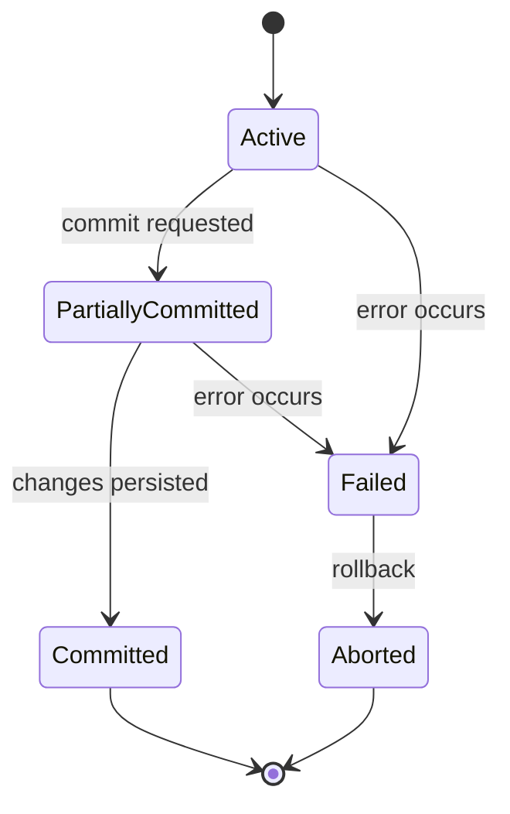

# Database Transactions

## Theory

### What is a Transaction?

A transaction is a sequence of one or more database operations (reads/writes) that is treated as a single logical unit of work — either all of its effects are applied, or none are. Transactions let applications group related changes (e.g., debiting one account and crediting another) so the database never ends up in a partially-updated, inconsistent state.

**Real-life scenario:** Transferring $100 from Account A to Account B involves two updates (debit A, credit B). Wrapping both in a transaction guarantees that if the credit fails after the debit succeeds, the debit is undone too — money is never lost or duplicated.

### Transaction Lifecycle

A transaction begins with a `BEGIN`/`START TRANSACTION` statement, executes a series of reads/writes, and ends either by committing (making changes permanent) or rolling back (discarding changes). Along the way it may pass through intermediate states as the database validates and applies its changes.

```sql
START TRANSACTION;
UPDATE account SET balance = balance - 100 WHERE account_id = 'A';
UPDATE account SET balance = balance + 100 WHERE account_id = 'B';
COMMIT;
```

### Transaction States

A transaction moves through a well-defined set of states from start to finish, tracked internally by the database's transaction manager.



- **Active** – the transaction is executing its operations.
- **Partially Committed** – the last operation has executed, but changes are not yet durably persisted.
- **Committed** – all changes have been durably saved.
- **Failed** – an error prevented the transaction from continuing normally.
- **Aborted** – the transaction was rolled back, and the database restored to its pre-transaction state.

### ACID Properties

ACID is the set of guarantees a database transaction must provide to be considered reliable.

**Real-life scenario:** In the bank transfer example above, ACID guarantees: the transfer either fully happens or not at all (Atomicity), the total money in the system stays correct (Consistency), concurrent transfers don't interfere with each other's intermediate state (Isolation), and once confirmed, the transfer survives a crash (Durability).

| Property | Guarantee |
|---|---|
| Atomicity | All operations in the transaction succeed, or none are applied |
| Consistency | The database moves from one valid state to another, preserving all rules/constraints |
| Isolation | Concurrent transactions don't see each other's uncommitted intermediate state |
| Durability | Once committed, changes survive crashes/power loss |

### Transaction Failures

A transaction can fail for several reasons: a logical/application error (e.g., a constraint violation), a system crash, a disk/hardware failure, or a deadlock that forces the database to abort one of the competing transactions. In all cases, the database must roll back the failed transaction's partial changes to preserve atomicity and consistency.

### Commit

`COMMIT` finalizes a transaction, making all of its changes permanent and visible to other transactions. Once committed, the changes are durable and cannot be undone by a rollback.

```sql
START TRANSACTION;
INSERT INTO orders (order_id, status) VALUES (101, 'CREATED');
COMMIT;  -- changes are now permanent
```

### Rollback

`ROLLBACK` undoes all changes made during the current transaction, restoring the database to the state it was in before the transaction began. It's used both explicitly (application logic detects a problem) and implicitly (the database aborts the transaction due to an error or deadlock).

```sql
START TRANSACTION;
UPDATE account SET balance = balance - 100 WHERE account_id = 'A';
-- error detected: insufficient funds check fails in application logic
ROLLBACK;  -- the debit above is undone
```

### Savepoints

A savepoint is a named marker within a transaction that allows a partial rollback to that point, without discarding the entire transaction. It's useful for handling recoverable errors partway through a long transaction.

```sql
START TRANSACTION;
UPDATE account SET balance = balance - 100 WHERE account_id = 'A';
SAVEPOINT after_debit;
UPDATE account SET balance = balance + 100 WHERE account_id = 'C'; -- wrong account
ROLLBACK TO after_debit;  -- undo only the bad credit, keep the debit
UPDATE account SET balance = balance + 100 WHERE account_id = 'B'; -- correct account
COMMIT;
```

### Interview Questions

- **Q: What are the ACID properties, and why do they matter?**
  A: Atomicity, Consistency, Isolation, and Durability — they guarantee that transactions are reliable: fully applied or not at all, keep the database valid, don't interfere with each other, and survive crashes once committed.
- **Q: What's the difference between COMMIT and ROLLBACK?**
  A: `COMMIT` permanently saves all changes made in the transaction; `ROLLBACK` discards them, restoring the pre-transaction state.
- **Q: Give a real-world example that shows why atomicity is necessary.**
  A: A bank transfer that debits one account and credits another — if the credit fails after the debit succeeds without atomicity, money would simply disappear.
- **Q: What is a savepoint used for?**
  A: To roll back only part of a transaction (back to a named marker) without discarding all the work done earlier in that transaction.
- **Q: Can a transaction be rolled back after it has been committed?**
  A: No — once committed, changes are durable and permanent; a separate compensating transaction would be needed to reverse the effect.
- **Q: What causes a transaction to fail, and what does the database do about it?**
  A: Causes include constraint violations, application errors, system crashes, and deadlocks; the database rolls back the transaction's partial changes to keep the database consistent.
- **Q: Why is isolation important when multiple transactions run concurrently?**
  A: Without isolation, one transaction could read another's uncommitted, potentially-to-be-rolled-back changes, leading to incorrect results (dirty reads, lost updates, etc.).

