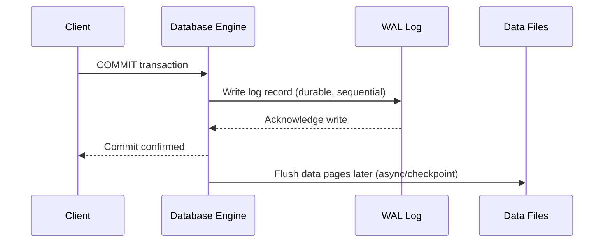

# Write Ahead logging

## Youtube

- [What is Write Ahead logging? WAL Explained in System Design](https://www.youtube.com/watch?v=cqORW8yzyFg)
    - [Why Uber Engineering Switched from Postgres to MySQL](https://www.uber.com/us/en/blog/postgres-to-mysql-migration/)
    - [Why Uber Moved from Postgres to MySQL](https://medium.com/databases-in-simple-words/why-uber-moved-from-postgres-to-mysql-b6ecfa9ff0d9)

## Theory
### Write-Ahead Logging (WAL)

WAL is a technique where changes to data are first recorded in a durable log before being applied to the actual data files. This guarantees durability and enables crash recovery — since even if the database crashes before writing changes to disk, the log can be replayed to reconstruct the correct state.

- **Advantages:** durability guarantee without requiring every data page write to be synchronous, faster commits (sequential log writes vs random data writes), enables crash recovery and replication
- **Disadvantages:** additional storage for logs, log management/archiving complexity

