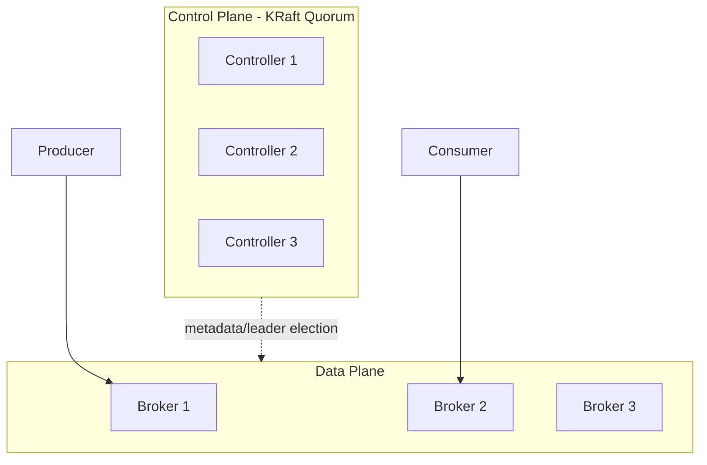
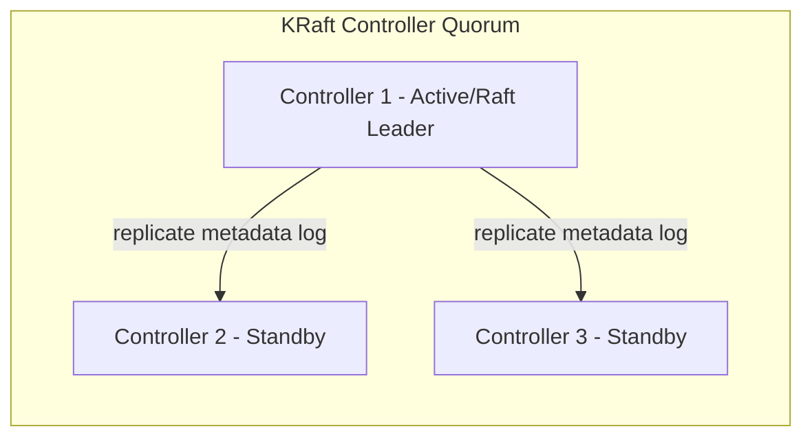

# Kafka Architecture

### Cluster Architecture

Kafka's cluster architecture is built from three cooperating layers: the **data plane** (brokers storing and serving partitions), the **control plane** (the KRaft controller quorum managing metadata, leader elections, and cluster membership), and the **client layer** (producers and consumers that read cluster metadata and talk directly to the relevant partition leaders). This separation lets the data plane scale by simply adding brokers, while the control plane remains small and highly consistent (typically 3 or 5 controller nodes using Raft consensus).

Clients never need a load balancer in front of Kafka in the traditional sense — instead, they use a small list of "bootstrap" broker addresses to discover the full cluster topology, then cache and refresh that metadata as partitions move or leaders change.



**Real-life scenario:** A platform team scales from 3 to 12 brokers as traffic grows, redistributing partitions across the new brokers, without ever touching the small 3-node controller quorum that continues managing metadata.

**Interview Questions:**
- Why is the control plane kept small (3-5 nodes) even in large clusters? — Raft consensus performs best with a small, odd-numbered quorum; it doesn't need to scale with data volume.
- How do clients discover the full cluster topology? — By connecting to bootstrap servers and fetching metadata, which is cached and refreshed as needed.
- What are the three architectural layers of a Kafka deployment? — Control plane (KRaft controllers), data plane (brokers), and client layer (producers/consumers).

### Broker Responsibilities

A broker's core responsibilities include: persisting partition data to disk as append-only log segments; serving `Produce` requests (appending new records) and `Fetch` requests (serving records to consumers/followers); managing replication for partitions it leads or follows; enforcing topic configuration such as retention, quotas, and compaction; and participating in cluster membership/heartbeats with the controller.

Brokers are deliberately kept stateless with respect to consumer progress — they don't track which records a given consumer group has read (that's stored in `__consumer_offsets`, itself just another topic) — which keeps the broker implementation simpler and more scalable.

Performance-wise, brokers rely heavily on the OS page cache and sequential disk I/O (rather than random access or in-JVM caching) to achieve high throughput, and use zero-copy transfer (`sendfile`) to serve fetch requests efficiently without extra data copies.

**Real-life scenario:** An SRE team monitors broker-level metrics like `UnderReplicatedPartitions` and `RequestHandlerAvgIdlePercent` to catch a struggling broker before it causes cluster-wide latency spikes.

**Interview Questions:**
- Does a broker know how far along a specific consumer group has read? — No, that state lives in the `__consumer_offsets` topic, not in broker memory tied to the consumer.
- Why does Kafka favor sequential disk I/O? — It is dramatically faster than random I/O on both spinning disks and SSDs, and pairs well with OS page-cache reads.
- What technique lets brokers serve fetch requests with minimal CPU/memory overhead? — Zero-copy transfer via `sendfile`.

### Topic Partitioning

Topic partitioning is the act of splitting a topic's data into multiple independent, ordered logs (partitions) so that storage and throughput scale horizontally across brokers, and so that multiple consumers can process a topic in parallel. Partitioning is a core architectural decision because it directly bounds parallelism (partition count) and ordering scope (only within a partition).

When a producer sends a record, a **partitioner** decides its destination partition: if a key is present, the default partitioner hashes the key (murmur2) to consistently map same-key records to the same partition; if no key is present, records are distributed using a sticky/round-robin approach for load balancing across partitions.

Repartitioning an existing topic (increasing partition count) is possible but changes the key-to-partition mapping going forward, which can break ordering assumptions for existing keys — a well-known gotcha that's frequently asked about in interviews.

```bash
# Increase partitions on an existing topic (cannot decrease!)
kafka-topics.sh --bootstrap-server localhost:9092 \
  --alter --topic order-events --partitions 12
```

**Real-life scenario:** A team increases `order-events` from 6 to 12 partitions to add consumer parallelism, but must warn downstream teams that records for existing order IDs may now land on a different partition than before, potentially affecting strict per-key ordering during the transition.

**Interview Questions:**
- How does the default partitioner decide the partition for a keyed record? — It hashes the key (murmur2) modulo partition count.
- Can you decrease the number of partitions on an existing topic? — No, Kafka does not support reducing partition count; the topic must be recreated.
- What is the risk of increasing partition count on a topic with existing keyed data? — The key-to-partition mapping changes, potentially breaking per-key ordering continuity.

### Metadata

Cluster metadata is the authoritative record of everything about the cluster's topology: which topics and partitions exist, which broker is the leader/follower for each partition, the current ISR set, topic configurations, and broker liveness. In modern Kafka, this metadata itself is stored as an event log (the `__cluster_metadata` topic) replicated via the Raft protocol among controller nodes — a very fitting design, since Kafka essentially "eats its own dog food" by using a log to store its own metadata.

Clients periodically refresh cached metadata (on a timer, or reactively when they hit a `NotLeaderForPartition` error), so that they keep sending requests to the correct current leader even as leadership changes due to failures or rebalancing.

Efficient metadata propagation matters a lot at scale — with hundreds of thousands of partitions, slow metadata propagation was one of the biggest scalability pain points ZooKeeper-based Kafka had, which was a major motivation for KRaft.

**Real-life scenario:** When a broker crashes and a new leader is elected for its partitions, producers get a `NotLeaderForPartition` error on their next request, triggering an automatic metadata refresh so subsequent requests go to the correct new leader within milliseconds.

**Interview Questions:**
- Where is cluster metadata stored in a KRaft-based Kafka cluster? — In the internal `__cluster_metadata` topic, replicated via Raft among controllers.
- What triggers a client to refresh its cached metadata? — A periodic timer, or an error response like `NotLeaderForPartition`/`UnknownTopicOrPartition`.
- Why was metadata propagation a scalability bottleneck in ZooKeeper-based Kafka? — ZooKeeper's watch-based full-metadata propagation didn't scale well to very large partition counts, causing slow controller failover.

### Replication Factor

Replication factor is a per-topic configuration specifying how many copies of each partition should exist across the cluster, including the leader. A replication factor of 3 means one leader plus two followers; this is the most common production setting because it tolerates the simultaneous loss of two brokers without losing data (assuming `acks=all` and sufficient ISR).

Replication factor cannot exceed the number of brokers in the cluster, and increasing it after topic creation requires a partition reassignment operation (it isn't a simple config toggle), since new replicas need to be created and fully synced.

There's a direct cost trade-off: each additional replica multiplies storage usage and inter-broker network bandwidth for that topic, so teams typically apply replication factor 3 for important data and may accept replication factor 1 or 2 for easily-reproducible, low-value data (e.g., transient logs).

```properties
# server.properties / topic config
default.replication.factor=3
min.insync.replicas=2
```

**Real-life scenario:** A financial services firm mandates replication factor 3 for all production topics as a compliance requirement, ensuring no single points of failure for transactional event data.

**Interview Questions:**
- What is a typical production replication factor and why? — 3, because it tolerates 2 broker failures while balancing storage/network cost.
- Can replication factor exceed the broker count? — No, there must be at least as many brokers as the replication factor.
- Is changing replication factor a simple config change? — No, it requires a partition reassignment to create and sync new replicas.

### In-Sync Replicas (ISR)

The In-Sync Replica (ISR) set for a partition is the leader plus all follower replicas that have fetched up to (or sufficiently close to) the leader's latest offset within the allowed lag window (`replica.lag.time.max.ms`). Only members of the ISR are eligible to be elected leader if the current leader fails, which is what guarantees no acknowledged (committed) data is lost on failover.

The ISR set is dynamic: a follower is removed from ISR if it falls behind (e.g., due to a slow disk, network issue, or GC pause) and re-added once it catches up. Monitoring `UnderReplicatedPartitions` (partitions where the ISR set is smaller than the replication factor) is one of the most important operational health signals for a Kafka cluster.

`min.insync.replicas` works together with `acks=all` to enforce a durability floor: if the ISR count drops below `min.insync.replicas`, producers using `acks=all` will receive a `NotEnoughReplicasException` rather than silently writing with weaker durability.

**Real-life scenario:** A broker experiences a long GC pause; its replicas fall out of the ISR for several partitions, and the cluster's monitoring dashboard fires an alert on rising `UnderReplicatedPartitions` before customer impact occurs.

**Interview Questions:**
- What determines whether a replica is in the ISR? — Whether it has kept up with the leader within the configured lag time/window.
- Why does leader election only choose from the ISR set? — To guarantee no committed data is lost (a lagging replica may be missing recent records).
- What happens to `acks=all` producers when ISR count drops below `min.insync.replicas`? — They receive a `NotEnoughReplicasException` and the write is rejected.

### Controller

The controller is the component (in KRaft, a set of dedicated controller nodes forming a Raft quorum) responsible for cluster-wide coordination: electing partition leaders, tracking broker liveness, propagating metadata changes, and processing administrative operations like topic creation/deletion and partition reassignment. In legacy ZooKeeper-based Kafka, exactly one broker was elected "controller" using ZooKeeper; in KRaft, dedicated controller nodes (which can be combined with broker roles in smaller clusters) manage this via Raft consensus without external coordination software.

The controller must react quickly to broker failures — detecting a dead broker, and reassigning leadership for every partition it led — so controller failover speed and metadata propagation efficiency are critical to overall cluster availability during incidents.

Because the controller quorum uses Raft, it maintains strong consistency about cluster state and elects its own internal active controller similarly to how partitions elect leaders, making the whole system self-similar in design.

**Real-life scenario:** When a broker holding 500 partition leaderships suddenly crashes, the controller quickly detects the failure via missed heartbeats and reassigns each affected partition's leadership to an in-sync follower, restoring full availability within seconds.

**Interview Questions:**
- What is the controller's primary job in a Kafka cluster? — Managing partition leader election, broker membership, and metadata propagation.
- How did the controller work before KRaft, and what changed? — One broker was elected controller via ZooKeeper; KRaft replaces this with a dedicated Raft-based controller quorum.
- Why is fast controller failover important operationally? — Because until a new controller is active, leader elections and metadata updates cannot proceed, risking availability during incidents.

### KRaft Architecture

KRaft (Kafka Raft) is Kafka's built-in consensus protocol that replaces ZooKeeper for metadata management, making Kafka self-contained with no external coordination service required. In KRaft mode, a small set of nodes run the **controller** role (forming a Raft quorum that replicates the `__cluster_metadata` log), while other nodes run the **broker** role (serving data); small clusters can combine both roles on the same nodes, while large production clusters typically run dedicated controller nodes.

KRaft was introduced to solve real operational pain points with ZooKeeper: a second system to deploy/monitor/secure, slower controller failover due to full-metadata reloads, and scalability limits around very large partition counts (ZooKeeper struggled past a few hundred thousand partitions). KRaft's event-log-based metadata store scales much better and unifies Kafka's own architecture (metadata is itself just a replicated log, consistent with how Kafka treats everything else).

As of recent Kafka versions, KRaft is the default and recommended mode for new clusters, with ZooKeeper mode deprecated and slated for removal.

```properties
# KRaft node roles in server.properties (combined mode example)
process.roles=broker,controller
node.id=1
controller.quorum.voters=1@localhost:9093,2@localhost:9094,3@localhost:9095
listeners=PLAINTEXT://:9092,CONTROLLER://:9093
```

**Real-life scenario:** A team migrating from Kafka 2.x to a modern version retires their ZooKeeper ensemble entirely, simplifying their deployment topology and reducing the number of systems that need patching, monitoring, and on-call runbooks.

**Interview Questions:**
- What problem does KRaft solve compared to ZooKeeper-based Kafka? — Removes the external ZooKeeper dependency, improves controller failover speed, and scales to far more partitions.
- What two node roles exist in KRaft, and can they be combined? — Broker and controller; yes, small clusters can combine both roles on the same node.
- Where is KRaft metadata stored? — In an internal replicated log, the `__cluster_metadata` topic.

### ZooKeeper (Legacy)

ZooKeeper was the original external coordination service Kafka relied on (pre-KRaft) to store cluster metadata: broker registration, topic/partition configuration, ACLs, and — critically — to elect the single active controller broker. ZooKeeper is a general-purpose distributed coordination system (used by many distributed systems, not just Kafka) providing a hierarchical key-value store with watches for change notification.

The ZooKeeper-based design had well-known limitations: operators had to run, secure, and monitor a completely separate ZooKeeper ensemble; controller failover required reloading full metadata state, which became slow as partition counts grew into the hundreds of thousands; and the watch-based notification model didn't scale gracefully to very large clusters.

Kafka has fully deprecated ZooKeeper mode in favor of KRaft; it is now primarily an interview/legacy-systems topic — useful to understand for maintaining older clusters, but not for new deployments.

**Real-life scenario:** An engineer supporting a legacy Kafka 2.x deployment troubleshoots a slow controller failover, tracing the root cause to ZooKeeper reprocessing a large volume of watches during a full metadata reload — the exact pain point KRaft was built to eliminate.

**Interview Questions:**
- What was ZooKeeper's role in older Kafka clusters? — Storing cluster metadata and electing the active controller broker.
- Why was ZooKeeper eventually removed from Kafka's architecture? — It added an extra operational dependency and became a scalability/failover bottleneck at high partition counts.
- Is ZooKeeper still recommended for new Kafka deployments? — No, KRaft is the default and recommended mode; ZooKeeper mode is deprecated.

### KRaft Controller Quorum

The KRaft controller quorum is the set of nodes (typically 3 or 5, an odd number for majority voting) running the controller role that use the Raft consensus algorithm to maintain a single, consistent, replicated log of cluster metadata. One node in the quorum acts as the **active controller** (the Raft leader for the metadata log) while the others are **standby controllers** that replicate the log and can take over instantly if the active controller fails.

Raft ensures that metadata changes (new topic, partition reassignment, ACL update, broker registration) are committed only once a majority of the quorum has persisted them, giving strong consistency guarantees even during controller failover — a big improvement over the ZooKeeper model's slower, full-reload failover.

Sizing the controller quorum is a small, fixed decision independent of the number of brokers or partitions in the cluster — 3 controllers is standard for most deployments, with 5 used for extremely large or critical clusters wanting extra fault tolerance.



**Real-life scenario:** During a datacenter network blip, the active controller becomes unreachable; the remaining two controllers in the quorum quickly elect a new active controller via Raft, and cluster operations (leader elections, metadata updates) resume with only a brief pause.

**Interview Questions:**
- Why is the controller quorum sized as an odd number (e.g., 3 or 5)? — To ensure a clear majority for Raft consensus and tolerate node failures without losing quorum.
- What is the difference between the active controller and standby controllers? — The active controller is the current Raft leader processing metadata writes; standbys replicate and stand ready to take over.
- Does controller quorum size need to scale with the number of brokers? — No, it is typically fixed (3 or 5) regardless of cluster size.

