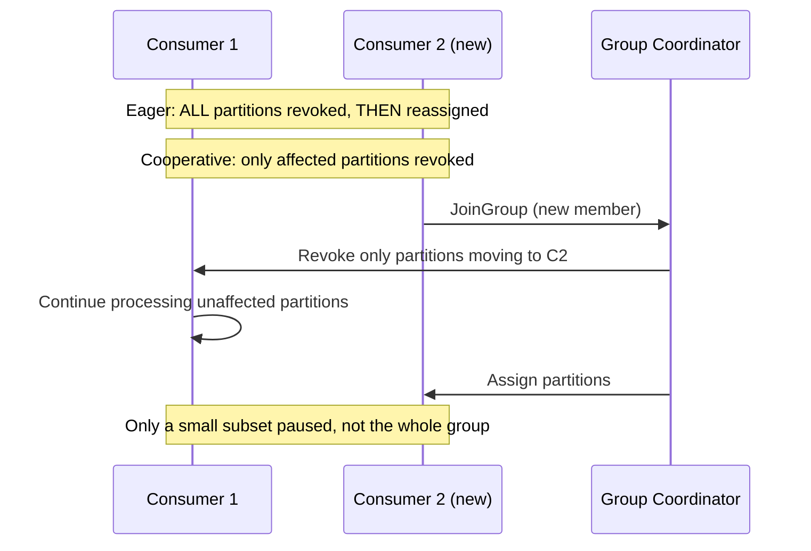

# Consumer Group Rebalancing

### Static Membership

By default, each consumer instance gets a dynamically generated `member.id` on every join, so a brief restart (rolling deploy, pod reschedule) looks like "member left, then a new member joined" — triggering a full rebalance. Static membership fixes this by letting a consumer specify a stable `group.instance.id`; on rejoin within `session.timeout.ms`, the group coordinator recognizes it as the *same* member and skips triggering a rebalance, simply reassigning it its previous partitions.

This is especially valuable for stateful consumers (e.g., Kafka Streams apps with local state stores) where rebalancing is expensive (state store rebuilding, cache invalidation) — static membership turns routine restarts from "expensive full rebalance" into "cheap, transparent reconnect."

```properties
group.instance.id=consumer-instance-1
session.timeout.ms=45000
```

```java
@Bean
public ConsumerFactory<String, String> consumerFactory() {
    Map<String, Object> props = new HashMap<>();
    props.put(ConsumerConfig.GROUP_INSTANCE_ID_CONFIG, "order-consumer-1");
    return new DefaultKafkaConsumerFactory<>(props);
}
```

**Real-life scenario:** A Kubernetes-deployed Kafka Streams application restarts pods during a rolling update; with static membership, each pod reclaims its exact prior partition assignment on restart instead of forcing the entire consumer group to rebalance and rebuild state.

**Advantages**
- Avoids unnecessary rebalances on brief, expected restarts — much cheaper for stateful consumers.

**Disadvantages**
- Requires each instance to have a genuinely stable, unique `group.instance.id` (misconfiguration, e.g., duplicate IDs, causes errors).
- Doesn't help if the instance is gone for longer than `session.timeout.ms` — a rebalance still happens eventually.

**Differences vs Dynamic Membership**
- Static: stable identity across restarts, rebalance-avoidant.
- Dynamic: new identity every join, rebalances on every restart.

**Interview Questions**
- What problem does static membership solve for stateful consumer applications? — It prevents brief, routine restarts from triggering a full, expensive rebalance (state store rebuilds, cache invalidation) by letting the consumer keep a stable identity across restarts.
- What config enables static membership, and what happens if two instances share the same value? — `group.instance.id`; if two live instances share the same value, the coordinator treats it as a conflicting/duplicate member and fences one of them off with an error.
- What happens if a statically-membered consumer doesn't come back within the session timeout? — The coordinator eventually treats it as truly gone and triggers a normal rebalance to reassign its partitions to other members.

### Dynamic Membership

Dynamic membership is Kafka's default consumer group behavior: every time a consumer instance joins the group, it's assigned a brand-new, ephemeral `member.id`, and the group coordinator has no concept of "this is the same physical instance as before." Any join, leave, restart, or crash is treated as a full membership change, triggering a rebalance to redistribute partitions among current members.

This is simpler to reason about and requires no configuration, making it the right choice for stateless consumers where a rebalance is cheap (no local state to rebuild) — but for stateful or large consumer groups, frequent rebalances caused by routine restarts can become a real performance/availability concern, which is exactly what static membership was introduced to address.

```properties
# Default behavior — no group.instance.id set
group.id=order-processing-group
```

**Real-life scenario:** A simple, stateless notification-sending consumer group that scales up/down frequently with autoscaling — dynamic membership is fine here since each rebalance is cheap and there's no state to lose.

**Advantages**
- Zero configuration, simplest mental model, works fine for stateless/lightweight consumers.

**Disadvantages**
- Every restart/crash triggers a rebalance, which can be costly for stateful applications or large groups (rebalance "storms").

**Differences vs Static Membership**
- Dynamic: new ID every join, rebalance on every membership change.
- Static: stable ID via `group.instance.id`, rebalance-avoidant on brief restarts.

**Interview Questions**
- What is the default consumer group membership behavior in Kafka? — Dynamic membership — every join is assigned a brand-new ephemeral `member.id`, with no concept of "same instance as before."
- Why can frequent rebalances be especially costly for large or stateful consumer groups? — Each rebalance can pause processing across the whole group (under eager rebalancing) and force stateful consumers to rebuild local state stores/caches, and the cost scales with group size and state size.

### Cooperative Rebalancing

Cooperative (incremental) rebalancing, introduced via the `CooperativeStickyAssignor`, replaces the older "stop-the-world" **eager** rebalancing protocol (where *every* consumer revokes *all* its partitions before reassignment, even ones it will get right back) with an incremental approach: only the specific partitions that actually need to move are revoked, and consumers keep processing their unaffected partitions throughout the rebalance. This can require two rebalance rounds internally, but avoids the full-group pause that eager rebalancing causes.

This is now the recommended assignment strategy for most Spring Kafka / Kafka Streams applications, since it significantly reduces the "stop the world" pause duration during scaling events or restarts, especially for large consumer groups with many partitions.

```properties
partition.assignment.strategy=org.apache.kafka.clients.consumer.CooperativeStickyAssignor
```



**Real-life scenario:** A 20-partition, 10-consumer group scales up to 12 consumers — with cooperative rebalancing, only the ~4 partitions that actually need to move are briefly paused, while the other 16 keep processing uninterrupted.

**Advantages**
- Much shorter effective downtime during rebalances; scales better for large groups.

**Disadvantages**
- Slightly more complex protocol (may take two rebalance passes); requires consistent assignor config across all group members.

**Differences vs Eager Rebalancing**
- Eager: revoke everything, then reassign everything (full pause).
- Cooperative: revoke and reassign only what's necessary (partial, incremental pause).

**Interview Questions**
- What is the key difference between eager and cooperative rebalancing protocols? — Eager rebalancing revokes *all* partitions from *every* consumer before reassigning any of them (a full stop-the-world pause); cooperative rebalancing only revokes the specific partitions that actually need to move, letting consumers keep processing unaffected partitions.
- Which assignor enables cooperative rebalancing, and what config enables it? — `CooperativeStickyAssignor`, set via `partition.assignment.strategy`.
- Why might cooperative rebalancing take more than one round to converge? — Because partitions are only revoked (not reassigned) in the first pass, a second rebalance round is sometimes needed to actually hand those revoked partitions to their new owners.

### Rebalance Triggers

A rebalance is triggered whenever the group coordinator determines that partition ownership needs to change. Common triggers include: a new consumer joining the group, an existing consumer leaving gracefully (`close()`) or being considered dead (missed heartbeats past `session.timeout.ms`, or failing to call `poll()` within `max.poll.interval.ms`), a topic's partition count increasing, or the consumer group's subscribed topic list changing.

Understanding these triggers is critical for diagnosing "rebalance storms" in production — e.g., a consumer whose processing occasionally exceeds `max.poll.interval.ms` will be repeatedly kicked out and rejoin, causing continuous, avoidable rebalances that hurt overall group throughput.

```properties
session.timeout.ms=45000
heartbeat.interval.ms=15000
max.poll.interval.ms=300000
max.poll.records=500
```

**Real-life scenario:** A consumer occasionally takes longer than `max.poll.interval.ms` to process a large batch (e.g., due to a slow downstream API call), gets evicted from the group, and rejoins moments later — triggering a rebalance every time this happens, visible as a recurring pattern in consumer lag graphs.

**Advantages of understanding triggers**
- Enables tuning (`max.poll.records`, `max.poll.interval.ms`, session timeouts) to reduce unnecessary rebalances.

**Disadvantages of frequent, unmanaged rebalances**
- Temporary processing pauses, potential duplicate processing (uncommitted offsets get reprocessed), reduced overall throughput.

**Interview Questions**
- What are the main events that trigger a consumer group rebalance? — A consumer joining or leaving the group, a consumer crashing or being deemed dead (session timeout / missed `max.poll.interval.ms`), or a change in topic metadata such as new partitions being added.
- How can slow message processing indirectly cause repeated rebalances? — If processing a batch takes longer than `max.poll.interval.ms`, the coordinator assumes the consumer is dead and evicts it, triggering a rebalance even though the instance is still alive and just slow.
- What's the difference between `session.timeout.ms` and `max.poll.interval.ms`, and how do they each relate to rebalances? — `session.timeout.ms` bounds how long the coordinator waits without a heartbeat before considering a consumer dead; `max.poll.interval.ms` bounds how long between calls to `poll()` before the consumer is considered stuck/dead — either one being exceeded triggers a rebalance.

### Rebalance Listeners

Spring Kafka and the native Kafka client both expose rebalance listener hooks — `ConsumerRebalanceListener` (native) and `ConsumerAwareRebalanceListener`/container `setConsumerRebalanceListener` (Spring Kafka) — that let application code react to partitions being revoked or assigned, most commonly to **commit offsets manually before partitions are taken away**, or to clean up/initialize local resources (caches, state) tied to specific partitions.

The two key callback methods are `onPartitionsRevoked` (called just before partitions are reassigned — the last safe chance to commit offsets for that batch of work) and `onPartitionsAssigned` (called once new partitions are assigned — a good place to seek to a specific offset or warm up local state).

```java
@Bean
public ConcurrentKafkaListenerContainerFactory<String, String> kafkaListenerContainerFactory(
        ConsumerFactory<String, String> cf) {
    ConcurrentKafkaListenerContainerFactory<String, String> factory =
            new ConcurrentKafkaListenerContainerFactory<>();
    factory.setConsumerFactory(cf);
    factory.getContainerProperties().setConsumerRebalanceListener(new ConsumerAwareRebalanceListener() {
        @Override
        public void onPartitionsRevokedBeforeCommit(Consumer<?, ?> consumer, Collection<TopicPartition> partitions) {
            log.info("Partitions revoked, committing offsets: {}", partitions);
        }

        @Override
        public void onPartitionsAssigned(Consumer<?, ?> consumer, Collection<TopicPartition> partitions) {
            log.info("Partitions assigned: {}", partitions);
        }
    });
    return factory;
}
```

**Real-life scenario:** A consumer maintaining an in-memory per-partition cache uses `onPartitionsRevoked` to flush pending writes and commit offsets safely, and `onPartitionsAssigned` to pre-load cache entries for its newly assigned partitions — avoiding both data loss and cold-cache latency spikes.

**Advantages**
- Enables safe cleanup/commit and warm-up logic exactly at the moments ownership changes.

**Disadvantages**
- Incorrect handling (e.g., slow logic in the listener) can extend the overall rebalance pause for the whole group.

**Interview Questions**
- Why is `onPartitionsRevoked` the right place to commit offsets manually? — It fires just before ownership of those partitions moves to another consumer, making it the last safe moment to commit progress for records already processed under the current assignment.
- What risk does putting slow logic inside a rebalance listener introduce? — The rebalance (and thus the whole group, under eager rebalancing) can't complete until the listener callback returns, so slow logic extends the pause for every member of the group.
- How would you use rebalance listeners to warm up a local cache per partition? — Implement `onPartitionsAssigned` to pre-load cache entries or seek to a specific offset for the newly assigned partitions before regular message processing begins.

