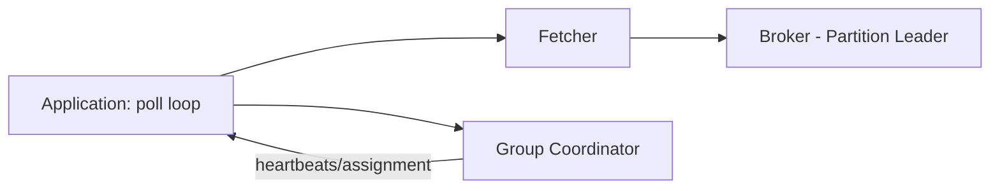

# Consumers

### Consumer Architecture

Internally, the Kafka consumer client manages a **fetcher** component that issues `Fetch` requests to partition leaders and buffers returned records locally, while the application thread calls `poll()` to retrieve batches of already-fetched records for processing. The consumer also maintains a connection to the **group coordinator** (a broker) for group membership, heartbeats, and partition assignment.

A single consumer instance can be assigned multiple partitions (potentially from multiple topics), and internally manages a separate fetch position per partition; `poll()` returns an interleaved batch of records across all currently assigned partitions, though within any single partition the records returned are always in offset order.

In Spring Kafka, the `@KafkaListenerContainerFactory`/`ConcurrentMessageListenerContainer` wraps this poll loop into a managed background thread pool, letting `concurrency` control how many consumer threads (and thus how many partitions can be processed in parallel) a single application instance runs.



**Real-life scenario:** A Spring Boot service configures `concurrency=4` on its `@KafkaListener`, spinning up 4 internal consumer threads that each independently poll and process a subset of the topic's partitions in parallel within a single application instance.

**Interview Questions:**
- What two broker-facing responsibilities does a consumer client manage besides fetching data? — Group membership/heartbeats and coordinating with the group coordinator for partition assignment.
- Within a single `poll()` call, is ordering guaranteed across different partitions? — No, only within each individual partition; the returned batch interleaves partitions.
- How does Spring Kafka let you run multiple consumer threads per application instance? — Via the `concurrency` setting on `@KafkaListener`/listener container factory.

### Consumer Groups

(See also "Consumer Groups" under Core Kafka Concepts.) From an implementation standpoint, a consumer group's state — membership, partition assignment, committed offsets — is managed by a **group coordinator** broker, elected per group based on a hash of the `group.id`. Consumers periodically send heartbeats (`heartbeat.interval.ms`) to the coordinator to signal liveness; missing heartbeats beyond `session.timeout.ms` triggers removal from the group and a rebalance.

The relationship between partitions and consumer instances within a group is strictly 1-to-many-or-one: each partition is owned by exactly one consumer at a time, but a single consumer can own multiple partitions. This is the fundamental scaling knob — throughput scales by adding consumer instances up to the partition count, and beyond that by adding partitions (which requires planning, since partition count can't be decreased).

Choosing `group.id` carefully matters operationally: services that should share load use the same `group.id`; services that need their own independent copy of the stream use a distinct `group.id`.

```java
@KafkaListener(topics = "order-events", groupId = "inventory-service")
public void onOrder(OrderPlacedEvent event) { /* ... */ }
```

**Real-life scenario:** Both `inventory-service` and `analytics-service` consume the same `order-events` topic using different `group.id`s, so each gets its own full, independent copy of the stream at its own pace.

**Interview Questions:**
- What broker component manages a consumer group's membership and offsets? — The group coordinator.
- What two settings control how quickly a crashed consumer is detected and removed from the group? — `heartbeat.interval.ms` and `session.timeout.ms`.
- How do you scale processing throughput for a consumer group? — Add more consumer instances (up to the partition count), or increase partition count if already maxed out.

### Consumer Configuration

Key consumer configuration properties include `group.id` (group membership), `bootstrap.servers`, `key.deserializer`/`value.deserializer`, `auto.offset.reset` (`earliest`/`latest`/`none` — behavior when no committed offset exists), `enable.auto.commit` (auto vs manual offset commits), `max.poll.records` (batch size per poll), `max.poll.interval.ms` (max allowed time between polls before being considered dead), and `fetch.min.bytes`/`fetch.max.wait.ms` (fetch batching tuning).

In Spring Boot, these map to `spring.kafka.consumer.*` properties, and Spring Kafka additionally layers its own container-level settings (like `ackMode` for manual commit strategies, and `concurrency` for parallelism) on top of the raw Kafka client configuration.

A commonly misunderstood setting is `auto.offset.reset`: it only takes effect when there is **no previously committed offset** for that consumer group/partition (e.g., a brand-new group, or offsets expired) — it does *not* control behavior for a group with existing committed offsets, which always resumes from its last commit regardless of this setting.

```yaml
spring:
  kafka:
    consumer:
      group-id: billing-service
      auto-offset-reset: earliest
      enable-auto-commit: false
      max-poll-records: 500
      key-deserializer: org.apache.kafka.common.serialization.StringDeserializer
      value-deserializer: org.springframework.kafka.support.serializer.JsonDeserializer
    listener:
      ack-mode: MANUAL_IMMEDIATE
```

**Real-life scenario:** A new consumer group deployed for the first time uses `auto.offset.reset=earliest` to process the topic's entire retained history on its first run, then relies purely on its committed offsets for every subsequent restart.

**Interview Questions:**
- When does `auto.offset.reset` actually take effect? — Only when there's no existing committed offset for that consumer group/partition.
- What consumer setting bounds how many records are returned per `poll()` call? — `max.poll.records`.
- What happens if processing a poll batch exceeds `max.poll.interval.ms`? — The consumer is considered dead/stuck and is removed from the group, triggering a rebalance.

### Polling Model

Kafka consumers use a **pull-based polling model**: the application repeatedly calls `poll(Duration timeout)` in a loop, and the client returns whatever records are currently available (up to `max.poll.records`) for the partitions assigned to that consumer. This is a deliberate design choice versus a push-based model — it gives the consumer full control over its own pace and backpressure, rather than risking being overwhelmed by a broker pushing data faster than it can process.

Calling `poll()` serves double duty: it both retrieves records **and** signals liveness to the group coordinator (implicitly satisfying heartbeat/liveness requirements in older client versions, though modern clients use a separate background heartbeat thread to decouple liveness from slow processing between polls). Still, `max.poll.interval.ms` bounds how long you can go between `poll()` calls before being considered dead.

Spring Kafka's `@KafkaListener` abstracts this loop entirely — developers write a method that receives one record (or a batch, with `batch = true`) per invocation, while the framework manages the underlying poll loop, retry, and offset commit behavior.

```java
// Manual poll loop (what @KafkaListener does internally)
while (running) {
    ConsumerRecords<String, String> records = consumer.poll(Duration.ofMillis(500));
    for (ConsumerRecord<String, String> record : records) {
        process(record);
    }
    consumer.commitSync();
}
```

**Real-life scenario:** A consumer processing computationally expensive records deliberately keeps `max.poll.records` small so each poll's processing time comfortably stays under `max.poll.interval.ms`, avoiding accidental rebalances from perceived staleness.

**Interview Questions:**
- Is Kafka's consumption model push-based or pull-based, and why? — Pull-based, giving consumers control over pace and backpressure.
- What client-side setting bounds the allowed time between successive `poll()` calls? — `max.poll.interval.ms`.
- How does `@KafkaListener` relate to the raw `poll()` loop? — It wraps and manages the poll loop internally, invoking your method per record/batch.

### Offset Management

Offset management is the process of tracking, per consumer group and partition, the position up to which records have been processed, so that a restarted or rebalanced consumer knows where to resume. Kafka stores committed offsets durably in the internal `__consumer_offsets` topic (rather than requiring an external database), making offset tracking scale naturally with the rest of the cluster.

Offsets can be committed automatically (`enable.auto.commit=true`, periodically in the background) or manually (application code explicitly calls `commitSync()`/`commitAsync()`, or Spring Kafka's `Acknowledgment.acknowledge()` under `AckMode.MANUAL`/`MANUAL_IMMEDIATE`), with the choice directly affecting delivery semantics (at-most-once vs at-least-once).

Beyond simple commit/resume, offsets can be explicitly manipulated for operational purposes: seeking to a specific offset, a timestamp, or resetting to `earliest`/`latest` — invaluable for reprocessing after a bug fix or recovering from a bad deployment.

```bash
# Reset a consumer group's offsets to earliest (group must be inactive)
kafka-consumer-groups.sh --bootstrap-server localhost:9092 \
  --group billing-service --topic order-events \
  --reset-offsets --to-earliest --execute
```

**Real-life scenario:** After fixing a bug that mis-calculated invoices for two days, the billing team resets their consumer group's offsets to a timestamp just before the bug was deployed and lets the service reprocess and correct the affected invoices automatically.

**Interview Questions:**
- Where are committed consumer offsets stored? — In the internal `__consumer_offsets` topic.
- What are the two broad approaches to committing offsets? — Automatic (periodic background commit) and manual (explicit application-controlled commit).
- Name a practical operational reason to manually reset a consumer group's offsets. — Reprocessing data after fixing a processing bug, or recovering from a bad deployment.

### Offset Commit

Committing an offset tells Kafka "this consumer group has successfully processed up to (and including) this position" for a given partition. The timing of the commit relative to actual message processing is the single biggest factor determining a consumer's delivery guarantee: committing *before* processing risks losing unprocessed records on a crash (at-most-once); committing *after* successful processing risks reprocessing duplicates on a crash between processing and committing (at-least-once, the most common and recommended default); and true exactly-once requires transactional writes that atomically combine processing output with the offset commit.

Kafka supports both synchronous commits (`commitSync()` — blocks until the broker acknowledges, safer but slower) and asynchronous commits (`commitAsync()` — non-blocking, faster, but requires careful handling since a failed async commit isn't automatically retried in a way that guarantees ordering of commit results).

In Spring Kafka, the `AckMode` setting controls this behavior declaratively: `RECORD` (commit after each record), `BATCH` (commit after each poll batch, the default), `MANUAL`/`MANUAL_IMMEDIATE` (application explicitly calls `acknowledgment.acknowledge()`), removing the need to hand-write commit logic.

```java
@KafkaListener(topics = "order-events", groupId = "billing-service")
public void consume(ConsumerRecord<String, String> record, Acknowledgment ack) {
    process(record);
    ack.acknowledge(); // manual commit after successful processing
}
```

**Real-life scenario:** A billing consumer commits offsets only after successfully writing an invoice to its database, ensuring that if it crashes mid-processing, the record is reprocessed on restart rather than silently skipped (accepting at-least-once/duplicate-safe processing via idempotent writes).

**Interview Questions:**
- What delivery semantic results from committing offsets before processing completes? — At-most-once (risk of message loss on crash).
- What delivery semantic results from committing after successful processing? — At-least-once (risk of duplicate reprocessing on crash, the common safe default).
- What's the difference between `commitSync()` and `commitAsync()`? — `commitSync()` blocks until acknowledged (safer, slower); `commitAsync()` is non-blocking (faster, needs careful error handling).

### Auto Commit

Auto commit (`enable.auto.commit=true`, the client default) periodically commits the latest returned offsets in the background on a timer (`auto.commit.interval.ms`, default 5s), without the application needing to call any commit method explicitly. It's the simplest option to configure and works fine for workloads where occasional message loss or duplicate processing on crash is tolerable (e.g., non-critical metrics, best-effort notifications).

The core risk is that auto commit happens on a timer *independent of whether processing has actually finished* — if a consumer crashes between an auto-commit and finishing processing of records already "committed," those records are silently skipped on restart (effectively at-most-once in the worst case), which is often surprising and undesirable for business-critical data.

Auto commit is generally discouraged for anything where correctness matters, in favor of manual commit tied explicitly to successful processing completion.

```properties
enable.auto.commit=true
auto.commit.interval.ms=5000
```

**Advantages:** simplest to configure, lowest application complexity, fine for low-stakes/best-effort data.
**Disadvantages:** commit timing is decoupled from actual processing completion, risking silent data loss on crash; less control over delivery semantics.

**Interview Questions:**
- What is the default value of `enable.auto.commit`? — `true`.
- What's the main risk of auto commit for critical data? — Offsets can be committed before processing finishes, risking silent message loss on a crash.
- When is auto commit an acceptable choice? — For low-stakes, best-effort workloads where occasional loss/duplication is tolerable.

### Manual Commit

Manual commit (`enable.auto.commit=false`) gives the application explicit control over exactly when an offset is considered "done," typically by calling `commitSync()`/`commitAsync()` (raw client) or `Acknowledgment.acknowledge()` (Spring Kafka, under `AckMode.MANUAL`/`MANUAL_IMMEDIATE`) only after processing has genuinely completed successfully — e.g., after a database write succeeds, or after downstream calls succeed.

This is the recommended approach for any business-critical processing, because it lets you align the commit precisely with your actual unit of work and error-handling strategy (e.g., commit only after a successful transactional write, or after a retry/dead-letter-queue policy has handled a failure), achieving reliable at-least-once semantics (and, combined with Kafka transactions, exactly-once).

The trade-off is added application complexity: you must explicitly manage commit timing, handle commit failures, and decide on batch-vs-per-record commit granularity (per-record commits are safer but slower; batch commits are faster but reprocess a bigger batch on failure).

```java
@KafkaListener(topics = "order-events", groupId = "billing-service",
               containerFactory = "manualAckContainerFactory")
public void consume(ConsumerRecord<String, String> record, Acknowledgment ack) {
    try {
        billingService.process(record.value());
        ack.acknowledge();
    } catch (Exception e) {
        // send to DLQ, retry, or skip - deliberately don't ack on failure
    }
}
```

**Advantages:** precise control over delivery semantics, safer for critical data, integrates cleanly with retry/DLQ patterns.
**Disadvantages:** more code/complexity, easier to introduce bugs (e.g., forgetting to ack, or acking too early), typically slightly higher latency than auto commit for the same throughput.

**Differences vs Auto Commit:**
- Manual commit ties offset progress to actual processing success; auto commit ties it to a timer.
- Manual commit supports precise at-least-once/exactly-once patterns; auto commit cannot reliably guarantee either.
- Manual commit requires explicit error handling; auto commit "just works" but with weaker guarantees.

**Interview Questions:**
- Why is manual commit preferred for business-critical consumers? — It aligns offset commits precisely with actual successful processing, avoiding silent data loss.
- What Spring Kafka construct enables manual commit in a `@KafkaListener`? — The `Acknowledgment` parameter combined with `AckMode.MANUAL`/`MANUAL_IMMEDIATE`.
- What's a downside of committing after every single record versus after a batch? — Higher commit overhead/latency, though safer on a per-record basis (smaller reprocessing window on failure).

### Consumer Rebalancing

(See also "Partition Rebalancing" above, from the producer/partitioning-adjacent perspective.) From the consumer's own lifecycle viewpoint, rebalancing means a consumer instance can have partitions **revoked** (`ConsumerRebalanceListener.onPartitionsRevoked`) and later **assigned** (`onPartitionsAssigned`) as group membership changes; well-behaved consumers use these callbacks to commit offsets before losing a partition and to seek to appropriate positions after gaining one.

Spring Kafka exposes this via `ConsumerAwareRebalanceListener` on the listener container, letting applications hook custom logic (e.g., flushing local state, committing pending work) precisely at the moment partitions are revoked or (re)assigned, which is especially important for stateful consumers (e.g., ones maintaining an in-memory cache keyed by partition).

Choosing the **cooperative-sticky** assignor (`partition.assignment.strategy`) over the legacy eager assignors (range/round-robin) significantly reduces rebalance disruption in modern deployments, since it avoids revoking partitions that don't actually need to move.

```java
@Bean
public ConcurrentKafkaListenerContainerFactory<String, String> containerFactory(
        ConsumerFactory<String, String> consumerFactory) {
    ConcurrentKafkaListenerContainerFactory<String, String> factory =
            new ConcurrentKafkaListenerContainerFactory<>();
    factory.setConsumerFactory(consumerFactory);
    factory.getContainerProperties().setConsumerRebalanceListener(
        new ConsumerAwareRebalanceListener() {
            @Override
            public void onPartitionsRevokedBeforeCommit(Consumer<?, ?> consumer, Collection<TopicPartition> partitions) {
                // flush local state / commit pending offsets
            }
        });
    return factory;
}
```

**Real-life scenario:** A stateful fraud-detection consumer keeps an in-memory rolling window of transactions per partition; it uses `onPartitionsRevoked` to persist that in-memory state before losing ownership, preventing gaps in fraud detection during rebalances.

**Interview Questions:**
- What two callbacks does `ConsumerRebalanceListener` provide, and when do they fire? — `onPartitionsRevoked` (before losing partitions) and `onPartitionsAssigned` (after gaining partitions).
- Why might a stateful consumer care deeply about rebalance callbacks? — To persist/flush in-memory state tied to a partition before losing ownership of it.
- What modern assignment strategy minimizes rebalance disruption compared to eager assignors? — The cooperative-sticky assignor.

### Deserialization

Deserialization is the reverse of serialization on the consumer side, converting raw bytes back into typed Java objects using the configured `key.deserializer`/`value.deserializer` (e.g., `StringDeserializer`, Spring's `JsonDeserializer`, or Avro/Protobuf deserializers backed by a Schema Registry). Deserialization errors are one of the most common real-world consumer failure modes — a malformed or unexpectedly-shaped message can throw an exception that, if unhandled, can repeatedly crash the consumer (a "poison pill" record blocking the whole partition).

Modern Spring Kafka mitigates poison-pill scenarios with an `ErrorHandlingDeserializer` wrapper, which catches deserialization exceptions per-record and delegates them to the container's configured error handler (e.g., send to a Dead Letter Topic) instead of crashing the consumer thread — an essential production hardening pattern.

As with serialization, schema-based deserialization (Avro/Protobuf + Schema Registry) provides stronger safety by validating compatibility before a mismatched producer/consumer pair can even communicate, catching schema drift far earlier than plain JSON.

```java
config.put(ConsumerConfig.VALUE_DESERIALIZER_CLASS_CONFIG, ErrorHandlingDeserializer.class);
config.put(ErrorHandlingDeserializer.VALUE_DESERIALIZER_CLASS, JsonDeserializer.class.getName());
config.put(JsonDeserializer.TRUSTED_PACKAGES, "com.example.events");
```

**Real-life scenario:** A malformed record produced by a buggy upstream service used to repeatedly crash a downstream consumer on every restart until the team wrapped their deserializer with `ErrorHandlingDeserializer` and routed failures to a dead-letter topic for later inspection, keeping the main pipeline flowing.

**Interview Questions:**
- What is a "poison pill" record and why is it dangerous? — A malformed record that repeatedly fails deserialization/processing, potentially blocking or crash-looping a consumer indefinitely.
- How does `ErrorHandlingDeserializer` help in Spring Kafka? — It isolates deserialization failures per-record and routes them to the configured error handler instead of crashing the consumer.
- Why does schema-based deserialization (Avro/Protobuf) catch problems earlier than plain JSON? — Schema Registry enforces compatibility checks before incompatible producers/consumers can exchange data.

### Consumer Interceptors

A `ConsumerInterceptor` is the consumer-side counterpart to `ProducerInterceptor`, implementing hooks that run when records are returned from `poll()` (`onConsume`) and when offsets are committed (`onCommit`), allowing cross-cutting logic like metrics, logging, header inspection/mutation, or filtering — configured via `interceptor.classes` on the consumer, and chainable like producer interceptors.

Common practical uses include measuring end-to-end latency (comparing a `produced-at` header timestamp against consumption time), auditing which offsets were committed and when, and centralized tracing/correlation-id propagation into logging context (e.g., populating an MDC field for structured logs).

As with producer interceptors, consumer interceptor code runs synchronously in the poll/processing path, so it should remain lightweight and avoid throwing unhandled exceptions, since a misbehaving interceptor can disrupt the whole consumer's record processing.

```java
public class LatencyConsumerInterceptor implements ConsumerInterceptor<String, Object> {
    @Override
    public ConsumerRecords<String, Object> onConsume(ConsumerRecords<String, Object> records) {
        records.forEach(r -> {
            Header header = r.headers().lastHeader("produced-at");
            if (header != null) {
                // compute and record end-to-end latency metric
            }
        });
        return records;
    }
    @Override
    public void onCommit(Map<TopicPartition, OffsetAndMetadata> offsets) {}
    @Override public void close() {}
    @Override public void configure(Map<String, ?> configs) {}
}
```

```properties
interceptor.classes=com.example.LatencyConsumerInterceptor
```

**Real-life scenario:** An observability team adds a shared consumer interceptor across all services to automatically measure and export end-to-end (produce-to-consume) latency metrics, without requiring each team to instrument their own listener code.

**Interview Questions:**
- What two lifecycle hooks does a `ConsumerInterceptor` provide? — `onConsume()` (records returned from poll) and `onCommit()` (offsets committed).
- Give a practical use case for a consumer interceptor. — Measuring end-to-end latency using a producer-set timestamp header, or centralized audit logging of commits.
- What risk does putting heavy logic inside `onConsume` introduce? — It runs synchronously in the poll path and can slow down or destabilize record processing for the whole consumer.

