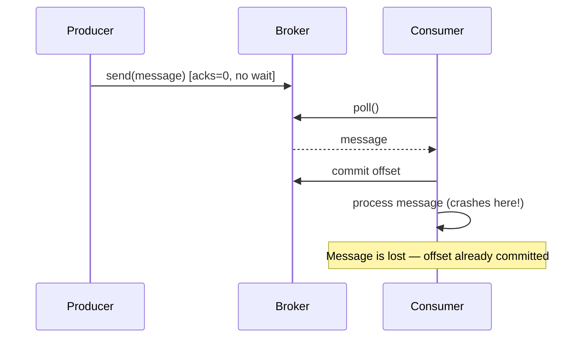
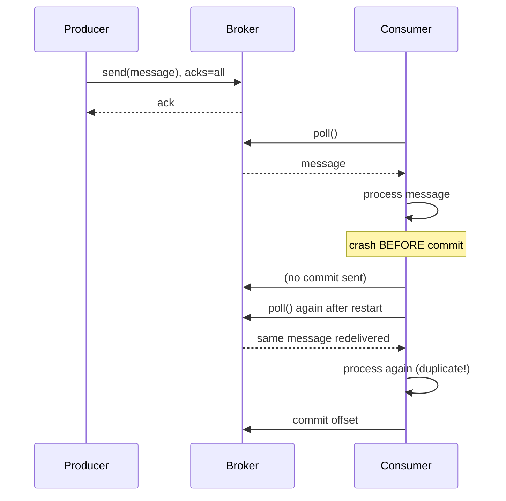
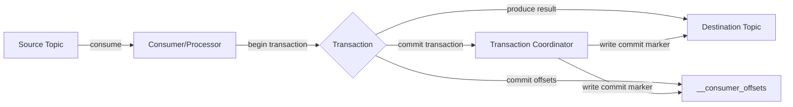
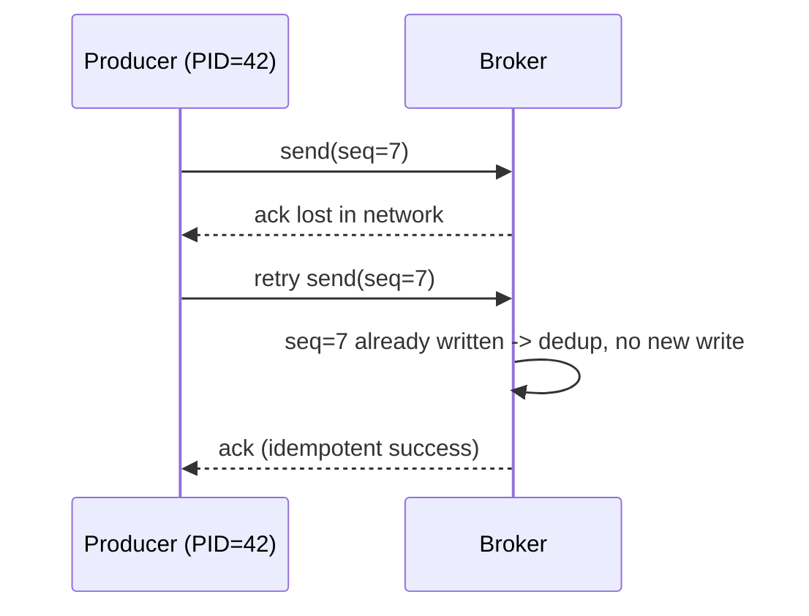
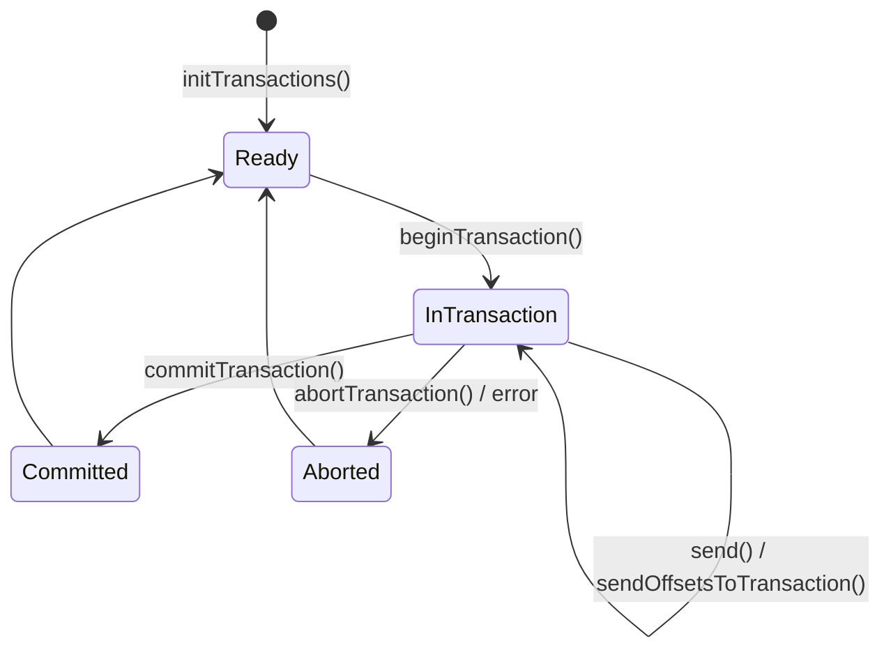

# Message Delivery Semantics

### At Most Once

At most once means every message is delivered **zero or one time** — it is never redelivered, even if that means it gets lost. This happens when a consumer commits its offset (or a producer stops retrying) *before* the message is fully processed. If the consumer crashes after committing but before finishing the business logic, the message is gone forever from that consumer's perspective.

This is the weakest and cheapest delivery guarantee. It trades correctness for throughput and simplicity — there's no need to track processing state, deduplicate, or retry. It's typically the default behavior when a producer uses `acks=0` (fire-and-forget) or when a consumer uses auto-commit with the commit happening on a timer rather than after processing.

In interviews, this is usually explained as the baseline against which "at least once" and "exactly once" are compared — most systems actively avoid this unless data loss is tolerable.

**Producer side (fire-and-forget):**
```properties
acks=0
retries=0
```

**Consumer side (commit before processing — classic at-most-once bug pattern):**
```java
@KafkaListener(topics = "orders", groupId = "at-most-once-group")
public void listen(ConsumerRecord<String, String> record, Acknowledgment ack) {
    ack.acknowledge(); // offset committed FIRST
    processOrder(record.value()); // if this throws, message is lost
}
```



**Real-life scenario:** A metrics/telemetry pipeline collecting non-critical UI click events — losing a handful of clicks during a consumer restart is acceptable, and avoiding duplicate counting is more valuable than perfect delivery.

**Advantages**
- Highest throughput, lowest latency — no waiting for acknowledgments or retries.
- Simplest consumer logic — no dedup/idempotency handling needed.

**Disadvantages**
- Silent data loss is possible and hard to detect.
- Not acceptable for financial, audit, or order-processing systems.

**Differences vs At Least Once / Exactly Once**
- At Most Once: 0 or 1 delivery (may lose data).
- At Least Once: 1+ deliveries (may duplicate data).
- Exactly Once: exactly 1 logical delivery (no loss, no duplication).

**Interview Questions**
- What producer/consumer configuration results in at-most-once semantics? — Producer `acks=0` (fire-and-forget, no retries) combined with a consumer that commits its offset (or auto-commits) before finishing processing the record.
- Why would a system intentionally choose at-most-once over at-least-once? — When throughput/latency matters more than completeness and occasional data loss is tolerable, such as non-critical telemetry or UI click tracking, since it avoids the overhead of retries, acks, and dedup logic.
- How does committing offsets before vs after processing change the delivery guarantee? — Committing before processing yields at-most-once (a crash mid-processing loses the message since the offset is already advanced); committing after processing yields at-least-once (a crash before commit causes redelivery on restart).

### At Least Once

At least once guarantees a message will **never be lost**, but it may be **delivered more than once**. This is achieved by committing the consumer offset (or retrying the producer send) only *after* the message has been successfully processed. If a failure happens after processing but before the commit, the same message is redelivered on restart/rebalance.

This is the most common delivery semantic used in production Kafka systems because it's a reasonable middle ground: no data loss, at the cost of the consumer needing to handle duplicates (idempotent processing). Producers achieve their side of "at least once" using `acks=all` combined with `retries > 0`, which can cause duplicate writes if a broker acknowledges but the ack is lost in transit, forcing a producer retry.

Because duplicates are possible, most real systems built on at-least-once semantics pair it with idempotent business logic (e.g., upserts keyed by a unique message ID) rather than trying to eliminate duplicates entirely at the messaging layer.

**Producer side:**
```properties
acks=all
retries=2147483647
enable.idempotence=false
max.in.flight.requests.per.connection=5
```

**Consumer side (manual ack after processing):**
```java
@KafkaListener(topics = "orders", groupId = "at-least-once-group",
        containerFactory = "manualAckContainerFactory")
public void listen(ConsumerRecord<String, String> record, Acknowledgment ack) {
    processOrder(record.value()); // done first
    ack.acknowledge();            // commit only after success
}
```



**Real-life scenario:** An order-processing service that writes to a database using the order ID as a unique key (`INSERT ... ON CONFLICT DO NOTHING` / upsert) — redelivery just re-runs a no-op write, so duplicates are harmless.

**Advantages**
- No data loss under normal failure scenarios.
- Simple to reason about compared to full exactly-once machinery.

**Disadvantages**
- Consumers must be idempotent or tolerate duplicates.
- Can cause double side-effects (e.g., double email sends) if not guarded.

**Differences vs At Most Once / Exactly Once**
- Safer than at-most-once (no silent loss) but less strict than exactly-once (duplicates possible).
- Requires application-level idempotency to behave like exactly-once in practice.

**Interview Questions**
- How do you make an at-least-once consumer effectively idempotent? — Track processed message IDs in a dedup table/cache and skip reprocessing, or design the side effect as an upsert keyed by a unique business ID so repeated application is harmless.
- What role does `acks=all` play in at-least-once producer guarantees? — It ensures the broker only acknowledges a write once it's durably replicated to all in-sync replicas, so the producer can safely retry on ack loss without losing the message (at the cost of possibly creating a duplicate).
- Give an example of a bug that causes duplicate processing in an at-least-once system. — A consumer processes an order (e.g., sends a confirmation email) but crashes before committing the offset; on restart it re-polls the same record and sends the email a second time.

### Exactly Once

Exactly once semantics (EOS) guarantee that each message is processed **once and only once**, with no loss and no duplication, even across producer retries, consumer rebalances, and broker failures. Kafka achieves this through a combination of **idempotent producers** (preventing duplicate writes on retry) and **transactions** (atomically committing both the produced records and the consumer offsets as a single unit — the classic "consume-transform-produce" pattern).

It's important to clarify in interviews that Kafka's exactly-once guarantee applies **within Kafka** — from a source topic, through processing, to a destination topic (or via Kafka Streams). If the consumer's side effect is an external system (e.g., calling a REST API or writing to a non-transactional database), Kafka cannot make that external call exactly-once; you still need idempotency or transactional outbox patterns at that boundary.

EOS is enabled by setting `enable.idempotence=true` on the producer (default in newer Kafka versions) and wrapping produce + offset-commit calls in a transaction using `transactional.id`. On the consumer side, `isolation.level=read_committed` ensures only committed transactional messages are visible.

```java
@Bean
public ProducerFactory<String, String> producerFactory() {
    Map<String, Object> props = new HashMap<>();
    props.put(ProducerConfig.ACKS_CONFIG, "all");
    props.put(ProducerConfig.ENABLE_IDEMPOTENCE_CONFIG, true);
    props.put(ProducerConfig.TRANSACTIONAL_ID_CONFIG, "order-tx-");
    return new DefaultKafkaProducerFactory<>(props);
}

@Transactional("kafkaTransactionManager")
public void processAndForward(ConsumerRecord<String, String> record) {
    String transformed = transform(record.value());
    kafkaTemplate.send("orders-out", transformed); // atomic with offset commit
}
```



**Real-life scenario:** A banking ledger service that debits one account and credits another via Kafka Streams — losing or duplicating a single event would corrupt balances, so EOS is mandatory.

**Advantages**
- No duplicates, no data loss — strongest guarantee Kafka offers.
- Enables safe stream processing pipelines (aggregations, joins) that would otherwise double-count.

**Disadvantages**
- Higher latency and lower throughput due to transaction overhead.
- Only end-to-end exactly-once when the entire pipeline stays within Kafka (or uses transactional sinks).
- More complex configuration and failure-mode reasoning.

**Differences vs At Most Once / At Least Once**
- Strongest guarantee; built on top of idempotent producers + transactions.
- At-least-once is a prerequisite mechanism EOS refines by eliminating duplicates via transactional atomicity.

**Interview Questions**
- How does Kafka implement exactly-once without a distributed two-phase commit across arbitrary systems? — By combining idempotent producers (dropping duplicate retries via PID+sequence) with transactions that atomically commit produced records and consumer offsets together, all scoped within Kafka itself rather than coordinating an external 2PC protocol.
- What is the relationship between idempotent producers and transactions in achieving EOS? — Idempotency prevents duplicate writes caused by producer retries; transactions build on top of that to atomically group multiple writes (and offset commits) so they all become visible together or not at all.
- Why can't Kafka guarantee exactly-once delivery to an external, non-transactional system by itself? — Kafka's transaction coordinator only controls Kafka partitions and the consumer offsets topic; it has no way to roll back or commit a side effect in an external database or REST API, so that boundary needs its own idempotency or an outbox pattern.
- What does `isolation.level=read_committed` do for EOS consumers? — It makes the consumer only see records from committed transactions, filtering out messages from transactions that were aborted or are still in-flight.

### Idempotency

Producer idempotency ensures that **retrying the same send does not result in duplicate messages** on the broker. Kafka implements this by assigning each producer a unique `PID` (producer ID) and tagging every message with a monotonically increasing sequence number per partition. The broker tracks the last committed `(PID, sequence)` pair per partition and silently drops/deduplicates any retry that matches a sequence it has already accepted.

This solves a very specific problem: without idempotency, if a producer sends a message, the broker writes it and sends an ack, but the ack is lost (network blip), the producer will retry and the broker will accept a **second, duplicate** write — even though the original succeeded. Idempotency closes this gap by making retries safe at the broker level, which is a prerequisite building block for full exactly-once transactions.

Enabling it is a single config flag, and since Kafka 3.0 it's the default for producers when other settings allow it (`acks=all`, bounded in-flight requests).

```properties
enable.idempotence=true
acks=all
max.in.flight.requests.per.connection=5
retries=2147483647
```



**Real-life scenario:** A payment event producer whose network occasionally times out on acks — idempotency guarantees a retried send never creates a second charge event on the topic.

**Advantages**
- Eliminates duplicate writes caused purely by producer retries, with negligible overhead.
- Foundation for transactional/exactly-once semantics.

**Disadvantages**
- Only protects against producer-retry duplication, not application-level duplicate sends (e.g., calling `send()` twice manually) or consumer-side reprocessing.
- Requires `max.in.flight.requests.per.connection <= 5` (Kafka enforces ordering guarantees for idempotence).

**Interview Questions**
- How does Kafka detect and drop duplicate messages at the producer level? — Each producer is assigned a unique PID and tags every message with a per-partition monotonically increasing sequence number; the broker tracks the last committed (PID, sequence) pair and silently discards a retried write matching one it already accepted.
- What is a `PID` and how is it used with sequence numbers? — A PID (producer ID) uniquely identifies a producer instance; combined with a per-partition sequence number it forms a key the broker uses to recognize and deduplicate retried sends.
- Does enabling `enable.idempotence=true` alone give you exactly-once semantics? Why not? — No — it only eliminates duplicate writes from producer-level retries; it does nothing about application-level duplicate sends or consumer-side reprocessing, so full exactly-once still requires transactions.

### Transactions

Kafka transactions let a producer write to **multiple partitions/topics atomically**, and — critically for stream processing — atomically commit produced records together with consumed offsets. All the writes within a transaction become visible to `read_committed` consumers together, or not at all if the transaction aborts.

A transactional producer is configured with a stable `transactional.id`, which Kafka uses to fence off older/zombie producer instances (e.g., after a rebalance or restart) so they cannot continue writing under the same identity — this is called **producer fencing**, using an incrementing epoch tied to the `transactional.id`.

The full API sequence is: `initTransactions()` → `beginTransaction()` → `send(...)` (and optionally `sendOffsetsToTransaction(...)`) → `commitTransaction()` or `abortTransaction()`. Spring Kafka wraps this with `@Transactional` and `KafkaTransactionManager` so application code rarely calls the raw API directly.

```java
try {
    producer.initTransactions();
    producer.beginTransaction();
    producer.send(new ProducerRecord<>("orders-out", key, value));
    producer.sendOffsetsToTransaction(offsets, consumerGroupMetadata);
    producer.commitTransaction();
} catch (ProducerFencedException | OutOfOrderSequenceException e) {
    producer.close(); // fatal, must recreate producer
} catch (KafkaException e) {
    producer.abortTransaction();
}
```



**Real-life scenario:** A Kafka Streams application reading `payments` and writing to both `payments-audit` and `payments-summary` topics needs both writes plus the input offset commit to succeed or fail together, or the audit and summary topics could drift out of sync.

**Advantages**
- Atomic multi-partition writes and atomic offset commits.
- Enables true exactly-once stream processing topologies.

**Disadvantages**
- Adds coordination overhead (transaction coordinator round-trips) and latency.
- Consumers must opt in with `isolation.level=read_committed` to benefit; default `read_uncommitted` sees uncommitted/aborted data.

**Interview Questions**
- Walk through the Kafka producer transaction API call sequence. — `initTransactions()` to register/recover state, `beginTransaction()` to start, one or more `send()`/`sendOffsetsToTransaction()` calls, then `commitTransaction()` to make everything visible atomically or `abortTransaction()` to discard it all.
- What is producer fencing and why is `transactional.id` important for it? — Producer fencing stops a stale/zombie producer instance (e.g., after a restart) from writing under the same identity by tying an incrementing epoch to its `transactional.id`; the broker rejects requests from a producer presenting an older epoch.
- What happens to an in-progress transaction if the producer crashes mid-way? — The transaction coordinator holds the transaction in a pending state; once the producer reconnects (or a new instance takes over via `initTransactions()`), the coordinator aborts the incomplete transaction so no partial writes become visible.

### Duplicate Messages

Duplicate messages are an inherent risk in any at-least-once (or misconfigured at-most-once) system. Duplicates can originate from: producer retries without idempotence, consumer reprocessing after a crash/rebalance before committing offsets, or manual redelivery/replay for recovery purposes. Handling them correctly is one of the most commonly tested practical Kafka skills in interviews because it shifts responsibility from "does Kafka guarantee it" to "how do I design my consumer."

The standard solution is **idempotent consumption**: design the downstream effect so that applying the same message twice produces the same result as applying it once. Common techniques include storing a processed-message ID (dedup table with a unique constraint), using upserts keyed by business ID, or leveraging natural idempotency of the operation (e.g., "set balance to X" instead of "add X to balance").

```java
@KafkaListener(topics = "orders")
public void listen(ConsumerRecord<String, String> record) {
    String messageId = new String(record.headers().lastHeader("messageId").value());
    if (processedMessageRepository.existsById(messageId)) {
        return; // already handled — skip duplicate
    }
    processOrder(record.value());
    processedMessageRepository.save(new ProcessedMessage(messageId));
}
```

**Real-life scenario:** A notification service that resends an SMS every time it reprocesses a message after a rebalance — deduplicating on a message ID prevents the customer from receiving the same alert five times.

**Advantages of handling duplicates at the application layer**
- Works regardless of which Kafka delivery semantic is used underneath.
- Decouples correctness from infrastructure configuration.

**Disadvantages**
- Requires extra storage (dedup table/cache) and adds a lookup on the hot path.
- Dedup window/TTL must be chosen carefully — too short and old duplicates slip through, too long and storage grows.

**Interview Questions**
- What causes duplicate messages even when a producer uses `acks=all`? — The broker can write and acknowledge a message, but if that ack is lost in transit before reaching the producer, the producer retries and (without idempotence) the broker writes a second copy.
- How would you design a consumer to be idempotent without relying on Kafka transactions? — Store a processed-message ID (or business key) in a dedup table/cache, check it before processing, and only apply the effect (or persist the ID) once; or design the operation itself to be naturally idempotent, like an upsert.
- What's the tradeoff of using a database unique constraint vs. an in-memory cache for deduplication? — A DB unique constraint is durable across restarts and survives long dedup windows but adds a query/write on every message; an in-memory cache is much faster but loses its dedup history on restart or across multiple instances unless it's shared/distributed.

