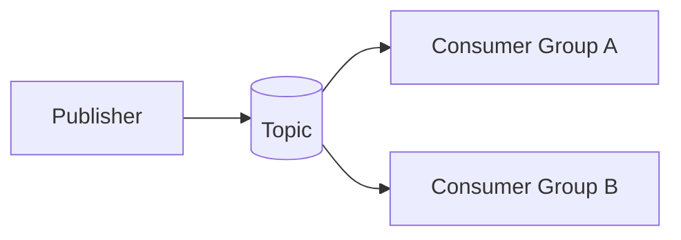
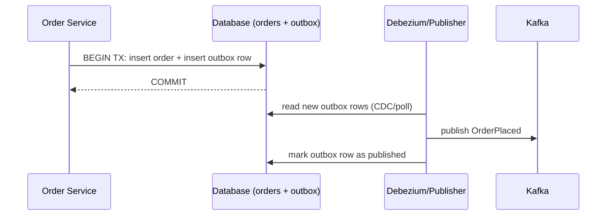
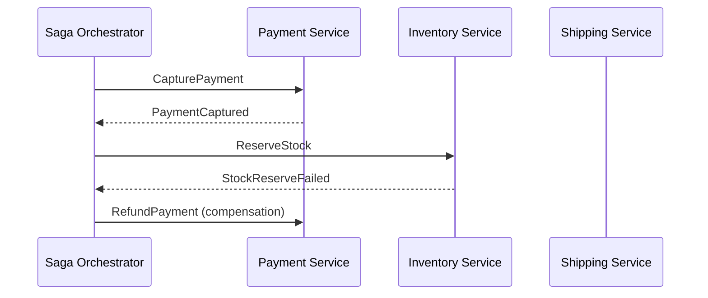

# Design Patterns

### Publish-Subscribe

Publish-Subscribe (pub-sub) is a messaging pattern where producers ("publishers") send messages to a named channel (a Kafka topic) without knowing who — if anyone — will consume them, and consumers ("subscribers") receive messages from that channel without knowing who produced them. Kafka implements pub-sub natively: any number of consumer groups can independently subscribe to the same topic and each group receives a full copy of every message, while consumers within the same group split the messages between them.

This is foundational interview material because it's the basis for almost every other pattern in this list. The key nuance interviewers look for is understanding the difference between pub-sub (Kafka topics, multiple independent consumer groups each get all messages) and point-to-point queueing (traditional queues like SQS/ActiveMQ, where one message is consumed by exactly one consumer overall).



**Real-life scenario:** A `payment-events` topic is published to once, but consumed independently by the fraud-detection group, the analytics group, and the notification group — each gets every message, unaffected by the others.

**Differences vs Point-to-Point Queue**
- Pub-sub: every subscribed consumer group receives every message.
- Point-to-point: a message is delivered to and consumed by exactly one consumer.

**Interview Questions**
- How does Kafka's consumer-group model let it support both pub-sub and queue-like semantics? — Each distinct consumer group receives a full copy of every message (pub-sub), while consumers within the same group split partitions between them so each message is handled once per group (queue-like).
- What happens if two different services both need every message from a topic — do they need separate consumer groups? — Yes — each service must use its own unique `group.id` so both receive every message independently, rather than competing for the same messages.
- How would you replay all messages for a newly added subscriber? — Start it with a new consumer group and `auto.offset.reset=earliest` (or seek to the beginning), so it reads the full retained history of the topic from the start.

### Event Sourcing (Overview)

Event Sourcing is a persistence pattern where instead of storing only the *current* state of an entity, you store the full sequence of events that led to that state, and current state is derived by replaying (or "folding over") those events. Kafka topics — especially compacted or long-retention topics — are a natural transport/storage layer for event-sourced systems, since they're append-only, ordered (per partition), and replayable.

Interviewers like this topic because it highlights a mental shift from CRUD thinking ("update the row") to event thinking ("append a fact, derive state"). It also pairs naturally with CQRS (Command Query Responsibility Segregation): commands produce events, and read-optimized projections are built by consuming those events.

```java
public class Account {
    private BigDecimal balance = BigDecimal.ZERO;

    public static Account replay(List<AccountEvent> events) {
        Account account = new Account();
        events.forEach(account::apply);
        return account;
    }

    private void apply(AccountEvent event) {
        switch (event) {
            case Deposited d -> balance = balance.add(d.amount());
            case Withdrawn w -> balance = balance.subtract(w.amount());
        }
    }
}
```

**Real-life scenario:** A banking ledger never stores a mutable "current balance" column as the source of truth; instead, `Deposited`/`Withdrawn` events are replayed to compute balance on demand, giving a complete audit trail for free.

**Advantages**
- Full audit history and time-travel debugging.
- Natural fit with event-driven, replayable architectures.

**Disadvantages**
- Replaying long event histories can be slow without snapshots.
- Querying "current state" requires building projections — more moving parts than plain CRUD.

**Interview Questions**
- How would you avoid replaying millions of events every time you need current state? — Periodically persist a snapshot of the derived state, then only replay events that occurred after the snapshot to bring it up to date.
- How does Event Sourcing relate to CQRS? — Event Sourcing provides the write-side source of truth (the event log), while CQRS separates that from read-optimized projections/views built by consuming those events — they're commonly paired but not the same thing.
- What are the challenges of changing an event's schema in an event-sourced system? — Old events already persisted must remain readable, so schema changes must stay backward compatible (or you need upcasting logic to translate old event versions during replay).

### Outbox Pattern

The Outbox Pattern solves the "dual-write problem": how do you atomically update your database *and* publish a Kafka event, when a database transaction and a Kafka publish can't be part of the same distributed transaction reliably? The solution: instead of publishing to Kafka directly inside the business transaction, you write the event to an `outbox` table in the *same* database transaction as your business data change. A separate process (often a CDC connector like Debezium reading the outbox table's binlog, or a polling publisher) then reads new outbox rows and publishes them to Kafka, later marking/deleting them.

This is one of the most commonly asked Kafka+Spring interview topics because it directly demonstrates understanding of distributed-systems failure modes: if you `save()` to the DB and then call `kafkaTemplate.send()` in the same method without an outbox, a crash between the two leaves your database and Kafka permanently inconsistent — either you saved but never published, or (less obviously) you published but the DB transaction later rolled back.

```java
@Transactional
public void placeOrder(Order order) {
    orderRepository.save(order);
    outboxRepository.save(new OutboxEvent(
        order.getId(), "OrderPlaced", toJson(order)));
    // both writes commit atomically in the same DB transaction
}
```



**Real-life scenario:** An order-service writes both the `orders` row and an `outbox` row in one JPA transaction; a Debezium connector tails the outbox table's binlog and reliably publishes `OrderPlaced` to Kafka, even if the service crashes right after committing.

**Advantages**
- Atomic, reliable publishing without distributed transactions.
- Works with any database that supports transactions.

**Disadvantages**
- Extra infrastructure (CDC connector or polling publisher) and outbox table maintenance.
- Slight publish latency versus a direct, synchronous send.

**Interview Questions**
- What problem does the Outbox Pattern solve that a plain `@Transactional` method with a Kafka send inside it doesn't? — The dual-write problem — a plain `@Transactional` method can commit the DB change but crash before (or during) the Kafka send, or vice versa if the send happens first; the outbox makes the "intent to publish" part of the same atomic DB transaction.
- How would you implement an outbox publisher without using Debezium/CDC? — Run a scheduled poller that queries unpublished outbox rows, publishes them to Kafka, and marks them published (or deletes them) after a successful send, using the row's own ID for idempotency.
- How do you clean up published rows from the outbox table without losing unpublished ones? — Only delete/archive rows after Kafka confirms the publish succeeded (e.g. via the producer's send acknowledgment), typically with a periodic cleanup job filtering on a `published` flag or timestamp.

### Request-Reply Pattern

Kafka is fundamentally asynchronous and one-way, but sometimes a caller genuinely needs a response correlated to its request (e.g. a synchronous-feeling API gateway call). The Request-Reply pattern over Kafka achieves this by having the requester publish a message to a "request" topic with a unique correlation ID and a `replyTo` topic, and the responder publishes its answer to that reply topic tagged with the same correlation ID; the original caller listens on the reply topic and matches responses back to pending requests (often via a `CompletableFuture` keyed by correlation ID).

Interviewers ask about this to test whether you understand that Kafka can *simulate* RPC but it's not a natural fit — you're trading Kafka's async strengths for synchronous semantics, and it adds meaningful complexity (correlation IDs, timeouts, reply-topic management) versus just calling a REST/gRPC endpoint directly.

```java
ReplyingKafkaTemplate<String, Request, Response> replyingTemplate;

public Response call(Request request) throws Exception {
    ProducerRecord<String, Request> record = new ProducerRecord<>("requests", request);
    RequestReplyFuture<String, Request, Response> future = replyingTemplate.sendAndReceive(record);
    return future.get(5, TimeUnit.SECONDS).value();
}
```

**Real-life scenario:** A legacy integration needs a synchronous "give me the current price" answer; instead of adding a REST endpoint, the team reuses existing Kafka infrastructure with Spring's `ReplyingKafkaTemplate` to correlate request/response pairs.

**Advantages**
- Reuses existing Kafka infrastructure/topics for synchronous-style calls.

**Disadvantages**
- Adds latency and complexity versus direct REST/gRPC calls.
- Requires careful timeout and correlation-ID management.

**Interview Questions**
- Why is Kafka not a natural fit for request-reply communication? — Kafka is designed for one-way, asynchronous, decoupled messaging; simulating a synchronous call requires extra machinery (correlation IDs, reply topics, timeouts) that a direct RPC call gets for free.
- How does Spring's `ReplyingKafkaTemplate` correlate a reply with its original request? — It tags each outgoing request with a unique correlation ID (typically in a header) and a `replyTo` topic, then matches incoming replies on that same correlation ID to complete the corresponding pending `Future`.
- When might you actually choose this pattern over a direct synchronous API call? — When you need to reuse existing Kafka infrastructure/topics for a legacy integration, or when the responder is itself primarily event-driven and doesn't expose a REST/gRPC endpoint.

### Competing Consumers

The Competing Consumers pattern uses multiple consumer instances in the same consumer group to process messages from a topic in parallel, with Kafka automatically dividing partitions among the group members so each message is handled by exactly one consumer instance in that group. This is Kafka's primary mechanism for horizontal scale-out of consumption.

Interviewers use this to test your understanding of the partition-to-consumer assignment: the maximum useful parallelism for a single consumer group is bounded by the number of partitions — adding more consumer instances than partitions leaves some instances idle. This directly ties into partition-count planning done at topic-creation time.

```java
@KafkaListener(topics = "orders", groupId = "order-processors", concurrency = "3")
public void process(OrderEvent event) {
    orderProcessingService.handle(event);
}
```

**Real-life scenario:** A topic with 12 partitions is consumed by 6 pods of the same service (same `groupId`); Kafka assigns 2 partitions to each pod, and if 2 pods crash, the remaining 4 automatically pick up the abandoned partitions.

**Advantages**
- Automatic load distribution and horizontal scalability.
- Automatic failover via rebalancing when a consumer dies.

**Disadvantages**
- Parallelism capped by partition count.
- Rebalances can cause brief processing pauses.

**Interview Questions**
- What determines the maximum number of consumer instances that can usefully process a topic in parallel? — The number of partitions on the topic — each partition can be assigned to only one consumer instance per group at a time.
- What happens if you add more consumer instances to a group than there are partitions? — The extra instances receive no partitions and sit idle, providing no additional throughput until a partition frees up.
- How does Kafka handle a consumer instance crashing mid-processing? — The group coordinator detects the failure (missed heartbeats) and triggers a rebalance, reassigning that instance's partitions to the remaining live consumers, which resume from the last committed offset.

### Retry Pattern

The Retry pattern handles transient failures (a downstream API timing out, a temporary DB lock) by re-attempting a failed operation, typically with a backoff strategy, before giving up and routing the message to a dead-letter topic. In Kafka/Spring, this is commonly implemented with `DefaultErrorHandler` + `FixedBackOff`/`ExponentialBackOff` for in-memory retries, or with `@RetryableTopic` for retries that go through dedicated retry topics (so the main consumer thread isn't blocked waiting).

Interviewers care about this because naive retry loops (infinite retry with no backoff) can cause cascading failures or "poison pill" messages that block a partition forever. Understanding the trade-off between blocking retries (simple, but stalls the partition) and non-blocking topic-based retries (more complex, but doesn't block other messages) is a strong signal of production experience.

```java
@Bean
public DefaultErrorHandler errorHandler() {
    return new DefaultErrorHandler(
        new FixedBackOff(1000L, 3)); // retry 3 times, 1s apart, then DLT
}
```

**Real-life scenario:** A payment-service call to a third-party gateway occasionally times out; retrying up to 3 times with backoff resolves most transient blips without operator intervention, while permanent failures move to a dead-letter topic for investigation.

**Interview Questions**
- What's the risk of retrying a failed message indefinitely with no backoff? — It can hammer an already-struggling downstream dependency (worsening the outage) and blocks the partition on a poison-pill message forever, since nothing ever routes it to a DLT.
- What's the difference between blocking retries and non-blocking retry-topic-based retries? — Blocking retries pause the consumer thread on the same partition while retrying, delaying all other messages behind it; `@RetryableTopic` republishes the failed message to a separate retry topic so the main consumer keeps processing other messages.
- How would you distinguish a retryable (transient) error from a non-retryable (permanent) one? — Transient errors (network timeouts, temporary unavailability) are worth retrying; permanent errors (deserialization failures, validation errors) will never succeed on retry and should go straight to a DLT, typically classified by exception type.

### Dead Letter Queue Pattern

A Dead Letter Queue (in Kafka, a Dead Letter Topic/DLT) is where messages are routed after they repeatedly fail processing (or fail deserialization), so they don't block the partition indefinitely and aren't silently dropped. Spring Kafka's `DeadLetterPublishingRecoverer` automatically republishes a failed record — along with exception details in headers — to a `<topic>.DLT` topic after retries are exhausted.

This matters in interviews because it's the standard answer to "what happens to a message that keeps failing?" — a poison-pill message (e.g. malformed JSON) would otherwise stall the consumer forever, retried on an infinite loop, blocking every message behind it in that partition. DLTs let processing continue while preserving the failed message for manual inspection/reprocessing.

```java
@Bean
public DefaultErrorHandler errorHandler(KafkaTemplate<Object, Object> template) {
    DeadLetterPublishingRecoverer recoverer =
        new DeadLetterPublishingRecoverer(template);
    return new DefaultErrorHandler(recoverer, new FixedBackOff(1000L, 3));
}
```

**Real-life scenario:** A consumer receives a malformed JSON payload from a buggy upstream producer; after 3 failed retries, `DeadLetterPublishingRecoverer` moves it to `orders.DLT` so the rest of the topic keeps flowing while an engineer investigates the bad message.

**Advantages**
- Prevents poison-pill messages from blocking a partition.
- Preserves failed messages for inspection/replay instead of dropping them.

**Disadvantages**
- Requires monitoring/alerting on the DLT, or failures go unnoticed.
- Reprocessing DLT messages after a fix requires manual or custom tooling.

**Interview Questions**
- What happens to a partition if a poison-pill message isn't routed to a DLT? — The consumer keeps retrying (and failing) on that same message indefinitely, blocking every message behind it in that partition from ever being processed.
- How does Spring Kafka's `DeadLetterPublishingRecoverer` work? — After retries configured on the error handler are exhausted, it republishes the failed record (with exception details added to headers) to a `<topic>.DLT` topic instead of blocking the consumer.
- How would you reprocess messages from a dead-letter topic once the root cause is fixed? — Write a small consumer/tool that reads from the DLT and republishes the original records to the source topic (or reprocesses them directly), typically after confirming the underlying bug is fixed.

### Transactional Outbox

Transactional Outbox is the more formal name for the same idea covered in the Outbox Pattern above, emphasized here specifically in its role of providing **exactly-once-like** effective delivery across a database and Kafka. The key guarantee is atomicity: the business-data write and the "intent to publish" write succeed or fail together as one local database transaction, and the actual Kafka publish is decoupled into a separate, retryable step (via CDC or a polling publisher) that can safely be retried to achieve at-least-once delivery to Kafka without ever losing an event.

Interviewers sometimes ask you to compare this against using Kafka transactions (`ChainedKafkaTransactionManager`) alone: Kafka transactions only guarantee atomicity *across Kafka operations* (or Kafka+JDBC via chained transaction managers in Spring, though this is not a true 2PC and has its own edge cases) — the Transactional Outbox pattern is the more battle-tested, universally applicable solution because it relies only on the database's own transactional guarantees.

**Real-life scenario:** A financial services company chose the transactional outbox pattern over chained transaction managers specifically because it required zero coordination logic beyond "read the outbox table," making it robust across database failovers and Kafka broker restarts.

**Differences vs plain "send after commit"**
- Plain send-after-commit: two independent operations; a crash between them loses the event or duplicates it inconsistently.
- Transactional outbox: single atomic local DB transaction; publishing is a separately retryable step guaranteed to eventually happen.

**Interview Questions**
- Why is "commit the DB transaction, then call `kafkaTemplate.send()`" not safe on its own? — The two operations aren't atomic; a crash after the DB commit but before (or during) the Kafka send permanently loses the event even though the business state change succeeded.
- How does the transactional outbox pattern differ from using `ChainedKafkaTransactionManager`? — The outbox relies only on the database's own transaction guarantees (writing an outbox row atomically with business data, publishing separately), while `ChainedKafkaTransactionManager` attempts to chain a JDBC and Kafka transaction together, which isn't true 2PC and has its own edge-case failure windows.
- What are the operational costs of running an outbox pattern in production (extra table, CDC connector, monitoring)? — You need an additional outbox table, a CDC connector or polling publisher process to maintain, and monitoring/alerting to catch publishing lag or failures in that pipeline.

### Saga Pattern (Overview)

A Saga is a pattern for managing data consistency across multiple services in a long-running business transaction, where a traditional ACID distributed transaction isn't feasible. Instead of one atomic transaction, a saga is a sequence of local transactions, each updating its own service's data and publishing an event/command to trigger the next step; if a step fails, previously completed steps are undone via **compensating transactions** (e.g. `PaymentCaptured` → `RefundIssued` if a later step fails).

This is one of the highest-value interview topics for microservices roles because it's the standard answer to "how do you keep data consistent across services without 2-phase commit?" Two implementation styles exist: **choreography** (each service reacts to events independently, as covered earlier) and **orchestration** (a central saga orchestrator explicitly invokes each participant and manages compensation logic).



**Real-life scenario:** An order saga captures payment, then tries to reserve stock; if stock reservation fails, the orchestrator issues a compensating `RefundPayment` command so the customer isn't charged for an item that can't ship.

**Advantages**
- Achieves eventual data consistency across services without distributed transactions.
- Each service keeps full ownership/autonomy over its own data.

**Disadvantages**
- Compensating transactions add significant design complexity.
- No true isolation — intermediate inconsistent states are briefly visible to other flows.

**Differences vs Choreography-based Sagas (Orchestration)**
- Orchestration: a central coordinator explicitly drives each step and compensation logic; flow is visible in one place.
- Choreography: no central coordinator; each service reacts to events and the flow emerges implicitly, easier to decouple but harder to observe/debug.

**Interview Questions**
- Why can't you use a traditional distributed (2PC) transaction across microservices in most Kafka-based architectures? — Each service owns its own database and Kafka doesn't participate in a classic two-phase-commit protocol with arbitrary external resource managers, so a global ACID transaction across services isn't practically achievable at scale; sagas trade strong consistency for eventual consistency instead.
- What is a compensating transaction, and why is designing one often harder than the "happy path" step? — It's an action that semantically undoes a previously completed step (e.g. `RefundPayment` undoing `CapturePayment`); it's harder because the original side effect may already be partially visible or irreversible (e.g. an email already sent), requiring careful domain-specific undo logic.
- When would you choose saga orchestration over choreography? — When the process is complex with many steps/branches and you want the flow and compensation logic centrally visible and easier to manage, rather than scattered implicitly across many services' event handlers.

