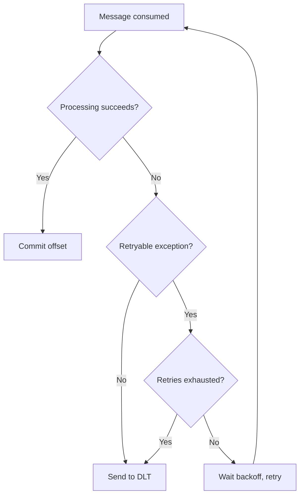
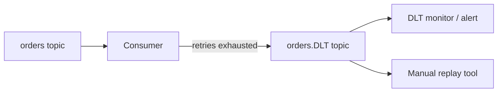

# Error Handling

### Retry Strategies

When a `@KafkaListener` throws an exception, Spring Kafka needs a policy for what to do next: retry immediately, retry with delay, retry a bounded number of times, or give up. Retry strategies define this policy so transient failures (a database connection blip, a downstream HTTP timeout) don't cause message loss, while permanent failures don't cause infinite reprocessing loops.

In Spring Kafka this is implemented via `DefaultErrorHandler` (formerly `SeekToCurrentErrorHandler`) combined with a `BackOff` implementation, or declaratively with `@RetryableTopic` / `RetryTopicConfiguration`. Retries can happen "in place" (blocking the consumer thread, re-polling the same record) or via non-blocking retry topics where the failed record is republished to a `-retry` topic with a delay header.

Choosing a retry strategy requires balancing consumer throughput (blocking retries stall the partition), message ordering guarantees, and the cost of duplicate processing. Idempotent consumers are essential when retries are in play, since redelivery is likely.

```java
@Bean
public DefaultErrorHandler errorHandler() {
    FixedBackOff backOff = new FixedBackOff(1000L, 3L); // 1s delay, 3 attempts
    DefaultErrorHandler handler = new DefaultErrorHandler(backOff);
    handler.addNotRetryableExceptions(IllegalArgumentException.class);
    return handler;
}
```



**Real-life scenario:** An order-service consumer calls a payment API that occasionally returns `503`. A retry strategy with exponential backoff lets the consumer wait and retry instead of failing the whole batch or losing the order event.

**Advantages**
- Handles transient failures automatically without manual intervention
- Reduces message loss compared to a simple try/catch that swallows errors

**Disadvantages**
- Blocking retries can stall partition consumption and increase consumer lag
- Naive retries without backoff can hammer an already-struggling downstream service

**Interview Questions**
- How does `DefaultErrorHandler` differ from the older `SeekToCurrentErrorHandler`? — `DefaultErrorHandler` is the modern, unified replacement that supports both record and batch listeners, pluggable backoff, and recoverers, whereas `SeekToCurrentErrorHandler` was the older, more limited record-only implementation it superseded.
- What's the difference between blocking and non-blocking retries in Spring Kafka? — Blocking retries re-poll and reprocess the same record on the same consumer thread, pausing that partition; non-blocking retries (via `@RetryableTopic`) republish the failed record to a separate retry topic with a delay, freeing the main consumer to keep processing other records.
- How do you avoid duplicate side effects when a message is retried? — Make the processing logic idempotent (dedup by message ID, or use upserts) so reprocessing the same record on retry produces the same result as processing it once.
- When would you mark an exception as "not retryable"? — When the failure is deterministic and will never succeed on retry, such as a deserialization error or a validation failure on malformed data — retrying it would just waste time and delay other messages.

### Dead Letter Topics (DLT)

A Dead Letter Topic is a designated Kafka topic where messages that repeatedly fail processing are routed instead of being retried forever or silently dropped. It acts as a quarantine area: the main pipeline keeps flowing while problematic messages are preserved for later inspection, replay, or manual remediation.

Spring Kafka provides this out of the box via `DeadLetterPublishingRecoverer`, which publishes the failed `ConsumerRecord` to a topic (by convention `<original-topic>.DLT`) along with headers describing the exception, original topic, partition, and offset. This is typically wired as the final recovery step after retries are exhausted in a `DefaultErrorHandler`.

DLTs are a cornerstone of resilient event-driven systems because they decouple "message failed" from "message lost." Operations teams can build dashboards/alerts on DLT volume, and a separate consumer (or manual tool) can replay DLT messages once the root cause (e.g., a bug or a downstream outage) is fixed.

```java
@Bean
public DefaultErrorHandler errorHandler(KafkaTemplate<Object, Object> template) {
    DeadLetterPublishingRecoverer recoverer =
        new DeadLetterPublishingRecoverer(template);
    return new DefaultErrorHandler(recoverer, new FixedBackOff(1000L, 3L));
}
```



**Real-life scenario:** A malformed JSON payload from a third-party webhook keeps failing deserialization. Instead of blocking the partition forever, it lands in `webhook-events.DLT` where an engineer inspects and fixes the producer, then replays it.

**Advantages**
- Keeps the main consumer moving instead of head-of-line blocking on one bad record
- Provides an audit trail of failures for debugging and compliance

**Disadvantages**
- Requires additional tooling/process to monitor and replay DLT messages
- If ordering matters, routing one message to DLT while others proceed can violate strict ordering guarantees

**Interview Questions**
- How do you configure `DeadLetterPublishingRecoverer` in Spring Kafka? — Construct it with a `KafkaTemplate` and pass it (along with a `BackOff`) into a `DefaultErrorHandler` bean, which then routes records to the DLT once retries are exhausted.
- What headers does Spring Kafka add to a DLT message? — Headers describing the original topic, partition, offset, and the exception message/stack trace that caused the failure.
- How would you replay messages from a DLT back into the original topic? — Write a consumer (or manual tool) that reads from the `.DLT` topic and republishes each record's original payload back onto the source topic once the root cause is fixed.
- What happens to partition/offset information when a record is sent to the DLT? — It's preserved as headers on the DLT message so the original location of the failed record can be traced or used for replay.

### Poison Messages

A poison message is a record that can never be processed successfully no matter how many times it's retried — for example, a payload that fails deserialization, violates a schema, or triggers a deterministic bug in the consumer logic. Unlike transient failures, retrying a poison message wastes resources and, if not handled, can cause an infinite retry loop that stalls the entire partition.

The key challenge is detection: the consumer needs to distinguish "might succeed if I retry" (network blip) from "will never succeed" (corrupt data, `NullPointerException` on a specific field). Spring Kafka addresses this with `addNotRetryableExceptions()` on `DefaultErrorHandler`, so exceptions like `DeserializationException` skip retries entirely and go straight to the recoverer (typically the DLT).

Deserialization failures are a special case because the exception happens before the listener method is even invoked. Spring Kafka handles this via `ErrorHandlingDeserializer`, which wraps the real deserializer and defers the exception, allowing the error handler to catch it and route it to the DLT rather than crashing the consumer.

```java
@Bean
public ConsumerFactory<String, MyEvent> consumerFactory() {
    Map<String, Object> props = new HashMap<>();
    props.put(ConsumerConfig.KEY_DESERIALIZER_CLASS_CONFIG, ErrorHandlingDeserializer.class);
    props.put(ConsumerConfig.VALUE_DESERIALIZER_CLASS_CONFIG, ErrorHandlingDeserializer.class);
    props.put(ErrorHandlingDeserializer.VALUE_DESERIALIZER_CLASS, JsonDeserializer.class.getName());
    return new DefaultKafkaConsumerFactory<>(props);
}
```

**Real-life scenario:** A producer bug emits an event with a negative `amount` field that fails a domain validation check every time. Marking that validation exception as not-retryable sends it straight to the DLT instead of retrying it 10 times and delaying every message behind it.

**Advantages**
- Prevents wasted retries and partition stalls caused by unrecoverable records
- Fast-fails clearly identifiable bad data straight to quarantine

**Disadvantages**
- Requires careful exception classification; misclassifying a transient error as permanent causes premature data loss (mitigated by DLT)

**Interview Questions**
- How does `ErrorHandlingDeserializer` prevent a poison message from crashing the consumer? — It wraps the real deserializer and, if deserialization throws, defers the exception instead of propagating it immediately, letting the error handler catch it and route the raw record to a recoverer (typically the DLT) rather than crashing the poll loop.
- How do you tell Spring Kafka an exception should skip retries? — Register it via `addNotRetryableExceptions()` on `DefaultErrorHandler`, so matching exceptions go straight to the recoverer without consuming retry attempts.
- What's the risk of retrying a poison message indefinitely? — It can stall the partition entirely (blocking retries) or waste resources cycling through retry topics forever, since the message can never actually succeed.

### Error Recovery

Error recovery is the step that runs after all configured retries are exhausted (or immediately for non-retryable exceptions) — it decides the final disposition of a failed record. Common recovery actions include publishing to a DLT, logging and skipping (seek-to-current past the record), or in rare cases failing the whole application to force operator intervention.

In Spring Kafka, recovery is pluggable through the `ConsumerRecordRecoverer` interface passed to `DefaultErrorHandler`. `DeadLetterPublishingRecoverer` is the most common implementation, but you can write a custom recoverer that, say, writes to a database "failed_events" table, calls a paging system, or applies compensating logic.

A well-designed recovery strategy also needs to commit the offset for the failed record after recovery so the consumer doesn't get stuck redelivering it forever — `DefaultErrorHandler` does this automatically once the recoverer completes successfully.

```java
ConsumerRecordRecoverer recoverer = (record, exception) -> {
    log.error("Recovering failed record at offset {}", record.offset(), exception);
    failedEventRepository.save(FailedEvent.from(record, exception));
};
DefaultErrorHandler handler = new DefaultErrorHandler(recoverer, new FixedBackOff(500L, 2L));
```

**Real-life scenario:** After 3 failed retries calling an inventory service, the recovery step persists the event to a `failed_events` table and triggers a low-priority alert, rather than crashing the consumer thread.

**Interview Questions**
- What is a `ConsumerRecordRecoverer` and how does it plug into `DefaultErrorHandler`? — A functional interface (`(record, exception) -> {}`) that defines the final action taken on a failed record after retries are exhausted; it's passed into `DefaultErrorHandler`'s constructor alongside a `BackOff`.
- Why must the offset be committed even after a record fails recovery? — So the consumer doesn't get stuck redelivering the same permanently-failed record forever — once the recoverer has handled it (e.g., persisted or sent to DLT), the consumer needs to move on.
- How would you build a custom recovery strategy that isn't just "send to DLT"? — Implement a custom `ConsumerRecordRecoverer` that, for example, persists the failed record to a database table, triggers a paging/alert system, or applies compensating business logic instead of publishing to a dead-letter topic.

### Backoff Strategies

Backoff strategy defines the delay between retry attempts. A `FixedBackOff` waits a constant interval between retries; an `ExponentialBackOff` starts with a small delay and multiplies it after each attempt (optionally with jitter and a max interval), which is generally preferred because it gives a struggling downstream dependency progressively more time to recover instead of hammering it at a constant rate.

Spring Kafka's `DefaultErrorHandler` accepts any `org.springframework.util.backoff.BackOff` implementation. For non-blocking retries via `@RetryableTopic`, backoff is expressed declaratively and Spring Kafka creates separate retry topics per delay tier (e.g., `orders-retry-0`, `orders-retry-1`) so the delay is achieved by scheduling redelivery rather than blocking the consumer thread.

Jitter (randomizing the delay slightly) is important at scale — without it, many consumer instances that failed at the same time retry in lockstep, causing a "thundering herd" against the downstream dependency.

```java
@Bean
public DefaultErrorHandler errorHandler() {
    ExponentialBackOff backOff = new ExponentialBackOff();
    backOff.setInitialInterval(500L);
    backOff.setMultiplier(2.0);
    backOff.setMaxInterval(10_000L);
    return new DefaultErrorHandler(backOff);
}
```

```java
@RetryableTopic(
    attempts = "4",
    backoff = @Backoff(delay = 1000, multiplier = 2.0, maxDelay = 10000),
    dltStrategy = DltStrategy.FAIL_ON_ERROR
)
@KafkaListener(topics = "orders")
public void listen(Order order) { ... }
```

**Real-life scenario:** A downstream fraud-check service returns errors during a brief deployment rollout. Exponential backoff spreads out retries over ~500ms, 1s, 2s, 4s instead of retrying instantly three times and giving up too soon.

**Differences vs Fixed Backoff**
- `FixedBackOff`: simple, predictable, but can overwhelm a recovering service with constant-rate retries
- `ExponentialBackOff`: adapts delay growth, better for real outages; slightly more complex to reason about and test

**Interview Questions**
- Why is exponential backoff generally preferred over fixed backoff for retries? — It gives a struggling downstream dependency progressively more time to recover instead of hammering it at a constant rate, reducing the chance of prolonging or worsening an outage.
- What is jitter and why does it matter at scale? — Jitter randomizes the retry delay slightly; without it, many consumer instances that failed simultaneously retry in lockstep, creating a "thundering herd" against the downstream dependency.
- How does backoff work differently for blocking retries vs. `@RetryableTopic` non-blocking retries? — Blocking retries pause the consumer thread with `Thread.sleep`-style delays between re-polls of the same record; `@RetryableTopic` instead achieves the delay by routing the record through separate retry topics, each consumed after its configured delay, without blocking the main listener thread.

