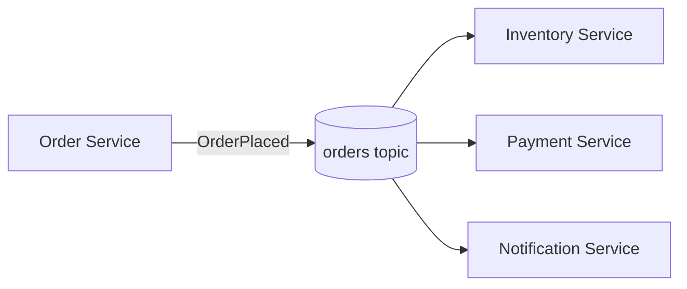
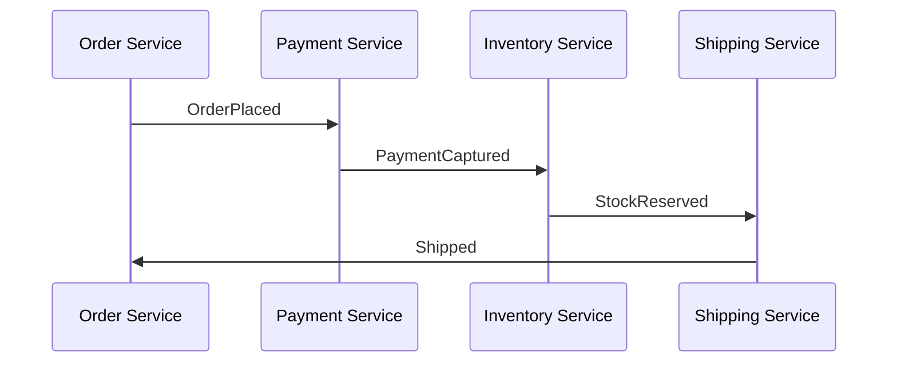

# Event-Driven Architecture

### Event-Driven Design

Event-driven design is an architectural style where services communicate by producing and reacting to **events** — immutable facts describing something that happened (`OrderPlaced`, `PaymentCaptured`) — rather than by calling each other's APIs directly. Kafka is the most common backbone for this style: producers publish events to topics, and any number of interested consumers react independently and asynchronously.

This matters enormously in interviews because most modern backend roles (especially microservices) expect familiarity with decoupling services via events instead of synchronous REST/RPC chains. Event-driven design reduces temporal coupling (the producer doesn't need consumers to be online) and enables new consumers to be added later without touching the producer at all — a core scalability and evolvability argument.

The trade-off interviewers expect you to articulate is complexity: debugging a request that flows through five asynchronous event handlers is harder than following a single synchronous call stack, and you give up strong consistency for eventual consistency, requiring careful thinking about idempotency, ordering, and failure handling.



**Real-life scenario:** An e-commerce checkout publishes a single `OrderPlaced` event; inventory, payment, and notification services each consume it independently, so adding a new "loyalty points" service later requires zero changes to the order service.

**Advantages**
- Loose coupling between producers and consumers.
- Easy to add new consumers without touching producers.
- Naturally supports scaling and async processing.

**Disadvantages**
- Harder to trace/debug a full business flow across services.
- Eventual consistency instead of strong consistency.
- Requires careful handling of duplicates, ordering, and failures.

**Interview Questions**
- How does event-driven design reduce coupling compared to synchronous REST calls between services? — Producers don't need to know who consumes their events or whether those consumers are even online, so new consumers can be added later without any change to the producer, unlike direct REST calls which require both sides available at once.
- What new failure modes does event-driven design introduce that a monolith doesn't have? — Eventual consistency instead of strong consistency, duplicate/out-of-order delivery, and harder-to-trace failures spread across independently-deployed asynchronous consumers.
- How would you trace a business transaction that spans multiple asynchronous event consumers? — Propagate a correlation/trace ID through event headers and use distributed tracing tooling (e.g. OpenTelemetry, Zipkin) to stitch together the spans across each consumer's processing.

### Event Producers

An event producer is any service or component responsible for detecting that something meaningful happened in its domain and publishing a corresponding event to a topic. In Kafka terms this is simply a `KafkaProducer` (or `KafkaTemplate` in Spring), but architecturally the important part is *domain ownership*: the producer is the authoritative source of truth for that event type, and it decides the event's schema, key, and topic.

Interviewers focus on producer responsibilities beyond "call `send()`": choosing a good partition key (for ordering guarantees), setting `acks` appropriately for durability, handling send failures/retries, and — critically — ensuring the event is only published if the underlying state change actually committed (the dual-write problem, often solved with the Outbox Pattern).

```java
@Service
public class OrderEventProducer {

    private final KafkaTemplate<String, OrderPlacedEvent> kafkaTemplate;

    public OrderEventProducer(KafkaTemplate<String, OrderPlacedEvent> kafkaTemplate) {
        this.kafkaTemplate = kafkaTemplate;
    }

    public void publish(OrderPlacedEvent event) {
        kafkaTemplate.send("orders", event.orderId(), event)
            .whenComplete((result, ex) -> {
                if (ex != null) {
                    log.error("Failed to publish OrderPlacedEvent {}", event.orderId(), ex);
                }
            });
    }
}
```

**Real-life scenario:** The order-service is the single producer of `OrderPlaced` events; no other service is allowed to emit that event type, keeping ownership and schema evolution unambiguous.

**Interview Questions**
- Why should only one service "own" producing a given event type? — A single authoritative owner keeps the event's schema and semantics unambiguous; if multiple services could publish the same event type, consumers couldn't trust a consistent contract.
- What is the dual-write problem, and how does it affect event producers? — It's the risk of a producer's local DB write and its Kafka publish not being atomic, so a crash between the two leaves the DB and Kafka permanently inconsistent (solved by the Outbox Pattern).
- How do you choose a partition key to preserve ordering for a given entity? — Use a stable identifier for that entity (like `orderId`) as the record key, since Kafka guarantees ordering within a partition and consistent keys always hash to the same partition.

### Event Consumers

An event consumer subscribes to one or more topics and reacts to incoming events — updating its own local state, triggering side effects (sending an email, calling another API), or emitting further downstream events. In Kafka this is a `KafkaConsumer` (or `@KafkaListener` in Spring), organized into consumer groups for scalability.

The interview-relevant nuance is that consumers must be designed for **at-least-once delivery**: a consumer may see the same event more than once (after a rebalance, crash, or retry), so consumer logic must be idempotent — e.g. checking a processed-events table keyed by event ID, or using upserts instead of blind inserts.

```java
@KafkaListener(topics = "orders", groupId = "inventory-service")
public void onOrderPlaced(OrderPlacedEvent event) {
    if (processedEventRepository.existsById(event.eventId())) {
        return; // idempotency guard
    }
    inventoryService.reserveStock(event);
    processedEventRepository.save(new ProcessedEvent(event.eventId()));
}
```

**Real-life scenario:** The inventory-service consumes `OrderPlaced` events to decrement stock; because Kafka guarantees at-least-once delivery, it tracks processed event IDs so a redelivered event never double-decrements inventory.

**Interview Questions**
- Why must event consumers be idempotent, and how would you implement that? — Kafka provides at-least-once delivery, so a consumer may see the same event more than once; implement idempotency via a processed-events table keyed by event ID or by using upserts instead of blind inserts.
- What happens to a consumer's offset if it crashes mid-processing before committing? — The offset was never committed, so on restart/rebalance the same message is redelivered and reprocessed — which is why idempotent handling is required.
- How do multiple consumers in the same consumer group share the work of a topic? — Kafka assigns each partition to exactly one consumer instance within the group, so partitions (and their messages) are divided across the group's members.

### Event Choreography

Choreography is a style of coordinating a multi-step business process where each service reacts to events from others and emits its own events in turn, with **no central coordinator** dictating the sequence. Each participant knows only "what to do when I see event X," and the overall flow emerges from the collective behavior of independent services listening to a shared stream of events.

This is a major interview topic because it's directly contrasted with **orchestration** (a central Saga orchestrator explicitly calling each step). Choreography is praised for decoupling — services don't need to know about each other, only about event contracts — but criticized because the overall business flow isn't visible in any single place, making it hard to reason about, monitor, or modify the process end-to-end.



**Real-life scenario:** In an order-fulfillment flow, payment-service reacts to `OrderPlaced`, inventory-service reacts to `PaymentCaptured`, and shipping-service reacts to `StockReserved` — no single service knows the entire pipeline exists.

**Advantages**
- Maximum decoupling; services only need to know event contracts.
- No single point of failure/coordination.

**Disadvantages**
- No centralized view of the overall business process.
- Harder to implement compensation/rollback logic across many services.
- Debugging cross-service flows requires distributed tracing.

**Differences vs Orchestration (Saga)**
- Choreography: decentralized, each service reacts to events independently.
- Orchestration: a central coordinator explicitly commands each step and handles compensation.

**Interview Questions**
- How would you debug a business process implemented via choreography when a step silently fails? — Use distributed tracing with a shared correlation ID across all events, plus per-service logging/monitoring, since no single service has visibility into the entire flow.
- Why is choreography harder to extend when the business process itself changes? — The logic is scattered across every participating service's event handlers, so adding or reordering a step means finding and updating multiple independently-deployed services rather than one central definition.
- When would you prefer orchestration over choreography? — When the business process is complex, needs a clear, centrally visible flow, or requires robust compensation/rollback logic that's easier to manage from a single coordinator.

### Event Ordering

Event ordering concerns whether events are processed in the same sequence they occurred, which matters because many domain events are only meaningful in order (e.g. `OrderCreated` before `OrderShipped`). Kafka guarantees ordering **only within a single partition**, so ordering across an entire topic isn't guaranteed unless all related events share the same partition — which is achieved by using a consistent partition key (typically the entity ID, like `orderId`).

Interviewers use this to test whether you understand Kafka's ordering guarantee is *partition-scoped, not topic-scoped* — a very common point of confusion. They also probe on what happens with retries/out-of-order redelivery, and how consumers might need to buffer or reorder events by a sequence number/version field when strict ordering matters but the partitioning scheme can't guarantee it (e.g. after repartitioning).

```java
// Using orderId as the key guarantees all events for the same order
// land in the same partition and are consumed in order.
kafkaTemplate.send("orders", event.orderId(), event);
```

**Real-life scenario:** All events for a given order (`OrderCreated`, `OrderPaid`, `OrderShipped`) use `orderId` as the partition key, so they always land in the same partition and are read by the consumer in the correct sequence.

**Interview Questions**
- Does Kafka guarantee global ordering across a topic? Why or why not? — No — Kafka only guarantees ordering within a single partition; across partitions, messages can be consumed in any relative order since each partition is an independent log.
- How do you guarantee that all events for a given entity are processed in order? — Use a consistent partition key (typically the entity's ID) so every event for that entity always lands in the same partition and is read in order.
- What happens to ordering guarantees if you increase the number of partitions on an existing topic? — The key-to-partition mapping changes for existing keys, so new events for a previously-existing entity can land in a different partition than its historical events, breaking strict per-entity ordering.

### Event Versioning

Event versioning is the practice of managing how an event's schema evolves over time without breaking existing consumers. As business requirements change, event payloads gain new fields, rename fields, or change types — and because producers and consumers deploy independently, multiple event versions may be "in flight" simultaneously. Strategies include additive-only changes (new optional fields), embedding an explicit `version` field in the payload, and using a schema registry (Avro/Protobuf/JSON Schema) with defined compatibility modes (`BACKWARD`, `FORWARD`, `FULL`).

This is a favorite interview topic because it tests real production experience: teams that don't plan for event versioning eventually break downstream consumers when a producer "helpfully" renames a field. Schema Registry compatibility checks (rejecting incompatible schema changes at publish time) are the standard safety net.

```json
{
  "type": "record",
  "name": "OrderPlacedEvent",
  "fields": [
    { "name": "orderId", "type": "string" },
    { "name": "amount", "type": "double" },
    { "name": "currency", "type": "string", "default": "USD" }
  ]
}
```

**Real-life scenario:** Adding a `currency` field with a `default` value keeps the schema `BACKWARD` compatible, so older consumers that don't know about `currency` can still deserialize new events.

**Interview Questions**
- What's the difference between `BACKWARD`, `FORWARD`, and `FULL` schema compatibility? — `BACKWARD` lets new schemas read data written with the previous schema; `FORWARD` lets old schemas read data written with the new schema; `FULL` requires both directions to hold.
- How would you add a new required field to an event without breaking existing consumers? — You generally can't safely — add it as optional with a default value instead, so old consumers ignore it and new consumers get the default when reading old events.
- Why is a schema registry useful in an event-driven architecture? — It centrally enforces compatibility rules at publish time, preventing a producer from deploying a schema change that would break existing consumers.

### Event Immutability

Event immutability means that once an event is published, it is never modified or deleted — it's a permanent record of a fact that occurred at a point in time. If something needs to change, you publish a *new* event (e.g. `OrderCancelled`) rather than editing the original `OrderPlaced` event. This is fundamentally different from mutable database rows, and it's what makes Kafka topics suitable as an append-only log / source of truth in Event Sourcing.

Interviewers ask about this to see if you understand why events are modeled as past-tense facts (`OrderPlaced`, not `PlaceOrder`) and why that immutability enables replayability — any consumer can reprocess the full event history from the beginning to rebuild state, which is impossible if events could be silently edited or removed.

**Real-life scenario:** When a customer cancels an order, the system doesn't delete or edit the original `OrderPlaced` event — it appends a new `OrderCancelled` event, preserving a complete, auditable history of what actually happened.

**Advantages**
- Full auditability and replayability of history.
- Enables Event Sourcing and time-travel debugging.

**Disadvantages**
- Corrections require compensating events, not edits — added application complexity.
- Storage grows unbounded unless topics use retention/compaction policies.

**Interview Questions**
- Why are events named in the past tense (`OrderPlaced`) rather than as commands (`PlaceOrder`)? — Events represent facts that have already happened and can't be un-happened, whereas a command name implies a request that could still be rejected — the past tense reflects that immutable, historical nature.
- How do you "correct" a mistaken event if events can never be edited or deleted? — Publish a new compensating event (e.g. `OrderCancelled` or `OrderCorrected`) that supersedes the effect of the original, rather than mutating history.
- How does immutability enable rebuilding state via Event Sourcing? — Because the full, unaltered sequence of events is preserved, any consumer can replay it from the beginning to deterministically reconstruct current (or historical) state.

