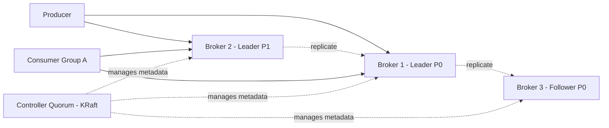

# Kafka Fundamentals

### What is Apache Kafka?

Apache Kafka is a distributed, horizontally scalable, fault-tolerant event streaming platform originally built at LinkedIn and later open-sourced through the Apache Software Foundation. At its core, Kafka is a durable, append-only, distributed commit log that lets producers write records to named streams called *topics*, and lets consumers read those records independently, at their own pace, in the order they were written.

Unlike a traditional queue where a message disappears once consumed, Kafka retains records for a configurable retention period (or indefinitely with compaction), so multiple independent consumers or applications can read the same data stream without interfering with each other. This log-centric design is what enables Kafka to act simultaneously as a messaging system, a storage system, and a stream-processing platform.

Kafka is written in Scala and Java, runs as a cluster of one or more servers called *brokers*, and (since KRaft became the default) no longer requires ZooKeeper for metadata management. It is used heavily for decoupling microservices, building event-driven architectures, real-time analytics pipelines, log aggregation, and as the backbone for CDC (Change Data Capture) pipelines with tools like Debezium.

For a Spring Boot engineer, Kafka usually shows up via the `spring-kafka` library, which wraps the native Kafka Java client with `KafkaTemplate` for producing and `@KafkaListener` for consuming, integrated with Spring's dependency injection and configuration model.

**Real-life scenario:** An e-commerce platform publishes an `OrderPlaced` event to Kafka whenever a customer checks out. The inventory service, billing service, notification service, and analytics service each consume that same event independently, without the order service needing to know who is listening.

**Interview Questions:**
- What problem was Kafka originally designed to solve at LinkedIn? — Handling high-throughput activity/event data feeds that traditional MOM systems couldn't scale to.
- Is Kafka a message queue or a streaming platform? — Both; it behaves like a queue via consumer groups and like a pub/sub log for independent consumers.
- Why is Kafka described as a "distributed commit log"? — Because each partition is an ordered, immutable, append-only sequence of records persisted to disk.
- What language is Kafka written in, and what client languages are commonly used with Spring Boot? — Written in Scala/Java; Spring Boot uses the Java client via `spring-kafka`.

### Event Streaming Platform

An event streaming platform is software infrastructure designed to continuously capture, store, and process streams of events — as opposed to processing data in discrete batches. Kafka qualifies as a full event streaming platform because it combines three capabilities: publish/subscribe messaging (producers and consumers), durable storage (the commit log with configurable retention), and stream processing (via Kafka Streams or ksqlDB) — all in one system.

The key mental shift from traditional data systems is that in event streaming, the *event* (a fact that something happened, e.g. "payment authorized") is the primary artifact, and it flows continuously rather than being requested on demand. Applications react to events as they arrive instead of polling a database for changes.

This architecture supports both real-time use cases (fraud detection, live dashboards) and near-batch use cases (nightly ETL jobs reading yesterday's events), because consumers can choose to read from the latest offset or replay from the beginning of the log.

```java
// Spring Kafka producer sending a domain event
@Service
public class OrderEventPublisher {

    private final KafkaTemplate<String, OrderPlacedEvent> kafkaTemplate;

    public OrderEventPublisher(KafkaTemplate<String, OrderPlacedEvent> kafkaTemplate) {
        this.kafkaTemplate = kafkaTemplate;
    }

    public void publish(OrderPlacedEvent event) {
        kafkaTemplate.send("order-events", event.getOrderId(), event);
    }
}
```

**Real-life scenario:** A ride-hailing app streams `DriverLocationUpdated` events continuously; a matching service consumes them in real time to assign the nearest driver, while a separate analytics job replays the same stream hours later to compute heatmaps.

**Interview Questions:**
- What three pillars make Kafka a complete event streaming platform? — Pub/sub messaging, durable storage, and stream processing.
- How does event streaming differ from traditional batch ETL? — Events are processed continuously as they occur rather than collected and processed periodically.
- Can the same event stream serve both real-time and batch consumers? — Yes, since Kafka retains data and consumers track their own offsets independently.

### Messaging System vs Event Streaming

Traditional messaging systems (like classic JMS queues) are built around the idea of delivering a message from a producer to a consumer and then discarding it — the broker's job is transient delivery, not long-term storage. Once a message is acknowledged/consumed, it is typically gone, and only one logical consumer group processes a given message.

Event streaming platforms like Kafka treat the stream as a durable, replayable log. Data is retained for a configurable time (or forever with log compaction), consumers do not remove data when they read it, and any number of independent consumer groups can replay the exact same history. This turns the broker from a transient pipe into a source of truth that new applications can plug into later and "catch up" on history.

The practical implication for system design: with pure messaging, if a new service needs historical data it usually queries a database; with event streaming, that service can simply subscribe to the topic from offset zero and rebuild its own state from the event history (event sourcing).

**Advantages of Event Streaming over classic Messaging:**
- Replayability — new consumers can reprocess history.
- Multiple independent consumer groups can read the same data.
- Enables event sourcing and CQRS patterns naturally.
- Higher throughput via sequential disk I/O and batching.

**Disadvantages of Event Streaming vs classic Messaging:**
- More operational complexity (partitions, offsets, consumer group rebalancing).
- Message-level per-consumer acknowledgement/redelivery semantics are less granular than JMS.
- Requires understanding of retention/compaction tuning to avoid unbounded storage growth.

**Interview Questions:**
- What happens to a message after it is consumed in Kafka vs in a traditional queue? — Kafka retains it per retention policy; a traditional queue typically deletes it.
- Why can multiple consumer groups read the same Kafka topic independently? — Kafka tracks offsets per consumer group, not by deleting messages on read.
- Give an example where event streaming enables a capability plain messaging cannot. — A new analytics service replaying all historical orders to build aggregates from scratch.

### Kafka Architecture

At a high level, a Kafka deployment consists of a cluster of *brokers* that store data, *topics* split into *partitions* distributed across those brokers, *producers* that write records, and *consumers* (organized into *consumer groups*) that read records. Metadata about the cluster — which broker leads which partition, current ISR sets, topic configs — is managed by a small quorum of *controller* nodes, using the KRaft protocol (Raft-based, replacing ZooKeeper in modern Kafka).

Each partition has one broker acting as *leader*, handling all reads and writes for that partition, while zero or more *followers* replicate the leader's log for fault tolerance. If a leader fails, the controller promotes one of the in-sync followers to leader.

Clients (producers/consumers) talk to any broker to fetch cluster metadata, then connect directly to the leader broker for each partition they need to produce to or consume from — Kafka clients are "smart," and brokers are comparatively simple pipes.



**Real-life scenario:** A payments company runs a 6-broker Kafka cluster across 3 availability zones; each topic has replication factor 3, so a full AZ outage does not cause data loss because followers in other AZs hold copies of every partition.

**Interview Questions:**
- What is the role of the controller in a Kafka cluster? — Manages partition leadership, cluster metadata, and broker membership.
- What replaced ZooKeeper in modern Kafka, and why? — KRaft (Kafka Raft), to simplify operations and remove the external ZooKeeper dependency.
- How do producers know which broker to send a record to? — They fetch metadata (topic/partition/leader mapping) and connect directly to the partition leader.

### Kafka Use Cases

Kafka is a general-purpose backbone for moving and processing data at scale, and its common use cases fall into a handful of recurring patterns: (1) **messaging/decoupling** between microservices so producers and consumers don't need synchronous APIs; (2) **log aggregation**, collecting application/infrastructure logs from many hosts into a central pipeline (often feeding Elasticsearch/Splunk); (3) **stream processing**, doing real-time transformations, aggregations, and joins with Kafka Streams or ksqlDB; (4) **event sourcing / CQRS**, where the topic is the durable source of truth for an entity's state changes; (5) **change data capture (CDC)**, streaming database row-level changes (via Debezium) into Kafka for downstream consumers; and (6) **metrics/telemetry pipelines** feeding monitoring systems.

Because Kafka decouples producers from consumers in time and space, it is especially well suited to systems that need to fan out one event to many independent downstream systems, or that need to buffer bursts of traffic (e.g., Black Friday sales spikes) without overwhelming downstream services.

In a Spring Boot microservices architecture, a very common pattern is the "outbox" pattern: a service writes to its own database and an outbox table in the same transaction, and a CDC connector or scheduled publisher pushes those changes to Kafka, guaranteeing at-least-once delivery without distributed transactions.

**Real-life scenario:** A bank streams every ledger transaction into Kafka; a fraud-detection stream-processing job scores transactions in real time, a reporting pipeline aggregates daily totals, and an audit service persists an immutable copy — all fed from one topic.

**Interview Questions:**
- Name three distinct architectural patterns where Kafka is commonly used. — Microservice decoupling, log aggregation, CDC/event sourcing.
- Why is Kafka a good fit for the outbox pattern? — It provides durable, ordered, replayable delivery decoupled from the originating service's transaction.
- How does Kafka help absorb traffic spikes? — Producers can write faster than consumers process; the log buffers the backlog until consumers catch up.

### Kafka vs RabbitMQ

RabbitMQ is a traditional message broker implementing AMQP, built around smart brokers with exchanges, queues, and bindings that actively route messages to consumers and typically delete a message once it's acknowledged. Kafka is a distributed log where "dumb" brokers just append and serve bytes, and "smart" consumers pull data and track their own offsets, with retained, replayable history.

RabbitMQ is generally the better choice for complex routing (topic/fanout/direct exchanges, priority queues, per-message TTL, request/reply RPC patterns) and lower absolute latency for individual messages at moderate throughput. Kafka is the better choice for very high-throughput, ordered, replayable event streams and stream processing.

**Differences vs RabbitMQ:**
- Kafka retains messages after consumption (configurable retention/compaction); RabbitMQ typically deletes on ack.
- Kafka scales consumption via partitions and consumer groups; RabbitMQ scales via competing consumers on a queue.
- Kafka guarantees order only within a partition; RabbitMQ can guarantee order per queue (single consumer) but loses it with competing consumers.
- RabbitMQ supports rich routing topologies (exchanges); Kafka routing is essentially topic + partition key.
- Kafka is push-pull with consumer-driven pulling; RabbitMQ pushes messages to consumers.

**Advantages of Kafka:** massive throughput, replay/history, natural fit for stream processing, strong ordering per key.
**Advantages of RabbitMQ:** flexible routing, simpler mental model for classic task queues, lower latency for low-volume workloads, mature plugin ecosystem (delayed messages, priority queues).

**Interview Questions:**
- When would you pick RabbitMQ over Kafka? — Complex routing needs, RPC-style messaging, or low-throughput task queues needing per-message acknowledgement semantics.
- How does message retention differ between the two systems? — Kafka retains by policy regardless of consumption; RabbitMQ removes messages once acknowledged.
- How is ordering guaranteed differently in each system? — Kafka orders within a partition; RabbitMQ orders within a queue only with a single consumer.

### Kafka vs ActiveMQ

ActiveMQ is a JMS-compliant broker supporting both queue (point-to-point) and topic (pub/sub) models with transient message delivery, typically used for enterprise integration patterns and reliable request/response messaging. Kafka instead implements a persistent, partitioned log designed for high-throughput streaming and replay, with a different delivery philosophy: consumers pull data and manage offsets rather than the broker pushing and tracking per-consumer state.

ActiveMQ's JMS topics allow multiple subscribers, but durable subscriptions and scaling to very large consumer counts or huge retained backlogs are not its strength; it was designed for enterprise messaging integration (ESB-style), not for petabyte-scale log storage or stream processing.

**Differences vs ActiveMQ:**
- Kafka is log-based and replayable; ActiveMQ is queue/topic-based and largely transient.
- Kafka scales horizontally via partitioning much more easily than ActiveMQ's broker/network-of-brokers model.
- ActiveMQ natively supports the JMS API and standards (useful for legacy Java EE integration); Kafka has its own client protocol (and JMS bridges exist but are not native).
- Kafka is generally preferred for streaming/analytics pipelines; ActiveMQ is preferred for classic enterprise integration (EIP) with strict JMS semantics.

**Interview Questions:**
- Why is Kafka generally favored for high-throughput streaming over ActiveMQ? — Its partitioned log design and sequential I/O give it much higher sustained throughput and replay capability.
- Does Kafka support the JMS API natively? — No, Kafka has its own client API; JMS-to-Kafka bridges/adapters exist separately.
- In what scenario would ActiveMQ's JMS compliance be a deciding factor? — Integrating with legacy Java EE apps that require standard JMS queues/topics and transactions.

### Kafka vs Pulsar

Apache Pulsar is a more recently developed pub/sub and streaming platform that separates the serving layer (brokers) from the storage layer (Apache BookKeeper), which theoretically allows brokers to scale and fail over independently of the data they serve. Kafka, by contrast, couples storage and serving in the broker itself (each broker owns and serves the partitions it stores).

Pulsar natively supports both queuing (shared subscriptions with competing consumers) and streaming (exclusive/failover subscriptions) semantics within the same topic abstraction, whereas Kafka's consumer-group model primarily targets the streaming/log-partition style and approximates queue semantics via a single-partition, single-consumer-group setup.

**Differences vs Pulsar (Overview):**
- Pulsar decouples compute (brokers) from storage (BookKeeper); Kafka brokers own their own storage.
- Pulsar has built-in multi-tenancy and geo-replication features baked in earlier; Kafka added MirrorMaker/Cluster Linking for cross-cluster replication.
- Kafka has a much larger ecosystem, community, and tooling maturity (Kafka Streams, ksqlDB, Kafka Connect) as of most interviews' expectations.
- Pulsar supports flexible subscription types (exclusive, shared, failover, key-shared) natively; Kafka approximates these through partition/consumer-group design.

**Interview Questions:**
- What is the fundamental architectural difference between Kafka and Pulsar? — Pulsar separates serving (brokers) from storage (BookKeeper); Kafka brokers do both together.
- Why might Pulsar rebalance faster after a broker failure than Kafka? — Because storage is externalized to BookKeeper, a new broker can immediately serve existing segments without re-replicating data.
- Which platform has broader ecosystem/tooling maturity for stream processing as of common industry usage? — Kafka, via Kafka Streams and ksqlDB.

