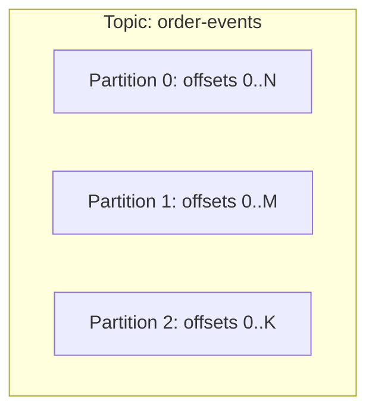
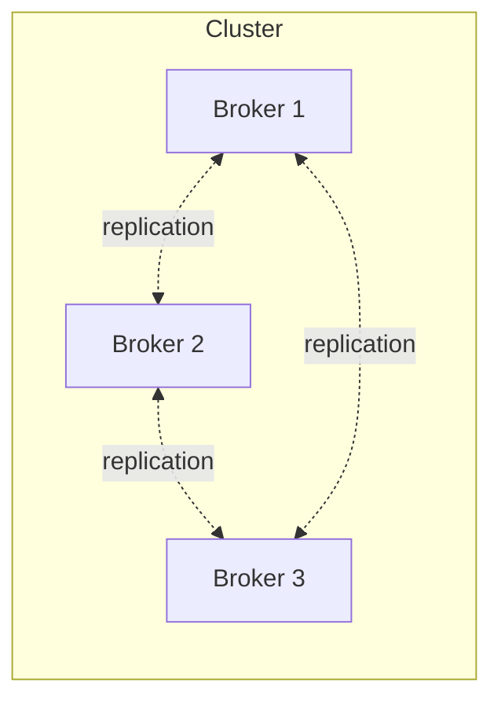
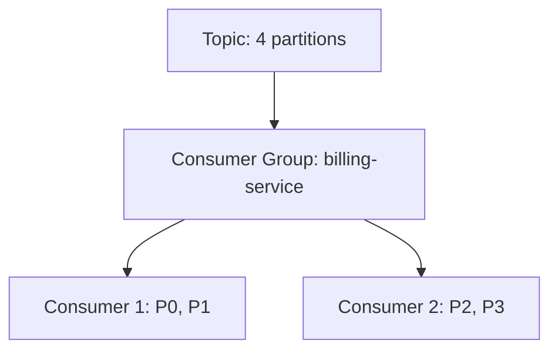
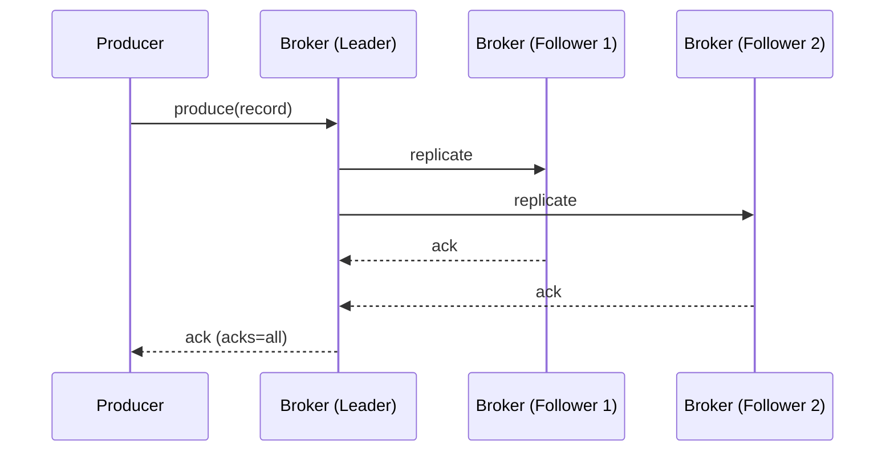

# Apache Kafka - Complete Guide
## Kafka Core Concepts

### Topic

- A **topic** is a logical channel or category where producers send records and consumers read them.
- Topics are the main way Kafka organizes data streams.
- Each topic can have multiple **partitions** for scalability.
- Records in a topic consist of:
    - **Key** (optional): Used for partitioning and message grouping.
    - **Value** (payload): The actual data/message.
    - **Offset**: Unique position of the record within a partition.
- Topics can be configured for **retention** (how long data is kept) and **compaction** (keeping only the latest value per key).
- Topics are **append-only**; records cannot be updated or deleted after being written.

> **Example:** An `orders` topic collects all order events from an e-commerce platform.

### Partition

- Topics are split into **partitions**, which are the basic unit of parallelism and scalability in Kafka.
- Each partition is:
    - **Ordered**: Records are stored in the order they arrive.
    - **Immutable**: Once written, records cannot be changed.
    - **Identified**: By `<topic>-<partition_number>`.
- Partitions allow Kafka to distribute data across multiple brokers and scale horizontally.
- More partitions mean higher throughput, but also more overhead for management and coordination.

> **Example:** The `orders` topic might have 6 partitions, allowing 6 consumers to process data in parallel.

### Replication

- Kafka replicates each partition across multiple brokers for **high availability** and **durability**.
- One broker acts as the **leader** for a partition; others are **followers**.
- Producers and consumers interact only with the leader.
- If the leader fails, a follower is automatically promoted to leader, ensuring no data loss.
- Replication factor is configurable per topic.

> **Example:** A partition with replication factor 3 is stored on three brokers.

### Consumer Group

- A **consumer group** is a set of consumers that work together to read data from a topic.
- Kafka ensures that each partition in a topic is consumed by only one consumer within a group, enabling **parallel processing** and **load balancing**.
- Multiple consumer groups can read the same topic independently, allowing different applications to process the same data in their own way.
- Consumer groups provide **fault tolerance**: if one consumer fails, another in the group can take over.
- Consumers in a group coordinate their progress using **offsets**.

> **Example:** A group of analytics services consuming the `orders` topic, each processing a subset of the data.

### Offset

- An **offset** is a unique, sequential number assigned to each record within a partition.
- Offsets allow consumers to track their progress and resume processing after failures.
- Offsets are managed per partition and per consumer group.
- Consumers can commit offsets manually or automatically.
- Offsets enable features like **replay** (reprocessing old data) and **exactly-once** or **at-least-once** delivery semantics.

> **Example:** Consumer group A has processed up to offset 100 in partition 2.

### Routing Records (Odd/Even Example)

- Producers can control which partition a record goes to by specifying a key or using a custom partitioner.
- This enables routing logic, such as sending odd numbers to one partition and even numbers to another.
- Consumers can be assigned to specific partitions to process only the relevant data.

**Producer Example:**
```java
int partition = (number % 2 == 0) ? 1 : 0;
ProducerRecord<String, String> record =
        new ProducerRecord<>("numbers", partition, null, String.valueOf(number));
producer.send(record);
```

**Consumer Example:**
```java
KafkaConsumer<String, String> oddConsumer = new KafkaConsumer<>(props);
oddConsumer.assign(List.of(new TopicPartition("numbers", 0))); // Odd partition

KafkaConsumer<String, String> evenConsumer = new KafkaConsumer<>(props);
evenConsumer.assign(List.of(new TopicPartition("numbers", 1))); // Even partition
```

> **Use case:** Targeted processing, filtering, or sharding of data streams.

### Change Data Capture (CDC)

- **CDC** is a technique for capturing changes (INSERT, UPDATE, DELETE) in databases and streaming them into Kafka topics.
- Enables real-time data synchronization between databases and other systems.
- Common CDC tools:
    - **Debezium**: Open-source, supports MySQL, PostgreSQL, MongoDB, SQL Server, Oracle, etc.
    - **Kafka Connect CDC connectors**.
- Use cases:
    - Replicating database changes to analytics platforms.
    - Building event-driven architectures.
    - Maintaining audit logs and data lineage.

### Kafka Connect

- **Kafka Connect** is a framework for integrating Kafka with external systems (databases, files, cloud storage, etc.).
- Provides **source connectors** (import data into Kafka) and **sink connectors** (export data from Kafka).
- Connectors are configurable and scalable, supporting distributed deployments.
- Enables building ETL pipelines without custom code.
- Supports transformations and error handling.

> **Example:** Use Kafka Connect to stream data from MySQL into Kafka, then from Kafka to Elasticsearch.

### Schema Registry

- The **Schema Registry** manages schemas for Kafka messages (Avro, JSON, Protobuf).
- Ensures producers and consumers agree on message structure, preventing data corruption.
- Supports **schema evolution** (backward/forward compatibility).
- Enforces rules to prevent breaking changes.
- Integrates with Kafka clients for automatic serialization/deserialization.

> **Example:** Enforce Avro schema for all messages in the `orders` topic.

### ZooKeeper & KRaft

#### ZooKeeper (legacy)
- Kafka originally used **ZooKeeper** for cluster metadata, broker management, and controller election.
- Required a separate ZooKeeper cluster, adding operational complexity.

#### KRaft (Kafka Raft mode)
- Modern Kafka (2.8+) uses **KRaft** (Kafka Raft) mode, eliminating ZooKeeper.
- Stores metadata in internal Kafka topics.
- Simplifies deployment, improves scalability and resilience.
- New Kafka clusters should use KRaft mode.

### Additional Features

- **Log Compaction**: Retains only the latest value per key, useful for stateful applications.
- **Exactly-Once Semantics (EOS)**: Guarantees that each message is processed only once, even in failure scenarios.
- **Streams API**: Enables building real-time, stateful stream processing applications directly on Kafka.
- **Kafka Admin API**: Programmatically manage topics, configurations, and access controls (ACLs).
- **Security**: Supports SSL, SASL, and ACLs for authentication and authorization.
- **Monitoring**: Exposes metrics via JMX and integrates with monitoring tools.

### Kafka Use Cases

- **Real-time analytics**: Process and analyze data streams instantly for dashboards and alerts.
- **Event sourcing**: Store all changes as a sequence of events for audit and recovery.
- **Log aggregation**: Centralize logs from multiple services for troubleshooting and monitoring.
- **Messaging**: Decouple producers and consumers for scalable, resilient architectures.
- **Data integration**: Move data between databases, caches, search engines, and cloud services.
- **Microservices communication**: Enable asynchronous, reliable communication between services.

### Useful Kafka CLI Commands

```sh
# List topics
kafka-topics.sh --list --bootstrap-server localhost:9092

# Create a topic
kafka-topics.sh --create --topic my-topic --partitions 3 --replication-factor 2 --bootstrap-server localhost:9092

# Describe a topic
kafka-topics.sh --describe --topic my-topic --bootstrap-server localhost:9092

# Produce messages
kafka-console-producer.sh --topic my-topic --bootstrap-server localhost:9092

# Consume messages
kafka-console-consumer.sh --topic my-topic --from-beginning --bootstrap-server localhost:9092

# List consumer groups
kafka-consumer-groups.sh --list --bootstrap-server localhost:9092

# Describe consumer group offsets
kafka-consumer-groups.sh --describe --group my-group --bootstrap-server localhost:9092
```

### References

- [Apache Kafka Documentation](https://kafka.apache.org/documentation/)
- [Kafka Quickstart Guide](https://kafka.apache.org/quickstart)
- [Debezium CDC](https://debezium.io/)
- [Confluent Schema Registry](https://docs.confluent.io/platform/current/schema-registry/index.html)
- [Kafka Connectors Hub](https://www.confluent.io/hub/)

> **Tip:** Monitor Kafka cluster health, tune configurations, and secure your deployment for optimal performance and reliability.

---


## Core Kafka Concepts (In Depth)

### Events (Records)

An event (also called a *record* or *message*) is the fundamental unit of data in Kafka: an immutable fact representing something that happened, such as "user 123 clicked button X" or "order 456 was placed." Structurally, a Kafka record consists of a **key**, a **value**, a **timestamp**, and optional **headers** (metadata key-value pairs), all serialized to bytes before being written to a partition.

The key is important beyond identifying the payload — Kafka uses it (by default, via a hash) to decide which partition a record lands in, which in turn determines ordering guarantees for records sharing that key. The value carries the actual payload, often JSON, Avro, or Protobuf-encoded.

Because records are immutable and appended sequentially, an event once written cannot be edited in place; corrections are made by publishing new compensating events (e.g., `OrderCancelled` after `OrderPlaced`), which fits well with event-sourcing style designs.

```java
public class OrderPlacedEvent {
    private String orderId;
    private BigDecimal amount;
    private Instant placedAt;
    // getters/setters
}

// Producing an event with a key and header
ProducerRecord<String, OrderPlacedEvent> record =
        new ProducerRecord<>("order-events", orderId, event);
record.headers().add("event-type", "OrderPlaced".getBytes(StandardCharsets.UTF_8));
kafkaTemplate.send(record);
```

**Real-life scenario:** A ride-share app emits a `TripCompleted` event carrying the trip ID as the key, ensuring all events for the same trip (start, update, complete) land in the same partition and are processed in order.

**Interview Questions:**
- What are the core components of a Kafka record? — Key, value, timestamp, and headers.
- Why does the key matter beyond just being part of the payload? — It determines the target partition, which affects ordering.
- Are Kafka records mutable? — No, they are immutable once appended to the log.

### Topics

A topic is a named, logical channel to which producers write and from which consumers read — conceptually similar to a table in a database or a folder of continuously appended files. Every topic is split into one or more partitions, and Kafka provides ordering guarantees only *within* a partition, not across an entire topic.

Topics are the primary unit of organization: you configure retention, replication factor, and cleanup policy (delete vs. compact) per topic. A topic can have many producers and many independent consumer groups reading it simultaneously without any coordination between them.

Topic names are typically namespaced by convention (e.g., `orders.created`, `payments.authorized`) to keep large clusters organized, and naming conventions matter a lot in real production systems for discoverability and access control (ACLs).

```bash
# Create a topic with 6 partitions and replication factor 3
kafka-topics.sh --bootstrap-server localhost:9092 \
  --create --topic order-events \
  --partitions 6 --replication-factor 3

# Describe a topic
kafka-topics.sh --bootstrap-server localhost:9092 --describe --topic order-events
```

**Real-life scenario:** A logistics company uses separate topics `shipment.created`, `shipment.dispatched`, and `shipment.delivered` instead of one giant topic, so consumers can subscribe only to the lifecycle stage they care about.

**Interview Questions:**
- What determines the ordering guarantee of a topic? — Ordering is guaranteed only within a single partition, not across the whole topic.
- What per-topic settings can be configured independently? — Retention, replication factor, partition count, cleanup policy, min ISR, etc.
- Can two unrelated applications read the same topic independently? — Yes, as long as they use different consumer group IDs.

### Partitions

A partition is an ordered, immutable sequence of records that forms a physical unit of parallelism and storage within a topic. Each partition lives on disk as a set of segment files on one or more brokers, and each record within a partition gets a monotonically increasing **offset** that uniquely identifies its position.

Partitions are the mechanism Kafka uses to scale both writes and reads horizontally: more partitions allow more brokers to share the write load and more consumers (up to the partition count) to read in parallel within a consumer group. However, more partitions also mean more open file handles, more replication traffic, and longer leader-election/rebalance times, so partition count is a real capacity-planning decision, not something to maximize blindly.

Choosing the number of partitions typically balances expected throughput, target consumer parallelism, and per-partition ordering requirements — a common rule of thumb is to size partitions based on desired consumer count and expected MB/s throughput per partition.



**Real-life scenario:** A topic with 3 partitions allows 3 consumer instances in the same group to each own one partition and process records in parallel, tripling throughput compared to a single partition.

**Interview Questions:**
- What is the maximum useful number of consumers in a single consumer group for a topic? — Equal to the number of partitions; extra consumers sit idle.
- Why can't Kafka guarantee ordering across an entire topic? — Because partitions are independent logs processed and replicated separately.
- What are the trade-offs of increasing partition count? — More parallelism but more overhead (file handles, replication, longer rebalances, higher latency for some operations).

### Offsets

An offset is a monotonically increasing integer that uniquely identifies the position of a record within a partition. Offsets are assigned by the partition leader at write time and never change for a given record — they are how consumers track "how far have I read."

Each consumer group tracks its own offset per partition (committed to the internal `__consumer_offsets` topic), which is what allows independent consumer groups to read the same partition at different paces without conflicting. Offset management is central to Kafka's delivery semantics: whether you get at-most-once, at-least-once, or effectively-once behavior largely depends on *when* offsets are committed relative to processing.

Consumers can also seek to arbitrary offsets — earliest, latest, a specific offset, or a timestamp — enabling replay for reprocessing, debugging, or disaster recovery.

```java
@KafkaListener(topics = "order-events", groupId = "billing-service")
public void consume(ConsumerRecord<String, OrderPlacedEvent> record) {
    log.info("Processing offset {} in partition {}", record.offset(), record.partition());
    // business logic
}
```

**Real-life scenario:** After a bug is found in a billing consumer, the team resets the consumer group's offset back to a known-good point in time and replays two days of `order-events` to recompute invoices correctly.

**Interview Questions:**
- Where does Kafka store committed consumer offsets? — In the internal `__consumer_offsets` topic (by default).
- What delivery semantic results from committing offsets before processing completes? — At-most-once (risk of losing unprocessed messages on crash).
- How can a team reprocess historical data? — By resetting the consumer group's offset to an earlier position (earliest, timestamp, or specific offset).

### Producers

A producer is a client application that publishes (writes) records to Kafka topics. Producers decide which topic to send to, optionally which partition (directly or via a key-based partitioner), and handle serialization of the key/value into bytes before sending.

Internally, the Kafka producer client batches records destined for the same partition, compresses them, and sends them asynchronously in the background via a network thread, while exposing a `Future`/callback-based API so the calling code isn't blocked waiting for the broker acknowledgment (unless it explicitly calls `.get()` or blocks on the future).

In Spring Boot, `KafkaTemplate` wraps the underlying producer, providing convenient synchronous and asynchronous send methods integrated with Spring's `ProducerFactory` and transaction management.

```java
@Configuration
public class KafkaProducerConfig {
    @Bean
    public ProducerFactory<String, Object> producerFactory() {
        Map<String, Object> config = new HashMap<>();
        config.put(ProducerConfig.BOOTSTRAP_SERVERS_CONFIG, "localhost:9092");
        config.put(ProducerConfig.KEY_SERIALIZER_CLASS_CONFIG, StringSerializer.class);
        config.put(ProducerConfig.VALUE_SERIALIZER_CLASS_CONFIG, JsonSerializer.class);
        config.put(ProducerConfig.ACKS_CONFIG, "all");
        return new DefaultKafkaProducerFactory<>(config);
    }

    @Bean
    public KafkaTemplate<String, Object> kafkaTemplate(ProducerFactory<String, Object> pf) {
        return new KafkaTemplate<>(pf);
    }
}
```

**Real-life scenario:** A checkout service produces an `OrderPlaced` event using `kafkaTemplate.send(...)` and attaches a callback to log a warning (and trigger an alert) if the broker ack fails, without blocking the HTTP response to the customer.

**Interview Questions:**
- Is `KafkaProducer.send()` synchronous or asynchronous by default? — Asynchronous; it returns a `Future` immediately.
- What responsibilities does a producer client have? — Serialization, partition selection, batching, compression, retries.
- How does Spring Boot simplify producing messages? — Via `KafkaTemplate`, which wraps `ProducerFactory`/`KafkaProducer` with Spring-friendly APIs.

### Consumers

A consumer is a client application that subscribes to one or more topics and pulls records for processing. Kafka's consumption model is pull-based: consumers actively poll brokers for new data (`poll()`), which gives consumers full control over their own pace, batch size, and backpressure — brokers never push data.

Consumers belong to a **consumer group**, identified by a `group.id`; Kafka assigns each partition of a subscribed topic to exactly one consumer instance within the group at any time, enabling horizontal scaling of processing while ensuring a partition's records are still processed in order by a single consumer instance.

In Spring Boot, `@KafkaListener` abstracts away the poll loop, offset management, and deserialization, letting developers write plain business-logic methods that get invoked per record or per batch.

```java
@KafkaListener(topics = "order-events", groupId = "notification-service", concurrency = "3")
public void onOrderPlaced(OrderPlacedEvent event, 
                           @Header(KafkaHeaders.RECEIVED_PARTITION) int partition) {
    notificationClient.sendOrderConfirmation(event);
}
```

**Real-life scenario:** A notification microservice runs 3 pod replicas, each hosting a consumer in the same group; Kafka spreads the topic's 6 partitions roughly 2-per-instance so notifications are sent in parallel without duplication.

**Interview Questions:**
- Is Kafka consumption push-based or pull-based? — Pull-based; consumers call `poll()`.
- What determines how many consumer instances can actively process a topic in parallel? — The number of partitions in the topic.
- How does `@KafkaListener` simplify consumer development in Spring Boot? — It hides the manual poll loop, offset commits, and deserialization boilerplate.

### Brokers

A broker is a single Kafka server process responsible for storing partition data, serving produce/fetch requests from clients, and replicating data for partitions it hosts. A production Kafka cluster typically consists of many brokers (3+ for real fault tolerance), each identified by a unique broker ID.

Each broker hosts a subset of the cluster's partitions, acting as **leader** for some and **follower** for others. Brokers handle the low-level mechanics of appending to log segments on disk, serving fetch requests efficiently (often via zero-copy sendfile), and enforcing topic-level configuration like retention and quotas.

Brokers are largely "dumb" in the sense that they don't track per-consumer read progress (that's the consumer's job via committed offsets) — this simplicity is a big part of why Kafka can scale to huge throughput.



**Real-life scenario:** During a rolling Kafka upgrade, operators take down brokers one at a time; because each partition is replicated across at least 3 brokers, no data is lost and clients transparently fail over to the new leader.

**Interview Questions:**
- What is the main responsibility of a Kafka broker? — Storing partition logs and serving produce/fetch requests, plus replication.
- Do brokers track consumer read progress? — No, consumers track and commit their own offsets.
- Why do production clusters typically run at least 3 brokers? — To tolerate broker failure while maintaining a majority/replication factor for durability.

### Kafka Cluster

A Kafka cluster is a group of brokers working together, coordinated via the controller (KRaft quorum), that collectively store all topics/partitions and serve all client traffic for a Kafka deployment. From a client's perspective, the cluster looks like a single logical system reachable via a bootstrap server list, even though data is physically spread across many machines.

Clusters provide horizontal scalability (adding brokers to hold more partitions/throughput) and fault tolerance (replication across brokers, often across racks or availability zones). Cluster-wide concerns — topic creation, partition reassignment, ACLs, quotas — are coordinated centrally by the controller, while data-plane operations (produce/fetch) are handled directly by the relevant partition leaders.

Multiple clusters are also common in larger organizations for isolation (dev/staging/prod), geographic distribution, or regulatory boundaries, often linked together with MirrorMaker 2 or Cluster Linking for cross-cluster replication.

**Real-life scenario:** A global SaaS company runs regional Kafka clusters in the US, EU, and APAC for data residency compliance, with only aggregated, anonymized events mirrored to a central analytics cluster.

**Interview Questions:**
- What is a "bootstrap server" and why don't clients need to know about every broker? — An initial contact point used to discover the full cluster metadata; clients don't need every broker's address upfront.
- What role does the controller play at the cluster level? — Manages metadata, leader election, and broker membership across the cluster.
- Why might an organization run multiple Kafka clusters instead of one? — Isolation, data residency/compliance, blast-radius reduction, or geographic latency.

### Consumer Groups

A consumer group is a set of consumer instances that share a `group.id` and cooperatively consume a topic's partitions, with each partition assigned to exactly one consumer in the group at a time. This is the mechanism Kafka uses to provide both queue-like load balancing (partitions split across instances) and pub/sub-like fan-out (multiple groups each get the full data independently).

The **group coordinator** (a broker) tracks group membership, triggers rebalances when consumers join/leave, and manages the partition assignment strategy (range, round-robin, sticky, or cooperative-sticky). When a rebalance happens, some or all partitions may be reassigned, and consumers must handle a brief pause in processing.

Scaling a service's consumption throughput is done by adding more consumer instances to the same group (up to the partition count) — beyond that, extra instances remain idle since a partition cannot be split further.



**Real-life scenario:** The `billing-service` consumer group has 2 instances handling 4 partitions (2 each); the `fraud-detection` consumer group independently reads the same topic from its own offsets without affecting billing.

**Interview Questions:**
- What determines whether two applications get independent copies of the same data stream? — Using different `group.id` values.
- What triggers a consumer group rebalance? — A consumer joining, leaving, crashing, or a partition count change.
- What happens if you add more consumers than partitions in a group? — The extras remain idle with no partitions assigned.

### Replication

Replication is Kafka's mechanism for durability and fault tolerance: each partition's data is copied to multiple brokers, with one broker as **leader** (serving all reads/writes) and the rest as **followers** (passively fetching and replicating the leader's log). The number of copies is controlled by the topic's **replication factor**.

Followers that are sufficiently caught up with the leader are part of the **in-sync replica (ISR)** set; only ISR members are eligible for leader election if the current leader fails, ensuring no committed data is lost during failover. Producers can require acknowledgment from all ISR members (`acks=all`) for the strongest durability guarantee.

Replication factor is a direct trade-off between durability/availability and storage/network cost: replication factor 3 (common in production) tolerates 2 broker failures for a partition while tripling storage and inter-broker network usage compared to replication factor 1.



**Real-life scenario:** A retail company sets replication factor 3 for its `orders` topic; when one broker's disk fails at 3am, the controller promotes a follower to leader automatically and the on-call engineer only needs to replace the failed hardware, with zero data loss.

**Interview Questions:**
- What is the difference between replication factor and ISR? — Replication factor is the configured target number of copies; ISR is the current set of replicas actually caught up with the leader.
- What acks setting gives the strongest durability guarantee, and why? — `acks=all`, because it waits for all in-sync replicas to acknowledge the write.
- What happens if a leader broker crashes? — The controller elects a new leader from the ISR set for the affected partitions.

### Leader and Follower Replicas

For each partition, one replica is elected **leader** and handles all client reads and writes for that partition; all other replicas are **followers** that continuously fetch data from the leader to stay in sync but do not (by default) serve client traffic directly. This leader-follower model keeps the consistency model simple: clients always talk to exactly one authoritative copy per partition.

Followers that fall too far behind (beyond `replica.lag.time.max.ms`) are removed from the ISR set and are not eligible to become leader until they catch back up, protecting against promoting a stale replica and silently losing committed data.

Since Kafka 2.4+, `fetch-from-follower` allows consumers to optionally read from a geographically closer follower replica (for latency/cost optimization) even though it's not the leader, while writes always still go to the leader.

**Real-life scenario:** In a multi-datacenter deployment, consumers in the EU read from an EU-based follower replica to avoid cross-region latency, while the partition leader (and all writes) remains in the US datacenter.

**Interview Questions:**
- Which replica handles writes for a partition? — Only the leader.
- What determines whether a follower is eligible to become the new leader? — Whether it is part of the current in-sync replica (ISR) set.
- What Kafka feature allows reading from a follower instead of the leader? — Fetch-from-follower (rack-aware consumer reads), introduced in KIP-392.

## A Complete Comparison: Confluent vs. Apache Kafka®

This guide breaks down the differences between the open-source **Apache Kafka** project and the commercial **Confluent** offering (Platform & Cloud).

### Executive Summary

| **Apache Kafka®** | **Confluent** |
| :--- | :--- |
| **The Engine** | **The Complete Car** |
| Free, open-source software (OSS). You download the code and build the infrastructure yourself. It requires significant engineering expertise to manage, secure, and scale. | A commercial data streaming platform built *on top* of Apache Kafka. It includes the Kafka engine plus a massive suite of enterprise tools (GUI, security, connectors, disaster recovery). |
| **Best for:** Tech-heavy teams who want full control, zero licensing costs, and are willing to handle all operations manually. | **Best for:** Enterprises needing speed-to-market, strict SLAs, advanced security (RBAC), and reduced operational overhead. |

### Detailed Feature Comparison

| Feature Category | Feature | **Apache Kafka (Open Source)** | **Confluent (Platform & Cloud)** |
| :--- | :--- | :--- | :--- |
| **Core** | **License** | Apache 2.0 (Free) | Commercial / Community License |
| | **Management UI** | None (CLI only) | **Control Center** (Web GUI) |
| | **Architecture** | Brokers + Zookeeper (or KRaft) | Brokers + KRaft + Kora Engine (Cloud) |
| | **Updates** | 3 releases/year (manual upgrade) | Rolling updates / Managed (Cloud) |
| **Development** | **Schema Management** | ❌ None (Third-party required) | ✅ **Schema Registry** (Avro, Protobuf, JSON) |
| | **Stream Processing** | Kafka Streams (Java Library) | **ksqlDB** (SQL-based) & Flink (Managed) |
| | **Connectors** | Framework only (Build your own) | **120+ Pre-built Connectors** (S3, Oracle, etc.) |
| | **Clients** | Java / Scala | C, C++, Python, Go, .NET, Java |
| **Operations** | **Storage** | Local Disk (limited by broker size) | **Tiered Storage** (Offload to S3/GCS) |
| | **Rebalancing** | Manual (Risk of performance hit) | **Self-Balancing Clusters** (Automated) |
| | **Multi-DC / DR** | MirrorMaker 2 (Manual setup) | **Cluster Linking** & Multi-Region Clusters |
| | **Kubernetes** | Manual manifests / Strimzi | **Confluent for Kubernetes (CFK)** Operator |
| **Security** | **Authentication** | SSL / SASL (Plain, SCRAM, Kerberos) | OAuth, OIDC, LDAP, AD Integration |
| | **Authorization** | ACLs (Simple Allow/Deny) | **RBAC** (Role-Based Access Control) |
| | **Auditing** | ❌ None | ✅ Structured Audit Logs |
| | **Encryption** | Over the wire (TLS) | At rest + Bring Your Own Key (BYOK) |

### Deep Dive: Key "Confluent-Only" Features

While Apache Kafka provides the messaging backbone, Confluent adds layers that are critical for production enterprise environments.

#### Schema Registry
* **Apache Kafka:** Does not understand the data inside your messages. If a producer changes the data format, downstream consumers will crash.
* **Confluent:** Provides a centralized **Schema Registry** that enforces data contracts (Avro, Protobuf, JSON). It prevents "bad" data from being produced and breaks the tightness between producers and consumers.

#### Tiered Storage
* **Apache Kafka:** You are limited by the physical disk space on your brokers. Storing 1 year of data is expensive and slows down recovery.
* **Confluent:** Offloads older data to cheap object storage (AWS S3, Google GCS, Azure Blob) seamlessly. Brokers stay lightweight and fast, while you can retain infinite historical data cheaply.

#### ksqlDB & Flink
* **Apache Kafka:** You must write Java/Scala code using the Kafka Streams library to process data.
* **Confluent:** Offers **ksqlDB**, which allows you to build stream processing apps using simple SQL commands (e.g., `CREATE STREAM fraudulent_payments AS SELECT * FROM payments WHERE amount > 10000`). Confluent Cloud also offers managed Apache Flink.

#### Cluster Linking
* **Apache Kafka:** To replicate data between regions (e.g., New York to London), you must run a separate cluster of "MirrorMaker 2" workers. This is complex to manage and monitor.
* **Confluent:** **Cluster Linking** is built into the brokers. You can "link" two clusters and mirror topics with a simple configuration, preserving offsets and reducing operational complexity.

### Deployment Models

#### Apache Kafka
* **Self-Managed:** You provision VMs (EC2, etc.) or bare metal.
* **Docker/K8s:** You write your own Helm charts or use the Strimzi operator (Open Source).
* **Responsibility:** You are on the hook for disk balancing, OS patching, Zookeeper management, and 2am outages.

#### Confluent Platform (Self-Hosted Software)
* **Enterprise Software:** You download the Confluent distribution and run it on your own servers (On-prem or Cloud).
* **Automation:** Includes **Confluent for Kubernetes (CFK)** and Ansible playbooks to automate upgrades and scaling.

#### Confluent Cloud (SaaS)
* **Serverless:** You don't see brokers. You just create topics and produce data.
* **Kora Engine:** A rewritten Kafka engine (10x faster) that is elastic. It scales up/down automatically based on traffic.
* **SLA:** 99.99% uptime guarantee.

### Which one should you choose?

#### Choose Apache Kafka if:
* ✅ You have a strong team of DevOps/Java engineers who know Kafka internals.
* ✅ You have a strict $0 software budget (CapEx) but have budget for engineering hours (OpEx).
* ✅ You are building a non-critical internal tool or a small-scale POC.
* ✅ You need complete control over every configuration parameter.

#### Choose Confluent if:
* ✅ You are handling critical data (Payments, Customer 360, Fraud Detection).
* ✅ You need "batteries included" (Connectors to S3, Snowflake, Mongo without coding).
* ✅ You need strict security (RBAC, Audit Logs) for compliance (GDPR, HIPAA, SOC2).
* ✅ You want to focus on *using* data, not managing Zookeeper and broker failures.

---

## Confluent Kafka (cp-kafka:7.8.0) Ports & Monitoring Guide

This document summarizes the exported ports for the `confluentinc/cp-kafka:7.8.0` Docker image, with a deep dive into the specific monitoring ports (9997 vs 9101).

### Standard Exported Ports
The following are the standard ports used when deploying Confluent Platform 7.8.0 via Docker.

| Port | Protocol | Description |
| :--- | :--- | :--- |
| **9092** | PLAINTEXT | **Client Port.** Standard internal client connections. |
| **29092**| EXTERNAL | **External Port.** (Convention) Used for host machine access. |
| **9093** | CONTROLLER | **KRaft Controller.** Used for cluster orchestration (no Zookeeper). |
| **9101** | HTTP | **Prometheus Metrics.** (JMX Exporter) Scrape endpoint. |
| **9997** | JMX/RMI | **Raw JMX.** Direct Java management connection. |
| **8090** | HTTP | **MDS/REST.** Metadata Service / Confluent Server API. |

#### Verification Command
To see exactly what your container is exposing, run:
```bash
docker run --rm confluentinc/cp-kafka:7.8.0 cat /etc/kafka/server.properties | grep port
```

---

## Comprehensive Explanation of Kafka Docker Configuration

This document explains every line and environment variable in your `docker-compose` snippet for `kafka1`.

### Container Basics
These settings define how Docker runs the container itself.

* **`image: confluentinc/cp-kafka:7.8.0`**
    * Uses Confluent's distribution of Apache Kafka, version 7.8.0.
* **`hostname: kafka1`**
    * Sets the internal network hostname of the container to `kafka1`. Other containers in the same network can reach it using this name.
* **`container_name: kafka1`**
    * A static name for the container, making it easier to manage via CLI (e.g., `docker logs kafka1`).
* **`ports`**
    * `"9092:9092"`: The standard port for client traffic (Producers/Consumers).
    * `"9093:9093"`: The port used for the KRaft Controller (internal cluster voting).
    * `"9997:9997"`: The port for JMX monitoring (metrics).
* **`networks: - kafka-net`**
    * Attaches this container to a custom bridge network called `kafka-net`, allowing it to resolve `kafka2` and `kafka3` by name.

### Core Identity & Roles (KRaft Mode)
In KRaft mode, Kafka does not use ZooKeeper. Instead, brokers manage their own metadata using a Raft quorum.

* **`KAFKA_NODE_ID: 1`**
    * A unique integer identifier for this specific node in the cluster. Every node must have a different ID.
* **`KAFKA_BROKER_ID: 1`**
    * Legacy synonym for `NODE_ID`. In newer KRaft versions, `NODE_ID` is preferred, but keeping both ensures compatibility.
* **`KAFKA_PROCESS_ROLES: 'broker,controller'`**
    * **Broker:** This node handles data (produces/consumes).
    * **Controller:** This node participates in the metadata consensus (voting on leader election).
    * *Note:* In large production clusters, these roles are often separated. Here, the node does both (hyper-converged).
* **`KAFKA_CONTROLLER_QUORUM_VOTERS: '1@kafka1:9093,2@kafka2:9093,3@kafka3:9093'`**
    * Defines the entire "voting board" for the cluster.
    * Format: `nodeID@host:port`.
    * It tells `kafka1` that there are 3 voters total (itself, kafka2, and kafka3) communicating on port 9093.
* **`CLUSTER_ID: 'EmptNWtoR4GGWx-BH6nGLQ'`**
    * A unique UUID string that acts as a password for the cluster.
    * All nodes must have the **exact same** Cluster ID to successfully join and form a cluster.

### Networking & Listeners
This is often the most complex part of Kafka configuration. It defines "where I listen" and "how people find me."

* **`KAFKA_LISTENERS: 'PLAINTEXT://kafka1:9092,CONTROLLER://kafka1:9093'`**
    * **Binds ports.** It tells the process: "Open a socket on port 9092 for standard traffic and 9093 for controller traffic."
* **`KAFKA_ADVERTISED_LISTENERS: 'PLAINTEXT://kafka1:9092'`**
    * **The "Business Card".** This is the address the broker sends back to clients (producers/consumers).
    * When a client connects, the broker says: "If you want to write data to me, contact `kafka1` on port `9092`."
    * *Important:* This requires clients to be able to resolve the hostname `kafka1` (i.e., they must be inside the same Docker network).
* **`KAFKA_LISTENER_SECURITY_PROTOCOL_MAP: 'CONTROLLER:PLAINTEXT,PLAINTEXT:PLAINTEXT'`**
    * Maps the listener names to security protocols.
    * `CONTROLLER`: Uses `PLAINTEXT` (unencrypted) for internal voting.
    * `PLAINTEXT`: Uses `PLAINTEXT` (unencrypted) for client data.
* **`KAFKA_CONTROLLER_LISTENER_NAMES: 'CONTROLLER'`**
    * Explicitly tells Kafka which listener name from the list above is reserved *strictly* for the KRaft controller metadata traffic.
* **`KAFKA_INTER_BROKER_LISTENER_NAME: 'PLAINTEXT'`**
    * Tells the broker: "When you need to replicate data to other brokers (kafka2, kafka3), use the listener named `PLAINTEXT`."

### Replication & Reliability
These settings control data safety and availability.

* **`KAFKA_DEFAULT_REPLICATION_FACTOR: 3`**
    * When a user creates a new topic without specifying details, create 3 copies of the data (one on each node). This ensures High Availability.
* **`KAFKA_OFFSETS_TOPIC_REPLICATION_FACTOR: 3`**
    * The `__consumer_offsets` topic stores where every consumer group is currently reading. Setting this to 3 ensures that if a node dies, consumer progress is not lost.
* **`KAFKA_MIN_INSYNC_REPLICAS: 2`**
    * **Safety Gate.** If a producer sends a message with `acks=all`, at least **2** replicas (e.g., the leader + 1 follower) must acknowledge receipt before the write is considered successful.
    * Prevents data loss if only 1 node is alive.
* **`KAFKA_GROUP_INITIAL_REBALANCE_DELAY_MS: 0`**
    * Optimization for development. It tells the Group Coordinator strictly not to wait before rebalancing consumer groups. In production, a small delay (e.g., 3000ms) prevents "rebalance storms" when brokers restart.
* **`KAFKA_TRANSACTION_STATE_LOG_MIN_ISR: 1`**
* **`KAFKA_TRANSACTION_STATE_LOG_REPLICATION_FACTOR: 1`**
    * **Configuration Note:** These settings define the reliability of Kafka Transactions (Exactly-Once Semantics).
    * *Warning:* Setting this to `1` is risky for production but acceptable for local testing to save resources. In production, these should usually match your default replication (e.g., 3).

### Monitoring (JMX)
These settings enable tools like VisualVM, Datadog, or Prometheus to monitor the broker's health.

* **`KAFKA_JMX_PORT: 9997`**
    * Opens port 9997 for JMX connections.
* **`KAFKA_JMX_OPTS: ...`**
    * Standard Java options to configure the JMX remote agent:
        * `-Dcom.sun.management.jmxremote`: Enable remote JMX.
        * `authenticate=false` / `ssl=false`: **Security Warning.** Disables login and encryption for metrics. Safe for local Docker, unsafe for public internet.
        * `java.rmi.server.hostname=kafka1`: Crucial. Tells the JMX registry to advertise the hostname `kafka1` so remote tools can find the return path.

### Storage & Volumes
* **`KAFKA_LOG_DIRS: '/tmp/kraft-combined-logs'`**
    * The internal path inside the container where Kafka writes its data segments.
    * *Note:* The naming "kraft-combined-logs" implies it stores both Metadata logs (Controller) and Data logs (Broker) in the same directory structure.
* **`volumes: - kafka-cluster:/var/lib/kafka/data`**
    * **Correction/Conflict:** In the environment variable above, you set the log dir to `/tmp/kraft-combined-logs`, but here you are mounting a volume to `/var/lib/kafka/data`.
    * **Fix:** If you want your data to persist after the container restarts, you must ensure `KAFKA_LOG_DIRS` points to the mounted volume path.
    * *Recommended Change:* Set `KAFKA_LOG_DIRS: '/var/lib/kafka/data'` so data is actually stored in the Docker volume `kafka-cluster`.
