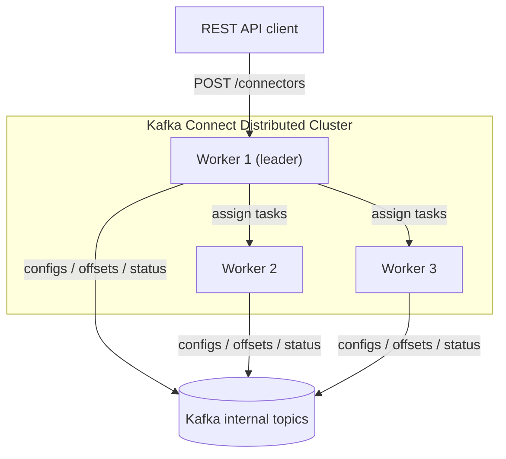

# Kafka Connect

### Source Connectors

A source connector is a Kafka Connect plugin that pulls data from an external system (a database, message queue, filesystem, or SaaS API) and publishes it as records into one or more Kafka topics. Instead of hand-writing a producer application for every upstream system, you configure a connector (for example `io.debezium.connector.mysql.MySqlConnector` or `io.confluent.connect.jdbc.JdbcSourceConnector`) and Kafka Connect handles polling, schema conversion, partitioning, offset tracking, and fault tolerance for you.

Source connectors matter in interviews because they represent the standard, low-code way organizations integrate legacy systems into event-driven pipelines. Understanding how a source connector converts external records (rows, files, messages) into Kafka `SourceRecord` objects — including key/value schemas and partition/offset bookkeeping — demonstrates you understand the full data-integration story, not just producer/consumer APIs.

A source connector implementation extends `SourceConnector` (cluster-level config validation and task partitioning) and one or more `SourceTask` instances that actually poll data and return `List<SourceRecord>`. Connect workers manage the task lifecycle, retries, and committing offsets so tasks resume from the correct position after a restart or rebalance.

```json
{
  "name": "mysql-orders-source",
  "config": {
    "connector.class": "io.debezium.connector.mysql.MySqlConnector",
    "database.hostname": "mysql",
    "database.port": "3306",
    "database.user": "debezium",
    "database.password": "dbz",
    "database.server.id": "184054",
    "topic.prefix": "orders-db",
    "table.include.list": "shop.orders",
    "schema.history.internal.kafka.bootstrap.servers": "kafka:9092",
    "schema.history.internal.kafka.topic": "schema-changes.orders"
  }
}
```

**Real-life scenario:** A retail company uses Debezium's MySQL source connector to capture every row change in the `orders` table via the MySQL binlog (CDC) and stream it into an `orders-db.shop.orders` topic, without any application code changes to the order-service.

**Advantages**
- No custom producer code needed for common systems.
- Built-in offset management and fault tolerance.
- Horizontally scalable by adding tasks.

**Disadvantages**
- Limited to what the connector plugin supports/exposes.
- Schema drift in the source system can break the connector.
- Debugging connector internals is harder than debugging your own producer.

**Interview Questions**
- What is the difference between a `SourceConnector` and a `SourceTask`? — The `SourceConnector` handles cluster-level config validation and splits work into task configs, while one or more `SourceTask` instances actually poll the external system and produce `SourceRecord`s.
- How does Kafka Connect know where a source connector left off after a restart? — It reads the last committed source offset (e.g. a binlog position or file byte offset) from the offset storage topic (distributed mode) or local file (standalone mode) and resumes from there.
- How would you use CDC (e.g. Debezium) to avoid dual-write problems? — Capture changes directly from the database's transaction log instead of having application code write to both the DB and Kafka separately, so Kafka events are derived from the single source of truth (the DB) rather than a second, potentially inconsistent write.

### Sink Connectors

A sink connector does the reverse of a source connector: it consumes records from Kafka topics and writes them into an external system such as Elasticsearch, a relational database, S3, or HDFS. Sink connectors are built by extending `SinkConnector` and `SinkTask`, where `SinkTask.put(Collection<SinkRecord>)` receives batches of records to persist downstream.

They matter for interviews because most real systems need to "land" streaming data somewhere queryable — a data warehouse, search index, or object store — and sink connectors are the idiomatic Kafka way to do this without writing bespoke consumer applications. Interviewers often probe on delivery semantics: sink connectors must handle at-least-once delivery, meaning downstream systems need idempotent writes (upserts keyed by a unique ID) to avoid duplicate records after task restarts.

Sink connectors also handle schema conversion — e.g. translating an Avro/JSON Kafka record into a SQL `INSERT ... ON DUPLICATE KEY UPDATE` statement or an Elasticsearch document — and manage batching/flush intervals to balance throughput versus latency.

```json
{
  "name": "es-orders-sink",
  "config": {
    "connector.class": "io.confluent.connect.elasticsearch.ElasticsearchSinkConnector",
    "topics": "orders-db.shop.orders",
    "connection.url": "http://elasticsearch:9200",
    "type.name": "_doc",
    "key.ignore": "false",
    "schema.ignore": "true",
    "behavior.on.null.values": "delete"
  }
}
```

**Real-life scenario:** A search team subscribes to the `orders-db.shop.orders` topic via an Elasticsearch sink connector so every order change is immediately searchable in a customer-support dashboard, with no custom consumer code to maintain.

**Advantages**
- Declarative, reusable integration with common data stores.
- Automatic batching, retries, and dead-letter routing.

**Disadvantages**
- At-least-once semantics require idempotent downstream writes.
- Complex transformations may exceed what SMTs can express.

**Interview Questions**
- How do sink connectors guarantee (or fail to guarantee) exactly-once delivery to the target system? — Sink connectors generally only provide at-least-once delivery; true exactly-once requires the downstream write itself to be idempotent (e.g. upserts keyed by a unique ID).
- What happens if a downstream system is unavailable — how does the task handle retries? — The task retries with backoff per its `retry.backoff.ms`/error-handling config, and if retries are exhausted the failed records can be routed to a dead-letter topic or the task fails and requires manual restart.
- How would you design the sink target schema to make writes idempotent? — Use the Kafka record's unique key/ID as a primary key or unique constraint in the target store and perform upserts (`INSERT ... ON DUPLICATE KEY UPDATE` or equivalent) instead of blind inserts.

### Standalone Mode

Standalone mode runs Kafka Connect as a single process on a single machine, with connector and task state (including offsets) stored in local files rather than in Kafka topics. You start it with `connect-standalone.sh worker.properties connector1.properties [connector2.properties ...]`, and configuration for connectors is supplied via flat `.properties` files rather than the REST API (though the REST API is technically still available).

This mode matters for interviews as the "simple case" baseline: it's good for local development, testing a connector plugin, or small, non-critical integrations (like tailing a single log file) where high availability isn't a requirement. Because offsets live in a local file (`offset.storage.file.filename`), if the machine or disk is lost, offset tracking is lost too — there's no automatic failover to another node.

Understanding standalone mode helps you explain to an interviewer *why* production deployments almost always use distributed mode instead: standalone has a single point of failure and cannot scale beyond one JVM process.

**Advantages**
- Simple to set up; no additional Kafka topics required for coordination.
- Good for quick local testing of a connector.

**Disadvantages**
- No fault tolerance — losing the process loses in-flight work and requires the file to survive.
- No horizontal scaling; one process handles all tasks.
- Not suitable for production workloads that need HA.

**Differences vs Distributed Mode**
- Config & offsets: local files vs Kafka topics.
- Fault tolerance: none vs automatic task rebalancing across workers.
- Scalability: single process vs many worker processes/nodes.
- Management: static properties files vs dynamic REST API.

**Interview Questions**
- Why would you *never* use standalone mode for a production CDC pipeline? — It runs as a single process with no fault tolerance or horizontal scaling, so a machine failure loses offset tracking and halts the pipeline with no automatic failover.
- Where are offsets stored in standalone mode, and what's the operational risk? — In a local file (`offset.storage.file.filename`) on that single machine; if the disk or machine is lost, offset tracking is lost with it.
- When is standalone mode actually the right choice? — For local development, testing a connector plugin, or small non-critical integrations where high availability isn't required.

### Distributed Mode

Distributed mode runs Kafka Connect as a cluster of worker processes that coordinate via Kafka itself. Connector configurations, task status, and offsets are stored in internal Kafka topics (`connect-configs`, `connect-status`, `connect-offsets` by convention), and workers use a Kafka consumer group protocol to elect a leader and rebalance tasks across available workers automatically.

This is the mode used in virtually all production deployments because it provides fault tolerance (if a worker dies, its tasks are redistributed to remaining workers), horizontal scalability (add more workers to handle more tasks/throughput), and centralized management via the REST API rather than local config files. Interviewers care about this because it shows you understand Connect isn't just "a connector" — it's a distributed system with its own rebalancing protocol, much like consumer groups.



**Real-life scenario:** A data platform team runs a 3-node Connect cluster shared by dozens of source/sink connectors; when one node is redeployed during a rolling upgrade, its tasks are automatically picked up by the remaining nodes with minimal disruption.

**Advantages**
- Automatic task rebalancing and fault tolerance.
- Centralized, dynamic configuration via REST API.
- Scales horizontally by adding workers.

**Disadvantages**
- More operational complexity (internal topics, cluster group coordination).
- Rebalances can briefly pause task processing.

**Interview Questions**
- How does a distributed Connect cluster elect a leader and assign tasks? — Workers use the Kafka consumer group protocol to join a group and elect a leader, which computes task assignments and distributes them across available workers, rebalancing when workers join/leave.
- What are the three internal topics distributed Connect relies on, and what does each store? — `connect-configs` (connector/task configurations), `connect-offsets` (source connector offsets), and `connect-status` (connector/task running status).
- How would you scale a distributed Connect cluster to handle more source tables? — Add more worker processes/nodes to the cluster and/or increase `tasks.max` on the connector so more tasks run in parallel, splitting the tables across them.

### Connector Configuration

Every connector — source or sink — is defined by a configuration map of key/value properties submitted either as a `.properties` file (standalone) or JSON payload to the REST API (distributed). Core properties every connector needs include `name`, `connector.class`, `tasks.max`, `key.converter`/`value.converter` (or these are inherited from worker defaults), and connector-specific properties (e.g. `topics`, `connection.url`, `table.include.list`).

Interviewers probe this topic to see if you understand the separation between **worker-level config** (bootstrap servers, converters, offset storage — same for all connectors on that worker) and **connector-level config** (specific to that integration). Getting `tasks.max` right is also a key scaling lever: it caps parallelism, but the actual number of running tasks also depends on how many partitions/tables/files can be split.

```json
{
  "name": "jdbc-sink-users",
  "config": {
    "connector.class": "io.confluent.connect.jdbc.JdbcSinkConnector",
    "tasks.max": "4",
    "topics": "users",
    "connection.url": "jdbc:postgresql://db:5432/app",
    "auto.create": "true",
    "insert.mode": "upsert",
    "pk.mode": "record_key",
    "pk.fields": "id"
  }
}
```

**Real-life scenario:** A platform engineer bumps `tasks.max` from 1 to 4 on a busy sink connector to parallelize writes across four partitions, cutting consumer lag from minutes to seconds.

**Interview Questions**
- What is the difference between worker configuration and connector configuration? — Worker configuration (bootstrap servers, converters, offset storage) applies to the whole Connect process and all connectors on it, while connector configuration is specific to a single connector instance's integration details.
- What happens if you set `tasks.max` higher than the number of partitions/tables available to split work? — Connect can only create as many tasks as there is splittable work, so the excess `tasks.max` has no effect and some tasks simply won't be created.
- How do `key.converter`/`value.converter` settings affect how records are (de)serialized? — They determine the format (e.g. JSON, Avro, Protobuf) Connect uses to convert between Kafka's raw bytes and the internal `Struct`/schema representation used by connectors and SMTs.

### Offset Storage

Offset storage is how Kafka Connect tracks "how far" each connector task has progressed, so it can resume correctly after a restart, crash, or rebalance instead of reprocessing or skipping data. For **source connectors**, offsets represent a position in the *external* system (e.g. a file byte offset, a database CDC log position, a JDBC "last modified" timestamp) and are stored in the `offset.storage.topic` (distributed mode) or a local file (standalone mode). For **sink connectors**, "offsets" are just standard Kafka consumer-group offsets committed back to Kafka for the topics being consumed.

This matters in interviews because it's a common source of confusion: source-connector offsets are *connector-defined* semantics tracked by Connect, while sink-connector offsets reuse the normal Kafka consumer offset-commit mechanism. Understanding this distinction shows depth beyond "Connect just moves data."

In distributed mode, the offset topic is configured with `offset.storage.topic`, `offset.storage.replication.factor`, and `offset.storage.partitions`, and — like any Kafka topic — should be replicated (typically factor 3) since losing it means losing the ability to resume connectors correctly.

**Real-life scenario:** After a Connect worker crashes mid-poll, the replacement worker task reads the last committed source offset (e.g. binlog position `mysql-bin.000123:456789`) from the offset topic and resumes CDC capture from exactly that point, avoiding duplicate or missed events.

**Interview Questions**
- Why should the internal offset storage topic be replicated in production? — Losing it means losing the ability to resume connectors from the correct position, causing reprocessing or data loss; replication (typically factor 3) protects against broker failure.
- How do source-connector offsets differ conceptually from sink-connector offsets? — Source-connector offsets are connector-defined positions in the external system (e.g. a binlog position or file byte offset), while sink-connector offsets are just standard Kafka consumer-group offsets on the topics being consumed.
- What happens to processing if the offset topic is lost or corrupted? — Source connectors lose track of where they left off and may restart from the beginning (duplicates) or from an undefined position (data loss), depending on connector-specific fallback behavior.

### Single Message Transforms (SMTs)

Single Message Transforms are lightweight, per-record transformations applied inline within a Connect pipeline — either on records coming from a source connector before they hit Kafka, or on records read from Kafka before they reach a sink connector. Common built-in SMTs include `InsertField`, `MaskField`, `ReplaceField`, `Filter`, `RegexRouter`, `TimestampConverter`, and `Cast`.

SMTs matter because they let you do simple ETL-style adjustments (renaming fields, masking PII, routing to a different topic name, dropping tombstones) declaratively in connector JSON config, without writing and deploying custom Java code or a separate stream-processing job. For anything beyond simple per-record logic (joins, aggregations, windowing), you'd reach for Kafka Streams or ksqlDB instead — a key distinction interviewers like to test.

```json
{
  "name": "mysql-source-with-smt",
  "config": {
    "connector.class": "io.debezium.connector.mysql.MySqlConnector",
    "transforms": "route,mask",
    "transforms.route.type": "org.apache.kafka.connect.transforms.RegexRouter",
    "transforms.route.regex": "orders-db\\.shop\\.(.*)",
    "transforms.route.replacement": "cdc-$1",
    "transforms.mask.type": "org.apache.kafka.connect.transforms.MaskField$Value",
    "transforms.mask.fields": "customer_ssn"
  }
}
```

**Real-life scenario:** A compliance requirement mandates that SSNs never land in Kafka in plaintext; a `MaskField` SMT scrubs the field at ingestion time, before the record ever reaches the topic.

**Advantages**
- No extra code or deployment — just configuration.
- Chainable (multiple SMTs run in sequence per record).

**Disadvantages**
- Limited to single-record, stateless logic — no joins/aggregations.
- Chains of many SMTs can hurt readability and debuggability.

**Interview Questions**
- When would you choose an SMT versus a full Kafka Streams application? — SMTs for simple, stateless, per-record transformations (renaming, masking, routing); a full Streams application for anything needing joins, aggregations, windowing, or cross-record state.
- How would you mask or drop a sensitive field before it reaches a topic? — Apply a `MaskField` SMT on the source connector (or a `Filter`/custom SMT to drop it) so the transformation happens before the record is ever written to the topic.
- Can SMTs perform stateful operations like deduplication across records? Why or why not? — No — SMTs operate on one record at a time with no access to prior records or external state, so cross-record logic like deduplication requires Kafka Streams or a custom application instead.

### Kafka Connect REST API

The REST API is the primary management interface for a distributed Connect cluster: it lets you create, update, pause, resume, restart, and delete connectors, inspect task status, and query available connector plugins — all via HTTP (default port `8083`) instead of editing files on individual machines. Key endpoints include `POST /connectors`, `GET /connectors/{name}/status`, `PUT /connectors/{name}/config`, `POST /connectors/{name}/restart`, and `GET /connector-plugins`.

Interviewers ask about this to confirm you know Connect is managed operationally like a microservice with an API, not a static config file system, and that any worker in the cluster can serve API requests (they forward to the leader when needed) — meaning you don't need to know which node is "in charge."

```bash
# create/update a connector
curl -X PUT http://localhost:8083/connectors/mysql-orders-source/config \
  -H "Content-Type: application/json" \
  -d @mysql-source-config.json

# check status of all tasks
curl http://localhost:8083/connectors/mysql-orders-source/status

# restart only failed tasks
curl -X POST http://localhost:8083/connectors/mysql-orders-source/tasks/0/restart
```

**Real-life scenario:** An on-call engineer sees a connector task in `FAILED` state on a monitoring dashboard and uses `POST /connectors/{name}/tasks/{id}/restart` to recover it without redeploying the whole Connect cluster.

**Interview Questions**
- Which REST endpoint would you use to check why a connector task failed? — `GET /connectors/{name}/status`, which reports per-task state and the error trace for any `FAILED` task.
- How can you update a running connector's configuration without restarting the whole cluster? — `PUT /connectors/{name}/config` with the new configuration; Connect updates and restarts just that connector's tasks, not the whole cluster.
- How does the REST API behave differently on a follower worker versus the leader? — Any worker can accept REST requests, but a follower transparently forwards write requests (like creating/updating connectors) to the leader, which performs the actual assignment changes.

