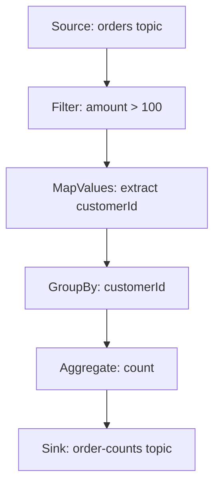
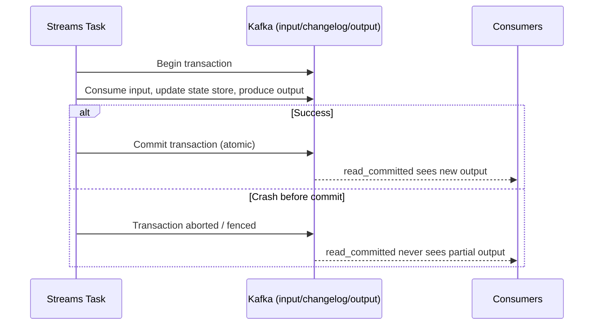

# Kafka Streams

### Stream Processing

Stream processing is the paradigm of continuously processing unbounded, ever-arriving data as it flows through a system, rather than collecting it into a bounded dataset and processing it in one shot (batch processing). Kafka Streams is a Java library (not a separate cluster/service — it runs as a library inside your application) that lets you build stream processing applications directly on top of Kafka topics, reading input topics, applying transformations, and writing results to output topics.

The core mental model is a continuous, potentially infinite sequence of key-value records flowing through a topology of processing steps (map, filter, join, aggregate) with results emitted incrementally as new data arrives, rather than waiting for "all the data" (which never truly ends in a streaming system).

```java
StreamsBuilder builder = new StreamsBuilder();
KStream<String, Order> orders = builder.stream("orders");
orders.filter((key, order) -> order.getAmount() > 100)
      .to("large-orders");

KafkaStreams streams = new KafkaStreams(builder.build(), streamsConfig());
streams.start();
```

**Real-life scenario:** A fraud detection system needs to flag suspicious transactions within seconds of them occurring — stream processing continuously evaluates each transaction as it arrives instead of waiting for a nightly batch job.

**Differences vs Batch Processing**
- Stream: low latency, continuous, unbounded data, results emitted incrementally
- Batch: higher latency, scheduled/bounded runs, simpler to reason about for large historical computations

**Interview Questions**
- How does Kafka Streams differ architecturally from a separate processing cluster like Spark? — Kafka Streams is a library embedded directly inside your application (no separate cluster/master/executor processes to deploy or manage) and scales by running more instances of your application, whereas Spark requires a dedicated cluster of driver/executor processes.
- What is the difference between stream processing and batch processing? — Stream processing continuously handles unbounded data as it arrives with low latency; batch processing collects a bounded dataset and processes it all at once, typically with higher latency but simpler reasoning.
- Why is Kafka Streams described as "just a library"? — Because it runs inside your own JVM application process (a plain dependency, like any other library) rather than requiring a separate processing cluster with its own deployment model.

### Stateless Processing

Stateless processing operations transform each record independently, without needing to remember anything about previously seen records. Examples in the Kafka Streams DSL include `filter`, `map`, `mapValues`, `flatMap`, and `foreach`. Because no state is retained between records, stateless operators are simple, require no local state store, and scale linearly — any instance can process any record without coordination.

Stateless operations are the building blocks for simple transformations and routing logic: reshaping a record's fields, filtering out irrelevant events, or splitting a stream by a predicate (`split()`/`branch`).

```java
KStream<String, Order> orders = builder.stream("orders");
KStream<String, String> highValueCustomerIds = orders
    .filter((key, order) -> order.getAmount() > 1000)
    .mapValues(order -> order.getCustomerId());
```

**Real-life scenario:** Redacting a sensitive field from every event before forwarding it to an analytics topic is a purely stateless `mapValues` transformation — no memory of past records is needed.

**Interview Questions**
- Give three examples of stateless Kafka Streams DSL operators. — `filter`, `map`/`mapValues`, and `flatMap` (or `foreach`).
- Why do stateless operations scale more easily than stateful ones? — Each record is processed independently with no memory of prior records, so any instance can handle any record without needing local state or coordination with other instances.

### Stateful Processing

Stateful processing operations need to remember information across multiple records to produce a result — aggregations (`count`, `reduce`, `aggregate`), joins, and windowing all require state. Kafka Streams implements this state using local **state stores** (backed by RocksDB by default, or in-memory stores), which are automatically backed up to internal **changelog topics** in Kafka so state can be restored if an instance crashes or a partition is reassigned.

Because state is partitioned along with the input topic's partitions, stateful operations require careful attention to keying: records must be **co-partitioned** (same key, same number of partitions) for joins and aggregations to work correctly, since Kafka Streams processes each partition's state independently on whichever instance owns it.

```java
KTable<String, Long> orderCountsByCustomer = builder
    .stream("orders", Consumed.with(Serdes.String(), orderSerde))
    .groupBy((key, order) -> order.getCustomerId(), Grouped.with(Serdes.String(), orderSerde))
    .count(Materialized.as("order-counts-store"));
```

**Real-life scenario:** Counting the number of orders per customer in the last hour requires stateful processing — the application must remember running counts per customer key, not just react to each order in isolation.

**Differences vs Stateless Processing**
- Stateless: no memory needed, trivially scalable, simple operators (`map`, `filter`)
- Stateful: needs local state stores + changelog topics, requires co-partitioning, more complex failure recovery (state restoration)

**Interview Questions**
- Why do stateful operations require a state store, and how is that store made fault-tolerant? — They need to remember information across records (running counts, join state), which is kept in a local state store; fault tolerance comes from Kafka Streams automatically backing up that store to an internal changelog topic so it can be rebuilt after a crash or reassignment.
- What does "co-partitioning" mean and why does it matter for joins/aggregations? — It means the input streams/tables share the same key type and number of partitions so that matching keys always land on the same partition; without it, Kafka Streams can't guarantee related records are processed together on the same task.
- What happens to a stateful task's data when a Kafka Streams instance crashes and its partition is reassigned? — The new instance owning that partition rebuilds the state store by replaying the partition's changelog topic from the beginning (or from a local standby replica if configured), restoring it before resuming processing.

### Stream Topology

A stream topology is the directed acyclic graph (DAG) of processing nodes — sources, processors, sinks — that defines how records flow through a Kafka Streams application. Built using either the high-level DSL (`StreamsBuilder`, `KStream`/`KTable` chaining) or the low-level Processor API (`Topology`, custom `Processor` implementations for full control), the topology is compiled once at startup and then executed continuously as records arrive.

Internally, Kafka Streams splits the topology into **sub-topologies** at points where repartitioning is required (e.g., after a `groupBy` with a different key), and each sub-topology's partitions are distributed across available stream threads/instances as **tasks** — the actual unit of parallelism in Kafka Streams.

```java
Topology topology = builder.build();
System.out.println(topology.describe()); // prints the DAG structure
```



**Real-life scenario:** Calling `topology.describe()` during development lets an engineer visually verify the DAG matches their intended business logic before deploying, catching an accidental extra repartition step.

**Interview Questions**
- What's the difference between the high-level DSL and the low-level Processor API in Kafka Streams? — The DSL (`StreamsBuilder`, `KStream`/`KTable`) offers concise, declarative operators for common patterns; the Processor API gives full manual control over the topology and per-record processing logic at the cost of more boilerplate.
- What is a sub-topology and when does Kafka Streams create one? — A sub-topology is a portion of the overall topology; Kafka Streams splits the topology into sub-topologies at points where repartitioning is required, such as after a `groupBy` on a different key.
- What is a "task" in Kafka Streams and how does it relate to parallelism? — A task is the unit of parallelism — each sub-topology's partitions are assigned to tasks, which are distributed across available stream threads/instances, so the number of tasks (bounded by partition count) determines the maximum useful parallelism.

### Windowing

Windowing groups stream records into finite time buckets so aggregations (like `count` or `sum`) can be computed "per time period" instead of over the entire unbounded stream. Kafka Streams supports several window types: **tumbling windows** (fixed-size, non-overlapping, e.g., every 5 minutes), **hopping windows** (fixed-size but overlapping, advancing by a smaller "advance" interval than the window size), **sliding windows** (used mainly for joins, windows centered around each record), and **session windows** (dynamic-length windows that close after a period of inactivity/gap).

Because streaming data can arrive out of order or late (network delays, retries), Kafka Streams uses **grace periods** to decide how long to keep a window open for late-arriving records before finalizing and emitting results, balancing correctness against latency and state store size.

```java
KTable<Windowed<String>, Long> ordersPerFiveMinutes = builder
    .stream("orders", Consumed.with(Serdes.String(), orderSerde))
    .groupByKey()
    .windowedBy(TimeWindows.ofSizeAndGrace(Duration.ofMinutes(5), Duration.ofSeconds(30)))
    .count();
```



```mermaid
gantt
    title Tumbling vs Hopping Windows (5-min size)
    dateFormat X
    axisFormat %M
    section Tumbling
    Window 1 :0, 5
    Window 2 :5, 10
    section Hopping (advance 2min)
    Window A :0, 5
    Window B :2, 7
    Window C :4, 9
```

**Real-life scenario:** A monitoring system computes "requests per 1-minute tumbling window" to detect traffic spikes, while a session window groups a user's clickstream events into a "session" that closes after 30 minutes of inactivity.

**Differences vs each other**
- **Tumbling:** fixed, non-overlapping — simplest, each record belongs to exactly one window
- **Hopping:** fixed size, overlapping — a record can belong to multiple windows, useful for rolling averages
- **Session:** dynamic length based on activity gaps — ideal for user session analytics
- **Sliding:** used specifically for stream-stream joins, one window per record pair within a time bound

**Interview Questions**
- What's the difference between tumbling and hopping windows? — Tumbling windows are fixed-size and non-overlapping (each record belongs to exactly one window); hopping windows are fixed-size but overlapping, advancing by a smaller interval than the window size so a record can fall into multiple windows.
- What is a grace period and why is it needed for windowed aggregations? — It's the extra time Kafka Streams keeps a window open after its nominal end to accept late-arriving records, needed because streaming data can arrive out of order due to network delays or retries.
- When would you use a session window instead of a tumbling window? — When you want to group activity by periods of continuous engagement with dynamic boundaries (e.g., a user's browsing session that closes after a period of inactivity), rather than fixed, evenly-spaced time buckets.

### Joins

Kafka Streams supports joining two streams/tables similarly to a SQL join but adapted for continuous, unbounded data. The main categories are **KStream-KStream joins** (windowed, since both sides are unbounded streams — you must bound the time range being joined), **KStream-KTable joins** (non-windowed, enriches each stream record with the current value from a table, e.g., enriching an order event with customer details), and **KTable-KTable joins** (non-windowed, always up-to-date view join between two tables).

All joins require the input streams/tables to be **co-partitioned** (same key type, same number of partitions, same partitioning strategy) so that Kafka Streams can guarantee corresponding keys land on the same partition/task, since joins are computed locally per-partition without cross-network shuffling.

```java
KStream<String, Order> orders = builder.stream("orders");
KTable<String, Customer> customers = builder.table("customers");

KStream<String, EnrichedOrder> enrichedOrders = orders.join(
    customers,
    (order, customer) -> new EnrichedOrder(order, customer)
);
```

**Real-life scenario:** An `orders` stream is joined with a `customers` KTable to enrich each order event with the customer's tier/loyalty status in real time, without querying a database per event.

**Differences vs each other**
- **Stream-Stream:** windowed (bounded time range), both sides unbounded
- **Stream-Table:** non-windowed, table represents "latest known state," stream drives the join
- **Table-Table:** non-windowed, always reflects current state of both tables

**Interview Questions**
- Why must stream-stream joins be windowed while stream-table joins are not? — Both sides of a stream-stream join are unbounded, so without a time bound the join would have to consider matching every past and future record; stream-table joins bound one side to the table's "current known value," so no time window is needed.
- What does co-partitioning require, and what happens if streams aren't co-partitioned? — It requires matching key type and identical partition counts/partitioning strategy; if streams aren't co-partitioned, Kafka Streams throws an error at startup (or the join silently misses matches) because corresponding keys can't be guaranteed to land on the same task.
- Give an example use case for a KStream-KTable join. — Enriching an incoming `orders` stream with the current customer tier/loyalty status from a `customers` KTable, without querying an external database per event.

### Aggregations

Aggregations combine multiple records sharing a key into a single running result — `count()`, `reduce()`, and `aggregate()` are the core DSL operators. `count` tracks the number of records per key, `reduce` combines values of the same type (e.g., summing amounts), and `aggregate` is the most general form, allowing the result type to differ from the input type (e.g., building a custom object that tracks count, sum, and average together).

Aggregations always require a preceding `groupBy`/`groupByKey` (to ensure records are co-partitioned by the aggregation key) and produce a `KTable`, since an aggregation is fundamentally a continuously-updated "current state per key" rather than a stream of independent events. Combined with windowing, aggregations produce a `KTable<Windowed<K>, V>` representing per-window running totals.

```java
KTable<String, Double> totalSpendByCustomer = builder
    .stream("orders", Consumed.with(Serdes.String(), orderSerde))
    .groupBy((key, order) -> order.getCustomerId(), Grouped.with(Serdes.String(), orderSerde))
    .aggregate(
        () -> 0.0,
        (customerId, order, total) -> total + order.getAmount(),
        Materialized.<String, Double, KeyValueStore<Bytes, byte[]>>as("total-spend-store")
            .withValueSerde(Serdes.Double())
    );
```

**Real-life scenario:** An e-commerce platform maintains a running "total lifetime spend" per customer using `aggregate()`, updated in real time as new orders arrive, backing a personalization feature.

**Interview Questions**
- What's the difference between `reduce` and `aggregate` in the Kafka Streams DSL? — `reduce` requires the output type to match the input value type and combines values of the same type, while `aggregate` allows an arbitrary result type via an initializer and separate aggregator function, making it more flexible for building complex aggregated objects.
- Why does an aggregation always produce a `KTable` rather than a `KStream`? — Aggregation maintains a continuously updated running result per key, which is exactly the upsert/changelog semantics a `KTable` represents, not a stream of independent events.
- How does windowing change the key type of an aggregation result? — Windowed aggregations produce a `Windowed<K>` key that combines the original key with the window's start/end boundaries, so each time window per key becomes a distinct entry.

### Interactive Queries

Interactive Queries let an external application query the state stored inside a Kafka Streams application's local state stores directly (via a REST endpoint you expose yourself), instead of writing aggregation results back out to a Kafka topic and having another service consume it. This avoids an extra round-trip through Kafka for use cases like "give me this customer's current running total right now," turning Kafka Streams' internal state into a queryable, low-latency read API.

Because state is partitioned across multiple application instances, a query for a specific key might be served locally (if that instance owns the partition) or require the application to look up which instance owns the key (`KafkaStreams.queryMetadataForKey()`) and forward the request (typically over HTTP) to that instance — application code you write yourself, since Kafka Streams doesn't provide this routing out of the box.

```java
ReadOnlyKeyValueStore<String, Double> store =
    streams.store(StoreQueryParameters.fromNameAndType(
        "total-spend-store", QueryableStoreTypes.keyValueStore()));
Double total = store.get("customer-123");
```

**Real-life scenario:** A dashboard needs to show a customer's live running order total; instead of a separate database + sync job, it queries the Kafka Streams application's state store directly via a small REST endpoint.

**Interview Questions**
- What problem do Interactive Queries solve compared to writing results back to a topic? — They avoid the extra hop of publishing results to a topic and consuming it in a separate service, letting external callers query the streams application's local state directly via a low-latency REST endpoint you expose.
- How do you handle querying a key that lives on a different application instance's partition? — Use `KafkaStreams.queryMetadataForKey()` to look up which instance owns that key's partition, then forward the request (typically over HTTP) to that instance.
- What's a limitation of Interactive Queries regarding availability during rebalances? — State stores are unavailable or in a transitional state during a rebalance while partitions are being migrated, so queries can momentarily fail or return stale results until stores are rebuilt.

### KStream and KTable Abstractions

`KStream` and `KTable` are the two core abstractions in the Kafka Streams DSL, representing two different views of the same underlying idea: a Kafka topic. A `KStream` represents an unbounded sequence of independent events — every record is a new, distinct fact (think: "an order was placed"). A `KTable` represents a continuously updated table/changelog — each record with a given key represents an *update* to that key's current value (think: "customer 123's current address is now X"), and a new record with the same key overwrites the previous value logically (like a database upsert).

This distinction has real semantic consequences: aggregating a `KStream` counts/sums every individual event, while a `KTable` sourced from a compacted topic naturally represents "latest value per key" and updates in place. Kafka Streams also has a `GlobalKTable`, which — unlike a regular `KTable` — is fully replicated to every application instance (not partitioned), useful for small reference/lookup data that needs to be joined without requiring co-partitioning.

```java
KStream<String, Order> orderEvents = builder.stream("orders");         // every event distinct
KTable<String, Customer> customerTable = builder.table("customers");    // latest value per key
GlobalKTable<String, Product> productCatalog = builder.globalTable("products"); // fully replicated
```

**Real-life scenario:** An `orders` topic is naturally a `KStream` (every order is a distinct event you want to count/process individually), while a `customer-profile` compacted topic is naturally a `KTable` (you only care about each customer's latest profile state).

**Differences vs each other**
- **KStream:** every record independent, unbounded log of events, no "current value" semantics
- **KTable:** latest value per key, backed by a changelog/state store, supports upsert semantics
- **GlobalKTable:** fully replicated to all instances (no co-partitioning needed for joins), best for small reference datasets

**Interview Questions**
- What's the core semantic difference between a `KStream` and a `KTable`? — A `KStream` treats every record as an independent, distinct event, while a `KTable` treats each record as an update/upsert that replaces the previous value for that key.
- When would you use a `GlobalKTable` instead of a regular `KTable`? — When the data is small reference/lookup data that needs to be joined without co-partitioning, since a `GlobalKTable` is fully replicated to every instance rather than partitioned.
- Why does converting a `KStream` to a `KTable` (via aggregation) change how updates for the same key are treated? — Aggregating collapses the stream of independent events into a single running value per key, so subsequent records for that key overwrite/update the result instead of being treated as separate facts.

### State Stores

State stores are the local, embedded storage Kafka Streams uses to hold data needed for stateful operations — aggregation results, join lookup data, or custom state in the Processor API. By default, state stores are backed by RocksDB (an embedded key-value store optimized for fast local reads/writes on disk), though in-memory stores are also available for smaller state or lower-latency needs at the cost of durability across restarts.

Crucially, every state store is backed by a **changelog topic** in Kafka (unless explicitly disabled), so if an application instance crashes or a partition is migrated to another instance, the new owner can rebuild the state store's contents by replaying the changelog topic rather than losing data. This changelog-backed design is what makes Kafka Streams' state fault-tolerant without needing an external database.

```java
StoreBuilder<KeyValueStore<String, Long>> storeBuilder = Stores.keyValueStoreBuilder(
    Stores.persistentKeyValueStore("order-counts-store"),
    Serdes.String(), Serdes.Long()
);
builder.addStateStore(storeBuilder);
```

**Real-life scenario:** When a Kubernetes pod running a Kafka Streams instance is rescheduled to a new node, its RocksDB state store is rebuilt from the changelog topic before it resumes processing, ensuring no aggregation data is lost.

**Interview Questions**
- What's the default storage engine for Kafka Streams state stores, and why is it a good fit? — RocksDB, an embedded key-value store optimized for fast local disk reads/writes, giving low-latency access without needing an external database.
- How does Kafka Streams make state stores fault-tolerant? — Every state store is backed by a Kafka changelog topic, so if an instance crashes or a partition migrates, the new owner rebuilds the store by replaying the changelog.
- What's the trade-off between a persistent (RocksDB) store and an in-memory store? — RocksDB survives restarts and handles larger-than-memory state at the cost of disk I/O latency, while in-memory stores are faster but lose their local copy on restart (still recoverable from the changelog, just slower to rebuild).

### Exactly-Once Semantics in Kafka Streams

Exactly-once semantics (EOS) in Kafka Streams guarantees that each input record affects the final result exactly once, even in the face of failures/retries — no duplicate processing effects and no lost updates — despite the underlying mechanics involving at-least-once delivery and retries at the network level. This is achieved by combining Kafka's idempotent producer, transactions (atomic writes across multiple topics/partitions, including changelog topics and output topics), and consumer isolation levels (`read_committed`) so downstream consumers only see fully-committed transactional output.

Enabling it is a single configuration change (`processing.guarantee=exactly_once_v2`), but understanding the mechanics is a strong interview signal: Kafka Streams wraps each batch of processing (consume, update state, produce output, commit offsets) as a single Kafka transaction. If a Streams instance crashes mid-processing, the transaction is aborted and consumers with `isolation.level=read_committed` never see the partial/uncommitted output, so reprocessing after recovery produces a clean, exactly-once outcome.

```java
Properties props = new Properties();
props.put(StreamsConfig.PROCESSING_GUARANTEE_CONFIG, StreamsConfig.EXACTLY_ONCE_V2);
props.put(StreamsConfig.APPLICATION_ID_CONFIG, "order-processing-app");
props.put(StreamsConfig.BOOTSTRAP_SERVERS_CONFIG, "localhost:9092");
```



**Real-life scenario:** A billing aggregation Kafka Streams application enables `exactly_once_v2` so that if an instance crashes mid-batch while updating a customer's running total, the partial update is rolled back atomically rather than double-counting or losing that batch on restart.

**Advantages**
- Eliminates duplicate-processing bugs without manual idempotency logic in application code
- Provides atomic "read-process-write" guarantees across topics and state stores

**Disadvantages**
- Adds latency/throughput overhead due to transactional commits
- Requires `read_committed` isolation on downstream consumers to actually observe the guarantee end-to-end

**Interview Questions**
- What Kafka mechanisms combine to provide exactly-once semantics in Kafka Streams? — The idempotent producer (dedupes retried writes) and transactions (atomically commit output, changelog, and offset updates together), combined with `read_committed` consumer isolation.
- What config enables EOS, and what's the performance trade-off? — `processing.guarantee=exactly_once_v2`; it adds latency/throughput overhead from transactional commits across topics.
- What isolation level must downstream consumers use to actually benefit from EOS? — `read_committed`, so they only see fully-committed transactional output and never partial or aborted writes.
- What happens to a Streams transaction if the instance crashes mid-batch? — The in-flight transaction is aborted/fenced, so partially written output and state changes are rolled back and never become visible to `read_committed` consumers; processing resumes cleanly from the last committed offset.

