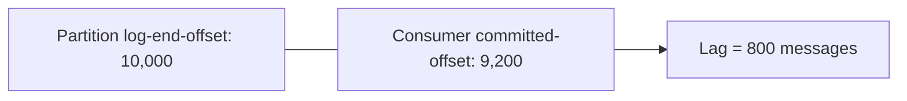

# Monitoring and Operations

### Kafka Metrics

Kafka exposes a rich set of metrics via JMX (Java Management Extensions) on both brokers and clients, covering everything from request rates and latencies to replication health and consumer lag. These metrics are the primary window into cluster health and are typically scraped by a monitoring agent (Prometheus JMX Exporter, Datadog agent, etc.) and visualized in Grafana/Datadog dashboards.

Broadly, Kafka metrics fall into categories: **broker metrics** (request handling, disk, replication), **topic/partition metrics** (bytes in/out, message rates per topic), **consumer metrics** (lag, fetch rate), and **producer metrics** (record send rate, error rate, batch size average). Understanding which metrics matter for which failure mode is a core operational skill — e.g., `UnderReplicatedPartitions` signals replication trouble, while `RequestQueueSize` signals broker overload.

```yaml
management:
  endpoints:
    web:
      exposure:
        include: prometheus, health, metrics
  metrics:
    export:
      prometheus:
        enabled: true
```

**Real-life scenario:** An SRE team builds a Grafana dashboard tracking `UnderReplicatedPartitions`, consumer lag, and request latency percentiles to get early warning before a slow disk turns into a full outage.

**Interview Questions**
- How does Kafka expose metrics, and what tools are commonly used to collect them? — Via JMX on brokers and clients; commonly scraped with the Prometheus JMX Exporter or Datadog agent and visualized in Grafana/Datadog dashboards.
- Name a few broker-level metrics that indicate cluster health problems. — `UnderReplicatedPartitions`, `RequestQueueSize`, `RequestHandlerAvgIdlePercent`, and `IsrShrinksPerSec`.
- What's the difference between broker metrics and consumer metrics? — Broker metrics describe the health/load of the Kafka server itself (request handling, replication, disk); consumer metrics describe client-side behavior like lag and fetch rate from the consuming application's perspective.

### Consumer Lag

Consumer lag is the difference between the latest offset produced to a partition (log-end-offset) and the offset a consumer group has last committed (current-offset). It's arguably the single most important operational metric in a Kafka-based system because it directly answers "how far behind real-time is this consumer?"

Lag can be measured with `kafka-consumer-groups.sh --describe`, via JMX metrics exposed by the consumer, or through tools like Burrow/Kafka Lag Exporter that track lag trends over time (a consumer with high but *shrinking* lag is recovering; high and *growing* lag signals a real problem — either the consumer is too slow or under-provisioned relative to incoming traffic).

Common causes of growing lag: consumer processing logic became slower (e.g., a downstream dependency degraded), insufficient consumer instances/partitions for the load, frequent rebalances interrupting progress, or a poison message stalling a partition.

```bash
kafka-consumer-groups.sh --bootstrap-server localhost:9092 \
  --describe --group order-processing-group
```



**Real-life scenario:** During a Black Friday traffic spike, consumer lag on the `orders` topic grows from near-zero to tens of thousands; the on-call engineer scales up consumer instances (up to the partition count) to catch up.

**Interview Questions**
- How is consumer lag calculated? — The difference between a partition's log-end-offset (latest produced offset) and the consumer group's last committed offset for that partition.
- What are common root causes of growing consumer lag? — Slower processing logic (e.g., a degraded downstream dependency), too few consumer instances/partitions for the traffic volume, frequent rebalances interrupting progress, or a poison message stalling a partition.
- How would you scale a consumer group to reduce lag, and what's the hard limit on parallelism? — Add more consumer instances up to the number of partitions on the topic — beyond that, extra instances sit idle since a partition can only be consumed by one member of a group at a time.

### Broker Metrics

Broker metrics describe the health and performance of an individual Kafka broker process: request handling (`RequestHandlerAvgIdlePercent`, request queue size, request latency percentiles per API type), replication (`UnderReplicatedPartitions`, `IsrShrinksPerSec`/`IsrExpandsPerSec`), and resource usage (disk usage per log dir, network thread utilization).

`UnderReplicatedPartitions` deserves special interview attention: it counts partitions where the ISR (in-sync replica set) is smaller than the configured replication factor, meaning some replicas have fallen behind — a leading indicator of broker/network trouble that can precede data-loss risk if it persists and the leader fails before replicas catch up.

**Real-life scenario:** A broker's disk starts failing intermittently; `RequestHandlerAvgIdlePercent` drops and `UnderReplicatedPartitions` rises well before the broker fully crashes, giving ops time to react.

**Interview Questions**
- What does `UnderReplicatedPartitions` indicate and why is it critical to monitor? — It counts partitions whose ISR is smaller than the configured replication factor, meaning some replicas have fallen behind — a leading indicator of broker/network trouble that can precede data loss if the leader fails before those replicas catch up.
- What does `RequestHandlerAvgIdlePercent` tell you about broker load? — It shows how much idle capacity the broker's request-handler threads have; a value trending toward zero indicates the broker is becoming saturated and struggling to keep up with incoming requests.
- How would you distinguish a network problem from a disk problem using broker metrics? — A network issue typically shows up as elevated request/response latency and connection errors without disk I/O metrics degrading, whereas a disk problem shows slow I/O thread metrics, growing request queues tied to log writes, and possibly `UnderReplicatedPartitions` rising due to slow local writes.

### Topic Metrics

Topic-level metrics aggregate activity per topic: bytes-in/bytes-out per second, messages-in per second, and failed produce/fetch request rates. These help identify which topics are driving cluster load, whether a specific topic's traffic pattern has changed unexpectedly (a sudden spike could indicate a bug causing duplicate produces), and where to focus partition/replication tuning.

Because topic metrics are typically tagged with the topic name, they're the natural granularity for per-team dashboards in a multi-tenant cluster, and for setting per-topic alerting thresholds (e.g., alert if `orders` topic bytes-in drops to zero unexpectedly, indicating an upstream producer outage).

**Real-life scenario:** A dashboard shows the `notifications` topic's messages-in rate suddenly 10x higher than baseline; investigation reveals a retry loop bug in a producer causing duplicate sends.

**Interview Questions**
- What topic-level metrics would you monitor to detect a producer misbehaving? — Bytes-in/messages-in rate per topic and failed produce request rate — an unexpected spike can reveal a retry-loop bug causing duplicate sends.
- Why is per-topic granularity useful in a multi-tenant cluster? — It lets each team monitor and alert on their own topic's traffic independently, and helps identify which specific tenant/topic is driving overall cluster load.

### Partition Metrics

Partition-level metrics drill down even further than topic metrics, tracking per-partition log size, log-end-offset growth rate, and — crucially — leader/replica placement and ISR status for that specific partition. Skewed partition metrics (one partition receiving far more traffic than its siblings) reveal a poor partitioning key choice, which causes hot partitions and uneven consumer load since a single consumer thread handles a partition at a time.

Monitoring partition size growth also matters for capacity planning and for catching runaway retention issues (e.g., a compacted topic not compacting properly, or `log.retention` misconfigured).

**Real-life scenario:** A topic partitioned by `customer_id` shows one partition consistently 5x larger than others because a single enterprise customer generates disproportionate traffic — an interview-worthy case for reconsidering the partitioning key or using a custom partitioner.

**Interview Questions**
- What causes a "hot partition" and how would you detect it via metrics? — A poorly chosen partitioning key that sends disproportionate traffic to one partition (e.g., keying by a low-cardinality field); it's detected by comparing per-partition log size/throughput metrics and seeing one significantly larger than its siblings.
- Why does uneven partition traffic hurt consumer group scalability? — Since one consumer thread handles a partition at a time, a hot partition becomes a bottleneck that can't be relieved by adding more consumers — the single consumer assigned to it caps overall throughput for that key range.
- How would you fix a hot-partition problem caused by a skewed partitioning key? — Choose a higher-cardinality or better-distributed partitioning key, or use a custom partitioner that spreads the skewed key's traffic across multiple partitions.

### Health Checks

Health checks in a Kafka-based Spring Boot application typically mean two things: (1) the application's own readiness/liveness — is the Spring Kafka container running, connected, and consuming; and (2) the cluster's health — are brokers reachable, is the target topic present, is replication healthy. Spring Boot Actuator provides a built-in `KafkaHealthIndicator` (when `spring-boot-starter-actuator` and Spring Kafka are both on the classpath) that reports `UP`/`DOWN` based on whether the admin client can describe cluster metadata.

In Kubernetes deployments, liveness probes should generally NOT be tied directly to Kafka connectivity (a transient broker blip shouldn't kill and restart the whole pod), while readiness probes checking Kafka health make more sense — taking the pod out of the load balancer/traffic rotation until Kafka connectivity is restored, without killing it.

```yaml
management:
  endpoint:
    health:
      show-details: always
  health:
    kafka:
      enabled: true
```

**Real-life scenario:** During a brief broker restart for a rolling upgrade, a consuming service's readiness probe flips to `DOWN` temporarily (removed from load-balanced traffic) but its liveness probe stays `UP` so Kubernetes doesn't unnecessarily restart the pod.

**Interview Questions**
- What does Spring Boot Actuator's Kafka health indicator check? — Whether the admin client can successfully describe cluster metadata, reporting `UP`/`DOWN` based on that connectivity check.
- Why should Kafka connectivity typically inform readiness rather than liveness probes? — A transient broker blip shouldn't cause Kubernetes to kill and restart the whole application pod; readiness instead temporarily removes it from traffic routing until connectivity is restored, without an unnecessary restart.
- What could cause a Kafka health check to report `DOWN` even though the application itself is fine? — A broker outage, network partition, or authentication/authorization misconfiguration that prevents the admin client from reaching or describing the cluster, unrelated to any bug in the application code.

### Log Monitoring

Log monitoring refers to two related but distinct things in Kafka operations: monitoring the **application/broker logs** (broker `server.log`, controller logs, application logs from `@KafkaListener` error handlers) for error patterns, and monitoring **Kafka's own commit log** — the actual topic-partition log segments on disk — for size, retention, and compaction behavior.

For broker/application logs, teams typically ship logs to a centralized system (ELK, Splunk, Loki) and alert on patterns like repeated `NotLeaderForPartitionException`, `OutOfMemoryError`, or a spike in DLT publishing log lines. For the Kafka log itself, `kafka-log-dirs.sh` and JMX metrics reveal segment counts, size on disk per topic, and whether log cleanup (deletion or compaction) is keeping up with retention configuration.

**Real-life scenario:** A centralized logging alert fires when a broker logs repeated `Broker had a stale broker epoch` warnings, prompting the ops team to investigate a flaky controller before it causes a leader election storm.

**Interview Questions**
- What's the difference between monitoring Kafka's application/broker logs vs. monitoring the Kafka log (partition segments) itself? — Application/broker log monitoring tracks textual log lines (errors, warnings, exceptions) typically shipped to ELK/Splunk; monitoring the Kafka log itself means inspecting the actual on-disk segment files/metrics (size, count, compaction/retention progress) via tools like `kafka-log-dirs.sh`.
- What log patterns would you alert on for early failure detection? — Repeated `NotLeaderForPartitionException`, `OutOfMemoryError`, controller/broker epoch warnings, or a spike in dead-letter-topic publishing log lines.
- What tool would you use to inspect on-disk log segment sizes per topic? — `kafka-log-dirs.sh`.

### Alerting

Alerting turns metrics and log monitoring into actionable notifications when thresholds are breached, ideally before an incident becomes customer-visible. Good Kafka alerting strategy tiers alerts by severity: page immediately for things like `UnderReplicatedPartitions > 0` sustained for several minutes, broker down, or consumer lag growing unbounded on a critical topic; ticket/low-priority for things like disk usage trending toward a threshold over days.

A common interview-level pitfall to discuss is alert fatigue: naive alerting (e.g., "alert if lag > 0") generates constant noise since transient lag spikes are normal during traffic bursts or brief consumer restarts. Effective alerts use rate-of-change and sustained-duration conditions (e.g., "lag > 10,000 for more than 5 minutes AND still increasing") rather than instantaneous thresholds.

```yaml
# Example Prometheus alerting rule (conceptual)
groups:
  - name: kafka-alerts
    rules:
      - alert: HighConsumerLag
        expr: kafka_consumergroup_lag > 10000
        for: 5m
        labels:
          severity: page
```

**Real-life scenario:** An alerting rule pages on-call only when `orders` consumer lag exceeds 10,000 messages for 5+ consecutive minutes, avoiding false pages during brief, self-resolving traffic spikes.

**Interview Questions**
- How would you design alert thresholds to avoid alert fatigue? — Use sustained-duration and rate-of-change conditions (e.g., "lag > 10,000 for 5+ minutes and still rising") instead of instantaneous thresholds, so brief, self-resolving spikes don't page anyone.
- What's the difference between an instantaneous threshold alert and a sustained/rate-based alert? — An instantaneous alert fires the moment a metric crosses a value, even briefly; a sustained/rate-based alert only fires once the condition holds for a defined duration or continues trending in a bad direction, filtering out transient noise.
- What Kafka metrics would you page on immediately vs. just ticket? — Page on `UnderReplicatedPartitions` sustained, broker down, or unbounded consumer lag on a critical topic; ticket lower-urgency trends like disk usage gradually approaching a threshold over days.

### Broker Configuration (server.properties)

`server.properties` is the primary configuration file for a Kafka broker, controlling everything from network listeners and log directories to replication, retention, and cluster identity (`broker.id`, or KRaft's `node.id`/`process.roles`). Key categories interview candidates should know: **listener config** (`listeners`, `advertised.listeners`, `security.inter.broker.protocol`), **log config** (`log.dirs`, `log.retention.hours`, `log.segment.bytes`, `log.cleanup.policy`), **replication config** (`default.replication.factor`, `min.insync.replicas`, `unclean.leader.election.enable`), and **cluster metadata** (`zookeeper.connect` for legacy mode, or `process.roles`/`controller.quorum.voters` for KRaft mode).

`min.insync.replicas` combined with producer `acks=all` is a frequent interview topic: it defines the minimum number of replicas that must acknowledge a write for it to be considered successful, directly trading off durability against availability (a higher `min.insync.replicas` means stronger durability guarantees but requests fail if too many replicas are unavailable).

```properties
# server.properties
broker.id=1
listeners=SASL_SSL://broker1:9093
log.dirs=/var/kafka-logs
log.retention.hours=168
default.replication.factor=3
min.insync.replicas=2
unclean.leader.election.enable=false
```

**Real-life scenario:** A payments system sets `min.insync.replicas=2` with `replication.factor=3` and producer `acks=all`, ensuring a write is only acknowledged once it's durably stored on at least 2 of 3 replicas — protecting against data loss if a single broker fails right after acknowledging.

**Interview Questions**
- What does `min.insync.replicas` control, and how does it interact with producer `acks=all`? — It sets the minimum number of replicas that must acknowledge a write for it to succeed; combined with `acks=all`, the producer's write is only considered successful once that many replicas have durably stored it.
- Why would you disable `unclean.leader.election.enable` in a durability-sensitive system? — To guarantee that only fully in-sync replicas can become leader, ensuring no committed data is silently lost even if it means a partition becomes temporarily unavailable.
- What's the difference between `listeners` and `advertised.listeners`? — `listeners` defines the addresses the broker binds to internally; `advertised.listeners` is what the broker tells clients to connect to (useful when internal and external/reachable addresses differ, e.g., behind NAT or in containerized environments).

