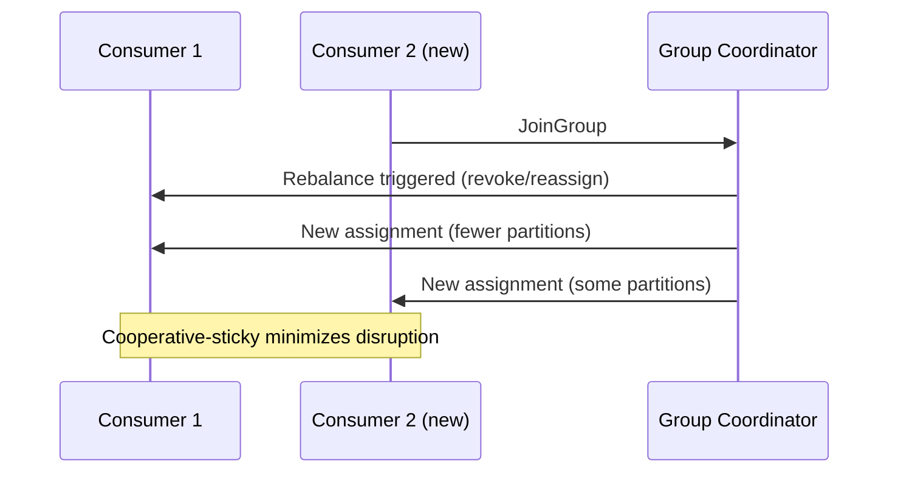

# Partitions and Ordering

### Partitioning Strategy

A partitioning strategy is the logic that determines which partition a given record is written to, and it directly shapes both load distribution and ordering guarantees. Kafka's built-in default strategy is: if a key is present, hash the key (murmur2) and mod by partition count; if no key is present, use a sticky/round-robin strategy that batches records to one partition at a time for efficiency before moving to the next.

Choosing the right partitioning strategy is really about choosing the right **key**: keying by `customerId` guarantees all events for a customer are ordered relative to each other (same partition), while keying by something too coarse (e.g., a constant) defeats parallelism, and keying by something too fine-grained and skewed (e.g., a rare category value) can cause "hot partitions."

For advanced cases, applications can supply a custom `Partitioner` implementation to control exactly how records map to partitions — e.g., to co-locate related entities beyond simple key hashing, or to implement geographic/tenant-aware partitioning.

```java
ProducerRecord<String, OrderEvent> record =
        new ProducerRecord<>("order-events", customerId, orderEvent); // key drives partition
```

**Real-life scenario:** An analytics platform keys events by `tenantId` so that all events for a given tenant are processed in order by the same consumer instance, simplifying per-tenant stateful aggregation.

**Interview Questions:**
- What's the default behavior when a producer sends a record with no key? — A sticky/round-robin distribution across partitions for load balancing.
- Why does key choice matter so much for partitioning? — It determines both load distribution and per-key ordering guarantees.
- What is a "hot partition" and how does poor key choice cause it? — A partition receiving disproportionate traffic because the chosen key has skewed value distribution.

### Message Ordering

Kafka guarantees strict ordering only **within a single partition** — records with the same key (and thus the same partition) are guaranteed to be written and read in the order they were produced, but there is no ordering guarantee across different partitions of the same topic. This is a foundational fact that shapes almost every design decision involving Kafka and ordering-sensitive data.

To preserve ordering for a logical entity (e.g., all events for one bank account), you must ensure all its events share the same partition key. On the producer side, retries can also threaten ordering unless `max.in.flight.requests.per.connection` is limited (or idempotence is enabled, which fixes this safely) — otherwise a retried batch could be written after a later batch that succeeded first.

On the consumer side, ordering is naturally preserved because a single consumer instance processes a given partition's records sequentially — but if you fan work out to multiple threads within a consumer's processing logic without care, you can accidentally reorder processing even though Kafka delivered records in order.

```java
// Safe ordering with idempotence + limited in-flight requests
config.put(ProducerConfig.ENABLE_IDEMPOTENCE_CONFIG, true);
config.put(ProducerConfig.MAX_IN_FLIGHT_REQUESTS_PER_CONNECTION, 5); // safe with idempotence
```

**Real-life scenario:** A banking system keys all transactions for an account by `accountId`, guaranteeing that a `Deposit` event is always processed before a subsequent `Withdrawal` event for the same account, since both land in the same partition in produce order.

**Interview Questions:**
- Does Kafka guarantee ordering across an entire topic? — No, only within a single partition.
- How can producer retries break ordering, and how is this fixed? — Retried batches could land out of order; enabling the idempotent producer fixes this safely even with multiple in-flight requests.
- What must you ensure to preserve ordering for a logical entity's events? — All its events must share the same partition key.

### Partition Keys

A partition key is the value (often the record's `key` field) used by the partitioner to deterministically choose which partition a record belongs to, most commonly via hashing. Good key selection balances two competing goals: even distribution of load across partitions, and correct grouping of related records that must stay ordered together.

Common effective keys include entity identifiers like `customerId`, `orderId`, `deviceId`, or `accountId` — anything that represents "the thing whose events must be ordered relative to each other." Poor key choices include highly skewed values (e.g., a `country` field where 90% of traffic is one country) or overly generic constants that eliminate parallelism entirely.

It's worth noting the key also often carries business meaning beyond partitioning — e.g., for a compacted topic, the key defines the compaction unit (only the latest value per key survives).

```java
// Good: keyed by orderId - all lifecycle events for an order stay ordered
kafkaTemplate.send("order-events", orderId, orderStatusChangedEvent);
```

**Real-life scenario:** An IoT platform partitions sensor readings by `deviceId`, ensuring a single consumer thread processes a device's readings in sequence (important for stateful anomaly detection), while spreading load across thousands of devices evenly.

**Interview Questions:**
- What two goals must a good partition key balance? — Even load distribution and correct grouping/ordering of related records.
- What happens if you choose a highly skewed partition key? — It creates hot partitions, overloading some brokers/consumers while others sit idle.
- Besides partitioning, what other role does the key play in a compacted topic? — It defines the compaction unit — only the latest value per key is retained.

### Round Robin Partitioning

Round-robin partitioning distributes records evenly across all partitions in sequence, used by default when a producer sends records **without a key** (technically Kafka's modern default is a "sticky" variant that batches several records to one partition before rotating, for better batching efficiency, but the net effect over time is still roughly even distribution). This maximizes load balancing but sacrifices any ordering relationship between records, since there's no key tying related records to the same partition.

Round-robin (or sticky) partitioning is appropriate when records are truly independent of each other — e.g., isolated log lines, metrics, or telemetry pings where no downstream consumer needs to see a particular entity's events in strict order.

The trade-off versus keyed partitioning is fundamental: round-robin optimizes for uniform load distribution, while keyed partitioning optimizes for correct per-entity ordering — you generally cannot fully have both when the key distribution itself is skewed.

```java
// No key -> sticky/round-robin distribution across partitions
ProducerRecord<String, String> record = new ProducerRecord<>("app-logs", null, logLine);
```

**Real-life scenario:** A logging pipeline sends unkeyed log lines to a `app-logs` topic using round-robin distribution, since individual log lines from different requests have no ordering dependency on each other.

**Interview Questions:**
- When is round-robin (no-key) partitioning appropriate? — When records are independent and don't require per-entity ordering.
- What is the modern default behavior for unkeyed records, and why does it differ slightly from pure round-robin? — A "sticky" partitioner batches several records to one partition at a time before rotating, improving batching efficiency while still balancing load overall.
- What do you lose by using round-robin partitioning instead of keyed partitioning? — Any ordering guarantee between related records.

### Custom Partitioners

A custom partitioner is a user-supplied implementation of Kafka's `Partitioner` interface, allowing an application to override the default key-hash/round-robin logic with domain-specific partition assignment — for example, co-locating related entities that don't share a simple key, implementing weighted/priority routing, or handling skewed keys with special-casing to avoid hot partitions.

To implement one, you implement the `partition()` method (returning a partition number given the topic, key, value, and cluster metadata) and configure it via the producer's `partitioner.class` property; Spring Boot/Spring Kafka simply passes this through to the underlying `ProducerConfig`.

Custom partitioners should be used sparingly — they add operational complexity and can make behavior less predictable to future maintainers — reaching for one is usually justified only when the default hashing genuinely can't express the required routing (e.g., dynamically rebalancing around known hot keys).

```java
public class VipAwarePartitioner implements Partitioner {
    @Override
    public int partition(String topic, Object key, byte[] keyBytes,
                          Object value, byte[] valueBytes, Cluster cluster) {
        int numPartitions = cluster.partitionsForTopic(topic).size();
        if ("VIP".equals(key)) {
            return 0; // dedicate partition 0 to VIP traffic
        }
        return Math.abs(Utils.murmur2(keyBytes)) % (numPartitions - 1) + 1;
    }
    @Override public void configure(Map<String, ?> configs) {}
    @Override public void close() {}
}
```

```properties
# producer config
partitioner.class=com.example.VipAwarePartitioner
```

**Real-life scenario:** A customer support platform routes VIP customer events to a dedicated partition (consumed with priority) via a custom partitioner, ensuring VIP tickets are processed faster than general traffic within the same topic.

**Interview Questions:**
- When would you implement a custom `Partitioner`? — When default hashing/round-robin can't express required routing (e.g., priority lanes, avoiding known hot keys).
- What method must a custom `Partitioner` implement? — `partition()`, returning the target partition number.
- What's a risk of overusing custom partitioners? — Increased complexity and less predictable/standard behavior for future maintainers.

### Partition Rebalancing

Partition rebalancing (in the consumer-group sense) is the process of reassigning topic partitions among the active consumer instances in a group whenever membership changes — a consumer joins, leaves, crashes (missed heartbeat), or the subscribed topic's partition count changes. During a rebalance, the group coordinator pauses partition assignment, runs the configured assignment strategy (range, round-robin, sticky, or cooperative-sticky), and hands out the new assignment.

Older "eager" rebalancing (range/round-robin assignors) revokes *all* partitions from *all* consumers before reassigning, causing a full stop-the-world pause. Newer **cooperative-sticky** rebalancing incrementally reassigns only the partitions that actually need to move, letting unaffected consumers keep processing during the rebalance — a major improvement adopted widely in modern Spring Kafka/consumer configurations.

Frequent or long rebalances are a common production pain point (often caused by slow consumer processing exceeding `max.poll.interval.ms`, or aggressive session timeouts), and are usually fixed by tuning poll/session timeouts, reducing batch processing time, or switching to the cooperative-sticky assignor.



```properties
partition.assignment.strategy=org.apache.kafka.clients.consumer.CooperativeStickyAssignor
```

**Real-life scenario:** During a rolling deployment of a consumer service, pods restart one at a time; using the cooperative-sticky assignor keeps the rebalance impact minimal so throughput barely dips, versus the old eager assignor which would briefly stop all consumption cluster-wide.

**Interview Questions:**
- What triggers a consumer group rebalance? — Consumers joining/leaving, crashing, or partition count changes.
- What's the key difference between eager and cooperative-sticky rebalancing? — Eager revokes all partitions from everyone first; cooperative-sticky only reassigns the partitions that actually need to move.
- What consumer config commonly causes unwanted rebalances due to slow processing? — Exceeding `max.poll.interval.ms` between polls.

