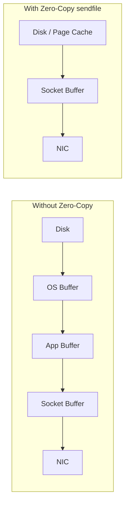

# Performance Tuning

### Throughput vs Latency

Throughput measures how many messages/bytes per second a Kafka pipeline can move; latency measures how long a single message takes from produce to consume. These two goals are frequently in tension: techniques that maximize throughput (large batches, compression, waiting to accumulate records) add latency per message, while techniques that minimize latency (small batches, `linger.ms=0`, immediate sends) reduce per-batch efficiency and increase per-message overhead (more network round trips, more CPU per byte).

Interview candidates should understand that Kafka tuning is rarely "one-size-fits-all" — a fraud-detection pipeline that needs sub-100ms latency will configure producers very differently from a batch analytics pipeline ingesting terabytes where a few hundred milliseconds of extra latency per batch is irrelevant. The key producer knobs that trade one for the other are `batch.size`, `linger.ms`, and `compression.type`; on the consumer side, `fetch.min.bytes` and `fetch.max.wait.ms` play the equivalent role.

In practice, most systems pick a "good enough" balance: a small `linger.ms` (5-20ms) captures most of the batching benefit without meaningfully hurting perceived latency, while still allowing higher throughput than `linger.ms=0`.

**Differences vs each other**
- **Throughput-optimized:** larger `batch.size`, non-zero `linger.ms`, compression enabled, more partitions — higher CPU efficiency, higher per-message delay
- **Latency-optimized:** `linger.ms=0`, small batches, `acks=1`, fewer partitions per consumer — lower delay, more network/CPU overhead per message

**Real-life scenario:** A stock-trading system prioritizes latency (`linger.ms=0`) to react to price changes within milliseconds, while a nightly clickstream aggregation job prioritizes throughput (`linger.ms=50`, `compression.type=lz4`) to ingest billions of events cheaply.

**Interview Questions**
- Which producer configs primarily control the throughput/latency trade-off? — `batch.size`, `linger.ms`, and `compression.type` on the producer side, plus `fetch.min.bytes`/`fetch.max.wait.ms` on the consumer side.
- Why does increasing `linger.ms` increase throughput but also increase per-message latency? — It deliberately delays sending so more records can accumulate into a single batch (fewer, larger network requests improve throughput), but the first record in that batch now waits longer before actually being sent.
- How would you tune Kafka differently for a real-time fraud detection system vs. a batch ETL pipeline? — Fraud detection would use `linger.ms=0`, small batches, and `acks=1` to minimize per-message delay; a batch ETL pipeline would use larger `batch.size`, higher `linger.ms`, and compression to maximize throughput since individual message latency doesn't matter.

### Batch Size

`batch.size` controls the maximum number of bytes of messages the producer will accumulate per partition before sending a batch to the broker. It's measured in bytes, not record count. When multiple records destined for the same partition arrive close together, the producer groups them into a single batch, amortizing network and broker-side overhead across many records instead of one request per record.

A larger `batch.size` improves throughput and compression efficiency (bigger batches compress better) at the cost of higher memory usage on the producer and slightly higher latency if `linger.ms` also allows batches to wait. If a batch fills up before `linger.ms` expires, it's sent immediately regardless of the timer — so `batch.size` and `linger.ms` work together, not independently.

```yaml
spring:
  kafka:
    producer:
      batch-size: 32768 # 32KB
      properties:
        linger.ms: 10
```

**Real-life scenario:** A logging pipeline sending millions of small log lines benefits hugely from a larger `batch.size` (e.g., 64KB) since it drastically cuts the number of produce requests to the broker.

**Interview Questions**
- What unit is `batch.size` measured in, and what happens when a batch fills up before `linger.ms` expires? — It's measured in bytes; if a batch reaches that byte size before the `linger.ms` timer expires, it's sent immediately regardless of the timer.
- How does `batch.size` interact with `compression.type`? — Larger batches give the compression algorithm more redundant data to work with, so bigger `batch.size` generally improves compression efficiency alongside throughput.
- What's the trade-off of setting `batch.size` very large? — It improves throughput and compression but increases producer memory usage and can add latency if batches take longer to fill (interacting with `linger.ms`).

### Linger Time

`linger.ms` tells the producer how long to wait, after the first record for a partition arrives, before sending the batch — even if `batch.size` hasn't been reached. It intentionally trades a small amount of latency for the opportunity to accumulate more records into a single request, improving throughput.

The default is `0`, meaning the producer sends as soon as the previous batch is flushed (essentially immediately for low-traffic partitions). Setting it to something like `5`-`20`ms is a common production compromise: it's imperceptible to most consumers but lets the producer batch several records from a burst of traffic into one network call.

```java
Properties props = new Properties();
props.put(ProducerConfig.LINGER_MS_CONFIG, 20);
props.put(ProducerConfig.BATCH_SIZE_CONFIG, 32768);
```

**Real-life scenario:** During a traffic spike, `linger.ms=20` lets dozens of events arriving within that 20ms window ride in a single batch instead of triggering dozens of separate network requests.

**Interview Questions**
- What happens if `linger.ms` is set to `0`? — The producer sends batches as soon as possible instead of waiting to accumulate more records, minimizing per-message latency at the cost of smaller, less efficient batches.
- How do `linger.ms` and `batch.size` interact to decide when a batch is sent? — A batch is sent as soon as either condition is met first: `batch.size` bytes have accumulated, or `linger.ms` has elapsed since the first record in the batch arrived.
- Why would a low-latency system set `linger.ms` to `0` while a high-throughput system sets it to `20`+? — A low-latency system wants each message sent immediately without waiting; a high-throughput system accepts a small, often imperceptible delay in exchange for batching many records into fewer, larger, more efficient requests.

### Compression

Kafka supports compressing batches of messages on the producer side (`compression.type`: `none`, `gzip`, `snappy`, `lz4`, `zstd`) and the broker stores/forwards them compressed, decompressing only happens on the consumer (and sometimes not even then, if using zero-copy — see below). Compression reduces network bandwidth usage and disk footprint substantially, often 2-4x, at the cost of CPU time on both producer and consumer.

`lz4` and `zstd` are popular modern choices: `lz4` is very fast with decent compression ratio, `zstd` offers the best compression ratio at a moderate CPU cost. `gzip` compresses well but is CPU-heavy and slower, mostly used when bandwidth is the primary bottleneck and CPU is abundant. `snappy` is fast but generally has a worse compression ratio than `lz4`/`zstd`.

Compression works at the batch level, so it pairs naturally with `batch.size`/`linger.ms` — bigger batches compress more efficiently because there's more redundant data to exploit.

```yaml
spring:
  kafka:
    producer:
      compression-type: lz4
```

**Real-life scenario:** A clickstream pipeline producing JSON events (highly compressible, repetitive field names) enables `zstd` and cuts network egress cost significantly with minimal CPU overhead.

**Advantages**
- Reduces network bandwidth and broker disk usage
- Improves effective throughput for text-heavy payloads (JSON, XML)

**Disadvantages**
- Adds CPU overhead on producer (compress) and consumer (decompress)
- Poor choice for already-compressed payloads (images, protobuf with binary blobs) — little benefit, wasted CPU

**Interview Questions**
- What compression codecs does Kafka support and how do `lz4` and `zstd` compare? — `none`, `gzip`, `snappy`, `lz4`, and `zstd`; `lz4` is very fast with a decent compression ratio, while `zstd` achieves the best compression ratio at a moderately higher CPU cost.
- Why does compression work better with larger batch sizes? — Compression algorithms exploit redundancy within the data being compressed, and larger batches contain more repeated patterns (e.g., similar JSON field names) to compress against.
- When would compression not be worth enabling? — For payloads that are already compressed or high-entropy binary data (images, pre-compressed blobs), where compression adds CPU overhead for little to no size reduction.

### Fetch Size

Fetch size settings control how much data a consumer requests from the broker per fetch request. `fetch.min.bytes` sets the minimum amount of data the broker should accumulate before responding (default 1 byte, meaning respond immediately); `fetch.max.wait.ms` caps how long the broker will wait to satisfy `fetch.min.bytes` before responding anyway; `max.partition.fetch.bytes` bounds how much data can be returned per partition in a single fetch.

Raising `fetch.min.bytes` (e.g., to a few KB) trades a small amount of latency for larger, more efficient fetch responses — similar in spirit to the producer's `linger.ms`/`batch.size` pair, but on the consume side.

```yaml
spring:
  kafka:
    consumer:
      fetch-min-size: 1048576   # 1MB
      fetch-max-wait: 500
      max-partition-fetch-bytes: 2097152
```

**Real-life scenario:** A high-throughput analytics consumer sets `fetch.min.bytes=1MB` so the broker batches more data per response, cutting the number of fetch round-trips dramatically compared to the 1-byte default.

**Interview Questions**
- What's the relationship between `fetch.min.bytes` and `fetch.max.wait.ms`? — `fetch.min.bytes` sets the minimum data the broker should accumulate before responding; `fetch.max.wait.ms` caps how long the broker waits to satisfy that minimum before responding anyway with whatever it has.
- What happens if `max.partition.fetch.bytes` is smaller than the largest message in a partition? — The consumer can get stuck — Kafka will still return that oversized message (fetch requests aren't split mid-record), but if configured too small relative to max message size it can cause fetch inefficiency or, in some client versions, errors; it must be at least as large as the largest expected message.

### Poll Size

`max.poll.records` caps how many records a single call to `consumer.poll()` returns to the application, controlling how much work happens per polling loop iteration. It's a client-side throttle independent of the actual bytes fetched from the broker (which is governed by fetch size settings above) — Kafka may fetch a large chunk of data internally but hand it to your code in `max.poll.records`-sized chunks.

Setting this too high risks exceeding `max.poll.interval.ms` (the deadline to call `poll()` again before the consumer is considered dead and triggers a rebalance) if processing each record is slow. Setting it too low increases polling overhead and reduces per-poll efficiency.

```yaml
spring:
  kafka:
    consumer:
      max-poll-records: 500
      properties:
        max.poll.interval.ms: 300000
```

**Real-life scenario:** A consumer doing heavyweight per-record processing (calling multiple external APIs) reduces `max.poll.records` from 500 to 50 so a single poll batch doesn't blow past `max.poll.interval.ms` and trigger a spurious rebalance.

**Interview Questions**
- How does `max.poll.records` relate to `max.poll.interval.ms`? — `max.poll.records` limits how many records are handed to the application per poll, and processing that batch must finish within `max.poll.interval.ms` or the consumer is deemed dead and a rebalance is triggered.
- What happens if a consumer fails to call `poll()` again within `max.poll.interval.ms`? — The coordinator considers it dead, evicts it from the group, and triggers a rebalance to reassign its partitions to other members.
- How would you tune `max.poll.records` for a listener with expensive per-record processing? — Lower it so a single poll batch takes comfortably less time to process than `max.poll.interval.ms`, avoiding spurious rebalances.

### Producer Buffer Memory

`buffer.memory` sets the total bytes the producer can use to buffer records waiting to be sent to the broker, across all partitions. When the application produces faster than the network can send data (e.g., broker slow, network congested), records queue up in this buffer. If the buffer fills up completely, `send()` calls will block for up to `max.block.ms` before throwing a `TimeoutException`.

This is essentially the producer's "shock absorber" for bursts of traffic. Sizing it correctly requires understanding your peak produce rate, average message size, and how long the broker might be temporarily unavailable or slow.

```yaml
spring:
  kafka:
    producer:
      buffer-memory: 33554432 # 32MB
      properties:
        max.block.ms: 60000
```

**Real-life scenario:** A batch job that bursts thousands of events per second increases `buffer.memory` from the 32MB default to 64MB to absorb spikes without blocking the producer thread.

**Interview Questions**
- What happens when `buffer.memory` is exhausted? — Further `send()` calls block for up to `max.block.ms` waiting for space to free up, then throw a `TimeoutException` if the buffer doesn't free up in time.
- How does `buffer.memory` differ from `batch.size`? — `buffer.memory` is the total memory budget across all partitions' pending batches; `batch.size` is the maximum size of an individual batch for one partition.
- What producer exception indicates the buffer is full and blocking timed out? — `TimeoutException` (from exceeding `max.block.ms` while waiting for buffer space).

### Consumer Fetch Settings

Beyond individual knobs, "consumer fetch settings" as a category refers to the combination of `fetch.min.bytes`, `fetch.max.wait.ms`, `max.partition.fetch.bytes`, and `max.poll.records` working together to shape how a consumer pulls data efficiently. Tuning them holistically matters more than tuning any single one in isolation — for example, raising `fetch.min.bytes` without also considering `max.partition.fetch.bytes` could mean the broker waits to accumulate data that then gets truncated per partition.

A common holistic tuning approach: increase `fetch.min.bytes` for high-throughput background consumers (reduces broker request overhead), keep it low (default) for latency-sensitive consumers, and always ensure `max.poll.interval.ms` comfortably exceeds worst-case processing time for a `max.poll.records` batch.

```yaml
spring:
  kafka:
    consumer:
      fetch-min-size: 65536
      fetch-max-wait: 500
      max-poll-records: 500
      properties:
        max.partition.fetch.bytes: 1048576
```

**Real-life scenario:** A metrics-ingestion consumer group tunes fetch settings together — larger `fetch.min.bytes`, moderate `max.poll.records` — to maximize throughput without risking rebalances from slow polling.

**Interview Questions**
- Why should fetch-related settings be tuned together rather than individually? — They interact — e.g., raising `fetch.min.bytes` without ensuring `max.partition.fetch.bytes` and `max.poll.records` are compatible could cause the broker to wait for data it then can't fully deliver per partition, or overwhelm the application's poll loop.
- How would misconfigured `max.partition.fetch.bytes` interact badly with `fetch.min.bytes`? — If `max.partition.fetch.bytes` is too small relative to `fetch.min.bytes`/message sizes, the broker may struggle to assemble a response that satisfies the minimum byte threshold efficiently, causing wasted waiting or inefficient small fetches.

### Broker Performance Tuning

Broker-side tuning in `server.properties` covers thread pools, disk I/O, and OS-level settings that determine how well a broker handles concurrent producer/consumer load. Key settings include `num.network.threads` (threads handling network requests), `num.io.threads` (threads doing disk I/O), `num.replica.fetchers` (threads replicating from other brokers), `log.flush.interval.messages`/`log.flush.interval.ms` (how often to force fsync vs. rely on OS page cache), and `log.segment.bytes` (segment file size affecting compaction/retention granularity).

Kafka is designed to rely heavily on the OS page cache rather than application-level caching or frequent fsyncs — this is why brokers perform best with plenty of RAM and why `log.flush.interval.*` is usually left at defaults (relying on replication for durability instead of per-message fsync). Disk choice matters too: sequential writes to fast disks (or even spinning disks, since Kafka's write pattern is sequential) combined with proper `num.io.threads` sizing (roughly matching disk count) significantly affects sustained write throughput.

```properties
# server.properties
num.network.threads=8
num.io.threads=16
num.replica.fetchers=4
log.segment.bytes=1073741824
log.retention.hours=168
replica.fetch.max.bytes=1048576
```

**Real-life scenario:** A broker handling a sudden surge of producers experiences request queuing; increasing `num.network.threads` and `num.io.threads` (matched to available CPU cores/disks) relieves the bottleneck.

**Interview Questions**
- What's the difference between `num.network.threads` and `num.io.threads`? — `num.network.threads` handle receiving/sending requests over the network; `num.io.threads` handle the actual disk I/O (reading/writing log segments) for those requests.
- Why does Kafka rely on the OS page cache instead of flushing to disk on every message? — Relying on the page cache (and replication for durability) avoids the overhead of fsyncing on every write, letting Kafka achieve much higher throughput than if every message forced a synchronous disk flush.
- How does `log.segment.bytes` affect log compaction and retention? — It determines segment size, which controls the granularity at which retention/deletion and compaction operate — smaller segments mean more frequent, finer-grained cleanup opportunities but more file overhead; larger segments mean coarser, less frequent cleanup.

### Zero-Copy Transfer

Zero-copy is an OS-level optimization (via the `sendfile()` system call) that lets Kafka brokers send data directly from the page cache/disk to the network socket without copying it through user-space application memory. Normally, serving a file over network involves multiple copies: disk → OS buffer → application buffer → socket buffer → NIC. Zero-copy collapses this to a single kernel-space transfer, dramatically reducing CPU usage and context switches for a very common Kafka operation: serving already-written log segments to consumers.

This is a major reason Kafka can sustain very high consumer throughput with modest CPU usage — consumers reading historical/older data (which is often already compressed on disk) get it streamed almost "for free" from the broker's perspective. It's also why enabling end-to-end compression is efficient: the broker doesn't decompress/recompress, it just moves compressed bytes.

Zero-copy applies specifically to reads that don't require broker-side transformation — if the broker needed to decrypt, re-encode, or transform the data before sending, zero-copy couldn't be used for that path.



**Real-life scenario:** A consumer group replaying weeks of historical topic data pulls large volumes of already-compressed log segments; zero-copy lets the broker serve this at near-network-line-rate with low CPU usage, instead of saturating broker CPU on data copying.

**Interview Questions**
- What is zero-copy and which system call enables it in Kafka? — Zero-copy transfers data directly from the page cache/disk to the network socket without copying through application (user-space) memory; it's enabled by the `sendfile()` system call.
- Why does zero-copy make serving compressed data particularly efficient? — The broker can stream already-compressed bytes straight to the network without decompressing and recompressing, so compression's bandwidth savings are realized without extra CPU cost on the broker.
- Under what circumstances can Kafka NOT use zero-copy transfer? — When the broker must transform the data before sending — e.g., decrypting, re-encoding, or otherwise processing it in user space — zero-copy can't be used for that path since the data has to pass through application memory.

