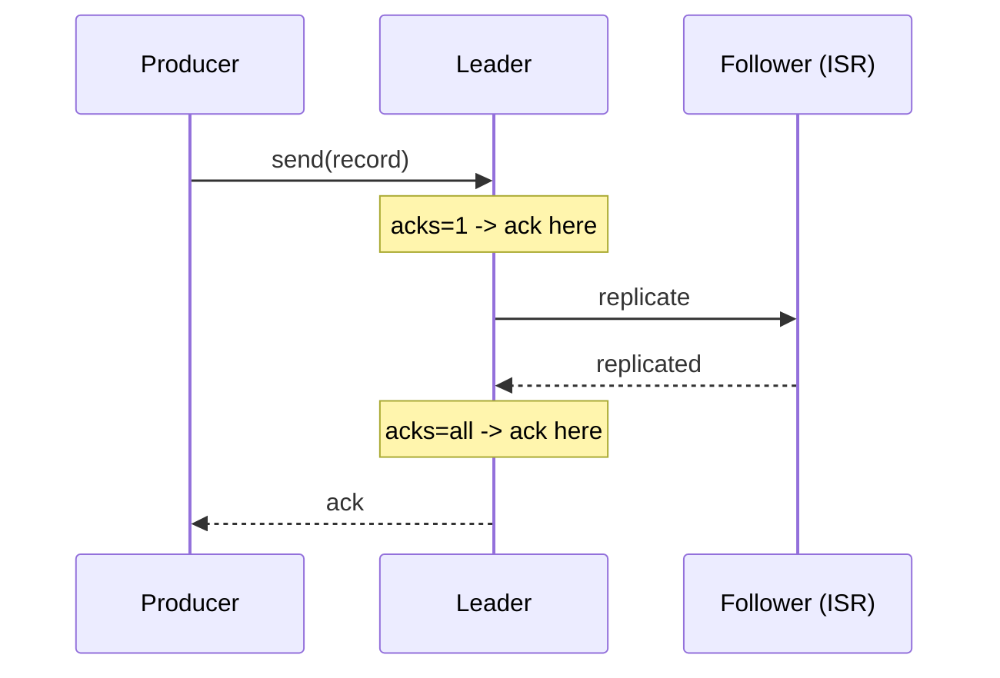

# Producers

### Producer Architecture

Internally, the Kafka producer client is built around a few cooperating pieces: the application thread that calls `send()`, an in-memory **record accumulator** that batches records per partition, and a background **Sender** thread that drains those batches and transmits them to the appropriate broker over the network. This architecture is what allows `send()` to return almost immediately (asynchronously) while still achieving high throughput through batching and compression.

When `send()` is called, the record is serialized, assigned a partition (via the partitioner), and appended to the accumulator's per-partition batch; the Sender thread flushes batches either when they hit `batch.size`, when `linger.ms` elapses, or when explicitly flushed. Responses (including retries and errors) are handled asynchronously and surfaced to the caller via a `Future<RecordMetadata>` or an optional callback.

Understanding this pipeline is important for tuning throughput vs. latency: increasing `linger.ms` and `batch.size` improves throughput and compression efficiency at the cost of added per-record latency, while decreasing them favors low latency at the cost of smaller, less efficient batches.


**Real-life scenario:** A high-throughput analytics pipeline tunes `linger.ms=20` and `batch.size=64KB` to trade a small amount of per-record latency for significantly better compression ratios and network efficiency.

**Interview Questions:**
- What two components handle batching and network transmission inside the producer client? — The record accumulator (batching) and the Sender thread (transmission).
- How does `linger.ms` affect throughput vs. latency? — Higher values allow bigger batches (better throughput/compression) at the cost of added latency per record.
- Is `KafkaProducer.send()` blocking? — No, it's asynchronous by default, returning a `Future`.

### Producer Configuration

Producer configuration governs correctness, performance, and durability trade-offs, and a handful of settings come up constantly in interviews: `bootstrap.servers` (initial cluster contact points), `acks` (durability level), `retries`/`delivery.timeout.ms` (resilience), `enable.idempotence` (exactly-once per-partition semantics), `batch.size`/`linger.ms` (batching), `compression.type`, `key.serializer`/`value.serializer`, and `max.in.flight.requests.per.connection`.

In Spring Boot, these map directly to `spring.kafka.producer.*` properties or programmatically via a `Map<String, Object>` passed to `DefaultKafkaProducerFactory`, giving teams a single place to standardize producer behavior across an application.

A well-configured production producer typically combines `acks=all`, `enable.idempotence=true`, and sensible retry/timeout settings to get strong durability without sacrificing much throughput, since modern brokers and clients are optimized to make this combination performant by default.

```yaml
# application.yml
spring:
  kafka:
    bootstrap-servers: localhost:9092
    producer:
      acks: all
      retries: 5
      properties:
        enable.idempotence: true
        max.in.flight.requests.per.connection: 5
        linger.ms: 10
        compression.type: snappy
      key-serializer: org.apache.kafka.common.serialization.StringSerializer
      value-serializer: org.springframework.kafka.support.serializer.JsonSerializer
```

**Real-life scenario:** A new engineer accidentally leaves `acks=1` (the client default in older versions) in production config, causing occasional silent data loss during leader failover — a code review catches it and standardizes on `acks=all` cluster-wide.

**Interview Questions:**
- What producer settings together provide strong durability guarantees? — `acks=all` combined with the topic's `min.insync.replicas`.
- How are producer settings configured in a Spring Boot application? — Via `spring.kafka.producer.*` properties or a custom `ProducerFactory` bean.
- What does `enable.idempotence=true` protect against? — Duplicate records caused by producer-side retries.

### Producer Acknowledgements (acks)

The `acks` setting controls how many replicas must confirm receipt of a record before the producer considers the write successful. `acks=0` means fire-and-forget (no confirmation, fastest, risk of silent loss); `acks=1` means only the partition leader must persist the record before acking (fast, but data can be lost if the leader fails before followers replicate it); `acks=all` (equivalent to `acks=-1`) means all current in-sync replicas must acknowledge, giving the strongest durability guarantee when combined with `min.insync.replicas`.

This setting is one of the most fundamental levers for the classic throughput-vs-durability trade-off in Kafka: `acks=0` maximizes throughput/minimizes latency at the cost of safety, while `acks=all` maximizes safety at some cost to latency (though modern Kafka minimizes this cost significantly).

For any data where loss is unacceptable — payments, orders, audit logs — `acks=all` paired with `min.insync.replicas>=2` and `enable.idempotence=true` is the standard production recipe.

```java
config.put(ProducerConfig.ACKS_CONFIG, "all");
```



**Real-life scenario:** A payment-processing service switches from the client default to `acks=all` after a post-mortem revealed a handful of transaction events were silently lost during a leader failover under `acks=1`.

**Interview Questions:**
- What are the three possible values of `acks` and their trade-offs? — `0` (no ack, fastest, riskiest), `1` (leader only), `all`/`-1` (all ISR, safest).
- Which `acks` setting can lose data on leader failure even though the producer got an ack? — `acks=1`.
- What other setting must be tuned alongside `acks=all` to avoid a false sense of durability? — `min.insync.replicas`.

### Batching

Batching is the producer's strategy of grouping multiple records destined for the same partition into a single network request, dramatically improving throughput by amortizing network and per-request overhead, and improving compression efficiency (compressing a batch of similar records together compresses better than compressing them individually). Batching is controlled primarily by `batch.size` (max bytes per batch) and `linger.ms` (max time to wait for a batch to fill before sending anyway).

There's an inherent trade-off: larger batches and longer linger times increase throughput and compression ratio but add latency to each individual record (since it waits in the batch before being sent); very latency-sensitive applications may deliberately keep `linger.ms` low (or 0) at some throughput cost.

Batching happens transparently inside the producer client — application code just calls `send()` per record, and the client's record accumulator handles grouping records into batches per partition automatically.

```properties
batch.size=32768
linger.ms=15
compression.type=lz4
```

**Real-life scenario:** A metrics ingestion pipeline handling millions of events/sec tunes `linger.ms=25` and a larger `batch.size`, cutting broker-side CPU and network usage substantially compared to sending each metric as an individual uncompressed request.

**Interview Questions:**
- What two settings primarily control batching behavior? — `batch.size` and `linger.ms`.
- Why does batching improve compression efficiency? — Compressing many similar records together achieves a better ratio than compressing each individually.
- What's the cost of increasing `linger.ms`? — Added latency per record, since it waits longer for the batch to fill before being sent.

### Compression

Kafka supports compressing record batches on the producer side (`compression.type`: `none`, `gzip`, `snappy`, `lz4`, or `zstd`) to reduce network bandwidth and broker storage, with the broker typically storing and forwarding the compressed batch as-is (avoiding recompression) and consumers decompressing on read. Compression operates on whole batches, not individual records, which is why bigger batches tend to compress better.

Different codecs trade off CPU cost against compression ratio: `gzip` compresses the most but is the slowest/most CPU-intensive; `lz4` and `snappy` are fast with moderate compression, good defaults for high-throughput systems; `zstd` (newer) often gives the best balance of ratio and speed for many workloads.

Compression is one of the easiest, highest-leverage production tuning changes — enabling `lz4` or `zstd` on a previously uncompressed high-volume topic often cuts network/storage costs substantially with minimal downside.

```properties
compression.type=zstd
```

**Real-life scenario:** A logging pipeline enables `compression.type=lz4` on its high-volume `app-logs` topic, cutting inter-broker replication network traffic and disk usage by more than half with negligible CPU overhead.

**Interview Questions:**
- Does Kafka compress individual records or whole batches? — Whole batches, which is also why larger batches compress more efficiently.
- Which compression codec typically offers the best speed/ratio balance for modern workloads? — `zstd` (with `lz4`/`snappy` as fast alternatives).
- Do brokers decompress and recompress data during replication/storage? — No, generally brokers store and forward the compressed batch as-is; decompression happens on the consumer side.

### Retries

Retries govern how the producer handles transient send failures (e.g., `NotLeaderForPartitionException`, timeouts) by automatically resending the record rather than failing immediately. Configured via `retries` (max attempts, effectively very high/unbounded by default in modern clients) and bounded overall by `delivery.timeout.ms` (the total time budget across all attempts before giving up entirely).

A well-known pitfall: without the idempotent producer enabled, retries with multiple in-flight requests (`max.in.flight.requests.per.connection > 1`) can cause **duplicate** or **out-of-order** records if an earlier batch's retry succeeds after a later batch already landed. Enabling `enable.idempotence=true` fixes both problems safely by having the broker deduplicate retried batches using producer ID + sequence numbers, without forcing you to sacrifice in-flight parallelism.

Retries should be paired with sensible timeout settings (`request.timeout.ms`, `delivery.timeout.ms`) so that a persistently unreachable cluster fails fast enough for the application to handle it (e.g., circuit breaker, fallback) rather than blocking indefinitely.

```properties
retries=2147483647
delivery.timeout.ms=120000
enable.idempotence=true
```

**Real-life scenario:** During a brief network blip between a producer and the cluster, transient send failures are automatically retried and succeed within the `delivery.timeout.ms` budget, with no duplicate or reordered records thanks to idempotence being enabled.

**Interview Questions:**
- What problem can retries introduce if idempotence is disabled? — Duplicate or out-of-order records when retried batches interleave with later successful batches.
- What setting bounds the total time budget across all retry attempts? — `delivery.timeout.ms`.
- How does enabling idempotence make retries with multiple in-flight requests safe? — The broker deduplicates using producer ID + sequence number, preserving order and preventing duplicates.

### Idempotent Producer

An idempotent producer (`enable.idempotence=true`) guarantees that retried sends of the same record batch are not duplicated on the broker side, achieved by assigning each producer a unique **Producer ID (PID)** and tagging each batch with a monotonically increasing **sequence number** per partition; the broker tracks the last committed sequence number per PID/partition and silently drops/deduplicates a retry that matches an already-committed sequence.

This gives **exactly-once semantics per partition, per producer session** for the write path (not to be confused with full end-to-end exactly-once processing, which additionally requires transactions to span reads+writes atomically, e.g., in Kafka Streams or transactional producer/consumer patterns). Idempotence is effectively "free" — it doesn't reduce throughput meaningfully — which is why it's recommended to enable by default in nearly all production producers.

Enabling idempotence automatically enforces `acks=all` and `max.in.flight.requests.per.connection<=5`, since these are required preconditions for the deduplication guarantee to hold correctly.

```properties
enable.idempotence=true
# acks is forced to 'all' automatically when idempotence is enabled
```

**Real-life scenario:** A billing service enables idempotent producers so that a network blip causing a retry never results in a customer being double-charged due to a duplicate `PaymentProcessed` event landing twice.

**Interview Questions:**
- How does Kafka implement idempotent producers under the hood? — Via a Producer ID (PID) and per-partition sequence numbers that the broker uses to detect and drop duplicate retries.
- What acks setting does enabling idempotence require? — `acks=all`, enforced automatically.
- Does the idempotent producer guarantee exactly-once across multiple partitions or topics? — No, only exactly-once per partition per producer session; cross-partition atomicity requires transactions.

### Transactions

Kafka transactions allow a producer to write to multiple partitions/topics **atomically** — either all the writes in the transaction become visible to consumers (with `isolation.level=read_committed`), or none do — and can also atomically combine a consume-process-produce cycle by committing consumer offsets as part of the same transaction. This is the foundation of Kafka's **exactly-once semantics (EOS)** for stream processing pipelines (heavily used internally by Kafka Streams).

Transactions require a stable `transactional.id` per producer instance (used to fence off zombie producer instances after a crash/restart, so an old instance can't accidentally commit stale writes), and idempotence is implicitly required/enabled as part of using transactions.

Consumers must set `isolation.level=read_committed` to only see committed transactional writes (the default, `read_uncommitted`, would let them see writes from transactions that later abort) — a subtlety that's an easy trap in interviews and in real production configs.

```java
config.put(ProducerConfig.TRANSACTIONAL_ID_CONFIG, "order-processor-1");
KafkaProducer<String, String> producer = new KafkaProducer<>(config);
producer.initTransactions();

try {
    producer.beginTransaction();
    producer.send(new ProducerRecord<>("orders", orderId, orderJson));
    producer.send(new ProducerRecord<>("audit-log", orderId, auditJson));
    producer.commitTransaction();
} catch (Exception e) {
    producer.abortTransaction();
}
```

**Real-life scenario:** An order-processing stream reads from `raw-orders`, transforms and writes to `validated-orders` plus commits its consumer offset, all within a single Kafka transaction — guaranteeing that if the process crashes mid-way, the partial output is never visible and no data is double-processed on restart.

**Interview Questions:**
- What consumer setting is required to only see committed transactional writes? — `isolation.level=read_committed`.
- What is the purpose of `transactional.id`? — To fence off zombie producer instances and maintain transactional state across restarts.
- What Kafka feature commonly relies on transactions internally? — Kafka Streams' exactly-once processing guarantee.

### Message Keys

(See also "Partition Keys" above.) Beyond routing to a partition, message keys carry semantic meaning throughout the Kafka ecosystem: they define the compaction unit in log-compacted topics, they're commonly used in Kafka Streams for co-partitioning joins/aggregations (`KStream`-`KTable` joins require matching keys and partition counts), and they often double as a natural identifier for logging/debugging/tracing a specific entity's event flow.

Choosing `null` as a key is a valid and common choice for genuinely independent events, resulting in round-robin/sticky distribution; choosing a key is required whenever ordering or co-partitioning matters. Keys are serialized independently from values (via `key.serializer`), commonly as a simple `String`/`Long`, though composite/Avro keys are also used in more advanced schemas.

A frequent real-world mistake is using a highly unique but semantically meaningless key (e.g., a random UUID per message) when the goal is actually just "even distribution" — that's better served by no key at all, since a UUID key defeats the purpose of any ordering relationship while adding partitioner overhead.

```java
// Correct: keyed by entity id
kafkaTemplate.send("orders", orderId, orderEvent);

// Anti-pattern: random UUID key when no ordering relationship is needed
kafkaTemplate.send("orders", UUID.randomUUID().toString(), orderEvent);
```

**Real-life scenario:** A stream-processing job joining `orders` (keyed by `orderId`) with `payments` (also keyed by `orderId`) relies on both topics being co-partitioned by the same key and partition count, which is only possible because both producers deliberately used the same key strategy.

**Interview Questions:**
- What Kafka Streams requirement depends directly on consistent message keys? — Co-partitioning for stream-table or stream-stream joins.
- What happens if you send a record with a `null` key? — It's distributed round-robin/sticky across partitions rather than by hash.
- Why is a random UUID often a poor key choice? — It defeats any ordering/co-partitioning benefit while adding unnecessary partitioner hashing overhead.

### Message Headers

Headers are optional key-value metadata pairs attached to a Kafka record, separate from the key and value payload, used to carry cross-cutting information like `event-type`, `correlation-id`, `trace-id`, content-type, schema version, or tenant ID — without polluting the actual business payload schema. Headers are lightweight (`byte[]` values) and can be read/written without deserializing the full record value.

Headers are especially useful for distributed tracing (propagating a `traceparent`/`correlation-id` header across service boundaries so logs/traces can be stitched together) and for routing/filtering logic in consumers or Kafka Streams topologies that need metadata without paying the cost of full value deserialization.

Spring Kafka exposes headers conveniently via the `@Header` annotation in `@KafkaListener` methods, or via the `Message<T>`/`ConsumerRecord` APIs for more manual control.

```java
// Producing with headers
ProducerRecord<String, OrderEvent> record = new ProducerRecord<>("order-events", orderId, event);
record.headers().add("correlation-id", correlationId.getBytes(StandardCharsets.UTF_8));
kafkaTemplate.send(record);

// Consuming with headers
@KafkaListener(topics = "order-events")
public void consume(@Payload OrderEvent event,
                     @Header("correlation-id") String correlationId) {
    log.info("Processing {} with correlation {}", event, correlationId);
}
```

**Real-life scenario:** A microservices platform propagates a `correlation-id` header through every Kafka event so that a single customer request can be traced end-to-end across five different services in their centralized logging/tracing system.

**Interview Questions:**
- What kind of data belongs in headers rather than the record value? — Cross-cutting metadata like correlation IDs, trace IDs, or event type, not core business payload data.
- How can consumers access a specific header in Spring Kafka? — Via the `@Header` annotation on a `@KafkaListener` method parameter.
- Why are headers useful for distributed tracing? — They let trace/correlation IDs propagate across service boundaries without altering the business payload schema.

### Serialization

Serialization converts a Java object (key or value) into bytes for transmission and storage, and deserialization reverses the process on the consumer side; Kafka requires configuring both `key.serializer`/`value.serializer` (producer) and matching `key.deserializer`/`value.deserializer` (consumer). Common choices include `StringSerializer`, `JsonSerializer`/`JsonDeserializer` (Spring Kafka, using Jackson), and schema-based formats like Avro or Protobuf paired with a **Schema Registry** for enforced, evolvable contracts between producers and consumers.

Schema-based serialization (Avro/Protobuf + Schema Registry) is strongly preferred in larger production systems because it provides compile-time/runtime type safety, enforces backward/forward-compatible schema evolution, and avoids the classic "consumer breaks because producer added/removed a JSON field" problem that plain JSON serialization doesn't protect against.

A very common pitfall in polyglot/Spring Kafka setups is type mismatches when `JsonDeserializer` tries to deserialize into a specific target class but the producer's payload doesn't match — configuring `spring.json.trusted.packages` and explicit type mapping headers helps avoid runtime deserialization errors and security issues (unrestricted deserialization of arbitrary classes is itself a security risk).

```java
// Producer
config.put(ProducerConfig.VALUE_SERIALIZER_CLASS_CONFIG, JsonSerializer.class);

// Consumer
config.put(ConsumerConfig.VALUE_DESERIALIZER_CLASS_CONFIG, JsonDeserializer.class);
config.put(JsonDeserializer.TRUSTED_PACKAGES, "com.example.events");
config.put(JsonDeserializer.VALUE_DEFAULT_TYPE, OrderPlacedEvent.class.getName());
```

**Real-life scenario:** A large e-commerce platform migrates from plain JSON to Avro with a Schema Registry after repeated production incidents where a producer team silently changed a field type, breaking multiple downstream consumers without warning.

**Interview Questions:**
- Why is schema-based serialization (Avro/Protobuf) often preferred over plain JSON in large systems? — It enforces compile/runtime-checked, evolvable contracts and prevents silent breaking changes between producers and consumers.
- What Spring Kafka setting restricts which classes `JsonDeserializer` is allowed to instantiate? — `spring.json.trusted.packages` (or `JsonDeserializer.TRUSTED_PACKAGES`).
- What's a security risk of unrestricted deserialization? — Deserializing arbitrary/untrusted classes can lead to remote code execution or denial-of-service vulnerabilities.

### Producer Interceptors

A `ProducerInterceptor` is a pluggable hook (implementing `org.apache.kafka.clients.producer.ProducerInterceptor`) that lets you intercept and optionally mutate records before they're sent (`onSend`), and observe the result after acknowledgment or failure (`onAcknowledgement`), without changing the core producer application code. Interceptors are configured via `interceptor.classes` and are chained if multiple are configured.

Common use cases include cross-cutting concerns like adding standardized headers (correlation ID, timestamp), metrics/monitoring (measuring send latency or error rates), and auditing/logging — the same kind of AOP-style cross-cutting logic Spring developers are already familiar with from AOP interceptors/aspects.

Interceptors should be kept lightweight and side-effect-safe since they run synchronously in the calling thread's send path (for `onSend`) — throwing exceptions or doing slow blocking work inside an interceptor can degrade producer performance or even break sends.

```java
public class MetricsProducerInterceptor implements ProducerInterceptor<String, Object> {
    @Override
    public ProducerRecord<String, Object> onSend(ProducerRecord<String, Object> record) {
        record.headers().add("produced-at", Instant.now().toString().getBytes());
        return record;
    }
    @Override
    public void onAcknowledgement(RecordMetadata metadata, Exception exception) {
        if (exception != null) metricsRegistry.incrementCounter("producer.errors");
    }
    @Override public void configure(Map<String, ?> configs) {}
    @Override public void close() {}
}
```

```properties
interceptor.classes=com.example.MetricsProducerInterceptor
```

**Real-life scenario:** A platform team adds a producer interceptor across all services to automatically tag every outgoing record with a `produced-at` timestamp header and emit a metric on send failures, without requiring every team to duplicate that logic.

**Interview Questions:**
- What two lifecycle methods does a `ProducerInterceptor` implement? — `onSend()` (before sending) and `onAcknowledgement()` (after the result is known).
- Give a practical cross-cutting use case for producer interceptors. — Adding standardized headers, metrics, or audit logging without modifying business logic.
- What risk does putting slow/blocking logic inside `onSend` introduce? — It runs synchronously in the send path and can degrade producer throughput/latency.

