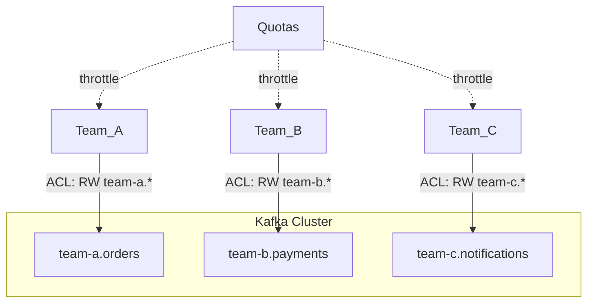

# Quotas and Multi-Tenancy

### Client Quotas

Client quotas let a Kafka cluster limit the byte-rate (produce/fetch bandwidth) or request-rate a given client (identified by `client.id` and/or authenticated user principal) can consume, preventing any single misbehaving or overly aggressive client from starving others sharing the cluster. Two main quota types exist: **network bandwidth quotas** (`producer_byte_rate`, `consumer_byte_rate`) and **request rate quotas** (CPU time spent processing a client's requests, covered next).

Quotas are configured dynamically via `kafka-configs.sh` against `--entity-type users` and/or `--entity-type clients`, and can be scoped per-user, per-client-id, per-user-and-client-id, or as a cluster-wide default. When a client exceeds its quota, the broker doesn't reject the request — instead it throttles by delaying the response, and exposes throttle time via metrics/response so well-behaved clients can back off gracefully.

```bash
kafka-configs.sh --bootstrap-server localhost:9092 \
  --alter --add-config 'producer_byte_rate=1048576,consumer_byte_rate=2097152' \
  --entity-type users --entity-name svc-orders
```

**Real-life scenario:** A shared multi-tenant Kafka cluster caps each tenant service to 1MB/s produce throughput so one tenant's traffic burst can't degrade latency for every other tenant on the same brokers.

**Interview Questions**
- What are the two broad categories of Kafka client quotas? — Network bandwidth quotas (`producer_byte_rate`/`consumer_byte_rate`) and request rate quotas (percentage of broker thread time).
- How does a broker enforce a quota — does it reject or throttle requests? — It throttles — delaying responses to clients that exceed their quota rather than rejecting the requests outright.
- How would you set a quota for a specific user + client-id combination? — Use `kafka-configs.sh --alter --add-config` with `--entity-type users --entity-name <user> --entity-type clients --entity-name <client-id>` to scope the quota to that exact user-and-client-id pair.

### Request Rate Quotas

Request rate quotas limit the percentage of broker request-handler/network thread time a client (or user) is allowed to consume, expressed as a percentage (e.g., `request_percentage=25` means up to 25% of a thread's capacity). This protects against CPU-bound abuse that byte-rate quotas alone wouldn't catch — for example, a client sending a huge volume of tiny requests (lots of `Metadata` or `Fetch` calls with little data each) can burn CPU/thread time disproportionately to the bytes transferred.

Like byte-rate quotas, exceeding the request-rate quota causes the broker to throttle (delay) responses rather than reject them outright, giving misbehaving clients backpressure instead of hard failures.

```bash
kafka-configs.sh --bootstrap-server localhost:9092 \
  --alter --add-config 'request_percentage=25' \
  --entity-type users --entity-name svc-orders
```

**Real-life scenario:** A buggy consumer polling in a tight loop with `fetch.max.wait.ms=0` overwhelms broker request-handler threads; a request rate quota throttles it, protecting other tenants without needing a code fix immediately.

**Interview Questions**
- Why are request rate quotas needed in addition to byte-rate quotas? — Some abusive behavior burns CPU/thread time disproportionately to bytes transferred (e.g., many small requests), which byte-rate quotas wouldn't detect since the total data volume looks small.
- What does a `request_percentage` value represent? — The percentage of a broker request-handler/network thread's capacity a client is allowed to consume.
- What kind of client behavior does a byte-rate quota fail to catch but a request-rate quota catches? — A client issuing a very high volume of tiny requests (e.g., aggressive polling with little data per call) — low bytes transferred but high CPU/thread overhead from processing so many requests.

### Multi-Tenancy

Multi-tenancy means multiple teams, applications, or even external customers share a single Kafka cluster (or a small number of clusters) instead of each getting a dedicated cluster. It reduces operational overhead and infrastructure cost but introduces the challenge of isolating tenants from each other's failures, traffic spikes, and security boundaries.

Kafka supports multi-tenancy through a combination of the primitives already covered: **naming conventions/topic prefixes** (e.g., `team-a.orders`) for organizational clarity, **ACLs** to restrict each tenant to its own topics/consumer groups, **quotas** to prevent noisy-neighbor resource contention, and sometimes **separate listeners or even KRaft/ZooKeeper isolation** for stricter tenants. Some organizations also isolate tenants using resource-level tagging and per-tenant monitoring dashboards built from topic/consumer-group metrics.

The trade-off is real: shared clusters are cheaper and simpler to operate than one cluster per team, but require disciplined governance (naming standards, quota defaults, ACL review processes) to avoid one tenant's mistake (e.g., creating thousands of topics, or a runaway producer) degrading the whole cluster.



**Real-life scenario:** A platform team runs one shared Kafka cluster for the whole company; each department gets a topic-name prefix, dedicated ACLs, and default quotas so no single team can monopolize brokers or read another team's data.

**Advantages**
- Lower infrastructure and operational cost vs. per-team dedicated clusters
- Centralized monitoring/governance

**Disadvantages**
- Noisy-neighbor risk without proper quotas
- Harder blast-radius containment — a cluster-wide incident (e.g., disk full) affects every tenant
- Requires strong naming/ACL governance to avoid chaos

**Interview Questions**
- What Kafka primitives combine to enable safe multi-tenancy? — Topic naming conventions/prefixes, ACLs scoping each tenant to its own topics/consumer groups, and quotas to prevent noisy-neighbor resource contention.
- What's the main risk of multi-tenancy and how do quotas mitigate it? — A noisy or misbehaving tenant can monopolize shared broker resources and degrade performance for everyone else; quotas cap each tenant's byte-rate/request-rate so no single tenant can exceed its fair share.
- When would you choose dedicated clusters per team instead of a shared multi-tenant cluster? — When a team has strict compliance/isolation requirements, needs to avoid any blast-radius risk from other tenants, or has traffic patterns/scale that would dominate a shared cluster regardless of quotas.

