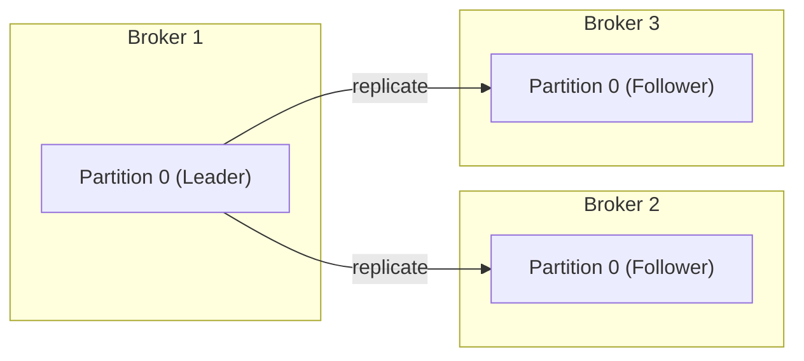
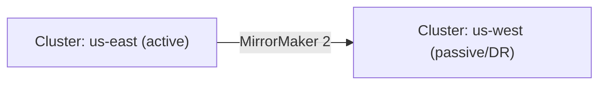

# Reliability

### High Availability

High Availability (HA) in Kafka means the cluster keeps serving reads/writes even when individual brokers fail, achieved primarily through partition replication: each partition has a leader (serves all reads/writes) and one or more followers (replicate the leader's log) distributed across different brokers. If the leader broker fails, one of the in-sync replicas (ISRs) is automatically elected as the new leader, and clients transparently reconnect to it.

Interviewers expect you to connect HA directly to configuration knobs: `replication.factor` (how many copies of each partition exist), `min.insync.replicas` (how many replicas must acknowledge a write for it to be considered "committed" when `acks=all`), and `unclean.leader.election.enable` (whether a non-in-sync replica can become leader, trading availability for potential data loss).



**Real-life scenario:** With `replication.factor=3` and `min.insync.replicas=2`, losing one broker in a 3-broker cluster doesn't interrupt producers or consumers — a follower is promoted to leader automatically and writes continue.

**Interview Questions**
- What is the relationship between `replication.factor`, `min.insync.replicas`, and `acks=all`? — `replication.factor` sets how many total copies of a partition exist; `min.insync.replicas` sets how many of those must be in-sync for a write to succeed under `acks=all`, so together they define the minimum durability guarantee a producer can rely on.
- What happens if the leader for a partition fails and no in-sync replica is available? — The partition becomes unavailable for writes (and reads) unless `unclean.leader.election.enable=true`, in which case an out-of-sync replica can be elected leader at the cost of potential data loss.
- What does `unclean.leader.election.enable=true` trade off, and why is it usually disabled in production? — It trades durability for availability by allowing a non-in-sync replica to become leader (losing any messages it hadn't yet replicated); it's usually disabled because silent data loss is normally worse than brief unavailability.

### Disaster Recovery

Disaster Recovery (DR) for Kafka addresses the scenario where an entire cluster (or datacenter/region) becomes unavailable — beyond what in-cluster replication can handle. The standard approach is running a secondary Kafka cluster in a different region/datacenter and continuously replicating data to it using a cross-cluster replication tool (typically **MirrorMaker 2**), so applications can fail over to the secondary cluster if the primary is lost entirely.

This matters in interviews as the natural follow-up to "what if the whole cluster/region goes down, not just one broker?" — testing whether candidates understand DR operates at a different layer than in-cluster replication (which only protects against individual broker failures, not full cluster/region loss), and that DR introduces its own challenges: offset translation between clusters, replication lag, and failover/failback runbooks.

**Real-life scenario:** A financial services company runs an active-passive Kafka DR setup across two AWS regions using MirrorMaker 2; during a regional outage, consumers are redirected to the DR cluster's replicated topics with a documented runbook for offset translation.

**Interview Questions**
- How does disaster recovery differ from in-cluster replication (`replication.factor`)? — In-cluster replication only protects against individual broker failures within one cluster; DR protects against the loss of the entire cluster or region by maintaining a separately replicated cluster elsewhere.
- What tool is commonly used to replicate data between Kafka clusters in different regions? — MirrorMaker 2 (MM2).
- What complications arise when failing over consumers from a primary to a DR cluster (hint: offsets)? — Offsets on the DR cluster aren't identical to the primary's, so consumers need translated/checkpointed offsets (which MM2 provides) to resume near the correct position instead of reprocessing everything or skipping data.

### Rack Awareness

Rack awareness lets Kafka distribute partition replicas across different physical racks (or, in the cloud, different availability zones) by tagging each broker with a `broker.rack` identifier, so the replica-placement algorithm avoids putting all replicas of a partition on brokers that could fail together (same rack/power/network segment). Without rack awareness, Kafka might, by chance, place all 3 replicas of a partition in the same AZ — meaning a single AZ outage could take down every replica of that partition simultaneously.

Interviewers ask about this to test cloud-deployment awareness: rack awareness is essential for genuinely fault-tolerant deployments in AWS/GCP/Azure, where `broker.rack` is typically set to the availability zone, ensuring replicas spread across AZs and survive a single-AZ outage.

```properties
# broker configuration (server.properties)
broker.rack=us-east-1a
```

**Real-life scenario:** By setting `broker.rack` to each broker's actual AZ, a team ensures that a partition with `replication.factor=3` always has its replicas spread across 3 different AZs, so a single AZ failure never takes out more than one replica.

**Interview Questions**
- What problem does rack awareness solve that plain replication doesn't? — Plain replication only guarantees copies exist on different brokers, not that those brokers are in physically/logically independent failure domains; rack awareness ensures replicas spread across racks/AZs so one failure domain going down doesn't take out every replica.
- How would you configure `broker.rack` in a cloud deployment across 3 availability zones? — Set each broker's `broker.rack` property to its actual AZ identifier (e.g. `us-east-1a`, `us-east-1b`, `us-east-1c`) so the replica placement algorithm spreads replicas across all three.
- What could go wrong if all replicas of a partition ended up in the same rack/AZ? — A single AZ outage could take down every replica of that partition simultaneously, causing full unavailability or data loss despite having a healthy-looking replication factor.

### Multi-Cluster Replication (Overview)

Multi-cluster replication is the practice of copying topic data between two or more independent Kafka clusters — for disaster recovery, geo-locality (serving reads closer to users in each region), regulatory data residency, or aggregating data from many edge clusters into a central analytics cluster. It's distinct from in-cluster partition replication: multi-cluster replication treats each cluster as an independent unit with its own brokers, ZooKeeper/KRaft controllers, and topic metadata, connected via an external replication tool.

Interviewers ask about this at a conceptual level to see if you understand the common topologies: **active-passive** (one cluster serves traffic, the other is a DR standby), **active-active** (both clusters serve traffic, with bidirectional replication), and **aggregation** (many regional clusters replicate into one central cluster).



**Real-life scenario:** A global SaaS company runs regional Kafka clusters in each geography for low producer latency, while replicating all topics into one central cluster for cross-region analytics.

**Interview Questions**
- What are the main reasons a company would run multiple Kafka clusters instead of one large cluster? — Disaster recovery, geo-locality/latency for regional users, regulatory data residency requirements, and isolating blast radius between teams/environments.
- What's the difference between active-passive and active-active multi-cluster topologies? — Active-passive has one cluster serving live traffic while the other is a replicated standby for failover; active-active has both clusters serving traffic concurrently with bidirectional replication.
- What challenges arise with active-active replication (hint: conflict/loop prevention)? — Preventing infinite replication loops (a message replicated back and forth forever) and handling conflicting writes to the same entity from both clusters, typically addressed via topic renaming conventions and careful key/ownership partitioning.

### MirrorMaker 2 (Overview)

MirrorMaker 2 (MM2) is Kafka's official tool for replicating topics, consumer offsets, and ACLs between clusters, built on top of the Kafka Connect framework (it ships `MirrorSourceConnector`, `MirrorCheckpointConnector`, and `MirrorHeartbeatConnector`). Unlike the original MirrorMaker, MM2 supports active-active replication, automatic topic renaming to avoid collisions (e.g. `us-east.orders` on the target cluster), and — critically — offset translation, so a consumer failing over to the replica cluster can resume from roughly the equivalent position instead of starting from the beginning or end.

Interviewers ask about MM2 to confirm hands-on familiarity with Kafka's DR tooling, and to test whether you know it's built on Connect (so it inherits Connect's distributed-mode fault tolerance and REST API management) rather than being a bespoke standalone tool.

```properties
# mm2.properties
clusters = primary, secondary
primary.bootstrap.servers = primary-kafka:9092
secondary.bootstrap.servers = secondary-kafka:9092
primary->secondary.enabled = true
primary->secondary.topics = orders.*
sync.topic.acls.enabled = false
```

**Real-life scenario:** During a primary-region outage, consumers reconnect to the secondary cluster and use MM2's translated offsets (via `MirrorCheckpointConnector`) to resume close to where they left off, instead of reprocessing the entire topic from the start.

**Interview Questions**
- What Kafka Connect components does MirrorMaker 2 build on internally? — It's implemented as a set of Kafka Connect connectors: `MirrorSourceConnector` (replicates data), `MirrorCheckpointConnector` (replicates/translates consumer offsets), and `MirrorHeartbeatConnector` (tracks replication health/lag).
- How does MM2 handle offset translation when a consumer fails over to a replica cluster? — `MirrorCheckpointConnector` maintains a mapping between source and target cluster offsets, letting a failed-over consumer resume from an equivalent position on the target cluster instead of the beginning or end.
- How does MM2's topic-renaming convention help avoid replication loops in active-active setups? — By prefixing replicated topics with the source cluster's alias (e.g. `us-east.orders`), MM2 can distinguish locally-produced topics from replicated ones and avoid re-replicating a topic back to where it came from.

