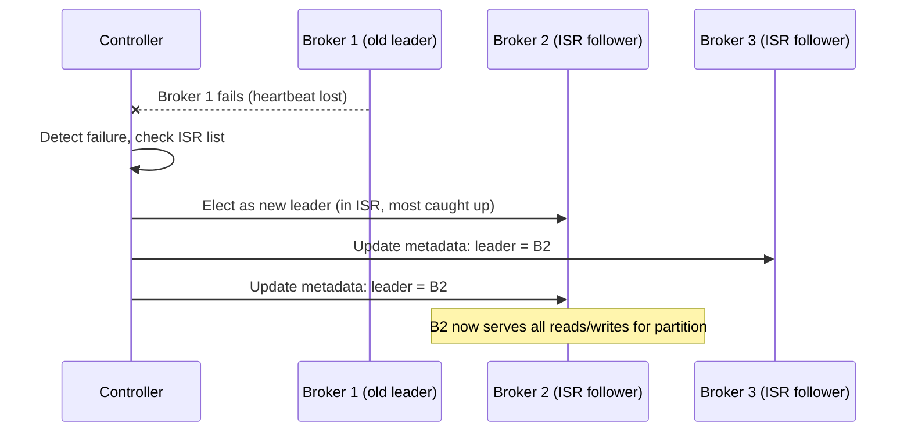
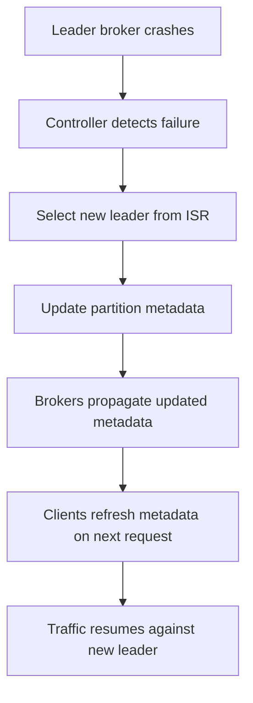
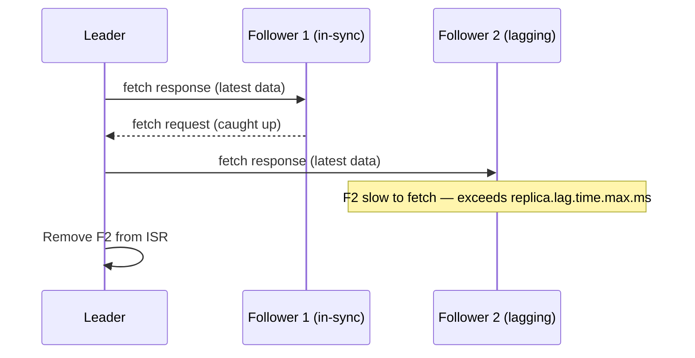
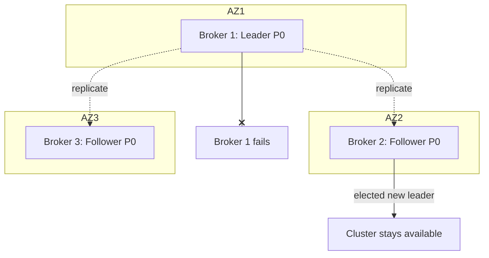
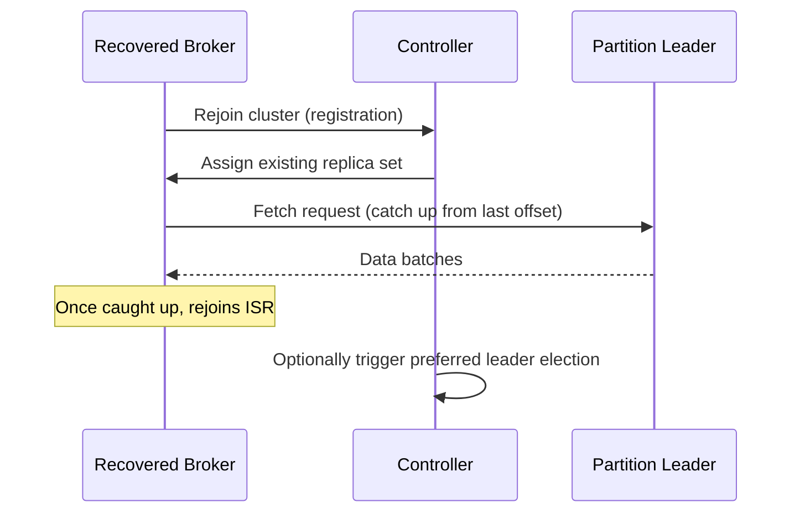
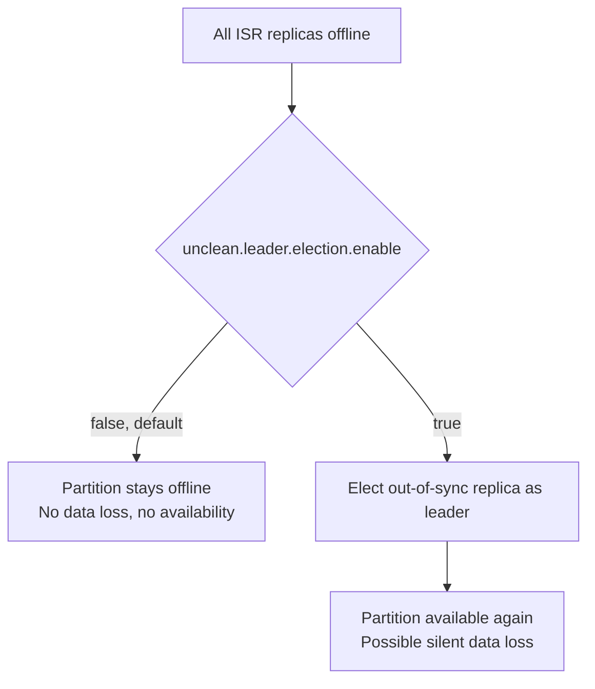

# Replication and Fault Tolerance

### Replication Factor

Replication factor (RF) is the number of copies of each partition Kafka maintains across different brokers. An RF of 3 means every partition has one leader and two follower replicas, each on a different broker (ideally in different racks/availability zones). This is the primary mechanism Kafka uses to survive broker failures without losing data.

RF is set per-topic (`--replication-factor`) and interacts closely with the `min.insync.replicas` and `acks` producer setting: with `acks=all` and `min.insync.replicas=2` on an RF=3 topic, a write is only acknowledged once it's durably stored on at least 2 of the 3 replicas, tolerating the loss of 1 broker without data loss.

```bash
kafka-topics.sh --create --topic orders --partitions 6 --replication-factor 3 \
  --bootstrap-server localhost:9092
```

```properties
min.insync.replicas=2
acks=all
```

**Real-life scenario:** A production cluster spanning 3 availability zones sets RF=3 (one replica per AZ) so that losing an entire AZ doesn't cause data loss or downtime for that topic.

**Advantages**
- Higher RF tolerates more simultaneous broker failures without data loss.
- Works transparently with leader election for automatic failover.

**Disadvantages**
- Higher RF increases storage cost and network replication traffic proportionally.
- Doesn't help if `acks`/`min.insync.replicas` aren't configured to actually require replica acknowledgment.

**Interview Questions**
- If RF=3 and `min.insync.replicas=2`, how many broker failures can you tolerate without losing availability for writes? — One broker failure — with 2 remaining replicas still able to satisfy `min.insync.replicas=2`; a second failure would drop below the threshold and block writes.
- What's the relationship between replication factor and `acks=all`? — `acks=all` makes the producer wait for acknowledgment from all in-sync replicas (bounded by `min.insync.replicas`), so a higher replication factor gives `acks=all` more redundant copies to durably acknowledge against before failure tolerance is exhausted.
- What are the storage/network cost tradeoffs of increasing replication factor? — Each additional replica multiplies disk usage and inter-broker replication network traffic proportionally, so higher RF trades more infrastructure cost for greater fault tolerance.

### Leader Election

Every partition has exactly one **leader** replica that handles all reads and writes for that partition; followers passively replicate from the leader. Leader election is the process of choosing which replica becomes the leader — happening initially at topic/partition creation, and again whenever the current leader fails or is taken offline (broker shutdown, crash, etc.).

Historically, election was coordinated by a **Controller** broker using ZooKeeper; in modern Kafka (KRaft mode, post-ZooKeeper removal), the controller quorum itself manages metadata and leader election via the Raft protocol. Either way, the goal is the same: pick a replica from the partition's **In-Sync Replica (ISR)** set to become the new leader as fast as possible to minimize unavailability.



**Real-life scenario:** A broker hosting the leader for `orders-partition-2` crashes during a deploy — the controller promotes an in-sync follower within seconds so producers/consumers experience only a brief blip, not an outage.

**Advantages**
- Automatic, fast failover with no manual intervention.
- Keeps the cluster available as long as at least one ISR replica survives.

**Disadvantages**
- Brief unavailability window during election (`LeaderNotAvailableException` on the client side momentarily).

**Interview Questions**
- What is the ISR set and why does it matter for leader election? — The In-Sync Replica set is the group of replicas fully caught up with the leader within the allowed lag; only ISR members are eligible to be elected leader (under clean election), guaranteeing no committed data is lost on failover.
- What component is responsible for leader election, and how did this change with KRaft? — A Controller broker historically coordinated elections using ZooKeeper; in KRaft mode, the controller quorum itself (using the Raft protocol) manages metadata and leader election without a ZooKeeper dependency.
- What happens to producers/consumers during the brief window while a new leader is being elected? — Requests to the old leader fail (e.g., `NotLeaderForPartitionException`), and clients briefly retry/refresh metadata until the new leader is discovered and traffic resumes against it.

### Preferred Leader

The preferred leader for a partition is the replica that was the leader at the time the partition was originally created/assigned — recorded as the first replica in the partition's assignment list. Over time, due to broker restarts and failovers, the *actual* leader can drift away from this preferred replica, leading to uneven leader distribution across the cluster (some brokers hosting far more leaders — and thus more client traffic — than others).

Kafka provides **preferred leader election** (automatic via `auto.leader.rebalance.enable=true`, or manual via `kafka-leader-election.sh`) to periodically rebalance leadership back to the preferred replicas, restoring even load distribution across brokers.

```bash
kafka-leader-election.sh --bootstrap-server localhost:9092 \
  --election-type preferred --all-topic-partitions
```

```properties
auto.leader.rebalance.enable=true
leader.imbalance.check.interval.seconds=300
leader.imbalance.per.broker.percentage=10
```

**Real-life scenario:** After a rolling restart, broker 1 ends up leading 80% of partitions while brokers 2 and 3 sit mostly idle — triggering preferred leader election redistributes leadership evenly, balancing CPU/network load.

**Advantages**
- Restores balanced load distribution across brokers after failovers/restarts.
- Can run automatically in the background with minimal operational effort.

**Disadvantages**
- Triggers additional leader elections (brief client-visible blips) purely for load balancing, not failure recovery.

**Interview Questions**
- Why can leadership become unevenly distributed across a cluster over time? — Broker restarts and failovers cause leadership to shift to whichever replica gets elected at the time, which may not be the original "preferred" replica, so leaders (and their traffic) can pile up on a subset of brokers.
- How do you trigger preferred leader election manually vs. automatically? — Manually via `kafka-leader-election.sh --election-type preferred`; automatically by setting `auto.leader.rebalance.enable=true`, which periodically checks and rebalances leadership in the background.

### Leader Failover

Leader failover is the end-to-end process that occurs when a partition's leader broker becomes unavailable: the controller detects the failure (via lost heartbeats/session expiry), selects a new leader from the ISR, updates cluster metadata, and propagates that new leader information to all brokers and clients. Producers and consumers discover the new leader via metadata refresh (triggered by a `NotLeaderForPartitionException`/`NotLeaderOrFollowerException` on their next request) and transparently redirect traffic.

This is the practical mechanism that gives Kafka its high-availability story — clients don't need any manual reconfiguration; the failover is handled entirely by the cluster and reflected through routine metadata refresh calls.



**Real-life scenario:** A hardware failure takes down a broker mid-afternoon; within the `session.timeout.ms`/controller detection window, all partitions it led fail over to healthy replicas with only a few seconds of write unavailability per partition.

**Advantages**
- Fully automatic; no operator intervention required for common failure cases.

**Disadvantages**
- If replication lag was high before the failure, failover can involve some risk of data loss unless `min.insync.replicas`/`acks=all` were properly configured (unclean election risk — see below).

**Interview Questions**
- Walk through what happens, step by step, when a partition leader broker dies. — The controller detects the failure via lost heartbeats/session expiry, selects a new leader from the partition's ISR, updates the cluster metadata, and propagates it to all brokers so clients can redirect traffic.
- How do producers/consumers find out a new leader has been elected? — Their next request to the old leader fails (e.g., `NotLeaderOrFollowerException`), which triggers a metadata refresh that returns the new leader's location.
- How does `min.insync.replicas` reduce the risk of data loss during leader failover? — It ensures `acks=all` writes are only acknowledged once durably stored on multiple replicas, so whichever ISR replica gets elected new leader already has the data — nothing acknowledged is lost.

### Replica Synchronization

Follower replicas continuously fetch new data from the partition leader to stay in sync — this fetching process is replica synchronization. A follower is considered **in-sync** (part of the ISR) if it has fetched up to (approximately) the leader's latest offset within the allowed lag window, controlled by `replica.lag.time.max.ms`. If a follower falls behind this threshold (due to slow disks, network issues, or being restarted), it's removed from the ISR until it catches up.

This mechanism is what makes replication *safe*: only replicas that are truly caught up are eligible to become leader, preventing a stale replica from becoming leader and silently losing recently-acknowledged data.

```properties
replica.lag.time.max.ms=30000
replica.fetch.max.bytes=1048576
```



**Real-life scenario:** A follower broker experiencing disk I/O contention falls behind and is dropped from the ISR — it keeps replicating in the background and rejoins the ISR automatically once caught up, without any manual step.

**Advantages**
- Ensures only truly up-to-date replicas can become leaders, protecting data durability.

**Disadvantages**
- A shrinking ISR (multiple followers lagging) reduces fault tolerance headroom and can block writes if `min.insync.replicas` can't be satisfied.

**Interview Questions**
- What determines whether a follower is considered "in-sync"? — Whether it has fetched up to (approximately) the leader's latest offset within the lag window controlled by `replica.lag.time.max.ms`.
- What happens to writes if the ISR shrinks below `min.insync.replicas`? — Producers using `acks=all` receive a `NotEnoughReplicasException` and writes are rejected until enough replicas rejoin the ISR.
- How does a lagging follower get back into the ISR? — It keeps fetching from the leader in the background, and once it catches up to within the allowed lag window it's automatically re-added to the ISR — no manual intervention needed.

### High Availability

High availability (HA) in Kafka refers to the cluster's ability to remain operational — serving both reads and writes — despite individual broker failures. HA is the emergent result of several mechanisms working together: replication (RF > 1), automatic leader election/failover, the ISR mechanism, and (in modern KRaft deployments) a fault-tolerant controller quorum instead of a single point of failure.

Designing for HA involves choosing an appropriate replication factor, spreading replicas across failure domains (racks/AZs via `broker.rack`), setting `min.insync.replicas` and `acks=all` appropriately, and monitoring under-replicated partitions as an early warning signal of degraded fault tolerance.



**Real-life scenario:** An always-on payment platform designs its Kafka cluster with RF=3 across 3 AZs, `min.insync.replicas=2`, and monitors `UnderReplicatedPartitions` — allowing a full AZ outage without service disruption.

**Advantages**
- No single point of failure for data storage or (in KRaft) cluster metadata.
- Enables zero-downtime rolling upgrades and maintenance.

**Disadvantages**
- HA requires deliberate configuration (RF, rack awareness, ISR settings); default single-broker/no-replication setups have none.

**Interview Questions**
- What combination of Kafka features together provide high availability? — Replication (RF > 1), automatic leader election/failover, the ISR mechanism, rack/AZ-aware replica placement, and (in KRaft) a fault-tolerant controller quorum instead of a single point of failure.
- What metric would you monitor to detect degraded fault tolerance before an outage occurs? — `UnderReplicatedPartitions` — a rising count signals replicas falling out of the ISR, meaning less tolerance for further failures.
- How does rack/AZ awareness (`broker.rack`) improve HA? — It lets Kafka spread a partition's replicas across different racks/availability zones, so losing an entire rack/AZ still leaves in-sync replicas available elsewhere.

### Broker Failure Recovery

Broker failure recovery describes what happens after a broker rejoins the cluster (restarted after a crash, or replaced) — it must catch up as a follower for every partition replica it hosts, re-syncing from each partition's current leader, and eventually can be re-elected as leader for its preferred partitions (see Preferred Leader) to restore balanced load.

Operationally, this involves the returning broker re-registering with the controller/quorum, resuming replica fetch requests for all its assigned partitions, and its partitions transitioning from under-replicated back to fully in-sync as it catches up. Monitoring `UnderReplicatedPartitions` and `OfflinePartitionsCount` during this window is standard practice.



**Real-life scenario:** After a broker is replaced due to disk failure, the new broker (same ID, empty disk) rejoins, and operators watch under-replicated partition counts drop to zero as it re-replicates several hundred GB of data before it's considered fully healthy.

**Advantages**
- Fully automated re-synchronization; no manual data copying required.

**Disadvantages**
- Recovery can be slow for large partitions/high-throughput topics, during which fault tolerance is reduced (fewer in-sync replicas).

**Interview Questions**
- What steps happen when a previously-failed broker rejoins the cluster? — It re-registers with the controller/quorum, resumes replica fetch requests for all partitions it hosts, and its replicas transition from under-replicated back to in-sync as they catch up.
- What metrics indicate a broker is still catching up after recovery? — `UnderReplicatedPartitions` and `OfflinePartitionsCount` remaining above zero for that broker's replicas indicates it hasn't fully caught up yet.
- Why might you delay preferred leader re-election immediately after a broker recovers? — Forcing leadership back onto a broker that just rejoined and is still catching up on other replicas could overload it and cause further instability before it's fully healthy.

### Unclean Leader Election

Unclean leader election is allowing a replica that is **not** in the ISR (i.e., it was lagging/out-of-date) to become the partition leader when no in-sync replica is available — trading availability for potential data loss. Kafka controls this with the topic/broker-level setting `unclean.leader.election.enable` (default `false` in modern Kafka for safety).

If disabled (the safe default), a partition with no available ISR members simply stays offline/unavailable until an ISR replica comes back, guaranteeing no committed data is lost but sacrificing availability. If enabled, the partition can keep serving traffic immediately using an out-of-sync replica, but any messages the ISR had that this replica never received are silently lost.

```properties
unclean.leader.election.enable=false
```



**Real-life scenario:** A retail analytics topic (where a few seconds of missing clickstream data is tolerable) enables unclean leader election to prioritize uptime, while a payments-ledger topic explicitly keeps it disabled to guarantee no silent data loss.

**Advantages**
- Restores availability quickly even when all ISR replicas are down.

**Disadvantages**
- Can silently lose committed messages that never replicated to the elected out-of-sync replica.
- Generally considered dangerous for critical data and disabled by default for good reason.

**Differences vs (clean) Leader Election**
- Clean election: only chooses from ISR — no data loss, but partition unavailable if ISR is empty.
- Unclean election: chooses any available replica — availability preserved, data loss possible.

**Interview Questions**
- What tradeoff does `unclean.leader.election.enable` control? — Availability vs. data durability — enabling it restores service faster using an out-of-sync replica but risks silently losing committed messages that replica never received.
- Why is unclean leader election disabled by default in modern Kafka? — Because silently losing committed data is considered worse than a temporary partition outage for most workloads, so Kafka favors safety by default.
- For what kind of topic might you deliberately enable unclean leader election? — A topic where availability matters more than completeness, such as clickstream/analytics data where losing a few messages during an outage is tolerable.

