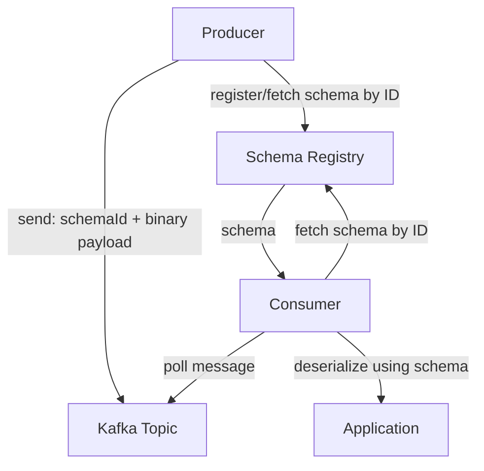
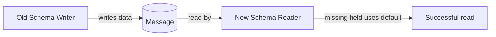

# Schema Management

### Schema Registry

The Schema Registry is a centralized service (most commonly Confluent Schema Registry) that stores and versions schemas (Avro, Protobuf, or JSON Schema) for Kafka topics, and enforces compatibility rules whenever a new schema version is registered. Producers and consumers reference schemas by an ID embedded in each message rather than sending the full schema every time, keeping payloads small.

It acts as the contract authority between independently-deployed producers and consumers: instead of every team informally agreeing on a message format (and drifting over time), the registry provides a queryable, enforced source of truth, typically organized under a "subject" naming strategy (e.g., `orders-value` for the value schema of the `orders` topic).

```properties
schema.registry.url=http://localhost:8081
```

```bash
# Register a new schema for the "orders-value" subject
curl -X POST -H "Content-Type: application/vnd.schemaregistry.v1+json" \
  --data '{"schema": "{\"type\":\"record\",\"name\":\"Order\",\"fields\":[...]}"}' \
  http://localhost:8081/subjects/orders-value/versions
```



**Real-life scenario:** Dozens of microservices producing/consuming `orders`, `payments`, and `shipments` events all rely on the registry to guarantee that a schema change by the `orders` team can't silently break the `shipments` team's consumers.

**Advantages**
- Central governance, compatibility enforcement, smaller message payloads (schema-by-reference).
- Enables schema discovery/documentation across teams.

**Disadvantages**
- Adds an operational dependency — an outage or misconfiguration can block all producers/consumers.
- Requires careful subject/compatibility strategy management as the system grows.

**Interview Questions**
- What problem does the Schema Registry solve that plain Avro/Protobuf alone does not? — It provides a central, queryable authority for schema versions and IDs so producers/consumers don't need to embed or re-send the full schema with every message, and it enforces compatibility rules automatically at registration time.
- How are messages linked to their schema without re-sending the schema every time? — Each message embeds a small schema ID (not the full schema); consumers look up the full schema definition from the registry by that ID and cache it locally.
- What happens if the Schema Registry is temporarily unavailable when a producer tries to send a message? — The producer's serializer typically fails to register/fetch the schema ID and the send fails (or blocks/retries per its client config) since it cannot obtain a schema ID to tag the message with, until the registry becomes reachable again.

### Schema Compatibility

Schema compatibility refers to the rules governing whether a new schema version can safely coexist with old producers/consumers still using a previous version. The Schema Registry supports several compatibility modes — `BACKWARD`, `FORWARD`, `FULL` (and their transitive variants, `BACKWARD_TRANSITIVE`, etc.) — each defining a different contract about who can read whose data.

Choosing the right mode is a deliberate architectural decision based on deployment order: if consumers are always upgraded before producers, forward compatibility matters most; if producers are upgraded first (the more common case), backward compatibility is what protects existing consumers.

```bash
# Set compatibility mode for a subject
curl -X PUT -H "Content-Type: application/vnd.schemaregistry.v1+json" \
  --data '{"compatibility": "BACKWARD"}' \
  http://localhost:8081/config/orders-value
```

**Real-life scenario:** A platform team mandates `BACKWARD` compatibility as the org-wide default so that any team can deploy a new producer schema without needing to coordinate simultaneous consumer deployments.

**Advantages**
- Prevents breaking changes from being deployed accidentally; codifies deployment ordering assumptions.
- Reduces cross-team coordination overhead for routine, additive schema changes.

**Disadvantages**
- Choosing the wrong mode for your deployment pattern can either be too restrictive (blocking valid changes) or too permissive (allowing breakage).

**Differences vs Forward/Backward/Full (see next entries)**
- Compatibility is the umbrella concept; Forward/Backward/Full are the specific enforced directions.

**Interview Questions**
- What is the difference between schema compatibility and schema validation? — Compatibility governs whether a *new* schema version can safely coexist with old producers/consumers using a *previous* version; validation just checks that a single message conforms to *a* schema, with no notion of version history.
- Why would an organization choose `BACKWARD` as its default compatibility mode? — Because the typical real-world deployment order upgrades producers before all consumers have caught up, and `BACKWARD` guarantees new-schema consumers can still read data written under the old schema.
- What is the transitive variant of a compatibility mode, and why does it matter? — The transitive variant (e.g., `BACKWARD_TRANSITIVE`) checks a new schema against *all* previous schema versions, not just the immediately prior one, preventing a chain of individually-compatible changes from breaking compatibility with an older version further back.

### Forward Compatibility

Forward compatibility means data written with a **new** schema can be read by consumers using the **old** schema. This matters when consumers are upgraded slower than producers, or when you can't control consumer upgrade timing at all (e.g., third-party consumers). In practice, this is achieved by only removing fields (never adding required fields without defaults) — old consumers simply ignore fields they don't recognize, and any field the old schema still expects must still be present with a default in the new writer schema... conceptually, "new writer, old reader."

The typical safe change under forward compatibility is **removing a field** (old readers just won't look for it) or adding a field with a default so that if an old reader schema still references it, a value is available.


**Real-life scenario:** A logging pipeline where the central log-aggregation consumer is upgraded far less frequently than the dozens of producing services — producers must be free to evolve without breaking the slow-moving aggregator.

**Advantages**
- Producers can evolve independently ahead of consumers.
- Useful when many heterogeneous/external consumers can't be upgraded on demand.

**Disadvantages**
- Restricts producer changes to safe subtractive/default-having changes only.
- Less commonly the default choice than backward compatibility in most orgs (producers are usually deployed first).

**Differences vs Backward Compatibility**
- Forward: new schema data readable by old schema readers ("upgrade producers first is safe").
- Backward: new schema readers can read old schema data ("upgrade consumers first is safe").

**Interview Questions**
- Give an example schema change that is forward-compatible but not backward-compatible. — Removing a field that had no default: old readers (which never expected the field) simply ignore its absence in new data (forward-compatible), but new readers that still expect the field can't find it in data written by old producers (breaks backward compatibility).
- In what deployment order scenario is forward compatibility the more important guarantee? — When producers are upgraded before consumers, or when consumers (e.g., third-party/external ones) can't be upgraded on demand — forward compatibility ensures those lagging old-schema consumers can still read the new data.

### Backward Compatibility

Backward compatibility means a **new** schema can read data written with an **old** schema — i.e., "new reader, old writer." This is the most commonly used default in real-world Kafka systems because the typical deployment pattern upgrades consumers to handle new fields *before* (or independent of) producers actually start sending them, and because it directly supports the common pattern of adding new optional fields with defaults that old data simply won't contain.

The safe changes here are **adding a field with a default value** (old data missing the field just uses the default) and **removing a field that had a default** in the old schema. Removing a field without a default, or adding a required field without one, breaks backward compatibility because the new reader would have no way to populate that field from old data.



**Real-life scenario:** Adding a `discountCode` field with a default of `null`/empty to the `Order` schema — new consumer code can safely read old order events produced before the field existed.

**Advantages**
- Matches the most common real deployment order (deploy new consumer code, then gradually roll out new producer fields).
- Enables safe additive schema growth over time.

**Disadvantages**
- Requires every new field to have a sensible default value.
- Doesn't protect old consumers from new data (that's forward compatibility's job).

**Differences vs Forward Compatibility**
- Backward: safe to upgrade consumers first.
- Forward: safe to upgrade producers first.

**Interview Questions**
- Why is adding a field with a default value backward-compatible but adding one without a default is not? — A new reader encountering old data missing the field can fall back to the default value; without a default the reader has no value to use for data that predates the field, so deserialization breaks.
- Which is more common in practice — backward or forward compatibility — and why? — Backward compatibility is more common because the typical deployment order upgrades producers/consumers such that new consumer code needs to keep reading old data, and additive changes with defaults are easier to reason about than subtractive ones.

### Full Compatibility

Full compatibility requires a schema change to be **both backward and forward compatible simultaneously** — old and new producers and consumers can all safely interoperate in any deployment order. This is the strictest and safest compatibility mode, but also the most restrictive: it only permits changes where every added/removed field has a default value on both sides, ruling out many otherwise-reasonable schema changes.

Because full compatibility eliminates deployment-order coordination entirely (you don't need to know or control whether producers or consumers upgrade first), it's often the right choice for shared, high-fanout topics with many independent consumer teams where coordinating upgrade order is impractical.

```bash
curl -X PUT -H "Content-Type: application/vnd.schemaregistry.v1+json" \
  --data '{"compatibility": "FULL"}' \
  http://localhost:8081/config/orders-value
```

**Real-life scenario:** A widely shared `customer-events` topic consumed by 15+ teams across the company — `FULL` compatibility avoids any single team needing to coordinate a synchronized upgrade with all consumers.

**Advantages**
- Maximum safety — no deployment-order assumptions required.
- Best for broadly shared/high-fanout topics with many independent consumer teams.

**Disadvantages**
- Most restrictive — only additive/subtractive changes with defaults on both sides are allowed; renames and type changes are effectively impossible without a new subject/topic.

**Differences vs Backward/Forward**
- Full = Backward AND Forward simultaneously enforced; strictly the intersection of allowed changes from both modes.

**Interview Questions**
- What is the tradeoff of choosing `FULL` compatibility over `BACKWARD` alone? — `FULL` guarantees safety in either upgrade order (no coordination needed) but is far more restrictive, since only changes that are simultaneously backward and forward compatible (defaults on both sides) are permitted.
- Why might a widely-shared topic prefer `FULL` compatibility despite its restrictiveness? — With many independent consumer teams, you can't guarantee or control their upgrade order, so `FULL` compatibility removes the need to coordinate a synchronized rollout across every team.

