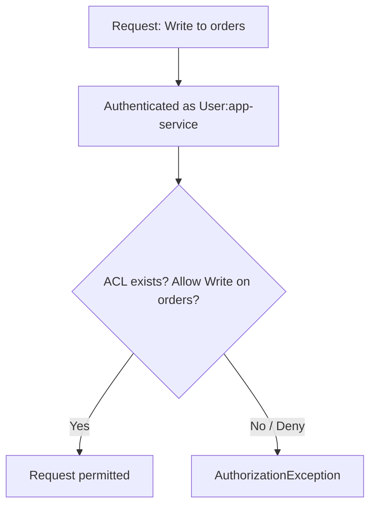
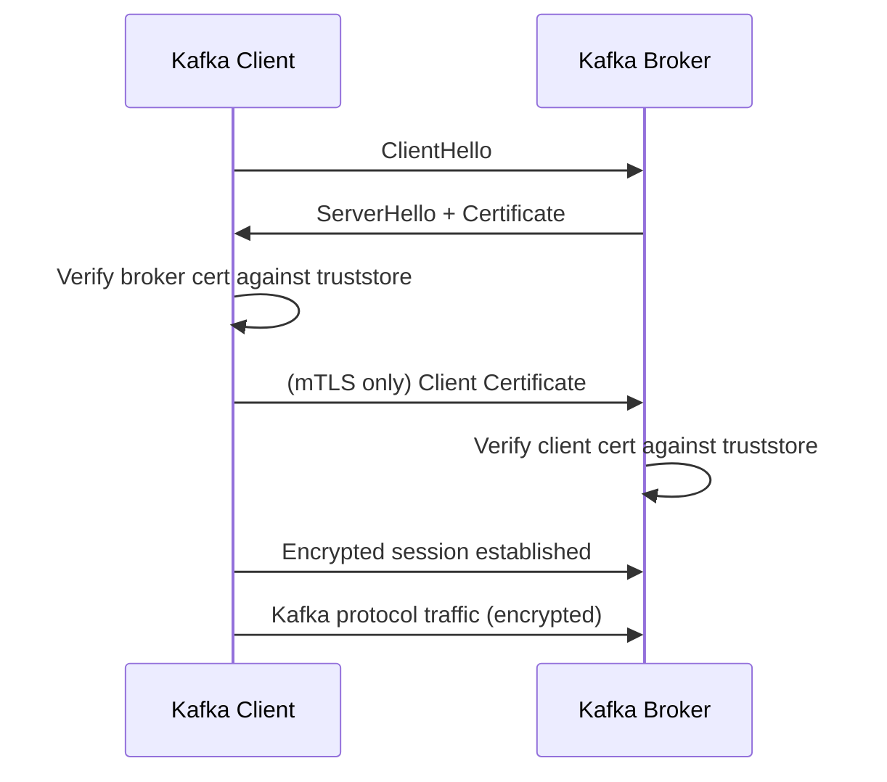

# Security

### Authentication

Authentication in Kafka verifies the identity of a client (producer, consumer, or another broker) before it's allowed to connect. Kafka supports several authentication mechanisms configured per listener: SSL/TLS mutual authentication (client certificates), SASL (with mechanisms like `PLAIN`, `SCRAM-SHA-256/512`, `GSSAPI`/Kerberos, or `OAUTHBEARER`), and combinations like `SASL_SSL` where SASL handles identity and TLS handles transport encryption.

Authentication answers "who are you?" — it's a prerequisite for authorization, which answers "what are you allowed to do?" Without authentication, any client that can reach the broker network could impersonate any principal, making ACLs meaningless.

```yaml
spring:
  kafka:
    security:
      protocol: SASL_SSL
    properties:
      sasl.mechanism: SCRAM-SHA-512
      sasl.jaas.config: >
        org.apache.kafka.common.security.scram.ScramLoginModule required
        username="app-user" password="app-secret";
```

**Real-life scenario:** A multi-team Kafka cluster requires every producing/consuming service to authenticate via `SASL_SSL` with unique credentials per service, so the security team can trace exactly which service produced a bad message.

**Interview Questions**
- What authentication mechanisms does Kafka support? — SSL/TLS mutual authentication (client certificates) and SASL with mechanisms like `PLAIN`, `SCRAM-SHA-256/512`, `GSSAPI` (Kerberos), and `OAUTHBEARER`.
- What's the difference between `SASL_PLAINTEXT` and `SASL_SSL`? — `SASL_PLAINTEXT` performs SASL authentication over an unencrypted connection; `SASL_SSL` performs the same authentication but over a TLS-encrypted connection, protecting credentials and data in transit.
- Why is authentication a prerequisite for meaningful authorization? — Authorization decisions are based on the identity of the requesting principal; without verifying that identity first, any client could claim to be any principal and bypass ACLs entirely.

### Authorization

Authorization determines what an already-authenticated principal is permitted to do — e.g., can `user:app-user` write to `orders` topic, read from `orders` topic, or manage the cluster's configs. Kafka implements authorization via a pluggable `Authorizer` interface, with `AclAuthorizer` (or the newer `StandardAuthorizer` under KRaft) being the built-in implementation backed by ACLs.

Every request to a broker (produce, fetch, create topic, alter configs, etc.) is checked against the authorizer, which evaluates configured ACLs (or, in some setups, integrates with external systems like LDAP/RBAC via commercial distributions) to allow or deny the operation. Denials return errors like `TopicAuthorizationException` to the client.

Well-designed authorization follows least-privilege: a service should only have `Read`/`Write` on the specific topics/consumer groups it needs, not blanket cluster-wide access.

**Real-life scenario:** A reporting service is granted `Read` on `orders` and `payments` topics but explicitly denied `Write`, preventing it from accidentally (or maliciously) publishing corrupt data into production topics.

**Interview Questions**
- How does Kafka authorization differ from authentication? — Authentication verifies who the client is; authorization (evaluated after authentication) determines what that identified principal is allowed to do, such as read/write specific topics.
- What is the role of the `Authorizer` interface? — It's the pluggable component every broker request is checked against, evaluating configured ACLs (or an external policy source) to allow or deny the requested operation.
- How would you enforce least-privilege access for a read-only reporting service? — Grant it only `Read`/`Describe` ACLs on the specific topics it needs, with no `Write` permission, so it can never publish data even if compromised.

### ACLs

Access Control Lists (ACLs) are the concrete rules Kafka's authorizer evaluates: each ACL binds a principal (e.g., `User:app-service`), a resource (topic, group, cluster, transactional ID), an operation (`Read`, `Write`, `Create`, `Describe`, `Alter`, `All`), and a permission type (`Allow`/`Deny`) — optionally scoped to a specific host. ACLs are managed via the `kafka-acls.sh` CLI tool or the `AdminClient` API and are stored in ZooKeeper (legacy) or the metadata log (KRaft).

Because Kafka's default behavior without any matching ACL is to deny (when authorization is enabled), ACLs are additive: you explicitly grant what's needed. `Deny` rules take precedence over `Allow` rules, useful for carving out exceptions (e.g., allow a group broad read access but deny one sensitive topic).

```bash
kafka-acls.sh --bootstrap-server localhost:9092 \
  --add --allow-principal User:app-service \
  --operation Read --operation Write \
  --topic orders
```



**Real-life scenario:** A security audit requires that only the `billing-service` principal can write to the `invoices` topic; an ACL is added granting `Write` to that principal alone, and all other write attempts are rejected.

**Interview Questions**
- What components make up a Kafka ACL binding? — A principal, a resource (topic/group/cluster/transactional ID), an operation (`Read`, `Write`, `Create`, etc.), a permission type (`Allow`/`Deny`), and optionally a host.
- What is the default authorization behavior when no ACL matches a request? — Deny — when authorization is enabled, requests with no matching ACL are rejected by default.
- How do `Allow` and `Deny` ACLs interact when both could apply? — `Deny` takes precedence over `Allow`, letting operators carve out exceptions (e.g., broad read access with a specific topic explicitly denied).

### SSL/TLS

SSL/TLS in Kafka provides two things: encryption in transit (protecting data from eavesdropping) and, optionally, mutual authentication via client certificates (2-way TLS). Each broker listener can be configured as `SSL` or combined with SASL as `SASL_SSL`. Brokers and clients present certificates from a truststore/keystore, and the TLS handshake establishes an encrypted channel before any Kafka protocol traffic flows.

When used purely for encryption (1-way TLS), only the broker presents a certificate and the client verifies it, similar to how HTTPS works for websites. When used for mutual TLS (2-way), the client also presents a certificate that the broker validates against its truststore, providing authentication without needing SASL.

```yaml
spring:
  kafka:
    security:
      protocol: SSL
    ssl:
      trust-store-location: file:/certs/truststore.jks
      trust-store-password: changeit
      key-store-location: file:/certs/keystore.jks
      key-store-password: changeit
```



**Real-life scenario:** A financial services company enables mutual TLS between all internal services and the Kafka cluster so that both encryption and client identity verification happen at the transport layer, satisfying compliance requirements.

**Interview Questions**
- What's the difference between one-way and mutual TLS in Kafka? — One-way TLS only has the broker present a certificate for the client to verify (encryption only); mutual TLS additionally has the client present a certificate the broker verifies, providing authentication as well as encryption.
- What files/stores are needed to configure SSL on a Kafka client? — A truststore (to verify the broker's certificate) and, for mutual TLS, a keystore containing the client's own certificate and private key.
- How does SSL-based authentication compare to SASL-based authentication? — SSL/mutual-TLS authenticates via certificates issued by a trusted CA; SASL authenticates via credentials or tokens (password, Kerberos ticket, OAuth token) validated through a login module — both can be combined (`SASL_SSL`) for encryption plus flexible identity mechanisms.

### SASL

SASL (Simple Authentication and Security Layer) is a framework Kafka uses for pluggable authentication independent of the transport encryption layer. Common SASL mechanisms in Kafka include `PLAIN` (simple username/password, should always be paired with TLS since credentials are otherwise sent in a recoverable form), `SCRAM-SHA-256`/`SCRAM-SHA-512` (salted challenge-response, credentials stored securely), `GSSAPI` (Kerberos, common in enterprise/Hadoop environments), and `OAUTHBEARER` (token-based, integrates with OAuth/OIDC providers).

SASL is typically combined with SSL as `SASL_SSL` in production: SASL handles "who is this client" while SSL/TLS handles "is this connection encrypted." Using `SASL_PLAINTEXT` (SASL without TLS) is discouraged outside trusted internal networks because credentials or tokens could be exposed on the wire depending on mechanism.

```yaml
spring:
  kafka:
    security:
      protocol: SASL_SSL
    properties:
      sasl.mechanism: SCRAM-SHA-256
      sasl.jaas.config: >
        org.apache.kafka.common.security.scram.ScramLoginModule required
        username="svc-orders" password="${KAFKA_PASSWORD}";
```

**Real-life scenario:** An enterprise already using Kerberos for internal service identity configures Kafka with `SASL_SSL` + `GSSAPI` so Kafka authentication integrates with existing corporate identity infrastructure.

**Differences vs SSL/TLS**
- SASL: primarily an authentication framework, mechanism-agnostic (password, Kerberos, OAuth)
- SSL/TLS: primarily a transport encryption + optional certificate-based authentication mechanism
- In production these are combined (`SASL_SSL`), not chosen exclusively

**Interview Questions**
- Name the SASL mechanisms supported by Kafka and when you'd choose each. — `PLAIN` for simple username/password (always with TLS); `SCRAM-SHA-256/512` for salted challenge-response without a Kerberos dependency; `GSSAPI` for Kerberos-integrated enterprise environments; `OAUTHBEARER` for token-based auth integrated with an OAuth/OIDC identity provider.
- Why is `SASL_PLAINTEXT` discouraged in production? — Without TLS, credentials or tokens can be exposed on the wire (depending on mechanism), so it's only considered safe on fully trusted, isolated internal networks.
- How does `SASL_SSL` combine authentication and encryption responsibilities? — SASL handles verifying client identity (the authentication handshake), while the underlying TLS layer encrypts the entire connection, so both concerns are satisfied together over one secured channel.

### SCRAM

SCRAM (Salted Challenge Response Authentication Mechanism) is a SASL mechanism that authenticates using a username/password without ever sending the plaintext password over the wire, and without the broker needing to store plaintext passwords. It uses salted, iterated cryptographic hashing (`SCRAM-SHA-256` or `SCRAM-SHA-512`) and a challenge-response handshake so both client and server prove knowledge of the password without transmitting it directly.

Credentials for SCRAM users are stored in ZooKeeper/KRaft metadata (created via `kafka-configs.sh`) rather than in a flat file, and can be rotated without restarting brokers, unlike Kerberos keytabs. This makes SCRAM a popular, relatively low-friction choice for teams that want per-user credentials without standing up a full Kerberos infrastructure.

```bash
kafka-configs.sh --bootstrap-server localhost:9092 \
  --alter --add-config 'SCRAM-SHA-512=[password=secret]' \
  --entity-type users --entity-name svc-orders
```

**Real-life scenario:** A mid-size company wants per-service Kafka credentials without deploying Kerberos; they use `SASL_SSL` + `SCRAM-SHA-512`, creating one SCRAM user per microservice.

**Differences vs OAuth**
- SCRAM: credentials managed directly in Kafka's metadata store, simple to set up, no external dependency
- OAuth: credentials/tokens issued and validated by an external identity provider, better for centralized identity/SSO and short-lived tokens, more moving parts to operate

**Interview Questions**
- How does SCRAM avoid sending the password in plaintext? — It uses a salted, iterated cryptographic hash and a challenge-response handshake where both sides prove knowledge of the password without ever transmitting it directly over the wire.
- Where are SCRAM credentials stored, and how do you rotate them? — They're stored in the cluster's metadata store (ZooKeeper or KRaft), created/updated via `kafka-configs.sh --alter --add-config`; rotation is done by re-running that command with a new password, without needing to restart brokers.
- Why might a team choose SCRAM over Kerberos (`GSSAPI`)? — SCRAM avoids the operational overhead of standing up and maintaining a full Kerberos infrastructure (KDC, keytabs) while still providing secure, non-plaintext password authentication.

### OAuth Authentication

Kafka supports OAuth 2.0 style authentication through the `OAUTHBEARER` SASL mechanism, letting clients authenticate using short-lived bearer tokens issued by an external identity provider (Okta, Keycloak, Azure AD, etc.) instead of static passwords. The client obtains a token (often via the client-credentials grant) and presents it during the SASL handshake; the broker validates the token's signature and claims (typically via a `AuthenticateCallbackHandler` that checks against the identity provider's JWKS endpoint or introspection endpoint).

This model fits well with modern zero-trust and centralized identity architectures: tokens are short-lived and automatically expire, revocation is centralized at the identity provider, and there's no long-lived shared secret embedded in application config the way there is with `SCRAM`/`PLAIN`.

```yaml
spring:
  kafka:
    security:
      protocol: SASL_SSL
    properties:
      sasl.mechanism: OAUTHBEARER
      sasl.login.callback.handler.class: org.apache.kafka.common.security.oauthbearer.secured.OAuthBearerLoginCallbackHandler
      sasl.jaas.config: >
        org.apache.kafka.common.security.oauthbearer.OAuthBearerLoginModule required
        clientId="orders-service" clientSecret="${OAUTH_CLIENT_SECRET}"
        tokenEndpointUrl="https://idp.example.com/oauth/token";
```

**Real-life scenario:** A company standardizing on Okta for all internal service-to-service auth configures Kafka clients to fetch short-lived OAuth tokens instead of managing separate SCRAM passwords per service.

**Interview Questions**
- How does `OAUTHBEARER` authentication flow differ from `SCRAM`? — `OAUTHBEARER` has the client obtain a short-lived bearer token from an external identity provider and present it to the broker, which validates the token's signature/claims, whereas `SCRAM` uses a direct password-based challenge-response handshake against credentials stored in Kafka's own metadata.
- Why are short-lived tokens preferable to static credentials in large organizations? — They automatically expire, limiting the damage window if leaked, and revocation/rotation is centralized at the identity provider instead of requiring coordinated password changes across every service.
- What component validates the token on the broker side? — An `AuthenticateCallbackHandler` (e.g., `OAuthBearerLoginCallbackHandler`) that checks the token's signature and claims against the identity provider's JWKS or introspection endpoint.

### Encryption in Transit

Encryption in transit ensures data moving between clients and brokers (and between brokers themselves during replication) can't be read or tampered with by anyone intercepting network traffic. In Kafka this is provided by enabling `SSL`/`TLS` on listeners — either standalone (`SSL`) or combined with SASL authentication (`SASL_SSL`). It's distinct from encryption at rest (protecting data on disk) and end-to-end/application-level encryption (encrypting the message payload itself, which even the broker can't read).

Production Kafka clusters almost always enable encryption in transit for inter-broker communication (`security.inter.broker.protocol`) as well as client-facing listeners, since replication traffic between brokers/data-centers may traverse less-trusted networks. Certificate management (rotation, CA trust chains) is an operational responsibility that comes with enabling TLS.

```properties
# server.properties
listeners=SASL_SSL://broker1:9093
security.inter.broker.protocol=SASL_SSL
ssl.client.auth=required
ssl.keystore.location=/certs/kafka.keystore.jks
ssl.truststore.location=/certs/kafka.truststore.jks
```

**Real-life scenario:** A healthcare company processing PHI data through Kafka enables TLS on every listener, including inter-broker replication, to satisfy HIPAA's requirement that data be encrypted in transit.

**Interview Questions**
- What's the difference between encryption in transit, encryption at rest, and end-to-end encryption? — Encryption in transit (TLS) protects data moving over the network; encryption at rest protects data stored on broker disks; end-to-end/application-level encryption encrypts the payload itself so not even the broker can read it.
- Why would you enable TLS specifically for inter-broker replication traffic, not just client connections? — Replication traffic between brokers (potentially across data centers) can traverse less-trusted network segments, so leaving it unencrypted would expose data even if client-facing listeners are secured.
- What operational overhead does enabling TLS introduce? — Certificate management — issuing, distributing, rotating, and trusting certificates/CAs across every broker and client, plus the CPU cost of the TLS handshake and encryption itself.

