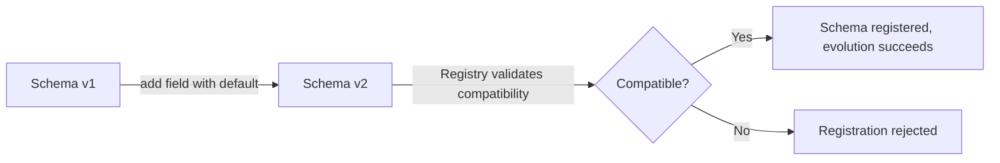

# Serialization

### String Serialization

String serialization is the simplest Kafka serialization strategy: keys and/or values are plain UTF-8 (or other charset) strings, handled by Kafka's built-in `StringSerializer`/`StringDeserializer`. It requires no schema, no external registry, and no extra dependencies — messages are just human-readable text (often JSON-as-a-string, CSV, or delimited formats).

It's commonly used for simple use cases, prototyping, log-style events, or when the payload is genuinely textual (e.g., a raw log line). Because there's no structure enforcement, it offers zero compile-time or run-time safety about the message shape — that responsibility falls entirely on the application.

```properties
key.serializer=org.apache.kafka.common.serialization.StringSerializer
value.serializer=org.apache.kafka.common.serialization.StringSerializer
key.deserializer=org.apache.kafka.common.serialization.StringDeserializer
value.deserializer=org.apache.kafka.common.serialization.StringDeserializer
```

```java
@Bean
public KafkaTemplate<String, String> kafkaTemplate(ProducerFactory<String, String> pf) {
    return new KafkaTemplate<>(pf);
}

kafkaTemplate.send("logs", "user-123", "LOGIN_SUCCESS");
```

**Real-life scenario:** Shipping raw application log lines or simple status codes between services where a full schema would be overkill.

**Advantages**
- Zero setup, human-readable, easy to debug with CLI tools (`kafka-console-consumer`).
- No schema registry dependency.

**Disadvantages**
- No schema enforcement — easy to introduce inconsistent formats across producers.
- Larger payload size than binary formats like Avro/Protobuf; no built-in compatibility checking.

**Interview Questions**
- When is plain string serialization an acceptable choice in production? — When the payload is genuinely unstructured text (raw log lines, simple status codes), for prototyping, or when tooling simplicity and human readability outweigh the need for schema enforcement.
- What are the risks of using strings for structured data (e.g., JSON-as-string) without a schema? — There's no compile-time or run-time validation of the message shape, so producers can silently drift in format, typos or missing fields break consumers at runtime, and there's no automated compatibility checking across versions.

### JSON Serialization

JSON serialization converts Java objects to/from JSON text, typically via Jackson (`JsonSerializer`/`JsonDeserializer` in Spring Kafka). It's human-readable and framework-friendly — POJOs annotate naturally, and most services already have Jackson on the classpath — making it a popular default for internal microservice communication.

Spring Kafka's `JsonSerializer` also embeds type information in message headers (`__TypeId__`) by default, allowing the deserializer to reconstruct the correct Java class automatically, which is convenient but couples the payload to a specific Java class name unless `addTypeInfo` is disabled and a type mapping is configured explicitly.

```java
@Bean
public ProducerFactory<String, Order> producerFactory() {
    Map<String, Object> props = new HashMap<>();
    props.put(ProducerConfig.KEY_SERIALIZER_CLASS_CONFIG, StringSerializer.class);
    props.put(ProducerConfig.VALUE_SERIALIZER_CLASS_CONFIG, JsonSerializer.class);
    return new DefaultKafkaProducerFactory<>(props);
}

@KafkaListener(topics = "orders")
public void listen(Order order) { // auto-deserialized via JsonDeserializer
    process(order);
}
```

**Real-life scenario:** A set of internal Spring Boot microservices exchanging `OrderCreatedEvent` payloads where developer velocity and readability matter more than wire size.

**Advantages**
- Human-readable, easy to debug, wide tooling/library support, no registry required (though can be paired with one).
- Flexible — tolerant of missing/extra fields by default (loosely typed).

**Disadvantages**
- No enforced schema/compatibility checks out of the box — breaking changes fail silently at runtime.
- Larger payloads and slower (de)serialization than binary formats like Avro/Protobuf.

**Differences vs Avro/Protobuf**
- JSON: human-readable, no schema enforcement by default, larger size.
- Avro/Protobuf: binary, compact, schema-enforced (especially with Schema Registry), faster.

**Interview Questions**
- How does Spring Kafka's `JsonDeserializer` know which Java class to deserialize into? — By default it reads the fully-qualified class name embedded by `JsonSerializer` in the `__TypeId__` message header; alternatively, `addTypeInfo=false` plus an explicit type mapping configuration can decouple the payload from a specific Java class name.
- What are the risks of using JSON serialization without any schema governance in a large microservices system? — Producers and consumers can drift independently since there's no central authority enforcing structure, and breaking changes (renamed/removed fields) typically fail silently or throw at runtime rather than being caught before deployment.
- How would you evolve a JSON message format safely across producer/consumer versions? — Add new fields as optional with sensible defaults so old consumers can ignore them, avoid removing or renaming existing fields, and roll out consumer changes that tolerate missing fields before producers start relying on them.

### Avro Serialization

Apache Avro is a compact, binary serialization format built around an explicit schema (`.avsc`, JSON-defined) that is normally managed centrally via a **Schema Registry**. Instead of embedding field names in every message (like JSON does), Avro stores only the data, referencing the schema (via a schema ID) needed to interpret it — resulting in significantly smaller payloads and faster serialization.

Avro is the most common serialization choice in mature Kafka ecosystems (especially Confluent-based) because of its first-class schema evolution support: it defines strict rules for **backward, forward, and full compatibility** checked automatically by the registry at publish time, catching breaking changes before they reach production.

```json
{
  "type": "record",
  "name": "Order",
  "fields": [
    { "name": "orderId", "type": "string" },
    { "name": "amount", "type": "double" },
    { "name": "status", "type": "string", "default": "PENDING" }
  ]
}
```

```java
@Bean
public ProducerFactory<String, Order> avroProducerFactory() {
    Map<String, Object> props = new HashMap<>();
    props.put(ProducerConfig.VALUE_SERIALIZER_CLASS_CONFIG, KafkaAvroSerializer.class);
    props.put("schema.registry.url", "http://localhost:8081");
    return new DefaultKafkaProducerFactory<>(props);
}
```

**Real-life scenario:** A high-throughput e-commerce event pipeline (millions of events/day) where wire size and deserialization speed materially affect infrastructure cost — Avro's compact binary encoding reduces both network and storage footprint versus JSON.

**Advantages**
- Compact binary format, fast (de)serialization.
- Strong schema evolution rules enforced via Schema Registry; generates typed classes.

**Disadvantages**
- Not human-readable — requires tooling (schema registry, Avro tools) to inspect messages.
- Adds an operational dependency (Schema Registry) and build-time code generation step.

**Differences vs Protobuf/JSON**
- Avro: schema stored separately (registry/ID reference), great for Kafka + Confluent ecosystem, dynamic typing supported.
- Protobuf: schema compiled into strongly-typed generated code, `.proto` IDL, popular for gRPC + Kafka combined systems.
- JSON: no compact binary form, no built-in schema evolution enforcement.

**Interview Questions**
- How does Avro achieve smaller payloads compared to JSON? — Avro messages store only the raw data values and reference their schema by ID (resolved via the Schema Registry) instead of repeating field names in every message the way JSON does.
- What role does the Schema Registry play when using Avro with Kafka? — It acts as the central authority that stores schema versions, assigns each one an ID, and enforces compatibility rules on every new schema registration so breaking changes are rejected before they reach production.
- How does Avro handle a consumer reading data written with an older schema version? — The consumer fetches both the writer's schema (by the ID embedded in the message) and its own reader schema from the registry, then uses Avro's schema resolution rules (backed by field defaults) to translate between them.

### Protobuf Serialization

Protocol Buffers (Protobuf) is Google's binary serialization format defined via `.proto` IDL files, compiled into strongly-typed classes for multiple languages. Like Avro, it's compact and fast, but unlike Avro, the schema is typically compiled directly into the application (though Confluent's Schema Registry also supports Protobuf schemas with compatibility checking, similar to Avro).

Protobuf is a strong choice for organizations that already use it for gRPC service contracts, since the same `.proto` definitions can be reused for both synchronous (gRPC) and asynchronous (Kafka) communication, giving a single source of truth for data contracts across the whole system.

```protobuf
syntax = "proto3";
message Order {
  string order_id = 1;
  double amount = 2;
  string status = 3;
}
```

```java
Map<String, Object> props = new HashMap<>();
props.put(ProducerConfig.VALUE_SERIALIZER_CLASS_CONFIG, KafkaProtobufSerializer.class);
props.put("schema.registry.url", "http://localhost:8081");
```

**Real-life scenario:** A polyglot microservices platform (Java, Go, Python) already using Protobuf/gRPC for synchronous APIs extends the same schemas to Kafka events for consistency and code-gen reuse.

**Advantages**
- Compact, fast, strongly typed generated code across many languages.
- Field numbering enables safe evolution (add optional fields without breaking old consumers).

**Disadvantages**
- Not human-readable without tooling; requires a compile step for `.proto` files.
- Slightly more rigid field semantics (e.g., default value ambiguity in proto3) than Avro.

**Differences vs Avro/JSON**
- Protobuf: compiled `.proto` contracts, great gRPC synergy, field-number-based evolution.
- Avro: registry-centric schema resolution, more dynamic/schema-on-read friendly.
- JSON: no compactness or built-in evolution guarantees.

**Interview Questions**
- How does Protobuf's field-numbering scheme support backward/forward compatibility? — Each field has a stable, explicit number that identifies it on the wire; readers simply ignore field numbers they don't recognize, so old readers tolerate new fields (forward compatibility) and new readers can supply defaults for fields absent in older messages (backward compatibility).
- When would you choose Protobuf over Avro in a Kafka-based system? — When the organization already uses Protobuf/`.proto` definitions for gRPC APIs and wants a single shared data contract, or when strongly-typed generated code across multiple languages is a priority.
- How can Protobuf schemas be shared between gRPC APIs and Kafka event contracts? — The same `.proto` file is compiled once into language-specific classes (e.g., `Order.java`, `order_pb2.py`), which are then reused both for gRPC service definitions and for serializing/deserializing Kafka messages, keeping a single source of truth.

### Custom Serialization

Custom serialization means implementing Kafka's `Serializer<T>` and `Deserializer<T>` interfaces yourself, rather than using a built-in or Confluent-provided implementation. This is useful when you need a proprietary binary format, need to integrate legacy encoding schemes, want fine-grained control over performance, or need to add custom framing (e.g., encryption, compression, versioning headers) around the payload.

The interfaces are intentionally minimal — `serialize(String topic, T data)` returns a `byte[]`, and `deserialize(String topic, byte[] data)` returns `T` — which makes it straightforward to wrap an existing library (e.g., Kryo, custom binary protocol) or add cross-cutting behavior like encryption before delegating to a real serializer.

```java
public class EncryptingSerializer implements Serializer<Order> {
    private final ObjectMapper mapper = new ObjectMapper();

    @Override
    public byte[] serialize(String topic, Order data) {
        try {
            byte[] json = mapper.writeValueAsBytes(data);
            return EncryptionUtil.encrypt(json); // custom framing/logic
        } catch (Exception e) {
            throw new SerializationException("Failed to serialize Order", e);
        }
    }
}
```

```properties
value.serializer=com.example.kafka.EncryptingSerializer
value.deserializer=com.example.kafka.DecryptingDeserializer
```

**Real-life scenario:** A regulated financial system that must encrypt PII fields at rest on the topic, requiring a custom serializer that encrypts before delegating to standard JSON/Avro encoding.

**Advantages**
- Full control over wire format, compression, encryption, or legacy protocol support.
- Can optimize for a very specific performance or size requirement.

**Disadvantages**
- You own all correctness, versioning, and compatibility concerns — no registry safety net unless you build one.
- More maintenance burden and onboarding complexity for new developers.

**Interview Questions**
- What two interfaces must you implement to create a custom Kafka serializer? — `Serializer<T>` (for producing) and `Deserializer<T>` (for consuming), each implementing a `serialize`/`deserialize` method.
- When would a custom serializer be preferred over Avro/Protobuf/JSON? — When you need a proprietary or legacy wire format, must integrate with an existing binary protocol, need custom encryption baked into the (de)serialization step, or require fine-grained performance control beyond what the standard formats provide.
- How would you add encryption to messages without changing every producer's business logic? — Implement a `Serializer` that wraps/delegates to the existing serializer (e.g., `JsonSerializer`), encrypting its output before returning the bytes, and configure it as the `value.serializer`; a matching `Deserializer` decrypts before delegating to the underlying deserializer — business/producer code stays untouched.

### Schema Evolution

Schema evolution is the practice of changing a message schema over time (adding fields, removing fields, renaming, changing types) while keeping producers and consumers on different schema versions interoperable. It's a core operational concern in any long-lived event-driven system, since producers and consumers deploy independently and are rarely upgraded in perfect lockstep.

The safest evolution changes are: adding an **optional field with a default value**, or removing a field that already had a default. Renaming fields, changing a field's type, or removing a required field without a default are generally unsafe and will break compatibility unless carefully staged (e.g., add-new-field → dual-write → migrate consumers → remove-old-field).

Schema Registry-backed formats (Avro/Protobuf) can enforce compatibility rules automatically on schema registration, rejecting a new schema version if it violates the configured compatibility mode (`BACKWARD`, `FORWARD`, `FULL`).

```json
// v1
{ "name": "Order", "fields": [ {"name": "orderId", "type": "string"} ] }

// v2 - safe evolution: added optional field with default
{ "name": "Order", "fields": [
  {"name": "orderId", "type": "string"},
  {"name": "currency", "type": "string", "default": "USD"}
]}
```



**Real-life scenario:** Adding a `currency` field to an `Order` event so new consumers can support multi-currency orders, while old consumers (unaware of the field) keep working unaffected.

**Advantages**
- Enables independent, incremental deployment of producers/consumers.
- Prevents "big bang" migrations across an entire event-driven architecture.

**Disadvantages**
- Requires discipline (avoiding breaking changes) and tooling (registry, compatibility checks) to do safely.
- Long-lived "deprecated but still present" fields can accumulate technical debt.

**Interview Questions**
- What kinds of schema changes are generally safe vs. unsafe for compatibility? — Safe: adding an optional field with a default, or removing a field that has a default; unsafe: adding a required field with no default, removing a required field, or renaming/retyping an existing field.
- How does adding a default value affect whether a new field is a breaking change? — A default lets readers using an older schema (that has never seen the new field) or writers that omit it fall back to a known value automatically, so the change stays backward/forward compatible instead of breaking deserialization.
- Describe a safe multi-step process for removing a field from a widely-used event schema. — First make the field optional with a default and stop relying on it in new consumers, then dual-write/tolerate its absence for a transition period while all consumers migrate, and only remove it from the schema once no consumer depends on it anymore.

