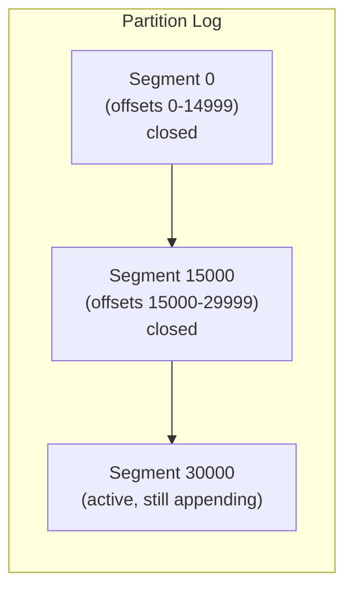
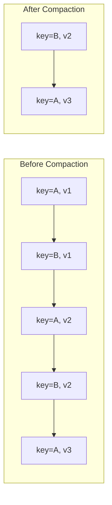
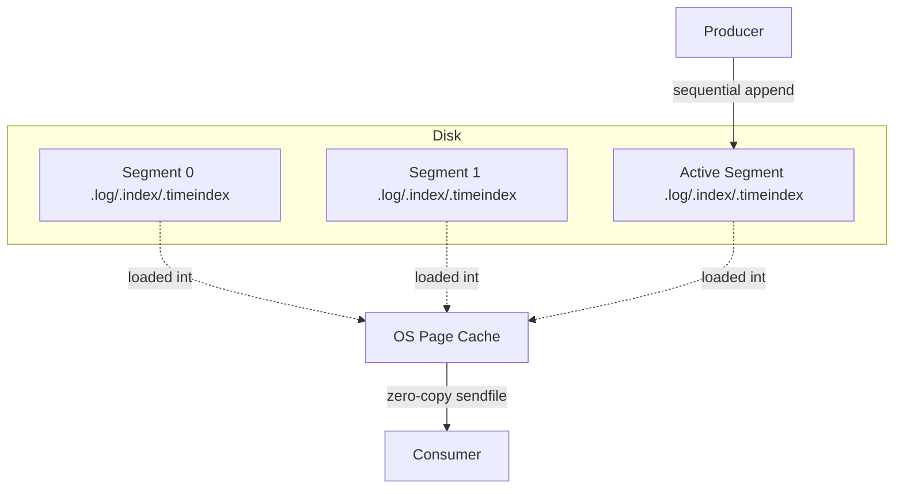
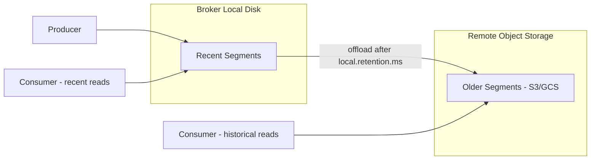

# Storage and Retention

### Log Segments

Kafka stores each partition's data as an append-only log, physically split into multiple **segment files** on disk (e.g., `00000000000000000000.log`, `00000000000000015000.log`), rather than one single ever-growing file. Each segment has an associated index file (`.index` for offset lookup, `.timeindex` for timestamp lookup) that lets Kafka binary-search to a specific offset/timestamp quickly without scanning the whole log.

Segmentation is what makes retention and compaction practically feasible: instead of rewriting or trimming one giant file, Kafka simply deletes whole segment files once every message in them is eligible for removal, and compaction operates segment-by-segment. Only the **active segment** (the newest one) accepts new writes; older segments are immutable/read-only.

```properties
log.segment.bytes=1073741824      # roll to a new segment at 1GB
log.segment.ms=604800000          # or roll after 7 days, whichever first
```



**Real-life scenario:** A high-volume `clickstream` topic rolls a new log segment roughly every hour due to its size threshold; retention deletion later just removes whole old segment files rather than editing them in place, keeping deletion cheap.

**Advantages**
- Enables efficient, cheap deletion (drop whole files) and fast offset/timestamp lookups via segment indexes.

**Disadvantages**
- More small files to manage on disk if segment size is set too small; too large delays reclaiming disk space.

**Interview Questions**
- Why does Kafka split a partition's log into multiple segment files instead of one file? — Segments let Kafka delete or compact whole files at once for retention/cleanup, and enable indexed lookups, without ever having to rewrite or truncate one giant ever-growing file.
- What are `.index` and `.timeindex` files used for? — `.index` maps offsets to physical file positions for fast offset-based lookup; `.timeindex` maps timestamps to offsets, enabling fast timestamp-based lookups (e.g., "seek to this time").
- What triggers a new segment to be created? — The active segment reaching `log.segment.bytes` in size, or `log.segment.ms` elapsing since it was created — whichever happens first.

### Log Retention

Log retention defines how long (or how much) data Kafka keeps in a topic before deleting it, independent of whether any consumer has read it — Kafka does not delete messages just because a consumer has consumed them. Retention is enforced at the segment level: an entire segment is eligible for deletion once its newest message exceeds the retention threshold (or the partition exceeds its size cap), which is why deletion happens in segment-sized chunks rather than per-message.

This "consumer-independent" retention model is a key conceptual difference from traditional message queues (like RabbitMQ/JMS), where a message is typically removed once acknowledged — Kafka instead behaves like a durable, replayable log, letting multiple/new consumers re-read history within the retention window.

```properties
log.retention.hours=168        # 7 days
log.retention.bytes=-1         # unlimited by size (per partition)
```

**Real-life scenario:** A new analytics consumer is deployed and needs to backfill the last 3 days of events — because Kafka retains data independent of consumption, it can simply reset its offset and replay, something a traditional queue couldn't support after messages were acked and removed.

**Advantages**
- Enables replay, multiple independent consumers, and reprocessing without producer involvement.

**Disadvantages**
- Requires enough disk to hold the configured retention window across all partitions/replicas.

**Interview Questions**
- Why doesn't Kafka delete a message as soon as a consumer reads it? — Kafka retains messages independent of consumption so multiple/new consumers can replay history within the retention window, unlike traditional queues that remove messages on ack.
- What are the two dimensions (besides compaction) that control retention? — Time (`log.retention.ms`/hours/minutes) and size (`log.retention.bytes`) — whichever limit is hit first triggers segment deletion.
- What operational risk exists if retention is set too long relative to available disk capacity? — Brokers can run out of disk space, since retention determines how much data (across all partitions and replicas) must be stored before it's eligible for deletion.

### Time-Based Retention

Time-based retention deletes segments once the age of their most recent message exceeds `log.retention.ms` (or the hours/minutes variants — `ms` takes precedence if multiple are set). This is the most commonly used retention strategy, since most use cases care about "how far back can I replay" rather than "how many total bytes are stored."

Kafka evaluates this per-segment (not per-message): a whole segment is deleted only once its *newest* record exceeds the retention window, meaning in practice data can be retained slightly longer than the configured value, bounded by segment roll frequency.

```properties
log.retention.ms=604800000   # 7 days, highest precedence
log.retention.minutes=10080
log.retention.hours=168
```

**Real-life scenario:** A `user-activity` topic retains 7 days of data by default so that reprocessing jobs (e.g., a nightly analytics batch) always have a full week of replay-able history available.

**Advantages**
- Predictable, easy-to-reason-about replay window ("last N days").

**Disadvantages**
- Doesn't protect against disk exhaustion if traffic volume spikes unexpectedly within the time window (that's what size-based retention complements).

**Interview Questions**
- Which config takes precedence if both `log.retention.ms` and `log.retention.hours` are set? — `log.retention.ms` takes precedence over the hours/minutes variants.
- Why might actual retained data slightly exceed the configured retention time? — Retention is evaluated per-segment, and a whole segment is only deleted once its *newest* record exceeds the threshold, so data can persist slightly longer bounded by how often segments roll.

### Size-Based Retention

Size-based retention deletes the oldest segments once a partition's total log size exceeds `log.retention.bytes`, regardless of message age. It's often used **in combination with** time-based retention as a safety net — whichever limit (time or size) is hit first triggers deletion — to bound disk usage during unexpected traffic spikes.

Note that `log.retention.bytes` is a **per-partition** limit, not per-topic, so the effective topic-level retention capacity is `log.retention.bytes × number of partitions`.

```properties
log.retention.bytes=536870912   # 512MB per partition
log.retention.ms=604800000      # 7 days — whichever limit hits first wins
```

**Real-life scenario:** A topic normally retains 7 days of data comfortably, but during a traffic surge (e.g., a flash sale), size-based retention kicks in first to cap disk usage, trimming the effective retention window shorter than 7 days for that period.

**Advantages**
- Provides a hard ceiling on disk usage regardless of traffic volume changes.

**Disadvantages**
- Can unexpectedly shorten the effective replay window during high-traffic periods, surprising consumers expecting the full time-based window.

**Differences vs Time-Based Retention**
- Time-based: bounds by age of data.
- Size-based: bounds by total bytes per partition; the two are combined with "whichever triggers first" semantics.

**Interview Questions**
- Is `log.retention.bytes` a per-topic or per-partition setting? — Per-partition — the effective topic-level capacity is `log.retention.bytes × number of partitions`.
- How do time-based and size-based retention interact when both are configured? — Whichever limit is reached first triggers segment deletion, so size-based retention acts as a safety net that can shorten the effective retention window during traffic spikes.

### Log Compaction

Log compaction is an alternative (or complementary) retention strategy that, instead of deleting data by age/size, retains **at least the last known value for each message key**, removing older records with the same key. This turns a Kafka topic into something like a durable, replayable changelog of the *latest state* per key — the foundation for Kafka Streams' `KTable` and for rebuilding state stores after a failure.

Compaction runs in the background (the log cleaner thread), operating on closed segments, and only rewrites data — it never breaks offset ordering, though offsets can have "gaps" after compaction since intermediate values are removed. A topic can combine `delete` and `compact` cleanup policies (`cleanup.policy=compact,delete`) to also enforce a time/size bound in addition to key-based compaction.

```properties
cleanup.policy=compact
min.cleanable.dirty.ratio=0.5
segment.ms=600000
```



**Real-life scenario:** A `customer-profile` topic used to feed a Kafka Streams `KTable` only needs each customer's latest profile snapshot — compaction keeps storage bounded to "one record per customer" instead of growing forever with every update.

**Advantages**
- Bounded storage growth for "latest value per key" use cases; enables fast state-store rebuilding.

**Disadvantages**
- Not suitable for use cases needing the full historical sequence of every change (use time/size-based retention instead).
- Requires every meaningful record to have a well-chosen key.

**Interview Questions**
- How does log compaction differ from time/size-based deletion? — Deletion removes segments based on age/size regardless of key; compaction instead retains only the latest value per key, discarding older records for the same key while keeping the log usable indefinitely as a "current state" changelog.
- What Kafka Streams concept relies heavily on compacted topics? — `KTable`/state stores — their changelog topics are compacted so only the latest value per key needs to be retained to rebuild state.
- Can offsets have gaps after compaction, and why? — Yes — compaction removes older records for a key (freeing their offsets) while never rewriting/reusing offset numbers, so the remaining records keep their original (now non-contiguous) offsets.

### Tombstone Records

A tombstone is a record with a non-null key but a **null value**, used in a compacted topic to signal "delete this key." During compaction, once a tombstone is encountered, the log cleaner removes all prior records for that key, and after a configurable grace period (`delete.retention.ms`), removes the tombstone itself too — giving downstream consumers time to observe the deletion before it disappears entirely.

This mechanism is essential for compacted topics acting as a changelog/state store (e.g., Kafka Streams `KTable`) — without tombstones, there would be no way to represent "this key was deleted" since compaction only ever removes *older* values for a key that still has a newer value, not the key entirely.

```java
// Producing a tombstone: null value deletes the key on a compacted topic
kafkaTemplate.send("customer-profile", customerId, null);
```

```properties
delete.retention.ms=86400000   # keep tombstone visible for 24h before fully removing
```

**Real-life scenario:** When a customer closes their account, the profile service publishes a tombstone (`key=customerId, value=null`) to `customer-profile`, ensuring the compacted topic (and any `KTable` built from it) eventually fully forgets that customer.

**Advantages**
- Provides an explicit, first-class "delete" signal in an otherwise append-only, keyed log.

**Disadvantages**
- Downstream consumers must be written to specifically check for and handle null values as deletions.

**Interview Questions**
- What does a tombstone record look like, and how is it produced? — A record with a non-null key and a null value; a producer creates one simply by sending a message with `value=null` for that key.
- Why doesn't the tombstone itself get removed from the log immediately? — It's kept for a grace period (`delete.retention.ms`) so downstream consumers have time to observe the deletion signal before it's purged; removing it instantly could let a slow consumer miss the delete entirely.
- What controls how long a tombstone remains visible before being purged? — `delete.retention.ms`.

### Disk Storage Model

Kafka's on-disk model is deliberately simple and sequential: each partition is an append-only log split into segment files, each segment paired with sparse index files (`.index`, `.timeindex`) for fast lookup. Writes always append to the end of the active segment (sequential disk I/O, which is dramatically faster than random I/O on spinning disks and still very fast on SSDs), and Kafka relies heavily on the OS page cache rather than an in-process cache — reads of recent data are often served directly from page cache, and Kafka uses `sendfile`/zero-copy transfer to send data to consumers without extra copies through user space.

This design is a large part of why Kafka achieves such high throughput compared to traditional message brokers: it avoids random disk access, avoids redundant memory copies, and leans on well-understood, highly optimized OS-level mechanisms (page cache, zero-copy) instead of reinventing them in the application layer.



**Real-life scenario:** Kafka brokers routinely sustain hundreds of MB/s per broker on commodity hardware/SSDs largely because writes are sequential appends and reads of recent data are served straight from OS page cache rather than round-tripping through disk.

**Advantages**
- Extremely high throughput via sequential I/O, page cache reuse, and zero-copy transfer.

**Disadvantages**
- Heavily relies on sufficient OS page cache/RAM headroom; cache misses for very old data fall back to slower disk reads.

**Interview Questions**
- Why does Kafka favor sequential disk I/O, and how does that affect performance? — Appending sequentially to the end of the active segment avoids costly random disk seeks, letting Kafka sustain very high write throughput even on spinning disks and extremely high throughput on SSDs.
- What is zero-copy transfer and how does Kafka use it when serving consumer fetch requests? — Zero-copy (via the `sendfile` system call) lets the broker transfer bytes straight from the page cache/file to the network socket without copying through user-space application memory, reducing CPU overhead and copies during fetch responses.
- How does the OS page cache factor into Kafka's read performance? — Kafka relies on the OS page cache instead of an application-level cache; recent segments are often already resident in page cache, so reads are served directly from memory rather than hitting disk.

### Tiered Storage

Tiered storage (available in modern Kafka versions, e.g., KIP-405) separates a partition's log into a **local tier** (recent data on broker-attached fast disks, used for low-latency reads) and a **remote tier** (older segments offloaded to cheaper, virtually unlimited object storage like S3/GCS/Azure Blob). This decouples storage capacity from broker compute/disk, letting operators retain data for months or years without needing enormous, expensive local disks on every broker.

Consumers reading recent data are served from local disk as usual; requests for older, tiered-off data are transparently fetched from remote storage by the broker, at the cost of higher latency for those older reads. This makes very long retention windows economically practical, especially for compliance/audit use cases, without requiring a separate data lake pipeline just to keep old Kafka data accessible.

```properties
remote.storage.enable=true
local.retention.ms=86400000        # 1 day kept locally
retention.ms=31536000000           # 1 year total (local + remote)
```



**Real-life scenario:** A compliance requirement mandates 2 years of audit-event retention; tiered storage keeps only the last day on local broker disks (cheap, fast) while the remaining ~2 years lives in S3, avoiding the need for petabytes of local broker disk.

**Advantages**
- Dramatically cheaper long-term retention; decouples storage growth from broker scaling.
- Enables very long replay windows without a separate archival/data-lake pipeline.

**Disadvantages**
- Reads of remote/tiered data have higher latency than local reads.
- Adds operational complexity (remote storage plugin/config, another dependency to monitor).

**Interview Questions**
- What problem does tiered storage solve compared to scaling local broker disks? — It decouples long-term storage capacity from broker compute/local disk by offloading older segments to cheap, virtually unlimited object storage, avoiding the need for enormous and expensive local disks on every broker just to satisfy long retention.
- How does read latency differ between local and remote tiered segments? — Local segment reads are fast (served from broker disk/page cache); reads of remote/tiered segments are slower since the broker must fetch them from object storage on demand.
- What two retention settings control how much data stays local vs. is eligible for offload? — `local.retention.ms` (how long data stays on local broker disk before offload) and `retention.ms` (total retention across local + remote tiers).

