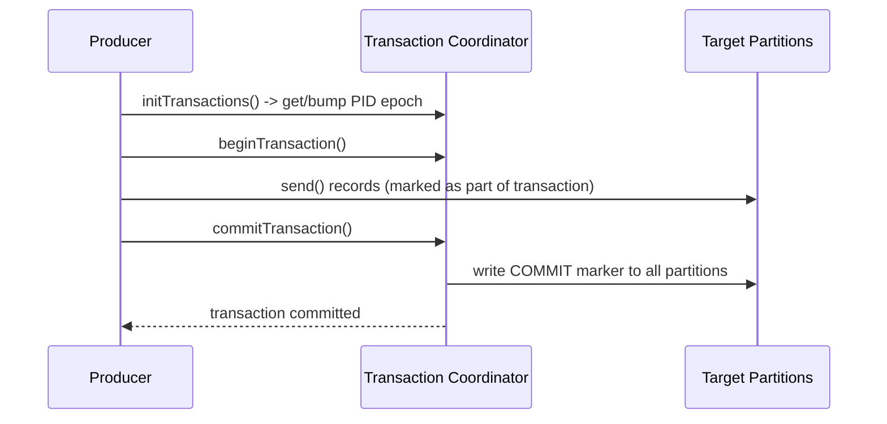
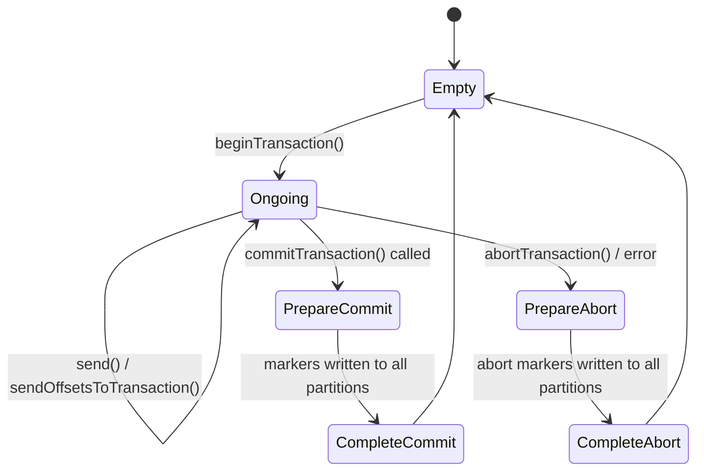
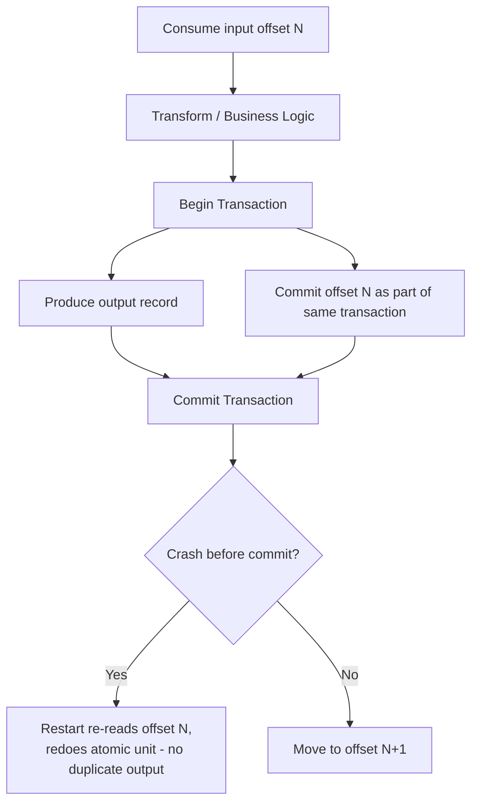

# Transactions

### Producer Transactions

Producer transactions let a single producer atomically write to multiple partitions/topics — all messages sent within a transaction become visible together (on commit) or are all discarded (on abort), never partially visible. This is enabled by setting a unique, stable `transactional.id` per producer instance and following the `initTransactions → beginTransaction → send... → commitTransaction/abortTransaction` lifecycle.

Spring Kafka simplifies this considerably: configuring a `transactional.id` prefix on the `ProducerFactory` and using `@Transactional` (backed by `KafkaTransactionManager`) around business logic automatically begins, commits, or rolls back the transaction based on whether the method completes normally or throws.

```java
@Bean
public KafkaTransactionManager<String, String> kafkaTransactionManager(
        ProducerFactory<String, String> producerFactory) {
    return new KafkaTransactionManager<>(producerFactory);
}

@Transactional("kafkaTransactionManager")
public void placeOrder(Order order) {
    kafkaTemplate.send("orders", order.getId(), order);
    kafkaTemplate.send("orders-audit", order.getId(), order);
    // both sends commit together, or both are aborted, atomically
}
```

**Real-life scenario:** Publishing both an `orders` event and a corresponding `orders-audit` event that must never diverge — producer transactions guarantee a consumer of either topic never sees one without the other.

**Advantages**
- Atomic multi-topic/multi-partition writes from a single producer.

**Disadvantages**
- Added latency/coordination overhead vs. non-transactional sends; requires downstream consumers to use `read_committed` to actually benefit.

**Interview Questions**
- What producer config is required to enable transactions? — A unique, stable `transactional.id` set on the producer (which also implicitly requires `enable.idempotence=true`).
- How does Spring Kafka's `@Transactional` map onto the raw producer transaction API? — `KafkaTransactionManager` automatically calls `beginTransaction()` when the annotated method starts and `commitTransaction()`/`abortTransaction()` when it returns normally or throws, so application code never calls the raw API directly.
- What happens to messages sent within a transaction that is later aborted? — They're written to the log but marked with an abort marker, so `read_committed` consumers never see them — the transaction's writes are effectively discarded from the consumer's point of view.

### Transaction Coordinator

The transaction coordinator is a broker-side component (one per transactional producer, resolved via hashing the `transactional.id`) responsible for managing a transaction's lifecycle: tracking its state in the internal `__transaction_state` topic, writing begin/commit/abort markers, and ensuring atomicity across all partitions involved — even if the producer crashes mid-transaction.

It also enforces **producer fencing**: each `transactional.id` has an associated epoch that increments every time `initTransactions()` is called for that ID. If an old "zombie" producer instance (e.g., a previous, still-running-but-orphaned process after a restart) tries to write using a stale epoch, the coordinator rejects it with a `ProducerFencedException`, preventing two instances of "the same" producer from corrupting a transaction concurrently.



**Real-life scenario:** A producer instance hangs (but isn't fully dead) and a new instance starts up with the same `transactional.id` after a restart — the coordinator fences the old instance's epoch so it can no longer commit, preventing conflicting/duplicate transactional writes.

**Advantages**
- Centralizes atomicity/consistency guarantees; protects against zombie-producer corruption via fencing.

**Disadvantages**
- Adds a coordination hop (extra broker round-trips) to every transactional write.

**Interview Questions**
- What is the role of the transaction coordinator in Kafka? — A broker-side component that manages a transaction's lifecycle, persists its state in `__transaction_state`, writes commit/abort markers to all involved partitions, and enforces producer fencing.
- How does producer fencing prevent zombie producers from corrupting data? — Each `transactional.id` has an epoch that increments on every `initTransactions()` call; the coordinator rejects requests carrying a stale epoch with `ProducerFencedException`, so an old zombie instance can't write after a new instance has taken over.
- What internal topic stores transaction state? — `__transaction_state`.

### Transaction Lifecycle

A Kafka transaction moves through a well-defined set of states, both from the producer API's perspective and the coordinator's internal state machine: **Empty/Ready** → **Ongoing** (after `beginTransaction()`, as records are sent) → **PrepareCommit**/**PrepareAbort** → **CompleteCommit**/**CompleteAbort**. Understanding this lifecycle matters for reasoning about failure scenarios — e.g., what happens if the producer crashes after `commitTransaction()` is called but before the coordinator finishes writing all commit markers (answer: the coordinator resumes and completes the commit on its own using its persisted state, since the decision was already durably recorded).



**Real-life scenario:** During a rolling deployment, a producer crashes right after calling `commitTransaction()` — because the coordinator already durably recorded the "PrepareCommit" decision in `__transaction_state`, it independently finishes writing commit markers to all partitions, so the transaction still completes correctly without producer involvement.

**Advantages**
- Durable, coordinator-driven state machine survives producer crashes mid-commit/abort.

**Disadvantages**
- More moving parts to reason about when debugging stuck or slow transactions.

**Interview Questions**
- What happens if a producer crashes right after calling `commitTransaction()`? — The coordinator has already durably recorded the commit decision in `__transaction_state`, so it independently finishes writing commit markers to all partitions without needing the producer to still be alive.
- Why does the coordinator need to persist transaction state durably? — So it can recover and complete (or abort) an in-flight transaction after a crash of either the producer or the coordinator itself, without losing track of what was decided.
- What's the difference between the `PrepareCommit` and `CompleteCommit` states? — `PrepareCommit` means the commit decision has been made and durably recorded but markers haven't been written to every partition yet; `CompleteCommit` means all commit markers have been successfully written and the transaction is fully finalized.

### Read Committed

`isolation.level=read_committed` is a consumer-side setting that makes the consumer only see messages from **committed** transactions — messages from open or aborted transactions are filtered out entirely (never delivered, not even as "skip-able" records, aside from an internal offset gap). This is what actually delivers the exactly-once *consumption* guarantee promised by Kafka transactions; without it, a consumer would see every message regardless of whether its producing transaction ultimately committed or aborted.

```properties
isolation.level=read_committed
```

```java
@Bean
public ConsumerFactory<String, String> consumerFactory() {
    Map<String, Object> props = new HashMap<>();
    props.put(ConsumerConfig.ISOLATION_LEVEL_CONFIG, "read_committed");
    return new DefaultKafkaConsumerFactory<>(props);
}
```

**Real-life scenario:** A downstream analytics consumer must never count an aborted, retried transactional write twice or see a half-written multi-topic transaction — `read_committed` ensures it only ever observes fully committed, atomic transaction results.

**Advantages**
- Enables true exactly-once processing semantics for consumers of transactional topics.

**Disadvantages**
- Slightly higher latency — messages aren't visible until the producing transaction actually commits (can't be read "early").

**Differences vs Read Uncommitted**
- Read committed: only committed transactional data visible; aborted/in-flight data hidden.
- Read uncommitted (default): all data visible immediately, including data from transactions that later abort.

**Interview Questions**
- What does `isolation.level=read_committed` actually filter out for a consumer? — Messages belonging to transactions that are still open (in-flight) or that were aborted — only fully committed transactional messages are delivered.
- Why is `read_committed` necessary to realize exactly-once semantics on the consumer side? — Without it, a consumer would see every message regardless of whether its producing transaction ultimately committed or aborted, defeating the atomicity guarantee transactions provide.
- Does `read_committed` add latency, and why? — Yes, slightly — messages aren't delivered to the consumer until the producing transaction actually commits, so they can't be read "early" the way `read_uncommitted` allows.

### Read Uncommitted

`isolation.level=read_uncommitted` is Kafka's **default** consumer isolation level: the consumer sees every message on the partition, in offset order, regardless of whether it was written as part of a transaction that eventually commits or aborts. This means with transactional producers in play, a `read_uncommitted` consumer could briefly observe data that is later effectively "undone" (aborted), leading to incorrect results if not accounted for.

For non-transactional topics, this distinction is moot — `read_uncommitted` behaves identically to `read_committed` since there are no transaction boundaries to consider. It only matters when a topic is written to by transactional producers and consumer correctness depends on never seeing uncommitted/aborted writes.

```properties
isolation.level=read_uncommitted   # default
```

**Real-life scenario:** A best-effort monitoring dashboard consuming a transactional topic doesn't care about the rare aborted-transaction edge case, so it stays on the (cheaper, lower-latency) default `read_uncommitted` setting rather than paying the small transactional-visibility delay of `read_committed`.

**Advantages**
- Lowest latency, default/simplest behavior; fine for non-transactional topics or tolerant consumers.

**Disadvantages**
- Can observe data from transactions that are later aborted, causing correctness bugs in strict-consistency use cases.

**Differences vs Read Committed**
- Uncommitted: sees everything immediately, including data from aborted transactions.
- Committed: only sees data from transactions that actually commit.

**Interview Questions**
- Why is `read_uncommitted` the default isolation level? — It's the simplest, lowest-latency behavior and matches historical/non-transactional Kafka semantics, so it remains the default to avoid changing behavior for topics that don't use transactions.
- In what scenario would a consumer on `read_uncommitted` see incorrect data due to an aborted transaction? — If a transactional producer writes several records then aborts the transaction, a `read_uncommitted` consumer would already have read and acted on those records before the abort, seeing data that is logically "undone."

### Exactly Once Semantics (EOS)

Exactly Once Semantics (EOS) is the umbrella term for Kafka's combination of **idempotent producers** (dedup on retry) and **transactions** (atomic multi-partition writes + atomic offset commits) that together deliver "process each message exactly once" for Kafka-to-Kafka pipelines — most visibly used within Kafka Streams (`processing.guarantee=exactly_once_v2`) and in any custom "consume-transform-produce" application built with a transactional producer and a `read_committed` consumer.

The key architectural insight for interviews: EOS doesn't eliminate reprocessing — a consumer/processor can still crash and reprocess input after restart — but it makes that reprocessing produce **identical, non-duplicated output**, because the output write and the input-offset commit are atomically tied together in one transaction; either both "happened" or neither did, so a restart simply redoes the same atomic unit of work rather than partially repeating it.

```java
@Bean
public KafkaStreamsConfiguration kStreamsConfig() {
    Map<String, Object> props = new HashMap<>();
    props.put(StreamsConfig.PROCESSING_GUARANTEE_CONFIG, StreamsConfig.EXACTLY_ONCE_V2);
    return new KafkaStreamsConfiguration(props);
}
```



**Real-life scenario:** A Kafka Streams application computing a running balance per account reads a debit event, computes the new balance, and writes it downstream — EOS guarantees that a mid-processing crash and restart never results in the balance being debited twice, because the write and offset commit succeed or fail as one atomic unit.

**Advantages**
- Strongest correctness guarantee for stream processing pipelines; eliminates duplicate side effects for Kafka-to-Kafka flows.

**Disadvantages**
- Throughput/latency cost from transactional coordination; only covers Kafka-native pipelines, not arbitrary external side effects.

**Differences vs At-Least-Once Processing**
- At-least-once: output may be duplicated on reprocessing after failure.
- EOS: output and offset commit are atomic, so reprocessing never duplicates output.

**Interview Questions**
- What two underlying mechanisms combine to provide Kafka's exactly-once semantics? — Idempotent producers (deduplicating retries via PID + sequence number) and transactions (atomically committing produced records together with consumer offsets).
- Why doesn't EOS prevent a consumer from ever reprocessing a message — what does it actually guarantee instead? — A crash can still cause the same input to be reprocessed after restart, but because the output write and input-offset commit are atomic, reprocessing redoes the same atomic unit of work rather than producing duplicated output.
- How is `processing.guarantee=exactly_once_v2` used in Kafka Streams, and what does it change under the hood? — Setting it enables Kafka Streams to wrap each task's consume-process-produce cycle in a Kafka transaction automatically, atomically committing output records and input offsets together without extra application code.
- Does Kafka's EOS extend to side effects in external, non-Kafka systems? Why or why not? — No — the transaction coordinator only controls Kafka partitions and the offsets topic, so any side effect outside Kafka (a REST call, a non-transactional database write) needs its own idempotency or outbox-style handling.

