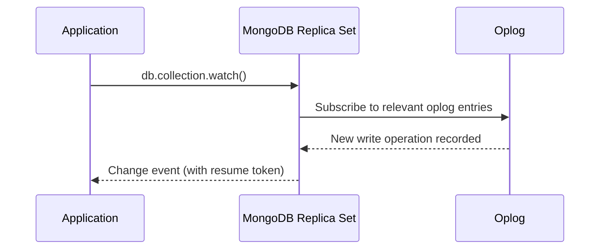

## Handy commands

These are administrative and operational commands for managing MongoDB instances, users, replica sets, and sharded clusters. They are typically run in `mongosh` (MongoDB Shell) by database administrators or during DevOps workflows.

---

### User and Authentication Management

**Intent**: Create, remove, and authenticate database users. MongoDB uses **Role-Based Access Control (RBAC)** — users are assigned roles that grant specific permissions.

**Switch to admin database and create a user:**
```js
use admin
db.createUser({"user": "root", "pwd": passwordPrompt(), "roles": ["root"]})
```
`passwordPrompt()` securely prompts for the password without exposing it in shell history. The `root` role has superuser access to all databases.

**Create a user with specific database roles:**
```js
use admin
db.createUser({
    user: "appUser",
    pwd: passwordPrompt(),
    roles: [
        { role: "readWrite", db: "myapp" },     // Read/write on myapp
        { role: "read", db: "analytics" }        // Read-only on analytics
    ]
})
```

**Common built-in roles:**

| Role | Scope | Permissions |
|------|-------|-------------|
| `read` | Database | Read all collections in a database |
| `readWrite` | Database | Read + write (insert, update, delete) |
| `dbAdmin` | Database | Index management, statistics, compact |
| `userAdmin` | Database | Create/modify users and roles |
| `clusterAdmin` | Cluster | Manage replica sets and sharding |
| `root` | All | Superuser — full access to everything |

**Drop a user:**
```js
db.dropUser("root")
```

**Authenticate a user:**
```js
db.auth("user", passwordPrompt())
```

---

### Database Navigation and Info

**Switch to test database:**
```js
use test
```

**Get sibling database:**
```js
db.getSiblingDB("dbname")
```
Useful in scripts to reference another database without `use`.

**Get current operations:**
```js
db.currentOp()
```
Shows all in-progress operations. Essential for identifying **long-running queries** or operations that are blocking others.

**Kill an operation:**
```js
db.killOp(123) // opid
```
Terminates a specific operation by its operation ID (found via `db.currentOp()`). Use this to stop runaway queries.

**Lock and unlock the database:**
```js
db.fsyncLock()
db.fsyncUnlock()
```
`fsyncLock()` flushes all writes to disk and locks the database against new writes. Used before taking **filesystem-level backups** (like snapshotting an EBS volume). Reads still work. Always `fsyncUnlock()` after the backup completes.

---

### Collection Information and Statistics

**Get collection names and information:**
```js
db.getCollectionNames()
db.getCollectionInfos()
db.printCollectionStats()
```
`getCollectionNames()` returns an array of collection names. `getCollectionInfos()` returns detailed metadata including validators and options. `printCollectionStats()` shows size, count, index size, and storage details for each collection.

**Get database statistics:**
```js
db.stats()
```
Returns the total data size, storage size, number of collections, indexes, and average object size for the current database.

---

### Replication Info

**Get replication information:**
```js
db.getReplicationInfo()
db.printReplicationInfo()
```
Shows the oplog (operations log) size, time span of operations in the oplog, and how far behind secondaries might be. Critical for monitoring **replication lag**.

---

### Server Management

**Get server information:**
```js
db.hello()
db.hostInfo()
```
`db.hello()` (replaces deprecated `isMaster()`) returns whether this node is primary/secondary, the replica set name, and connected members. `db.hostInfo()` returns OS-level info (CPU, memory, architecture).

**Shutdown the server:**
```js
db.shutdownServer()
```
Gracefully shuts down the `mongod` process. Must be run from the `admin` database. Add `{force: true}` to force shutdown even if there are active operations.

**Get server status:**
```js
db.serverStatus()
```
Returns a comprehensive document with connection count, memory usage, opcounters (insert/query/update/delete/getmore rates), lock statistics, and network traffic. Essential for **performance monitoring**.

---

### Profiling

**Intent**: The database profiler captures slow operations for analysis. Useful for identifying performance bottlenecks.

**Get and set profiling level:**
```js
db.getProfilingStatus()
db.setProfilingLevel(1, 200) // 0 == OFF, 1 == ON with slowms, 2 == ON
```

| Level | Behavior |
|-------|----------|
| `0` | Profiler OFF — no logging |
| `1` | Log operations slower than `slowms` threshold (200ms in example) |
| `2` | Log ALL operations (expensive — use only for debugging) |

```js
// Query the profiler results
db.system.profile.find({ millis: { $gt: 100 } }).sort({ ts: -1 }).limit(5)
// Shows the 5 most recent operations that took > 100ms
```

---

### Free Monitoring

**Enable and disable free monitoring:**
```js
db.enableFreeMonitoring()
db.disableFreeMonitoring()
db.getFreeMonitoringStatus()
```
MongoDB offers free cloud monitoring for standalone and replica set deployments. It provides a web dashboard with metrics for operations, memory, connections, and network. Data is sent to MongoDB's cloud service — review your security policies before enabling.

---

### Views

**Intent**: A **view** is a read-only "virtual collection" defined by an aggregation pipeline on a source collection. Views don't store data — they run the pipeline on every read.

**Create a view:**
```js
db.createView("viewName", "sourceColl", [{$project:{department: 1}}])
```

```js
// More practical example: view of active premium users
db.createView("premiumUsers", "users", [
    { $match: { status: "active", plan: "premium" } },
    { $project: { name: 1, email: 1, plan: 1, _id: 0 } }
])

// Query the view like a regular collection
db.premiumUsers.find()
db.premiumUsers.find({ name: "Alice" })

// ⚠️ Views are read-only — you cannot insert, update, or delete through a view
```

---

## Change Streams

**Intent**: Change Streams let you **watch for real-time changes** in a collection, database, or entire deployment. They use the oplog internally and are available on replica sets and sharded clusters. Common use cases: event-driven architectures, real-time notifications, cache invalidation, data synchronization.

**Watch for changes in a collection:**
```js
watchCursor = db.coll.watch([ { $match : {"operationType" : "insert" } } ])
while (!watchCursor.isExhausted()){
   if (watchCursor.hasNext()){
      print(tojson(watchCursor.next()));
   }
}
```

```js
// Watch for all change types (insert, update, delete, replace)
const changeStream = db.orders.watch()
changeStream.forEach(change => {
    printjson(change)
    // change.operationType: "insert", "update", "delete", "replace"
    // change.fullDocument: the complete document (for inserts/updates)
    // change.documentKey: { _id: ... }
    // change.updateDescription: { updatedFields, removedFields } (for updates)
})

// Watch with pipeline — only high-value orders
db.orders.watch([
    { $match: {
        "operationType": "insert",
        "fullDocument.amount": { $gte: 1000 }
    }}
])

// Resume a change stream after disconnect (using resume token)
const resumeToken = change._id  // Save this
db.orders.watch([], { resumeAfter: resumeToken })
```

---

## Replica Set

**Intent**: A **replica set** is a group of `mongod` instances that maintain the same data. It provides **high availability** (automatic failover) and **data redundancy**. One node is the **primary** (handles all writes), and the others are **secondaries** (replicate data from primary).

```
Replica Set Architecture:

  ┌──────────────────┐
  │    PRIMARY        │  ← All writes go here
  │  mongodb1:27017   │
  │  (reads + writes) │
  └────────┬─────────┘
           │  Oplog replication
     ┌─────┴─────┐
     ↓           ↓
┌──────────┐ ┌──────────┐
│SECONDARY │ │SECONDARY │  ← Replicate data from primary
│mongodb2  │ │mongodb3  │  ← Can serve reads (with read preference)
└──────────┘ └──────────┘

  If primary goes down → automatic election → a secondary becomes primary
```

**Get replica set status:**
```js
rs.status()
```
Returns the state of each member (PRIMARY, SECONDARY, ARBITER, DOWN), last heartbeat time, optime lag, and health status.

**Initialize a replica set:**
```js
rs.initiate({
  "_id": "RS1",
  members: [
    { _id: 0, host: "mongodb1.net:27017" },
    { _id: 1, host: "mongodb2.net:27017" },
    { _id: 2, host: "mongodb3.net:27017" }
  ]
})
```

**Add a member to the replica set:**
```js
rs.add("mongodb4.net:27017")
```

**Add an arbiter to the replica set:**
```js
rs.addArb("mongodb5.net:27017")
```
An **arbiter** participates in elections but doesn't hold data. Used when you need an odd number of voting members but can't afford another full data-bearing node.

**Remove a member from the replica set:**
```js
rs.remove("mongodb1.net:27017")
```

**Get replica set configuration:**
```js
rs.conf()
```

**Get replica set hello information:**
```js
rs.hello()
```

**Print replication information:**
```js
rs.printReplicationInfo()
rs.printSecondaryReplicationInfo()
```
Shows oplog window size (how much time of operations the oplog holds) and how far behind each secondary is.

**Reconfigure the replica set:**
```js
rs.reconfig(config)
rs.reconfigForPSASet(memberIndex, config, { options })
```

**Set read preference:**
```js
db.getMongo().setReadPref('secondaryPreferred')
```

**Read Preference options:**

| Preference | Behavior |
|-----------|----------|
| `primary` | All reads go to primary (default) — strongest consistency |
| `primaryPreferred` | Prefer primary, use secondary if primary unavailable |
| `secondary` | All reads go to secondaries — offloads primary |
| `secondaryPreferred` | Prefer secondary, use primary if no secondary available |
| `nearest` | Read from the node with lowest network latency |

**Step down the primary:**
```js
rs.stepDown(20, 5) // (stepDownSecs, secondaryCatchUpPeriodSecs)
```
Forces the current primary to step down and trigger an election. Used during **rolling maintenance** (upgrade one node at a time).

---

## Sharded Cluster

**Intent**: **Sharding** distributes data across multiple machines (shards) for horizontal scaling. Each shard holds a subset of the data. Used when a single replica set can't handle the data volume or write throughput.

```
Sharded Cluster Architecture:

  Application
       │
       ↓
  ┌──────────┐     Routes queries to correct shard(s)
  │  mongos   │     based on the shard key
  │  (router) │
  └─────┬─────┘
        │
  ┌─────┴──────────────────┐
  │                        │
  ↓           ↓            ↓
┌──────┐  ┌──────┐   ┌────────────┐
│Shard1│  │Shard2│   │Config Servers│  ← Store metadata
│(RS)  │  │(RS)  │   │(which data is│     (shard key ranges)
│A-M   │  │N-Z   │   │on which shard)│
└──────┘  └──────┘   └────────────┘
```

**Print sharding status:**
```js
db.printShardingStatus()
```

**Get sharding status:**
```js
sh.status()
```
Shows shards, databases, collections, chunk distribution, and balancer state.

**Add a shard to the cluster:**
```js
sh.addShard("rs1/mongodb1.example.net:27017")
```

**Shard a collection:**
```js
sh.shardCollection("mydb.coll", {zipcode: 1})
```
The **shard key** (`zipcode` in this example) determines how documents are distributed. Choosing the right shard key is critical — it should have high cardinality and even distribution.

**Move a chunk to a different shard:**
```js
sh.moveChunk("mydb.coll", { zipcode: "53187" }, "shard0019")
```

**Split a chunk at a specific point:**
```js
sh.splitAt("mydb.coll", {x: 70})
```

**Split a chunk based on a query:**
```js
sh.splitFind("mydb.coll", {x: 70})
```

---

### Balancer Management

The **balancer** automatically moves chunks between shards to ensure even distribution. It runs as a background process on the config server.

**Start and stop the balancer:**
```js
sh.startBalancer()
sh.stopBalancer()
```
Stop the balancer during **maintenance windows** or large data imports to avoid interference.

**Enable and disable balancing for a collection:**
```js
sh.disableBalancing("mydb.coll")
sh.enableBalancing("mydb.coll")
```

**Get and set balancer state:**
```js
sh.getBalancerState()
sh.setBalancerState(true/false)
```

**Check if the balancer is running:**
```js
sh.isBalancerRunning()
```

---

### Auto-Merger

**Start and stop auto-merger:**
```js
sh.startAutoMerger()
sh.stopAutoMerger()
```

**Enable and disable auto-merger:**
```js
sh.enableAutoMerger()
sh.disableAutoMerger()
```

---

### Zone Sharding

**Intent**: Zone sharding lets you **pin data to specific shards** based on shard key ranges. Common use case: keep EU user data in EU data centers and US data in US data centers for **data locality** and compliance.

**Update zone key range:**
```js
sh.updateZoneKeyRange("mydb.coll", {state: "NY", zip: MinKey }, { state: "NY", zip: MaxKey }, "NY")
```

**Remove range from zone:**
```js
sh.removeRangeFromZone("mydb.coll", {state: "NY", zip: MinKey }, { state: "NY", zip: MaxKey })
```

**Add and remove shard from zone:**
```js
sh.addShardToZone("shard0000", "NYC")
sh.removeShardFromZone("shard0000", "NYC")
```

```js
// Example: Geographic zone sharding
// 1. Tag shards with zone names
sh.addShardToZone("shard-us-east", "US")
sh.addShardToZone("shard-eu-west", "EU")

// 2. Define which shard key ranges belong to which zone
sh.updateZoneKeyRange("mydb.users",
    { region: "US" },    // min key
    { region: "US~" },   // max key (~ is after all ASCII chars)
    "US"
)
sh.updateZoneKeyRange("mydb.users",
    { region: "EU" },
    { region: "EU~" },
    "EU"
)
// Now all documents with region: "US*" go to shard-us-east
// and region: "EU*" go to shard-eu-west
```

---

## Change Streams — Concepts and Interview Q&A


### Change Streams

Change Streams allow applications to subscribe to real-time notifications of data changes (inserts, updates, deletes, replaces) on a collection, database, or entire deployment, without the complexity and inefficiency of tailing the oplog directly. They are built on top of the replication oplog but expose a stable, versioned API that is resilient to internal storage changes.

A common production use case is invalidating a cache or updating a search index (e.g. Elasticsearch) whenever a document changes, without polling the database or coupling the write path to secondary systems synchronously.

```javascript
// Open a change stream on a single collection
const changeStream = db.orders.watch()

changeStream.on('change', (change) => {
  console.log('Change detected:', change)
})
```

**Advantages:**
- Real-time, push-based notification instead of polling
- Resumable via resume tokens after a disconnect
- Can filter changes with an aggregation pipeline

**Disadvantages:**
- Requires a replica set or sharded cluster (not available on standalone servers)
- Consumers must handle resuming and de-duplication correctly to avoid missed or duplicated events

**Interview Questions:**
- What underlying mechanism do change streams use internally? — Change streams are built on top of the replication oplog, tailing it internally but exposing a stable, versioned public API rather than requiring applications to parse raw oplog entries directly.
- Why are change streams not available on a standalone `mongod` instance? — Change streams depend on the oplog, which only exists on replica sets (and by extension sharded clusters); a standalone server has no oplog since it doesn't replicate, so there's nothing for change streams to tail.
- How would you use a change stream to keep a search index in sync with MongoDB? — Open a change stream on the relevant collection(s), and for each insert/update/delete event received, apply the corresponding change to the search index (e.g. Elasticsearch) asynchronously, using resume tokens to ensure no events are missed across restarts.

### Event Notifications

Each change stream event is a document describing the operation type (`insert`, `update`, `delete`, `replace`, `invalidate`, etc.), the affected namespace, the document key, and — for updates — the specific fields that changed (`updateDescription`). Consumers can filter events using a `$match` stage passed to `watch()`.

```javascript
// Only watch for insert and update operations on the "orders" collection
db.orders.watch([
  { $match: { operationType: { $in: ['insert', 'update'] } } }
])
```



**Interview Questions:**
- What fields are typically present in a change stream event document? — A change event typically includes `_id` (the resume token), `operationType`, `ns` (namespace), `documentKey`, `fullDocument` (for inserts/replaces or when configured), and `updateDescription` (for updates, listing changed and removed fields).
- How would you filter a change stream to only receive events for a specific field update? — Pass a `$match` stage to `watch()` that filters on `operationType` and inspects `updateDescription.updatedFields` to only pass through events where the specific field of interest was modified.

### Resume Tokens

A resume token is an opaque value included in every change stream event that marks its position in the stream. If a consumer's connection drops, it can pass the last seen resume token back to `watch()` (via `resumeAfter` or `startAfter`) to continue exactly where it left off, without missing or reprocessing events.

```javascript
let resumeToken = null
const stream = db.orders.watch()

stream.on('change', (change) => {
  resumeToken = change._id
  // process change...
})

// On reconnect:
db.orders.watch([], { resumeAfter: resumeToken })
```

**Interview Questions:**
- What is a resume token used for and how does it enable fault-tolerant change stream consumers? — A resume token marks a change stream event's exact position in the underlying oplog; by persisting the last processed token, a consumer can reconnect after a crash or network drop and resume exactly where it left off, avoiding missed or duplicated events.
- What is the difference between `resumeAfter` and `startAfter`? — `resumeAfter` resumes strictly after a given token and can fail if that token refers to an invalidating event, while `startAfter` can also resume after an invalidate event (such as a collection drop/rename), making it more resilient for certain reconnection scenarios.
- What happens if the resume token refers to an oplog entry that has already been rolled off? — The change stream resume attempt fails with an error indicating the resume point is no longer available, since the corresponding oplog history has been overwritten; the consumer must then start a new change stream from the current time, potentially missing intervening events.

### Real-Time Data Processing

Change streams are commonly used to build event-driven pipelines: syncing data to caches or search engines, triggering microservice workflows, feeding data lakes, or driving real-time dashboards — all without a separate CDC (Change Data Capture) tool. In Spring applications, this is typically implemented with `MongoTemplate`'s reactive change stream support or Spring Data's `@Tailable` cursors for capped collections.

```java
// Spring Data MongoDB reactive change stream example
ChangeStreamOptions options = ChangeStreamOptions.builder()
    .filter(Aggregation.newAggregation(match(where("operationType").is("insert"))))
    .build();

reactiveMongoTemplate.changeStream("orders", options, Order.class)
    .doOnNext(event -> System.out.println("Change: " + event.getBody()))
    .subscribe();
```

**Interview Questions:**
- How would you design a real-time notification system on top of MongoDB change streams? — Open a change stream (filtered to relevant operations) on the collections of interest, transform each change event into a notification payload, and publish it to connected clients via WebSockets or Server-Sent Events, persisting resume tokens so the pipeline can recover from restarts without losing events.
- What are the trade-offs of using change streams versus a dedicated message broker (Kafka, RabbitMQ) for event-driven architectures? — Change streams avoid the operational overhead of running a separate messaging system and stay tightly consistent with the database, but lack advanced broker features like topic partitioning, long-term message retention, and cross-service pub/sub fan-out that a dedicated broker like Kafka provides.
