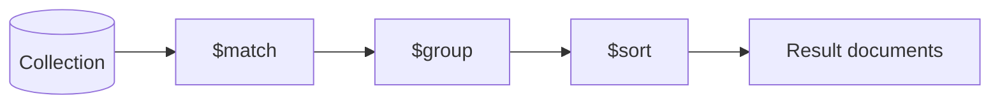

## Introduction

Aggregation framework is just another find method we could say but it has some other advantages too. In aggregation framework we basically create pipeline of steps which operates on datas of that collection.

**Why use the Aggregation Framework instead of `find()`?**

- `find()` can only filter and project — it cannot group, reshape, compute, or join data
- Aggregation pipelines can transform data through multiple stages, similar to UNIX pipes
- Operations like grouping, summing, averaging, joining collections, and reshaping documents are only possible with aggregation
- The aggregation framework runs on the server, avoiding transferring raw data to the application

```
Aggregation Pipeline Concept:

  Collection (raw documents)
       │
       ↓
  ┌──────────┐   ┌──────────┐   ┌──────────┐   ┌──────────┐
  │  $match  │──→│  $group  │──→│ $project │──→│  $sort   │──→ Results
  │ (filter) │   │(aggregate│   │(reshape) │   │(order)   │
  └──────────┘   └──────────┘   └──────────┘   └──────────┘
       Stage 1       Stage 2       Stage 3       Stage 4

  Each stage takes documents in, transforms them, and passes them to the next stage.
  Like UNIX: cat data.txt | grep "active" | sort | head -10
```

**Key Principles:**
- Stages execute in order — output of one stage becomes input for the next
- Place `$match` early to reduce documents flowing through the pipeline (performance)
- The pipeline operates on a **copy** of the data — the original collection is not modified
- Each stage can output a **different shape** of document than it received

---

### Common Aggregation Stages Reference

| Stage | Purpose | SQL Equivalent |
|-------|---------|---------------|
| `$match` | Filter documents | `WHERE` / `HAVING` |
| `$group` | Group and aggregate | `GROUP BY` |
| `$project` | Select/compute fields | `SELECT` |
| `$sort` | Order results | `ORDER BY` |
| `$limit` | Limit output count | `LIMIT` |
| `$skip` | Skip documents | `OFFSET` |
| `$unwind` | Flatten arrays | Lateral join |
| `$lookup` | Join collections | `LEFT OUTER JOIN` |
| `$count` | Count documents | `COUNT(*)` |
| `$addFields` | Add computed fields | `SELECT *, expr AS alias` |
| `$bucket` | Range-based grouping | `CASE WHEN ... GROUP BY` |
| `$facet` | Multiple pipelines | Multiple queries in one |
| `$out` / `$merge` | Write results | `INSERT INTO ... SELECT` |

---

### Aggregation Pipeline Example

This example demonstrates a multi-stage pipeline that filters, groups, projects, filters again, and sorts:

Aggregation Pipeline
```js
db.listingsAndReviews.aggregate([
    {
        $match: {
            number_of_reviews: { $gte: 100 } // Listings with more than 100 reviews
        } 
    },
    {
        $group : {
            _id : "$property_type",        // Group by property type
            count: { $sum : 1 },           // Total listings
            reviewCount: { $sum : "$number_of_reviews" },        // Total reviews
            avgPrice: { $avg : "$price" }, // Average price
        },
    },
    {
        $project: {
            _id: 1,
            count: 1,
            reviewCount: 1,
            avgPrice: { $ceil : "$avgPrice" } // Round up avgPrice
        }
    },
    {
        $match: {
            reviewCount: { $gte: 10000 } // Listings by property with more than 10000 total reviews
        } 
    },
    {
        $sort : { 
            count : -1, // Sort by count descending
            avgPrice: 1 // Sort by avgPrice ascending
        }
    }
])
```

**Step-by-step breakdown:**

```
Original collection: ~5000 listings
       │
  $match (reviews >= 100)  →  ~800 documents pass through
       │
  $group (by property_type)  →  ~15 groups (Apartment, House, etc.)
       │
  $project (round avgPrice)  →  Same 15 groups, reshaped
       │
  $match (reviewCount >= 10000)  →  ~5 groups remain
       │
  $sort (by count desc, avgPrice asc)  →  Final sorted results
```

---

### $lookup (Join)

`$lookup` performs a **left outer join** with another collection in the same database. This is MongoDB's equivalent of SQL `JOIN`.

```js
db.accounts.aggregate([
   {
      $lookup:
        {
          from: "transactions",         // join with 'transactions' collection
          localField: "account_id",     // field from the 'accounts' collection
          foreignField: "account_id",   // field from the 'transactions' collection
          as: "customer_orders"         // output array field
        }
   },
   {
      $match: { $expr: { $lt: [ {$size: "$customer_orders"}, 5 ] } } // filter for documents where 'customer_orders' is < 5
   },
])

```

**How $lookup works:**

```
accounts collection:             transactions collection:
┌──────────────────┐             ┌──────────────────────┐
│ { account_id: 1, │             │ { account_id: 1,     │
│   name: "Alice"} │             │   amount: 500 }      │
│ { account_id: 2, │             │ { account_id: 1,     │
│   name: "Bob" }  │             │   amount: 200 }      │
└──────────────────┘             │ { account_id: 2,     │
                                 │   amount: 100 }      │
                                 └──────────────────────┘

After $lookup:
┌────────────────────────────────────────────┐
│ { account_id: 1, name: "Alice",            │
│   customer_orders: [                       │
│     { account_id: 1, amount: 500 },        │
│     { account_id: 1, amount: 200 }         │
│   ]                                        │
│ }                                          │
│ { account_id: 2, name: "Bob",              │
│   customer_orders: [                       │
│     { account_id: 2, amount: 100 }         │
│   ]                                        │
│ }                                          │
└────────────────────────────────────────────┘
```

---

### $unwind — Flatten Arrays

`$unwind` deconstructs an array field, creating a separate document for each array element. This is essential when you need to aggregate on individual array items.

```js
// Original document:
// { _id: 1, name: "Alice", tags: ["mongodb", "nodejs", "python"] }

db.users.aggregate([
    { $unwind: "$tags" }
])

// Result: 3 separate documents:
// { _id: 1, name: "Alice", tags: "mongodb" }
// { _id: 1, name: "Alice", tags: "nodejs" }
// { _id: 1, name: "Alice", tags: "python" }
```

**Practical use — count tag frequency across all documents:**
```js
db.posts.aggregate([
    { $unwind: "$tags" },
    { $group: { _id: "$tags", count: { $sum: 1 } } },
    { $sort: { count: -1 } },
    { $limit: 10 }
])
// Returns the top 10 most used tags
```

**Preserve documents with empty/missing arrays:**
```js
{ $unwind: { path: "$tags", preserveNullAndEmptyArrays: true } }
// Without this option, documents where tags is [] or missing are dropped
```

---

### $addFields — Compute New Fields

`$addFields` adds new computed fields to documents without removing existing fields (unlike `$project` which requires you to explicitly include fields).

```js
db.orders.aggregate([
    { $addFields: {
        totalWithTax: { $multiply: ["$total", 1.18] },
        isHighValue: { $gte: ["$total", 1000] },
        orderYear: { $year: "$createdAt" }
    }}
])
```

---

### $bucket — Range-Based Grouping

Group documents into ranges (like a histogram):

```js
db.users.aggregate([
    { $bucket: {
        groupBy: "$age",
        boundaries: [0, 18, 30, 45, 60, 100],
        default: "Unknown",
        output: {
            count: { $sum: 1 },
            avgIncome: { $avg: "$income" },
            names: { $push: "$name" }
        }
    }}
])
// Groups users into age ranges: 0-17, 18-29, 30-44, 45-59, 60-99
```

---

### $facet — Multiple Pipelines in One Query

Run multiple aggregation pipelines in parallel on the same input documents:

```js
db.products.aggregate([
    { $facet: {
        "priceStats": [
            { $group: {
                _id: null,
                avgPrice: { $avg: "$price" },
                minPrice: { $min: "$price" },
                maxPrice: { $max: "$price" }
            }}
        ],
        "topRated": [
            { $sort: { rating: -1 } },
            { $limit: 5 },
            { $project: { name: 1, rating: 1 } }
        ],
        "categoryBreakdown": [
            { $group: { _id: "$category", count: { $sum: 1 } } },
            { $sort: { count: -1 } }
        ]
    }}
])
// Returns one document with three arrays: priceStats, topRated, categoryBreakdown
```

---

### $out / $merge — Write Results to a Collection

```js
// $out: REPLACE the entire target collection with pipeline results
db.orders.aggregate([
    { $group: { _id: "$customerId", totalSpent: { $sum: "$amount" } } },
    { $out: "customer_totals" }  // Creates/replaces 'customer_totals' collection
])

// $merge: INSERT or UPDATE into an existing collection (more flexible)
db.orders.aggregate([
    { $group: { _id: "$customerId", totalSpent: { $sum: "$amount" } } },
    { $merge: {
        into: "customer_totals",
        whenMatched: "merge",      // Update existing docs
        whenNotMatched: "insert"   // Insert new docs
    }}
])
```

---

### Real-World Aggregation Examples

**E-commerce: Monthly revenue report:**
```js
db.orders.aggregate([
    { $match: { status: "completed" } },
    { $group: {
        _id: {
            year: { $year: "$createdAt" },
            month: { $month: "$createdAt" }
        },
        totalRevenue: { $sum: "$amount" },
        orderCount: { $sum: 1 },
        avgOrderValue: { $avg: "$amount" }
    }},
    { $sort: { "_id.year": -1, "_id.month": -1 } },
    { $project: {
        _id: 0,
        period: { $concat: [
            { $toString: "$_id.year" }, "-",
            { $toString: "$_id.month" }
        ]},
        totalRevenue: { $round: ["$totalRevenue", 2] },
        orderCount: 1,
        avgOrderValue: { $round: ["$avgOrderValue", 2] }
    }}
])
```

**Social: User activity leaderboard:**
```js
db.activities.aggregate([
    { $match: { timestamp: { $gte: ISODate("2024-01-01") } } },
    { $group: {
        _id: "$userId",
        posts: { $sum: { $cond: [{ $eq: ["$type", "post"] }, 1, 0] } },
        comments: { $sum: { $cond: [{ $eq: ["$type", "comment"] }, 1, 0] } },
        likes: { $sum: { $cond: [{ $eq: ["$type", "like"] }, 1, 0] } },
        totalActions: { $sum: 1 }
    }},
    { $addFields: {
        score: { $add: [
            { $multiply: ["$posts", 10] },
            { $multiply: ["$comments", 5] },
            { $multiply: ["$likes", 1] }
        ]}
    }},
    { $sort: { score: -1 } },
    { $limit: 20 },
    { $lookup: {
        from: "users",
        localField: "_id",
        foreignField: "_id",
        as: "user"
    }},
    { $unwind: "$user" },
    { $project: {
        _id: 0,
        username: "$user.name",
        score: 1,
        posts: 1,
        comments: 1,
        likes: 1
    }}
])
```

---

### Performance Tips

```
Aggregation Pipeline Performance:

✅ DO:
  - Place $match and $limit as early as possible
  - Use indexes — $match and $sort can use indexes (only when first in pipeline)
  - Use $project early to drop unneeded fields (less data through pipeline)
  - Use allowDiskUse: true for large datasets exceeding 100MB memory limit

❌ DON'T:
  - Don't use $group on unfiltered collections (process all documents)
  - Don't $unwind large arrays without $match first
  - Don't $lookup without indexes on the foreign field
```

```js
// Enable disk use for large aggregations (default 100MB memory limit per stage)
db.orders.aggregate([
    { $group: { _id: "$customerId", total: { $sum: "$amount" } } }
], { allowDiskUse: true })

// Check aggregation explain plan
db.orders.explain("executionStats").aggregate([
    { $match: { status: "completed" } },
    { $group: { _id: "$customerId", total: { $sum: "$amount" } } }
])
```

---

## Aggregation Framework


### Aggregation Pipeline

The aggregation pipeline is a framework for transforming and analyzing documents by passing them through a sequence of stages, each performing an operation (filter, reshape, group, join, etc.) on the data and passing the result to the next stage — conceptually similar to Unix pipes. It is MongoDB's primary tool for complex analytics, reporting, and data transformation that goes beyond simple `find()` queries.



```javascript
db.orders.aggregate([
  { $match: { status: "SHIPPED" } },
  { $group: { _id: "$customerId", total: { $sum: "$amount" } } },
  { $sort: { total: -1 } }
]);
```

**Advantages:**
- Expressive, composable stages cover filtering, joining, grouping, and reshaping in one query
- Can push computation to the server, reducing data transferred to the application

**Disadvantages:**
- Complex pipelines can be harder to read/debug than simple queries
- Some stages (e.g., unindexed `$sort`, `$group`) can be memory-intensive

**Interview Questions:**
- How is the aggregation pipeline conceptually similar to Unix pipes? — Like Unix pipes chaining commands where each command's output feeds the next, an aggregation pipeline chains stages where each stage consumes the previous stage's output documents and passes its transformed result to the next stage.
- What is the difference between using `find()` with a filter versus an aggregation `$match` stage? — `find()` with a filter is a simple query returning matching documents (optionally reshaped via projection), while `$match` is one stage within a larger aggregation pipeline that can be combined with grouping, joining, and reshaping stages for far more complex analytics.
- How would you debug a slow aggregation pipeline? — Use `explain()` on the aggregation to inspect each stage's execution stats, check whether early stages like `$match`/`$sort` are using indexes, and look for expensive stages like unindexed `$sort`, `$group`, or `$lookup` without a foreign index that may need reordering or optimization.

### Pipeline Stages

Pipeline stages are the individual building blocks of an aggregation, executed in order, each consuming the output documents of the previous stage. Common stages include `$match`, `$project`, `$group`, `$sort`, `$limit`, `$skip`, `$unwind`, `$lookup`, `$facet`, `$bucket`, `$merge`, and `$out`. Stage order matters both for correctness and performance.

**Interview Questions:**
- Why does the order of stages in an aggregation pipeline matter for performance? — Placing filtering stages like `$match` early reduces the number of documents flowing into later, more expensive stages like `$group` or `$lookup`, minimizing total work done; reordering incorrectly can force MongoDB to process far more data than necessary.
- Which pipeline stages can make use of an index? — Stages like `$match` (especially when first in the pipeline), `$sort` (when it can use an index's natural order), and `$geoNear` can leverage indexes, while stages like `$group`, `$project`, and `$unwind` generally cannot use indexes directly.
- Can the same stage type (e.g., `$match`) appear multiple times in one pipeline? — Yes, the same stage type can appear multiple times at different points in a pipeline, each operating on the documents as transformed by the preceding stages at that point.

### Match

`$match` filters documents based on a query condition, functioning like the `find()` filter but within a pipeline. Placing `$match` as early as possible in a pipeline is a key optimization since it reduces the document count flowing into subsequent stages, and an early `$match` can use indexes.

```javascript
{ $match: { status: "SHIPPED", createdAt: { $gte: ISODate("2026-01-01") } } }
```

**Interview Questions:**
- Why is it recommended to place `$match` as early as possible in a pipeline? — An early `$match` filters out irrelevant documents before they reach more expensive downstream stages like `$group`, `$sort`, or `$lookup`, reducing the total data volume processed and improving overall pipeline performance.
- Can `$match` use an index? Under what conditions? — Yes, `$match` can use an index when it is the first stage in the pipeline (or immediately follows only index-compatible stages) and its filter conditions align with an existing index, just like a regular `find()` query.

### Project

`$project` reshapes documents by including, excluding, renaming, or computing new fields using expressions. It's often used to strip unneeded fields early (reducing memory for later stages) or to compute derived values.

```javascript
{ $project: { name: 1, totalWithTax: { $multiply: ["$amount", 1.08] }, _id: 0 } }
```

**Interview Questions:**
- How does `$project` differ from the `projection` argument of `find()`? — `$project` is a full pipeline stage that supports computed fields and expressions (like `$multiply` or `$concat`) in addition to inclusion/exclusion, while `find()`'s projection argument only supports simple field inclusion/exclusion without computed expressions.
- Can `$project` create entirely new computed fields? Give an example. — Yes, `$project` can compute new fields using aggregation expressions, for example `{ $project: { totalWithTax: { $multiply: ["$amount", 1.08] } } }` creates a new `totalWithTax` field derived from `amount`.

### Group

`$group` aggregates documents by a specified `_id` key (which can be `null` for a single overall group), computing accumulator expressions like `$sum`, `$avg`, `$min`, `$max`, `$push`, and `$addToSet` per group — analogous to SQL's `GROUP BY`.

```javascript
{ $group: { _id: "$customerId", orderCount: { $sum: 1 }, avgAmount: { $avg: "$amount" } } }
```

**Interview Questions:**
- How would you compute a grand total across all documents (not grouped by any field)? — Use `$group` with `_id: null`, which places every input document into a single overall group, allowing accumulators like `$sum` to compute a grand total across the entire collection (or pipeline input).
- What is the difference between `$push` and `$addToSet` accumulators? — `$push` collects every value into an array for each group, including duplicates, while `$addToSet` collects only distinct values, effectively deduplicating as it accumulates.
- Why can `$group` be memory-intensive on large datasets, and how does `allowDiskUse` help? — `$group` must hold intermediate group data (accumulator state per group) in memory as it processes documents, which can be large for many groups or large arrays; `allowDiskUse: true` lets MongoDB spill this intermediate data to disk when it exceeds the memory limit, trading speed for the ability to complete the operation.

### Sort

The `$sort` stage orders documents by one or more fields within the pipeline. Placing `$sort` before a `$limit` lets MongoDB optimize using a top-K sort algorithm, and placing it early enough may allow it to use an index.

```javascript
{ $sort: { totalSpent: -1 } }
```

**Interview Questions:**
- How does combining `$sort` immediately followed by `$limit` improve performance? — MongoDB recognizes the adjacent `$sort`+`$limit` combination and optimizes it into a top-K sort, only keeping track of the N smallest/largest documents in memory instead of sorting the entire input set.
- When can `$sort` in an aggregation pipeline use an index versus requiring an in-memory sort? — `$sort` can use an index when it's early enough in the pipeline (ideally the first stage, possibly after a `$match` using the same index) and its sort fields/directions match the index; otherwise it falls back to an in-memory sort subject to the 100MB limit.

### Limit

`$limit` restricts the number of documents passed to the next stage, commonly used with `$sort` for top-N queries or with `$skip` for pagination.

```javascript
{ $limit: 10 }
```

**Interview Questions:**
- Why is `{ $sort } { $limit }` more efficient than reversing the stage order? — With `$sort` before `$limit`, MongoDB can optimize the pair into a top-K sort that only tracks the needed number of top documents; reversing the order (`$limit` then `$sort`) would sort an arbitrary, potentially unrelated subset of documents, producing an incorrect and non-optimizable result.

### Skip

`$skip` bypasses a specified number of documents before passing the rest along the pipeline, typically used for pagination. Like the `skip()` cursor method, it still requires MongoDB to walk over the skipped documents, so it degrades for large offsets.

```javascript
{ $skip: 100 }
```

**Interview Questions:**
- Why is `$skip` inefficient for deep pagination on large collections? — Like the `skip()` cursor method, the `$skip` stage still requires MongoDB to iterate over and discard every skipped document, so cost grows linearly with the offset regardless of any index.
- What alternative pagination strategy avoids the cost of `$skip`? — Keyset (range-based) pagination, filtering with `$match` on the last seen sort key value (e.g., `{ _id: { $gt: lastSeenId } }`) instead of using `$skip`, avoids the linear scan cost of skipped documents.

### Unwind

`$unwind` deconstructs an array field, producing one output document per array element (each output document is a copy of the original with the array field replaced by a single element). It's essential for performing per-element analysis or joins on array data.

```javascript
db.orders.aggregate([
  { $unwind: "$items" },
  { $group: { _id: "$items.sku", totalQty: { $sum: "$items.qty" } } }
]);
```

**Interview Questions:**
- What happens to a document if the array field being unwound is empty or missing? — By default, `$unwind` drops the document entirely from the output if the array field is empty, missing, or not an array, unless `preserveNullAndEmptyArrays` is set to true.
- How does `preserveNullAndEmptyArrays` change `$unwind`'s default behavior? — Setting `preserveNullAndEmptyArrays: true` keeps documents with a missing, null, or empty array field in the output (with the field set to null/absent), instead of silently dropping them as `$unwind` does by default.
- Why might `$unwind` followed by `$group` be used together in real reporting pipelines? — `$unwind` flattens array elements into individual documents so that `$group` can then aggregate metrics per array element (e.g., total quantity sold per line item SKU across all orders), which wouldn't be possible while the values remained nested in an array.

### Lookup

`$lookup` performs a left outer join against another collection in the same database, matching a local field to a foreign field (or using a more flexible sub-pipeline form for complex join conditions), attaching matched documents as an array field.

```javascript
db.orders.aggregate([
  {
    $lookup: {
      from: "customers",
      localField: "customerId",
      foreignField: "_id",
      as: "customer"
    }
  },
  { $unwind: "$customer" }
]);
```

**Advantages:**
- Enables relational-style joins without denormalizing data
- The pipeline form supports complex, multi-condition joins

**Disadvantages:**
- Can be slow on large foreign collections without an index on the `foreignField`
- Adds latency compared to embedding related data directly

**Interview Questions:**
- What index should exist on the foreign collection to make `$lookup` efficient? — An index on the `foreignField` used in the `$lookup` (matching the collection referenced via `from`) is essential, since without it MongoDB must scan the entire foreign collection for every input document.
- How does the pipeline-based form of `$lookup` differ from the simple `localField`/`foreignField` form? — The pipeline-based form lets you run an arbitrary sub-pipeline (with `$match`, multiple conditions, `$expr`, etc.) against the foreign collection, supporting complex, multi-field join conditions that the simple `localField`/`foreignField` equality form cannot express.
- When would you choose embedding data over using `$lookup`? — Choose embedding when the joined data is small, bounded, and consistently accessed together with the parent, since embedding avoids the extra latency and potential index requirements of a `$lookup` join at query time.

### Facet

`$facet` runs multiple independent aggregation sub-pipelines within a single stage against the same input documents, returning all results together — useful for building a single response containing several different views of the data (e.g., paginated results plus a total count plus category breakdowns) in one round trip.

```javascript
db.products.aggregate([
  {
    $facet: {
      paginatedResults: [{ $skip: 0 }, { $limit: 10 }],
      totalCount: [{ $count: "count" }],
      byCategory: [{ $group: { _id: "$category", count: { $sum: 1 } } }]
    }
  }
]);
```

**Interview Questions:**
- What problem does `$facet` solve compared to running multiple separate aggregation queries? — `$facet` computes multiple independent views of the same input documents (e.g., paginated results, total count, and category breakdown) in a single aggregation call and round trip, instead of issuing several separate queries against the collection.
- Are the sub-pipelines inside `$facet` executed on the original input documents or on each other's output? — Each sub-pipeline inside `$facet` runs independently against the same original input documents entering the `$facet` stage; they do not see or depend on each other's output.

### Bucket

`$bucket` groups documents into discrete ranges ("buckets") based on a specified expression and boundary values, similar to a histogram — useful for reporting distributions like price ranges or age groups. `$bucketAuto` is a related stage that automatically computes boundaries for a target number of buckets.

```javascript
db.products.aggregate([
  {
    $bucket: {
      groupBy: "$price",
      boundaries: [0, 50, 100, 200, 500],
      default: "500+",
      output: { count: { $sum: 1 } }
    }
  }
]);
```

**Interview Questions:**
- What is the difference between `$bucket` and `$bucketAuto`? — `$bucket` requires you to explicitly specify the boundary values for each bucket, while `$bucketAuto` automatically computes bucket boundaries to distribute documents into a target number of buckets as evenly as possible.
- What happens to a document whose value falls outside all defined boundaries? — In `$bucket`, a document whose value falls outside all specified boundaries is placed into the bucket named by the `default` option, or the stage errors if no `default` is specified.

### Merge

`$merge` writes the aggregation pipeline's results into a specified collection (which can be a new or existing one, even in another database), supporting insert, replace, merge, or fail behaviors for conflicting documents — enabling incremental materialized views.

```javascript
db.orders.aggregate([
  { $group: { _id: "$customerId", total: { $sum: "$amount" } } },
  { $merge: { into: "customerTotals", whenMatched: "replace", whenNotMatched: "insert" } }
]);
```

**Differences:**

| Aspect | `$merge` | `$out` |
|---|---|---|
| Target collection | Can already contain data; merges/updates | Fully replaced |
| Conflict handling | Configurable (`whenMatched`/`whenNotMatched`) | N/A, full overwrite |
| Use case | Incremental materialized views | One-time snapshot/full refresh |

**Interview Questions:**
- How does `$merge` differ from `$out`? — `$merge` can write into a collection that already contains data, merging or updating matching documents based on configurable behaviors, while `$out` completely replaces the target collection's entire contents with the pipeline's output.
- What options control how `$merge` handles documents that already exist in the target collection? — The `whenMatched` option (e.g., `replace`, `merge`, `keepExisting`, `fail`, or a custom pipeline) and `whenNotMatched` option (e.g., `insert`, `discard`, `fail`) control how `$merge` handles existing versus new documents in the target collection.
- What is a practical use case for `$merge` (e.g., incrementally maintained materialized views)? — A practical use case is incrementally maintaining a `customerTotals` materialized view collection that's updated by re-running a nightly aggregation and merging new totals into the existing collection without wiping out unrelated historical data.

### Out

`$out` writes the aggregation results to a collection, completely replacing its previous contents (or creating it if it doesn't exist). It must be the last stage in the pipeline.

```javascript
db.orders.aggregate([
  { $group: { _id: "$customerId", total: { $sum: "$amount" } } },
  { $out: "customerTotalsSnapshot" }
]);
```

**Interview Questions:**
- Why must `$out` be the final stage of a pipeline? — `$out` completely replaces the target collection with the pipeline's output, so it wouldn't make sense to run further stages afterward since there is no further transformation needed; MongoDB enforces this by requiring `$out` to be last.
- What happens to the target collection's existing indexes when `$out` replaces its contents? — MongoDB preserves the target collection's existing indexes across the `$out` operation, rebuilding them against the new data rather than dropping them.

### Aggregation Pipeline Optimization

MongoDB automatically applies certain pipeline optimizations (e.g., merging adjacent `$match`/`$sort` stages, pushing `$match`/`$project` earlier when semantically safe, coalescing `$limit` into `$sort`). Developers can further optimize by placing `$match`/`$limit` early, projecting out unneeded fields before expensive stages, ensuring `$match`/`$sort` fields are indexed, and using `allowDiskUse: true` only when unavoidable for large `$group`/`$sort` operations.

```javascript
db.orders.aggregate(pipeline, { allowDiskUse: true });
```

**Interview Questions:**
- What automatic optimizations does the aggregation engine perform on pipeline stages? — MongoDB automatically merges adjacent `$match`/`$sort` stages where possible, pushes `$match`/`$project` earlier in the pipeline when semantically safe, and coalesces `$limit` into a preceding `$sort` for a top-K optimization.
- When would you need to enable `allowDiskUse`, and what is the tradeoff of doing so? — Enable `allowDiskUse: true` when a `$group` or `$sort` stage's intermediate data exceeds the 100MB in-memory limit; the tradeoff is slower execution since data must be spilled to and read from disk instead of staying fully in RAM.
- How would you use `explain()` on an aggregation pipeline to identify bottlenecks? — Call `.explain("executionStats")` on the aggregation to see per-stage execution statistics, revealing which stages examine the most documents, whether early stages use an index, and where time is spent so you can reorder or index accordingly.

### Window Functions

Window functions, exposed via the `$setWindowFields` stage, compute values across a "window" of related documents (partitioned and ordered, similar to SQL window functions) without collapsing them into groups the way `$group` does — enabling running totals, moving averages, and rankings while preserving each original document.

```javascript
db.sales.aggregate([
  {
    $setWindowFields: {
      partitionBy: "$region",
      sortBy: { date: 1 },
      output: {
        runningTotal: { $sum: "$amount", window: { documents: ["unbounded", "current"] } }
      }
    }
  }
]);
```

**Differences:**

| Aspect | `$group` | `$setWindowFields` |
|---|---|---|
| Output | One document per group | One document per input document, enriched |
| Preserves original rows | No | Yes |
| Typical use | Aggregated summaries | Running totals, moving averages, ranks |

**Interview Questions:**
- How does `$setWindowFields` differ from `$group` in terms of output shape? — `$setWindowFields` enriches each original input document with a computed window value while preserving one output document per input document, whereas `$group` collapses multiple documents into a single summary document per group.
- How would you compute a 7-day moving average using window functions? — Use `$setWindowFields` with `sortBy` on the date field and an `$avg` accumulator with a `window` range like `{ range: [-6, 0], unit: "day" }` (or a documents-based window sized to the desired span) to compute a rolling average over the trailing 7 days.
- What does `partitionBy` control in `$setWindowFields`? — `partitionBy` groups documents into separate partitions (similar to `$group`'s `_id`) so that window calculations like running totals or moving averages are computed independently within each partition, such as per-region rather than across the entire dataset.
