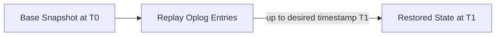
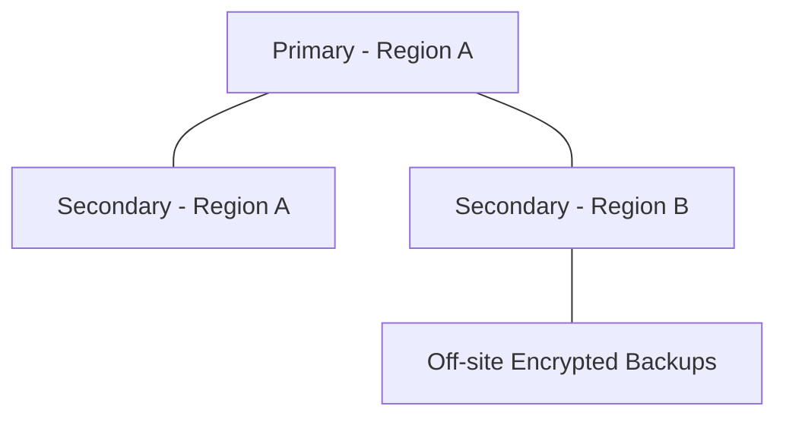

# Backup and Recovery

## mongodump

`mongodump` is a command-line utility that creates a binary (BSON) export of the data in a MongoDB database or collection, capturing documents and optionally indexes/metadata for later restoration with `mongorestore`. It can target a whole deployment, a single database, or a single collection, and supports query filters to export a subset of data. On a replica set, running it against a secondary with `--readPreference` avoids adding load to the primary.

```bash
# Dump an entire database to a local directory
mongodump --uri="mongodb://localhost:27017" --db=ecommerceDb --out=/tmp/backups/2026-08-02

# Dump only orders placed in the last 24 hours
mongodump --uri="mongodb://localhost:27017" --db=ecommerceDb --collection=orders \
  --query='{"orderDate": {"$gte": {"$date": "2026-08-01T00:00:00Z"}}}' \
  --out=/tmp/backups/orders-incremental
```

**Advantages:**
- Simple, built-in, no extra tooling required
- Supports filtering and per-collection granularity

**Disadvantages:**
- Not a point-in-time consistent snapshot across a whole sharded cluster unless carefully coordinated
- Slower and more resource-intensive than filesystem/block-level snapshots for very large datasets

**Interview Questions:**
- What does `mongodump` actually capture, and in what format? — `mongodump` captures documents (and optionally indexes/metadata) from a database or collection and exports them as binary BSON files that can later be restored with `mongorestore`.
- How would you take a backup without impacting the primary's performance? — Run `mongodump` against a secondary node using an appropriate `--readPreference` setting, offloading the backup's read load away from the primary that's serving live traffic.
- What are the limitations of `mongodump` for very large or sharded deployments? — `mongodump` is not inherently a point-in-time consistent snapshot across an entire sharded cluster unless carefully coordinated, and it's slower and more resource-intensive than filesystem or block-level snapshots for very large datasets.

## mongorestore

`mongorestore` loads BSON data produced by `mongodump` back into a MongoDB deployment, recreating collections, documents, and (optionally) indexes. It supports restoring into a different database/collection name than the source, dropping existing data before restore, and parallelism options (`--numParallelCollections`, `--numInsertionWorkersPerCollection`) to speed up large restores.

```bash
# Restore a database, dropping existing collections first
mongorestore --uri="mongodb://localhost:27017" --db=ecommerceDb --drop /tmp/backups/2026-08-02/ecommerceDb

# Restore into a differently named database (e.g. for testing)
mongorestore --uri="mongodb://localhost:27017" --nsFrom="ecommerceDb.*" --nsTo="ecommerceDbTest.*" /tmp/backups/2026-08-02/ecommerceDb
```

**Differences:**

| Tool | Direction | Common Flags |
|---|---|---|
| `mongodump` | Database → BSON files | `--db`, `--collection`, `--query`, `--out` |
| `mongorestore` | BSON files → Database | `--drop`, `--nsFrom`/`--nsTo`, `--numParallelCollections` |

**Interview Questions:**
- What does the `--drop` flag do during a restore, and when would you use it? — `--drop` tells `mongorestore` to drop each target collection before restoring its data, which you'd use when you want the restore to fully replace existing collection contents rather than merge with them.
- How can you restore a backup into a differently named database for testing? — Use the `--nsFrom` and `--nsTo` options to remap the namespace during restore, for example restoring `ecommerceDb.*` into `ecommerceDbTest.*` without altering the original backup files.
- How would you speed up a restore of a very large dataset? — Increase parallelism using flags like `--numParallelCollections` and `--numInsertionWorkersPerCollection`, which restore multiple collections and insert documents using multiple worker threads concurrently.

## Point-in-Time Recovery (Overview)

Point-in-time recovery (PITR) allows restoring a database to a specific moment rather than only to the time of the last full backup, typically by combining a base snapshot/backup with replayed oplog entries up to the desired timestamp. MongoDB Atlas offers continuous backup with PITR out of the box; self-managed deployments can approximate this by periodically archiving the oplog alongside filesystem snapshots and replaying oplog entries during restore.



**Advantages:**
- Enables recovery from logical errors (e.g. accidental deletes) to the exact moment before the mistake
- Reduces data loss window compared to relying solely on periodic full backups

**Disadvantages:**
- Requires retaining oplog history long enough to cover the desired recovery window
- More complex to implement and test on self-managed infrastructure compared to managed offerings

**Interview Questions:**
- What is the difference between a regular backup and point-in-time recovery? — A regular backup restores data to the exact moment the backup was taken, while point-in-time recovery can restore data to any specific moment (even between backups) by combining a base snapshot with replayed oplog entries up to the desired timestamp.
- How does the oplog enable point-in-time recovery? — Since the oplog records every write operation in sequence, replaying oplog entries from a base snapshot up to a chosen timestamp reconstructs the exact database state at that specific point in time.
- What operational requirement (oplog retention) is necessary to support PITR? — The oplog must be retained (not overwritten) for at least as long as the desired recovery window, meaning oplog size/retention must be large enough to cover the time span between backups plus any additional buffer needed for recovery scenarios.

## Backup Strategies

Backup strategy choices generally fall into logical backups (`mongodump`/`mongorestore`), filesystem/block-level snapshots (e.g. LVM snapshots, cloud disk snapshots), and managed continuous backup (MongoDB Atlas). Strategy selection depends on dataset size, RPO/RTO requirements, and whether the cluster is sharded (requiring coordinated snapshots across shards and config servers for consistency).

**Differences:**

| Strategy | Consistency | Speed (large data) | Sharded Cluster Support |
|---|---|---|---|
| `mongodump`/`mongorestore` | Per-collection, not cluster-wide atomic unless paused | Slower | Requires care/coordination |
| Filesystem snapshot | Point-in-time per node | Fast | Needs coordinated snapshot across shards + config servers |
| Managed (Atlas) continuous backup | Point-in-time, cluster-wide | Fast | Native support |

**Advantages:**
- Filesystem snapshots are typically faster and more scalable for large datasets
- Managed backup services remove most operational burden

**Disadvantages:**
- Filesystem snapshots require careful coordination in sharded clusters to avoid inconsistent cross-shard state
- Logical backups can be slow to restore for very large collections

**Interview Questions:**
- What factors determine whether you'd choose logical backups vs. filesystem snapshots? — Dataset size, required restore speed, and whether the cluster is sharded all matter: logical backups (`mongodump`) suit smaller datasets or selective exports, while filesystem snapshots scale better for very large datasets but require careful coordination across shards and config servers for a sharded cluster.
- Why is backing up a sharded cluster more complex than a single replica set? — A sharded cluster's data is spread across multiple independent shards plus config servers, so achieving a consistent, point-in-time backup requires coordinating snapshots across all of them simultaneously, unlike a single replica set where one consistent snapshot suffices.
- What are RPO and RTO, and how do they influence backup strategy? — RPO (Recovery Point Objective) defines the maximum acceptable data loss measured in time, and RTO (Recovery Time Objective) defines the maximum acceptable downtime during recovery; tighter RPO/RTO targets push toward more frequent backups, point-in-time recovery, and faster restore mechanisms like snapshots over logical dumps.

## Disaster Recovery

Disaster recovery (DR) planning covers how a MongoDB deployment survives catastrophic failures — data center outages, region-wide cloud provider incidents, or severe data corruption — going beyond routine backups to include geographically distributed replica set members, cross-region backup replication, documented and tested restore procedures, and defined RPO (Recovery Point Objective) and RTO (Recovery Time Objective) targets.

A typical production DR setup places replica set members across multiple availability zones or regions so a regional outage doesn't take down the whole deployment, combined with off-site backup copies and periodic restore drills to validate the plan actually works.



**Advantages:**
- Multi-region replica sets provide resilience against full data center/region loss
- Regularly tested restore procedures reduce the risk of backups being unusable when actually needed

**Disadvantages:**
- Cross-region replication adds network latency to write acknowledgment (if those members count toward write concern)
- Maintaining and regularly testing a DR plan requires ongoing operational investment

**Interview Questions:**
- What is the difference between a backup strategy and a full disaster recovery plan? — A backup strategy focuses narrowly on taking and storing copies of data, while a full disaster recovery plan additionally covers geographically distributed infrastructure, documented and tested restore procedures, and defined RPO/RTO targets to survive catastrophic failures like a regional outage.
- How would you design replica set topology to survive a regional outage? — Distribute replica set members across multiple availability zones or regions (e.g., primary and one secondary in Region A, another secondary in Region B) so that the loss of a single region still leaves enough members to maintain quorum and potentially elect a new primary.
- What are RPO and RTO, and how would you define them for a critical production database? — RPO is the maximum tolerable data loss window and RTO is the maximum tolerable downtime; for a critical production database you might define an RPO of minutes (via continuous oplog-based backups) and an RTO of under an hour, backed by tested automated restore procedures.
- Why is periodically testing a restore procedure just as important as taking the backup itself? — A backup that has never been restored successfully is unproven; regular restore drills catch issues like corrupted backups, missing files, or outdated procedures before they're discovered during an actual emergency when there's no room for error.
