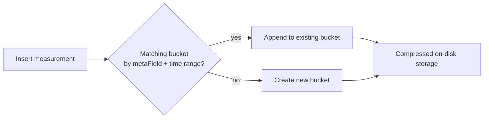

# Collections

## Capped Collections

Capped collections are fixed-size collections that preserve insertion order and automatically overwrite the oldest documents once the configured size (or document count) limit is reached, behaving like a circular buffer. Because there is no need to compute delete operations, writes are extremely fast and predictable in disk usage.

A common production use case is storing rolling application logs, recent audit events, or high-frequency telemetry where only the most recent window of data matters and older data can be discarded automatically without a background job.

```javascript
db.createCollection("appLogs", { capped: true, size: 5242880, max: 5000 });
db.appLogs.insertOne({ level: "INFO", msg: "service started", ts: new Date() });
db.appLogs.isCapped(); // true
```

**Advantages:**
- Very high write throughput; no delete overhead
- Naturally preserves insertion order without a secondary index
- Predictable, bounded disk footprint

**Disadvantages:**
- Individual documents cannot be deleted (only the whole collection can be dropped/recreated)
- Updates that increase a document's size are rejected
- Cannot be sharded, and cannot be manually resized without dropping and recreating

**Interview Questions:**
- What happens internally when a capped collection reaches its configured size limit? — Once the capped collection reaches its configured size (or document count) limit, MongoDB automatically overwrites the oldest documents to make room for new inserts, behaving like a circular buffer without requiring explicit delete operations.
- Can you delete a single document from a capped collection? Why or why not? — No, individual documents cannot be deleted from a capped collection; only the entire collection can be dropped and recreated, since the fixed-size, insertion-order design relies on automatic overwrite rather than arbitrary deletion.
- How do capped collections differ from using a TTL index on a regular collection? — A capped collection evicts the oldest documents purely based on reaching a size/count limit regardless of age, while a TTL index expires documents based on elapsed time from a date field, independent of collection size.
- Why can't capped collections be sharded? — Capped collections rely on maintaining strict insertion order and a fixed total size, which conflicts with sharding's need to distribute and rebalance data across multiple shards, so MongoDB disallows sharding them.

## Time Series Collections

Time series collections (introduced in MongoDB 5.0) are a purpose-built collection type optimized for storing sequences of measurements over time. Internally, MongoDB automatically groups related documents into compressed "buckets" by time range and metadata, which drastically reduces storage size and improves the performance of time-range queries and aggregations compared to storing raw documents.

They are ideal for IoT sensor readings, financial tick data, infrastructure/application metrics, or any workload that continuously ingests timestamped data and queries it by time range.

```javascript
db.createCollection("deviceReadings", {
  timeseries: {
    timeField: "timestamp",
    metaField: "deviceMetadata",
    granularity: "seconds"
  },
  expireAfterSeconds: 2592000 // optional TTL, 30 days
});

db.deviceReadings.insertOne({
  timestamp: new Date(),
  deviceMetadata: { deviceId: "sensor-42", location: "warehouse-1" },
  temperature: 21.5
});
```



**Advantages:**
- Automatic bucketing reduces storage and index overhead significantly
- Optimized query performance for time-range scans and aggregations
- Integrates with TTL for automatic data expiration

**Disadvantages:**
- Update/delete flexibility is more limited than regular collections
- Requires careful selection of `metaField` and `granularity` for optimal compression

**Differences:**

| Aspect | Time Series Collection | Capped Collection |
|---|---|---|
| Purpose | Timestamped measurement data | Fixed-size rolling buffer |
| Storage | Compressed, bucketed by time/metadata | Raw documents, fixed allocation |
| Expiration | TTL-based, automatic | Overwrite oldest on size limit |
| Query optimization | Time-range aware | None specific |

**Interview Questions:**
- What problem do time series collections solve compared to storing raw documents? — They solve the storage and query inefficiency of storing millions of individual timestamped documents by automatically bucketing related measurements together, drastically reducing storage size and speeding up time-range queries and aggregations.
- What role does the `metaField` play in bucketing? — The `metaField` identifies the metadata (e.g., device or source identifier) that groups related measurements together, so MongoDB buckets documents sharing the same metadata and time range into the same compressed bucket.
- How can you expire old time series data automatically? — You can set an `expireAfterSeconds` option on the time series collection, which automatically deletes buckets/documents older than the specified duration, similar to a TTL index.
- How does granularity affect bucket size and query performance? — The `granularity` setting (e.g., seconds, minutes, hours) tells MongoDB the expected time span between measurements, which it uses to size buckets appropriately — matching granularity to actual ingestion frequency optimizes both compression and query performance.

## Collection Validation

Collection validation lets you enforce a schema on documents using `$jsonSchema` (or query-style validation expressions) at the collection level. MongoDB checks the validator on inserts and updates, with `validationLevel` controlling how strictly it's enforced (`strict` vs `moderate`) and `validationAction` controlling whether violations are rejected (`error`) or just logged as warnings (`warn`).

This is useful when you want the flexibility of a document model during development but need guardrails in production to prevent malformed or inconsistent data from entering critical collections.

```javascript
db.createCollection("orders", {
  validator: {
    $jsonSchema: {
      bsonType: "object",
      required: ["customerId", "items", "status"],
      properties: {
        status: { enum: ["PENDING", "SHIPPED", "DELIVERED"] },
        items: { bsonType: "array", minItems: 1 }
      }
    }
  },
  validationLevel: "strict",
  validationAction: "error"
});

// Modify validation on an existing collection
db.runCommand({
  collMod: "orders",
  validationLevel: "moderate"
});
```

**Advantages:**
- Prevents malformed documents without requiring an external schema layer
- `moderate`/`warn` modes allow gradual rollout of stricter schemas
- Works alongside application-level validation (e.g., Spring Data MongoDB `@Validated` beans) as a defense-in-depth layer

**Disadvantages:**
- Validation errors can be less descriptive than application-level validation messages
- Schema changes require `collMod` and coordination with application deploys
- Does not validate documents already in the collection prior to the rule being added

**Interview Questions:**
- What is the difference between `validationLevel: strict` and `moderate`? — `strict` enforces the validator on all inserts and updates, while `moderate` only enforces it on inserts and on updates to documents that already satisfy the rules, letting pre-existing invalid documents continue to be modified without immediate compliance.
- What happens to existing documents when you add a validator to a populated collection? — Existing documents that violate the new validator are left untouched and remain in the collection; the validator only affects subsequent inserts and updates according to the configured `validationLevel`.
- How would you roll out a stricter schema without breaking existing writes? — Start with `validationAction: "warn"` and `validationLevel: "moderate"` to log violations without rejecting writes, monitor and fix offending data, then progressively tighten to `validationAction: "error"` and `validationLevel: "strict"`.
- How does collection validation compare to enforcing structure at the application layer? — Collection validation provides a database-level guardrail that applies regardless of which application or script writes to the collection, complementing (not replacing) application-level validation, which offers richer, more user-friendly error messages.

## Collection Options

Collections can be created with several configuration options beyond the default: `capped`, `size`, `max` (capped settings), `collation` (locale-aware string comparison rules), `storageEngine` (engine-specific options), `validator`/`validationLevel`/`validationAction` (schema rules), `timeseries` (time series settings), and `clusteredIndex`. These options are set at creation time via `db.createCollection()` and some can later be altered using the `collMod` command.

A common real-world example is setting a collection-wide `collation` so that string sorting and comparisons follow a specific language's rules (e.g., case-insensitive comparisons) without needing to specify collation on every query.

```javascript
db.createCollection("products", {
  collation: { locale: "en", strength: 2 } // case-insensitive comparisons
});
```

**Interview Questions:**
- What options can be configured when creating a collection in MongoDB? — Options include `capped`, `size`, and `max` for capped collections, `collation` for locale-aware comparisons, `storageEngine` for engine-specific settings, `validator`/`validationLevel`/`validationAction` for schema rules, `timeseries` settings, and `clusteredIndex`.
- How does setting a default `collation` on a collection affect query behavior? — A default collation applies its locale and comparison strength (e.g., case-insensitivity) to all string comparisons, sorts, and index usage on that collection unless a query explicitly overrides it with its own collation.
- Which collection options can be changed after creation using `collMod`, and which cannot? — Options like `validator`, `validationLevel`, `validationAction`, and TTL `expireAfterSeconds` can be changed later via `collMod`, while structural options like `capped` size/max, `collation`, and `clusteredIndex` key are generally fixed at creation time.

## Views

A view is a read-only, non-materialized "virtual collection" whose contents are computed on-the-fly by running an aggregation pipeline over an underlying source collection (or another view) each time it is queried. Views are useful for exposing a simplified, filtered, or reshaped projection of data to consumers without duplicating storage.

For example, you might expose an `activeCustomers` view over a large `customers` collection so reporting tools only ever see active, non-sensitive fields, without granting direct access to the raw collection.

```javascript
db.createView("activeCustomers", "customers", [
  { $match: { status: "ACTIVE" } },
  { $project: { name: 1, email: 1 } }
]);

db.activeCustomers.find({ name: /^A/ });
```

**Advantages:**
- No data duplication; always reflects current underlying data
- Simplifies access control by exposing only derived/filtered fields
- Reuses the full power of the aggregation framework

**Disadvantages:**
- Cannot be written to directly (no insert/update/delete on a view)
- No dedicated indexes of its own; performance depends on the underlying collection's indexes and pipeline complexity
- Adds pipeline execution overhead on every query compared to a materialized collection

**Interview Questions:**
- How is a view different from a materialized collection produced by `$merge` or `$out`? — A view is computed on-the-fly from its source every time it's queried and stores no data of its own, while `$merge`/`$out` write the aggregation results into an actual, persisted (materialized) collection that must be refreshed to stay current.
- Can you create indexes directly on a view? — No, a view has no storage or indexes of its own; query performance depends entirely on the indexes available on the underlying source collection and the complexity of the view's pipeline.
- Why might you use a view instead of restricting fields at the application layer? — A view enforces filtering/reshaping at the database level for every consumer regardless of which application or tool queries it, centralizing access control and projection logic rather than duplicating it across multiple application codebases.
- What happens to a view's results if the underlying collection is updated? — Since a view is non-materialized, its results always reflect the current state of the underlying collection the moment it's queried, with no risk of stale cached data.

## Clustered Collections

A clustered collection stores documents ordered directly by the value of a clustered index key (typically `_id`), meaning the collection's data file itself acts as the index — similar to a clustered index in relational engines like InnoDB. This eliminates the need for a separate `_id` index and can significantly reduce storage overhead and improve range-scan performance on the cluster key.

This is particularly beneficial for large, append-heavy collections such as time-ordered event logs where most queries filter or range-scan on `_id` or another monotonically increasing key.

```javascript
db.createCollection("events", {
  clusteredIndex: { key: { _id: 1 }, unique: true }
});
```

**Advantages:**
- Reduced storage footprint by avoiding a duplicate `_id` index
- Faster range scans on the clustered key
- Good fit for time-series-like or append-only workloads

**Disadvantages:**
- The clustering key must be chosen at creation time and is difficult to change later
- Not a general-purpose replacement for secondary indexes on other fields

**Differences:**

| Aspect | Clustered Collection | Regular Collection |
|---|---|---|
| `_id` storage | Data ordered by `_id`, no separate index | Separate B-tree index on `_id` |
| Range scans on `_id` | Very efficient | Requires index lookup + fetch |
| Storage overhead | Lower | Higher (extra index) |
| Flexibility | Cluster key fixed at creation | N/A |

**Interview Questions:**
- What is the core difference between a clustered collection and a normal collection with a default `_id` index? — In a clustered collection, documents are physically stored in order of the clustered key (typically `_id`), so the data file itself acts as the index, whereas a normal collection maintains a separate B-tree index pointing to document locations.
- What kinds of workloads benefit most from clustered collections? — Large, append-heavy, time-ordered workloads such as event logs or audit trails that frequently range-scan on `_id` or another monotonically increasing key benefit most, due to reduced storage overhead and faster range scans.
- Can the clustered index key be changed after the collection is created? — No, the clustering key must be chosen at collection creation time and cannot be changed afterward without recreating the collection.
