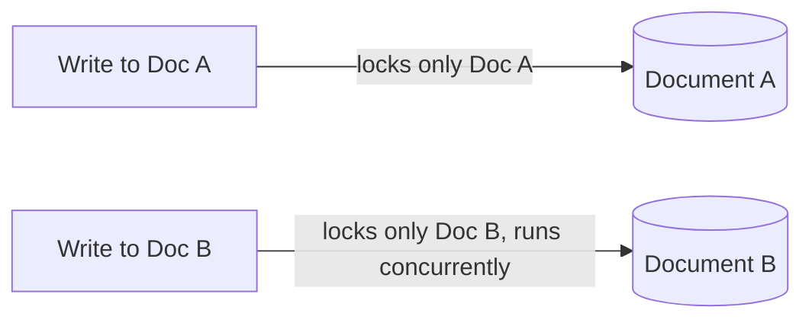

# Concurrency

## Document-Level Locking

MongoDB (with the WiredTiger storage engine) uses document-level concurrency control, meaning writes to different documents can proceed fully in parallel, and only the specific document being modified is locked for the duration of that operation. This is far more granular than older collection-level or database-level locking schemes.



**Advantages:**
- High write concurrency since unrelated documents never block each other
- Scales well for workloads with many independent documents

**Interview Questions:**
- What granularity of locking does WiredTiger use for writes? — WiredTiger uses document-level locking, meaning a write only locks the specific document being modified rather than the whole collection or database.
- How did document-level locking improve on MongoDB's older MMAPv1 storage engine locking model? — MMAPv1 used coarser database-level (and earlier, global) locking, which serialized many unrelated writes; WiredTiger's document-level locking allows writes to different documents to proceed fully in parallel, dramatically improving write concurrency.
- Can two concurrent writes to the same document proceed simultaneously? — No, two concurrent writes targeting the same document cannot proceed simultaneously; one must wait for the other to complete since the document itself is locked for the duration of the write.

## Optimistic Concurrency Concepts

Optimistic concurrency assumes conflicts are rare and lets operations proceed without locking ahead of time, detecting conflicts only at write time — typically implemented via a version field checked with a conditional update (compare-and-swap). If another process modified the document first, the conditional update matches zero documents and the application retries.

```java
@Version
private Long version; // Spring Data MongoDB optimistic locking field
```

```javascript
db.docs.updateOne(
  { _id: id, version: currentVersion },
  { $set: { value: newValue }, $inc: { version: 1 } }
);
// if matchedCount === 0, a concurrent update won the race — retry
```

**Differences:**

| Aspect | Optimistic Concurrency | Pessimistic Concurrency |
|---|---|---|
| Locking strategy | No upfront lock; detect conflicts at write time | Acquire lock before reading/modifying |
| Throughput | High under low contention | Lower due to blocking |
| Conflict handling | Retry on version mismatch | Prevented by blocking other readers/writers |
| MongoDB native support | Common pattern via version field + conditional update | Achieved via external locks or `findAndModify` |

**Interview Questions:**
- How would you implement optimistic concurrency control in MongoDB using a version field? — Add a `version` field to the document, read it along with the rest of the data, and perform the update with a filter that matches both the `_id` and the expected `version` value while incrementing the version, so the update only succeeds if no one else has modified the document in between.
- What should an application do when an optimistic update fails due to a version mismatch? — The application should detect that the update matched zero documents (indicating a concurrent modification), re-read the current document state, and retry its logic against the fresh data.
- Why is optimistic concurrency generally preferred in high-throughput, low-contention systems? — Optimistic concurrency avoids the overhead of acquiring locks upfront, allowing higher throughput when conflicts are rare, since most operations succeed on the first attempt and only the occasional conflicting write needs to retry.

## Atomic Operations

MongoDB provides several atomic single-document operations — `findAndModify`/`findOneAndUpdate`, update operators (`$inc`, `$set`, `$push`, etc.), and array operators — which are guaranteed to apply completely or not at all, and can be used to implement counters, queues, or state machines without a full transaction.

```javascript
db.counters.findOneAndUpdate(
  { _id: "orderSeq" },
  { $inc: { seq: 1 } },
  { returnDocument: "after", upsert: true }
);
```

**Interview Questions:**
- How can `findOneAndUpdate` with `$inc` be used to implement an atomic counter/sequence generator? — Calling `findOneAndUpdate` with an `$inc` operator on a dedicated counter document atomically increments and returns the new sequence value in one server-side operation, avoiding race conditions from a separate read-then-write approach.
- Why are atomic update operators preferable to a read-modify-write pattern in application code? — Update operators like `$inc` and `$push` execute atomically on the server in a single step, whereas a read-modify-write pattern in application code has a window where a concurrent write can be lost or overwritten between the read and the write.

## Write Conflicts

A write conflict occurs when two concurrent operations (often within transactions) attempt to modify the same document at the same time; MongoDB's WiredTiger engine detects this and aborts one of the operations with a `WriteConflict` error, which the driver/application should retry.

```javascript
try {
  session.startTransaction();
  // ... conflicting update ...
  session.commitTransaction();
} catch (e) {
  if (e.hasErrorLabel("TransientTransactionError")) {
    // retry the whole transaction
  }
}
```

**Interview Questions:**
- What causes a `WriteConflict` error in MongoDB, and which storage engine component detects it? — A `WriteConflict` occurs when two concurrent operations (often within transactions) attempt to modify the same document at the same time; MongoDB's WiredTiger storage engine detects this conflict and aborts one of the operations.
- How should an application respond when it receives a `TransientTransactionError`? — The application should catch the error label `TransientTransactionError` and retry the entire transaction from the beginning, since the error indicates the conflict was transient and likely to succeed on a subsequent attempt.
- How do write conflicts relate to the isolation guarantees of multi-document transactions? — Write conflicts are the mechanism by which MongoDB enforces snapshot isolation for transactions, ensuring that conflicting concurrent modifications to the same document are not silently merged but instead cause one transaction to abort and retry.
