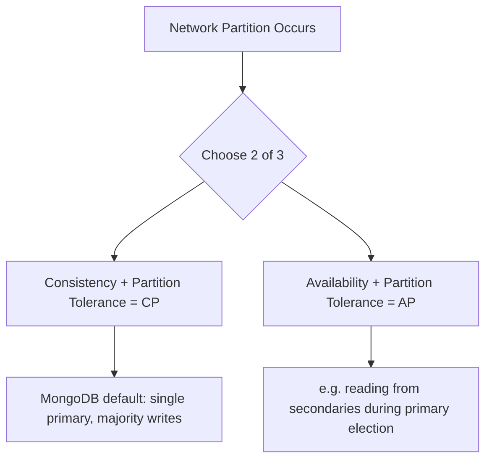

# Consistency and Availability

## CAP Theorem

The CAP theorem states that a distributed data system can only guarantee two out of three properties at any given moment when a network partition occurs: Consistency (every read receives the most recent write), Availability (every request receives a response, without guaranteeing it's the latest), and Partition tolerance (the system continues operating despite network failures between nodes). Since network partitions are unavoidable in real distributed systems, the practical choice is between consistency and availability during a partition.

MongoDB is generally classified as a CP system: by default, it favors consistency by routing all writes through a single primary and only exposing acknowledged, replicated data as durable, rather than allowing every replica to accept writes independently. However, its tunable read/write concerns and read preferences let application developers shift the balance toward availability when appropriate.



**Interview Questions:**
- Explain the CAP theorem in your own words and how it applies to MongoDB. — The CAP theorem states a distributed system can only guarantee two of Consistency, Availability, and Partition tolerance during a network partition; MongoDB, being a distributed replica set/sharded system, must choose how to behave when nodes can't communicate, and it defaults to prioritizing consistency.
- Why is MongoDB typically categorized as CP rather than AP? — MongoDB is categorized as CP because it routes all writes through a single Primary and only considers data durable once acknowledged per the configured write concern, favoring consistency over allowing every node to independently accept writes during a partition.
- How can you tune MongoDB's behavior to favor availability over strict consistency? — You can use weaker read/write concerns (e.g., `w:1`, `local` read concern) and secondary-friendly read preferences (`secondaryPreferred`, `nearest`), which allow reads and writes to succeed with less coordination, trading consistency guarantees for availability and latency.
- What happens to write availability during a primary election in a MongoDB replica set? — Writes are unavailable for the brief window (typically a few seconds) between the old Primary becoming unreachable and a new Primary being elected, since only a Primary can accept writes.

## Eventual Consistency

Eventual consistency means that if no new writes occur, all replicas of a piece of data will eventually converge to the same value, but reads immediately after a write are not guaranteed to reflect it everywhere. In MongoDB, secondary reads (when using non-primary read preferences) are eventually consistent because secondaries apply oplog entries asynchronously and may lag behind the primary (replication lag).

A common real-world use case is offloading reporting or analytics queries to secondary nodes to reduce load on the primary, accepting that the data might be a few seconds stale.

```javascript
// Explicitly allow eventually consistent reads from secondaries
db.orders.find({ status: "shipped" }).readPref("secondary")
```

**Advantages:**
- Improves read scalability and reduces load on the primary
- Keeps the system available even if some nodes are behind

**Disadvantages:**
- Application must tolerate stale reads, which is unsuitable for strongly consistent needs like financial balances
- Replication lag can vary unpredictably under heavy write load

**Interview Questions:**
- What causes eventual consistency in a MongoDB replica set? — Secondaries apply oplog entries from the Primary asynchronously, so there's a natural replication lag during which a secondary's data may not yet reflect the Primary's latest writes, causing eventual (rather than immediate) consistency for secondary reads.
- In what scenarios is eventual consistency an acceptable trade-off? — It's acceptable for read-heavy, non-critical workloads like reporting, analytics dashboards, or offloading traffic from the Primary, where slightly stale data doesn't cause business harm.
- How would you detect and monitor replication lag? — Use `rs.printSecondaryReplicationInfo()` or monitor the `optimeDate` differences between the Primary and Secondaries (also exposed via monitoring tools like Atlas or `db.serverStatus()`'s replication metrics) to detect and track lag.

## Read Preference

Read preference determines which member of a replica set (primary or secondaries) handles a given read operation. MongoDB supports five modes: `primary` (default, strongest consistency), `primaryPreferred`, `secondary`, `secondaryPreferred`, and `nearest` (lowest network latency, regardless of role). Read preference is set per-query, per-connection, or per-client, giving fine-grained control over the consistency/availability/latency trade-off.

```javascript
// Route analytics-style reads to secondaries to reduce primary load
db.orders.find({ region: "EU" }).readPref("secondaryPreferred")
```

```java
// Spring Data MongoDB: setting read preference via MongoTemplate
mongoTemplate.setReadPreference(ReadPreference.secondaryPreferred());
```

**Interview Questions:**
- What are the five read preference modes and when would you use each? — `primary` (default, strongest consistency, use for critical reads), `primaryPreferred` (fall back to secondary only if primary is down), `secondary` (always read from secondaries, for offloading load), `secondaryPreferred` (prefer secondaries but fall back to primary), and `nearest` (lowest latency node, for latency-sensitive global apps).
- What is the risk of using `secondary` read preference for critical reads? — Since secondaries replicate asynchronously, a `secondary` read may return stale data that doesn't reflect the most recent writes, which is risky for critical reads that require up-to-date information.
- How does `nearest` differ from `secondaryPreferred` in terms of node selection? — `nearest` selects whichever member (primary or secondary) has the lowest network latency to the client, while `secondaryPreferred` specifically prefers any secondary over the primary regardless of latency, only falling back to the primary if no secondary is available.

## Read Concern

Read concern controls the consistency guarantee of the data returned by a read operation, independent of which node serves it. Common levels include `local` (returns whatever data is on the queried node, no guarantee it's been replicated), `available`, `majority` (only returns data acknowledged by a majority of replica set members, guaranteeing it won't be rolled back), `linearizable` (strongest, guarantees the read reflects all previously completed majority-acknowledged writes), and `snapshot` (used with multi-document transactions).

```javascript
// Read only majority-committed data (won't be rolled back)
db.orders.find({ status: "paid" }).readConcern("majority")
```

**Differences:**

| Read Concern | Guarantee | Typical Use Case |
|---|---|---|
| `local` | Fastest, may return uncommitted/rollback-able data | Default, non-critical reads |
| `majority` | Data acknowledged by majority of replica set | Critical reads that must survive failover |
| `linearizable` | Reflects all prior majority writes, single-document only | Strongest consistency needs |
| `snapshot` | Consistent point-in-time view | Multi-document transactions |

**Interview Questions:**
- What is the difference between `local` and `majority` read concern? — `local` returns whatever data is currently on the queried node with no guarantee it has been replicated to a majority, while `majority` only returns data that has been acknowledged by a majority of replica set members, guaranteeing it won't later be rolled back.
- Why would `linearizable` read concern be slower than `majority`? — `linearizable` requires the read to confirm it reflects all previously completed majority writes, which involves additional coordination (including waiting on a no-op write to the majority) beyond simply checking majority-committed data, adding latency.
- When is `snapshot` read concern used? — `snapshot` read concern is used within multi-document transactions to give all reads within the transaction a consistent, point-in-time view of the data as of the transaction's start.

## Write Concern

Write concern specifies the level of acknowledgment MongoDB requires from replica set members before considering a write operation successful. It's expressed as `w` (number of nodes, or `"majority"`), `j` (whether the write must be committed to the on-disk journal), and `wtimeout` (how long to wait before giving up). Choosing a stronger write concern increases durability guarantees at the cost of latency.

```javascript
// Require acknowledgment from a majority of voting members, with journal commit
db.orders.insertOne(
  { customerId: "C123", total: 99.99 },
  { writeConcern: { w: "majority", j: true, wtimeout: 5000 } }
)
```

**Advantages:**
- `w: "majority"` protects against data loss from primary failover (rollback)
- Tunable per-operation, so critical writes can be stronger than bulk/log writes

**Disadvantages:**
- Higher write concerns increase write latency
- `wtimeout` too low can cause spurious failures under load; too high can hang requests

**Interview Questions:**
- What does `w: "majority"` protect against that `w: 1` does not? — `w: "majority"` protects against the write being rolled back after a primary failover by ensuring it's replicated to a majority of nodes first, whereas `w: 1` only confirms the primary accepted it, risking loss if the primary fails before replicating.
- What role does the `j` option play in write concern? — The `j` option requires the write to be committed to the on-disk journal on the acknowledging node(s) before the write is considered successful, protecting against loss from a process crash even before the next checkpoint.
- How would you choose write concern differently for an audit log vs. a financial transaction? — An audit log might use a lighter write concern like `w: 1` for lower latency since occasional loss is tolerable, while a financial transaction should use `w: "majority"` with `j: true` to guarantee durability and prevent silent data loss.

## Causal Consistency

Causal consistency guarantees that operations that are causally related (e.g. a write followed by a dependent read) are observed by every node in the correct order, even when reading from secondaries. MongoDB implements this via causally consistent sessions (`ClientSession`), which track logical timestamps (`operationTime`) and pass them between operations so subsequent reads wait until the required data has replicated.

A real-world scenario: a user updates their profile and immediately reloads the page — causal consistency ensures that even if the read is served from a secondary, it will reflect the just-completed write rather than stale data.

```javascript
const session = db.getMongo().startSession({ causalConsistency: true })
const orders = session.getDatabase("ecommerceDb").orders
orders.insertOne({ customerId: "C123", total: 49.99 })
// Subsequent reads within this session are guaranteed to see the insert above
orders.find({ customerId: "C123" }).readPref("secondary")
session.endSession()
```

**Interview Questions:**
- What problem does causal consistency solve for applications reading from secondaries? — It solves the problem of a client reading stale data from a secondary immediately after making a write, guaranteeing that causally related operations (a write followed by a dependent read) are observed in the correct order even across nodes.
- How does MongoDB track causal relationships between operations? — MongoDB uses causally consistent client sessions that track logical `operationTime` timestamps, passing them between operations so subsequent reads within the session wait until the relevant data has replicated to the node serving the read.
- What is the relationship between causally consistent sessions and read/write concern? — Causally consistent sessions work alongside read/write concern (typically requiring at least `majority` read/write concern) to guarantee that causal ordering is honored even when reads are routed to different nodes than the originating writes.
