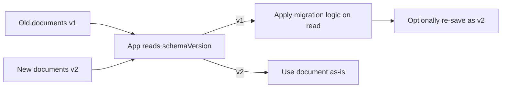

# MongoDB Design Patterns

## Bucket Pattern

The Bucket Pattern groups multiple related small documents (typically time-series or IoT sensor readings) into a single "bucket" document that holds an array of measurements within a fixed time range, instead of storing one document per reading. This drastically reduces the total document count and index overhead while keeping related data physically co-located.

A common use case is storing sensor readings taken every second: rather than one document per reading (millions per day), you bucket all readings for a sensor within a one-hour window into a single document with an array field.

```json
{
  "sensorId": "sensor-42",
  "startTime": "2026-08-02T10:00:00Z",
  "endTime": "2026-08-02T11:00:00Z",
  "readingsCount": 60,
  "readings": [
    { "ts": "2026-08-02T10:00:00Z", "temp": 21.5 },
    { "ts": "2026-08-02T10:01:00Z", "temp": 21.6 }
  ]
}
```

**Advantages:**
- Fewer documents means smaller indexes and less per-document overhead
- Related readings are read together in a single disk fetch

**Disadvantages:**
- Documents can grow large and require careful bucket-size limits
- Updating/appending to buckets requires careful array-size management to avoid document growth churn

**Interview Questions:**
- How does the Bucket Pattern improve performance for time-series workloads? — By grouping many time-series readings for a period (e.g. an hour) into a single document with an array field, the Bucket Pattern reduces the number of documents scanned and index entries needed, improving both read aggregation speed and write efficiency compared to one document per reading.
- What are the risks of unbounded array growth within a bucket document? — Without a cap on the number of readings per bucket, a document can grow toward the 16MB limit and suffer repeated in-place growth/relocation on disk, so buckets should have a fixed time window or maximum element count.
- How would you decide the time window size for a bucket? — Choose a window based on expected write frequency and typical query granularity, balancing enough readings per bucket to reduce document count against keeping bucket size well under the 16MB limit and matching how data is usually queried (e.g. hourly or daily rollups).

## Attribute Pattern

The Attribute Pattern converts many similar optional fields into an array of key/value sub-documents, making it easy to index and query a variable/sparse set of attributes without creating a separate index per field. It's especially useful for product catalogs where different products have different specification fields.

```json
{
  "name": "Wireless Headphones",
  "attributes": [
    { "k": "color", "v": "black" },
    { "k": "batteryLifeHours", "v": 30 },
    { "k": "wireless", "v": true }
  ]
}
```

**Advantages:**
- A single compound index on `attributes.k` and `attributes.v` can serve queries across many different attribute types
- Avoids needing dozens of sparse single-field indexes

**Disadvantages:**
- Queries become slightly more verbose (`{"attributes.k": "color", "attributes.v": "black"}`)
- Not ideal for attributes you always need to project directly

**Interview Questions:**
- What problem does the Attribute Pattern solve compared to storing each attribute as a top-level field? — It avoids needing a separate index per sparse/optional field by moving variable attributes into a key/value array, letting a single compound index serve queries across many different attribute types.
- How would you write an index to efficiently support the Attribute Pattern? — Create a compound index on the key and value sub-fields, e.g. `{ "attributes.k": 1, "attributes.v": 1 }`, so queries filtering on any attribute name/value pair can use the same index.

## Subset Pattern

The Subset Pattern addresses the "unbounded array" or "large document" problem by storing only a small, frequently accessed subset of a large array or related dataset in the main document (e.g. the 10 most recent reviews), while the full dataset is kept in a separate collection. This keeps the main document's working set small enough to fit comfortably in the WiredTiger cache.

```json
// product document keeps only the 5 most recent reviews inline
{
  "_id": "prod-1",
  "name": "Laptop",
  "recentReviews": [
    { "user": "alice", "rating": 5, "comment": "Great!" }
  ]
}
// full review history lives in a separate "reviews" collection, queried on demand
```

**Interview Questions:**
- When would you apply the Subset Pattern instead of embedding a full array? — When the full related array (e.g. all reviews) is large and rarely needed in its entirety, so embedding only the most relevant subset keeps the primary document small while the full data lives in a separate collection queried on demand.
- How does the Subset Pattern help with working-set size and cache efficiency? — By keeping frequently accessed documents small, more of the working set fits in the WiredTiger cache, reducing disk reads and improving overall read performance for the common access pattern.

## Extended Reference Pattern

The Extended Reference Pattern denormalizes a few frequently accessed fields from a referenced document into the referencing document, avoiding an extra lookup ($lookup or a second query) for common read paths, while still keeping the full referenced document elsewhere for less frequent needs.

```json
// order document embeds a small "extended reference" of the customer
{
  "_id": "order-100",
  "customerRef": { "customerId": "cust-9", "name": "Jane Doe", "email": "jane@example.com" },
  "items": [ { "sku": "SKU1", "qty": 2 } ]
}
```

**Advantages:**
- Eliminates a join/lookup for the most common read pattern
- Reduces read latency for frequently displayed data (e.g. order lists showing customer name)

**Disadvantages:**
- Denormalized copies must be kept in sync when the source data changes

**Interview Questions:**
- How does the Extended Reference Pattern trade off consistency for read performance? — It duplicates a few frequently needed fields from a referenced document into the referencing document, eliminating an extra lookup on the hot read path at the cost of the duplicated copy potentially becoming stale until it's synchronized.
- What strategy would you use to keep denormalized extended reference fields up to date? — Update the denormalized copies synchronously in the same write operation when the source changes, or use an asynchronous background job/change stream listener to propagate updates, accepting eventual consistency for rarely changing fields.

## Computed Pattern

The Computed Pattern precomputes and stores the result of an expensive calculation (sums, averages, counts) rather than recalculating it on every read. The computed value is updated periodically or on each write, trading a small amount of write-time cost for much cheaper reads.

```javascript
// Instead of summing all order line items on every product page view,
// maintain a precomputed "totalSold" field updated on each order.
db.products.updateOne(
  { _id: 'prod-1' },
  { $inc: { totalSold: 1, totalRevenue: 49.99 } }
)
```

**Interview Questions:**
- When is it worth the added write complexity to precompute a value versus calculating it on read? — When the value is read far more often than it changes, or the calculation is expensive (e.g. aggregating across many documents), so precomputing on write amortizes the cost across many cheap reads instead of recalculating every time.
- How would you keep a computed field consistent if updates can fail partway through? — Use atomic single-document update operators like `$inc` where possible, or wrap the computation and update in a multi-document transaction, and consider a periodic reconciliation job to detect and correct drift.

## Outlier Pattern

The Outlier Pattern handles the rare cases where a small percentage of documents would otherwise become abnormally large (e.g. a celebrity account with millions of followers) by flagging those documents and moving their overflow data to a secondary collection, while the common case remains a simple, compact document.

```json
{
  "_id": "user-1",
  "username": "celebrity_account",
  "hasOutlierFollowers": true,
  "followersPreview": ["user-2", "user-3"]
}
// full follower list for this specific user lives in a "user_followers_overflow" collection
```

**Interview Questions:**
- What problem does the Outlier Pattern solve that the Subset Pattern doesn't fully address? — It handles the rare extreme case (e.g. a celebrity account) where even a small embedded subset would still make that specific document abnormally large, by flagging and offloading the overflow data for just those outlier documents while most documents remain simple.
- How would you detect which documents need to be treated as outliers in your schema? — Track a count or size threshold (e.g. follower count, array length) and set a boolean flag such as `hasOutlierFollowers` once it's exceeded, then route overflow data to a secondary collection only for flagged documents.

## Schema Versioning Pattern

The Schema Versioning Pattern adds an explicit `schemaVersion` field to documents so that application code can support multiple document shapes simultaneously during a gradual, zero-downtime migration, instead of requiring a risky big-bang migration of all documents at once.

```json
{ "_id": "u1", "schemaVersion": 2, "name": "Alice", "address": { "city": "NYC" } }
{ "_id": "u2", "schemaVersion": 1, "name": "Bob", "city": "LA" }
```



**Advantages:**
- Enables rolling deployments and gradual background migration
- Avoids a long-running blocking migration script

**Disadvantages:**
- Application code must handle multiple schema versions concurrently, adding complexity

**Interview Questions:**
- How would you migrate a large production collection to a new schema without downtime? — Add a `schemaVersion` field, deploy application code that can read both old and new shapes, then gradually migrate documents in the background (e.g. on read-and-resave or via a batch job) rather than running one large blocking migration.
- Where should version-aware transformation logic live in a layered application (e.g. Spring service vs. repository)? — It belongs in a dedicated mapping/conversion layer (such as a custom converter or service-level adapter) rather than scattered across repositories, so version-handling logic is centralized and easy to remove once migration completes.
