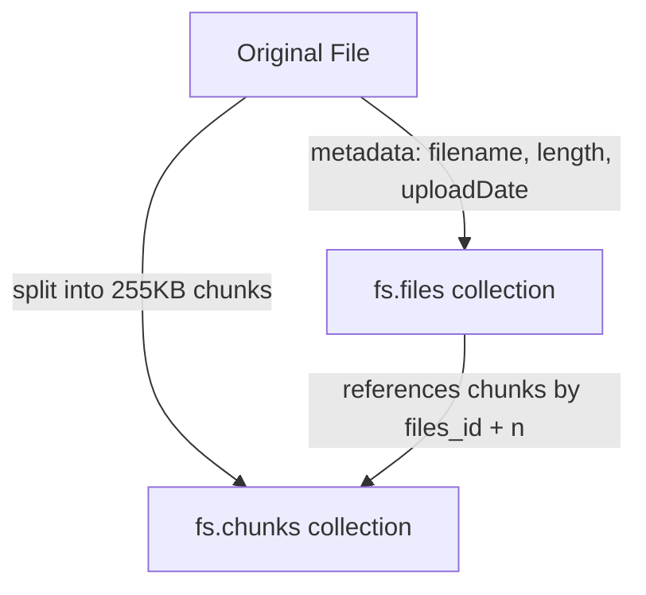

# GridFS

## GridFS Fundamentals

GridFS is a specification for storing and retrieving files that exceed the BSON document size limit of 16MB, or files that you want to serve in chunks (such as streaming video). Instead of storing a file as a single document, GridFS splits it into smaller chunks and stores each chunk as a separate document, alongside a single metadata document describing the file as a whole.

Use GridFS when you need to store large binary assets (images, videos, PDFs, backups) directly in MongoDB and want features like range queries on parts of a file, or when your file storage needs to scale and replicate along with the rest of your data. For simple small file storage, a plain `Binary` field or an external object store (S3, GCS) is often simpler and cheaper.

**Advantages:**
- Files larger than 16MB can be stored without hitting the BSON limit
- Chunks replicate/shard along with the rest of the database
- Partial reads of large files are efficient (e.g. seeking into a video)

**Disadvantages:**
- Higher operational complexity than a dedicated object store
- Not ideal for very small, frequently changing files due to per-chunk overhead
- No built-in atomicity across all chunks of a file during concurrent writes

**Interview Questions:**
- Why does GridFS exist and when should you use it instead of storing raw binary data in a document? — GridFS exists because a single BSON document is capped at 16MB, so files larger than that (or files you want to stream/range-read) cannot be stored as a plain `Binary` field; GridFS splits them into chunks to work around that limit while still replicating and sharding alongside the rest of the data.
- What are the alternatives to GridFS for storing large files and when would you choose them? — A dedicated object store like Amazon S3 or Google Cloud Storage is often preferable for large files, offering cheaper storage, built-in CDN integration, and simpler operations; GridFS is preferable when you want files to live alongside their metadata in the same database and replicate/shard as one system.

## File Storage

When a file is stored with GridFS, it is broken into chunks (default 255KB each) which are written to the `fs.chunks` collection, while a single document describing the file (filename, length, chunkSize, uploadDate, metadata) is written to `fs.files`. Drivers handle this splitting and reassembly transparently through a GridFS bucket API.

```javascript
// Using the mongosh/Node.js driver GridFSBucket API
const bucket = new mongodb.GridFSBucket(db, { bucketName: 'uploads' })

const uploadStream = bucket.openUploadStream('report.pdf', {
  metadata: { contentType: 'application/pdf', uploadedBy: 'user123' }
})
fs.createReadStream('./report.pdf').pipe(uploadStream)
```



**Interview Questions:**
- What is the default chunk size in GridFS and can it be changed? — The default chunk size is 255KB, and it can be changed by specifying a custom `chunkSizeBytes` option when opening an upload stream via the GridFS bucket API.
- What information is stored in `fs.files` versus `fs.chunks`? — `fs.files` stores one metadata document per file (filename, length, chunkSize, uploadDate, custom metadata), while `fs.chunks` stores the actual binary chunk data, each chunk referencing its parent file's `_id` and its sequence number.

## Buckets

A GridFS "bucket" is simply a named pair of collections (`<bucketName>.files` and `<bucketName>.chunks`) used to organize stored files. The default bucket name is `fs`, but applications can define multiple buckets (e.g. `images`, `videos`) to logically separate different kinds of file storage within the same database.

```javascript
// Create/use a custom bucket named "images"
const imagesBucket = new mongodb.GridFSBucket(db, { bucketName: 'images' })
```

**Interview Questions:**
- Why might an application use multiple GridFS buckets instead of the default one? — Separate buckets (e.g. `images`, `videos`) logically organize different kinds of file storage, allow different indexing or lifecycle policies per bucket, and keep unrelated file types from mixing within the same `files`/`chunks` collections.
- What indexes should exist on the `files` and `chunks` collections of a bucket for good performance? — The `chunks` collection should have a compound unique index on `{ files_id: 1, n: 1 }` for efficient ordered chunk retrieval, and the `files` collection typically has an index on `{ filename: 1, uploadDate: 1 }` to support lookups by filename.

## File Retrieval

Files are read back from GridFS by opening a download stream against the bucket, either by file `_id` or filename, which transparently reassembles the chunks in order into a continuous byte stream. GridFS also supports range reads (`start`/`end` options) so consumers can stream only part of a file, which is essential for features like video seeking.

```javascript
// Download a file by its ObjectId and pipe it to an HTTP response
const downloadStream = bucket.openDownloadStream(fileId)
downloadStream.pipe(res)

// Download only a byte range of the file
bucket.openDownloadStream(fileId, { start: 1000, end: 5000 }).pipe(res)
```

**Interview Questions:**
- How does GridFS support streaming a large video file without loading it entirely into memory? — GridFS download streams read and emit chunks incrementally as they're fetched from `fs.chunks`, and combined with range options (`start`/`end`), a client can request and stream only the needed byte range without ever holding the entire file in memory at once.
- What happens if a chunk in the middle of a file is missing or corrupted during retrieval? — The download stream will fail with an error once it reaches the missing or corrupted chunk, since GridFS relies on all chunks being present and in sequence to reassemble the complete file correctly.
