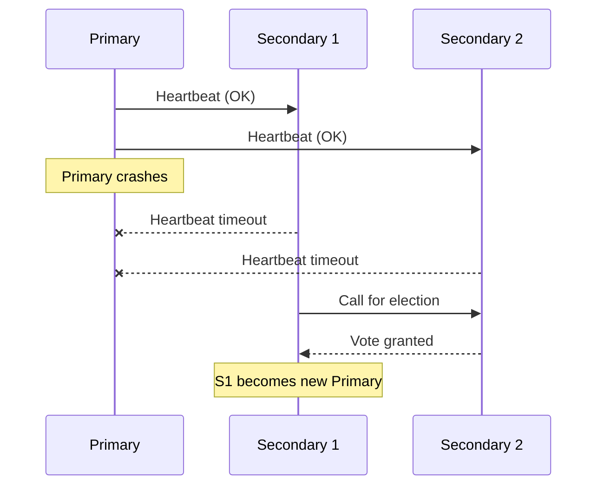

# High Availability

## Replica Set Failover

A replica set is a group of `mongod` instances maintaining the same data set, consisting of one primary (accepts writes) and multiple secondaries (replicate from the primary). If the primary becomes unreachable, the remaining members automatically hold an election to promote a new primary, allowing the application to continue writing with minimal manual intervention.



**Advantages:**
- Automatic failover with no manual DBA intervention required
- Reads can be distributed to secondaries for read scaling (with eventual consistency trade-offs)

**Disadvantages:**
- A brief write-unavailability window occurs during election (typically a few seconds)
- Requires an odd number of voting members (or an arbiter) to avoid split votes

**Interview Questions:**
- What triggers a replica set election and how long does failover typically take? — An election is triggered when secondaries stop receiving heartbeats from the primary within the election timeout (default 10 seconds); failover including detecting the failure and electing a new primary typically completes within a few seconds to around 12 seconds.
- What is the role of an arbiter in a replica set and when would you use one? — An arbiter is a voting-only member that participates in elections but holds no data, used to maintain an odd number of voters (avoiding split votes) when adding a full data-bearing member isn't justified by cost or hardware.
- How does a driver detect that a primary has changed and redirect writes? — The MongoDB driver continuously monitors the replica set topology via `isMaster`/`hello` commands and server description updates, and automatically retries and redirects writes to the newly elected primary once it's discovered.

## Heartbeats

Replica set members send heartbeat pings to each other roughly every 2 seconds to monitor availability. If a member doesn't respond within the configured `electionTimeoutMillis` (default 10 seconds), the other members consider it down and may trigger an election if the unreachable member was the primary.

**Interview Questions:**
- What is the default heartbeat interval and election timeout in a MongoDB replica set? — By default, members send heartbeats roughly every 2 seconds, and `electionTimeoutMillis` defaults to 10,000ms (10 seconds) before an unresponsive primary is considered down.
- How would you tune heartbeat/election timeouts for a cross-region replica set with higher network latency? — Increase `electionTimeoutMillis` (and possibly the heartbeat interval) to accommodate higher round-trip latency between regions, reducing the chance of unnecessary elections caused by transient network delay rather than an actual failure.

## Elections

Replica set elections use a Raft-inspired consensus protocol to select a new primary from the eligible secondaries. Members vote based on factors including data freshness (highest priority to the member with the most recent oplog entries), configured member `priority`, and network connectivity.

```javascript
// Configure member priority to influence election outcomes
cfg = rs.conf()
cfg.members[0].priority = 2   // prefer this member as primary
rs.reconfig(cfg)
```

**Interview Questions:**
- What factors determine which secondary is elected as the new primary? — Election outcome is determined primarily by which member has the most up-to-date oplog (most recent data), then by configured member `priority`, and by overall network connectivity/reachability to a majority of voting members.
- How can you configure a replica set member to never become primary? — Set that member's `priority` to 0 in the replica set configuration (`rs.reconfig()`), which allows it to vote and hold data/serve reads but excludes it from ever being elected primary.
- What is a rollback and when can it occur after an election? — A rollback occurs when a former primary rejoins the replica set after an election and discovers it had accepted writes that were never replicated to the new primary before failover; those un-replicated writes are reverted (rolled back) to keep the data set consistent.

## Disaster Recovery Concepts

Disaster recovery for MongoDB combines replica sets (for automatic failover within/across data centers), regular backups (logical `mongodump`/`mongorestore` or filesystem/volume snapshots), and point-in-time recovery via oplog replay. Multi-region replica set deployments protect against full data-center outages, while backups protect against logical corruption or accidental deletes that replication would otherwise faithfully propagate.

**Advantages:**
- Replica sets handle hardware/node failures automatically
- Snapshot + oplog backups enable point-in-time recovery from logical errors

**Disadvantages:**
- Replication alone does not protect against accidental deletes or application bugs that corrupt data (they replicate too)
- Cross-region replicas add write latency due to majority write concerns

**Interview Questions:**
- Why is replication alone not sufficient as a disaster recovery strategy? — Replication faithfully copies every write, including accidental deletes, data corruption, or application bugs, to all secondaries, so it protects against hardware failure but not against logical errors that need to be recovered from a point-in-time backup.
- How would you design a backup strategy that supports point-in-time recovery? — Combine periodic full snapshots (filesystem/volume snapshots or `mongodump`) with continuous oplog capture, so you can restore the last snapshot and then replay oplog entries up to the exact moment before the incident occurred.
- What is the difference between a logical backup and a filesystem snapshot backup in MongoDB? — A logical backup (`mongodump`) exports data as BSON documents independent of storage engine internals and is more portable but slower to restore, while a filesystem/volume snapshot captures the raw on-disk data files nearly instantaneously but is tied to the same storage engine and typically requires the mongod to be stopped or fsync-locked for consistency.
