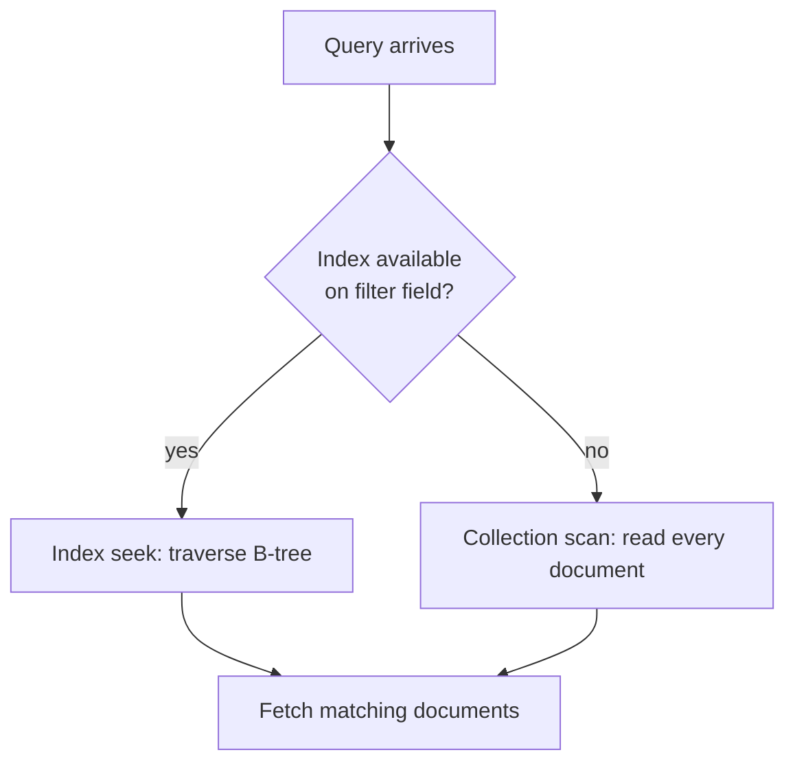

## Introduction

Indexes are special data structures that store a small portion of the collection's data in an easily traversable form. They dramatically improve query performance by avoiding full collection scans.

```
Without Index (COLLSCAN):            With Index (IXSCAN):

  ┌─────────────────────┐             ┌──────────────┐
  │ Scan ALL documents   │             │ B-Tree Index │
  │ doc1 → check         │             │   ┌───┐      │
  │ doc2 → check         │             │   │ M │      │
  │ doc3 → check         │             │  ┌┴─┬─┴┐    │
  │ ...                  │             │  │D │ │R│    │
  │ docN → check         │             │  └┬─┘ └┬┘   │
  │                      │             │  Jump directly│
  │ O(n) — slow          │             │  to matches   │
  └─────────────────────┘             │  O(log n)     │
                                      └──────────────┘
```

**Index Types at a Glance:**

| Index Type | Created With | Use Case |
|-----------|-------------|----------|
| **Single Field** | `{field: 1}` | Queries on one field |
| **Compound** | `{a: 1, b: 1}` | Queries on multiple fields (order matters!) |
| **Multikey** | `{arrayField: 1}` | Queries on array contents |
| **Text** | `{field: "text"}` | Full-text search |
| **Geospatial** | `{loc: "2dsphere"}` | Location queries |
| **Hashed** | `{field: "hashed"}` | Hash-based sharding |
| **Wildcard** | `{"$**": 1}` | Dynamic/unknown field structures |
| **TTL** | `{date: 1}, {expireAfterSeconds: N}` | Auto-delete expired documents |

**Index Trade-offs:**

| Benefit | Cost |
|---------|------|
| Faster reads (`find`, `sort`) | Slower writes (`insert`, `update`, `delete`) |
| Supports covered queries | Uses disk space & RAM |
| Enables efficient sorting | Max 64 indexes per collection |

---

Why Indexes?

An index can speed up our find update and delete query. If our query is like `db.products.find({ seller : "Max" })` then MongoDB will search for the entire collection for the seller name `"Max"`, which is also called as `COLLSCAN` and this can take a while if there is million record. 

So, in that case we can create a `Index` on `Selle`r field. MongoDB will create an `Ordered` list with all the values of the `Seller`s and all the items of this list will have a pointer to the actual document in the collection. 
Now if we run the exact query then Mongodb will see that there is an `Index` on Seller so MongoDB will run `IXSCAN` and directly jump to `"M"` which will speed up the querying.

But we should not overdo the indexes. If we can index on all fields, then it will certainly improve the performance for the find query but for the `insert` query it will slow down. As now it will again have to update the Ordered list for every field index for every insert and update.

To see the all the index present on the collection:
```js
> db.infos.getIndexes()
[ { "v" : 2, "key" : { "_id" : 1 }, "name" : "_id_" } ]
```

By default, mongodb will create an index on `_id` field.
To create an index on specific fields:
```js
db.infos.createIndex( { "dob.age" : 1} } )

db.infos.createIndex( { "dob.age" : -1} } )
```
`1` means increasing and `-1` means decreasing Though that does not matter as mongoDB can traverse both ways. 

We can also create index with more than on field. The order matters here.
```js
db.infos.createIndex( { "email" : 1, "dob.age" : 1} } )
```
This means that mongoDb will create a `compound index` and first the `index` with email then `dob.age`
Example: (a@test.com,23) will come before (a.@test.com,24) 

To drop the index use:
```js
>db.infos.dropIndex({ "dob.age": 1 })
{ "nIndexesWas" : 2, "ok" : 1 }
```

We can also drop index by name. 
```js
> db.infos.dropIndex("dob.age_1")
{ "nIndexesWas" : 2, "ok" : 1 }
```


## Query Explain

To analyse how a query will execute mongodb has a unique method that is explain().
```js
> db.infos.explain().find( { "dob.age" : { $gt : 60 }} )
{
        "explainVersion" : "1",
        "queryPlanner" : {
                "namespace" : "persons.infos",
                "indexFilterSet" : false,
                "parsedQuery" : {
                        "dob.age" : {
                                "$gt" : 60
                        }
                },
                "queryHash" : "FC9E47D2",
                "planCacheKey" : "A5FF588D",
                "maxIndexedOrSolutionsReached" : false,
                "maxIndexedAndSolutionsReached" : false,
                "maxScansToExplodeReached" : false,
                "winningPlan" : {
                        "stage" : "COLLSCAN",
                        "filter" : {
                                "dob.age" : {
                                        "$gt" : 60
                                }
                        },
                        "direction" : "forward"
                },
                "rejectedPlans" : [ ]
        },
        "command" : {
                "find" : "infos",
                "filter" : {
                        "dob.age" : {
                                "$gt" : 60
                        }
                },
                "$db" : "persons"
        },
        
        "ok" : 1
}
```

In the winning plan we can see `COLLSCAN` as mongodb searched the entire collection for this query.
There is also a rejected plans array but currently it is empty as mongodb has no other option than searching the entire array.

We can also add additional properties in explain(). It will print some additional information
```js
> db.infos.explain("executionStats").find( { "dob.age" : { $gt : 60 }} )
{
        "explainVersion" : "1",
        "queryPlanner" : {
                "namespace" : "persons.infos",
                "indexFilterSet" : false,
                "parsedQuery" : {
                        "dob.age" : {
                                "$gt" : 60
                        }
                },
                "maxIndexedOrSolutionsReached" : false,
                "maxIndexedAndSolutionsReached" : false,
                "maxScansToExplodeReached" : false,
                "winningPlan" : {
                        "stage" : "COLLSCAN",
                        "filter" : {
                                "dob.age" : {
                                        "$gt" : 60
                                }
                        },
                        "direction" : "forward"
                },
                "rejectedPlans" : [ ]
        },
        "executionStats" : {
                "executionSuccess" : true,
                "nReturned" : 1222,
                "executionTimeMillis" : 3,
                "totalKeysExamined" : 0,
                "totalDocsExamined" : 5000,
                "executionStages" : {
                        "stage" : "COLLSCAN",
                        "filter" : {
                                "dob.age" : {
                                        "$gt" : 60
                                }
                        },
                        "nReturned" : 1222,
                        "executionTimeMillisEstimate" : 0,
                        "works" : 5002,
                        "advanced" : 1222,
                        "needTime" : 3779,
                        "needYield" : 0,
                        "saveState" : 5,
                        "restoreState" : 5,
                        "isEOF" : 1,
                        "direction" : "forward",
                        "docsExamined" : 5000
                }
        },
        "command" : {
                "find" : "infos",
                "filter" : {
                        "dob.age" : {
                                "$gt" : 60
                        }
                },
                "$db" : "persons"
        },
        
        "ok" : 1
}
```

Here we can see some other additional informations like totalDocumentScan, totalDocumentReturn, executionTimeMillis.

Now if we do the indexing on dob.age and run the same query with explain
```js
> db.infos.createIndex( { "dob.age" : 1} )
{
        "numIndexesBefore" : 1,
        "numIndexesAfter" : 2,
        "createdCollectionAutomatically" : false,
        "ok" : 1
}

> db.infos.explain("executionStats").find( { "dob.age" : { $gt : 60 }} )
{
        "explainVersion" : "1",
        "queryPlanner" : {
                "namespace" : "persons.infos",
                "indexFilterSet" : false,
                "parsedQuery" : {
                        "dob.age" : {
                                "$gt" : 60
                        }
                },
                "maxIndexedOrSolutionsReached" : false,
                "maxIndexedAndSolutionsReached" : false,
                "maxScansToExplodeReached" : false,
                "winningPlan" : {
                        "stage" : "FETCH",
                        "inputStage" : {
                                "stage" : "IXSCAN",
                                "keyPattern" : {
                                        "dob.age" : 1
                                },
                                "indexName" : "dob.age_1",
                                "isMultiKey" : false,
                                "multiKeyPaths" : {
                                        "dob.age" : [ ]
                                },
                                "isUnique" : false,
                                "isSparse" : false,
                                "isPartial" : false,
                                "indexVersion" : 2,
                                "direction" : "forward",
                                "indexBounds" : {
                                        "dob.age" : [
                                                "(60.0, inf.0]"
                                        ]
                                }
                        }
                },
                "rejectedPlans" : [ ]
        },
        "executionStats" : {
                "executionSuccess" : true,
                "nReturned" : 1222,
                "executionTimeMillis" : 50,
                "totalKeysExamined" : 1222,
                "totalDocsExamined" : 1222,
                "executionStages" : {
                        "stage" : "FETCH",
                        "nReturned" : 1222,
                        "executionTimeMillisEstimate" : 0,
                        "works" : 1223,
                        "advanced" : 1222,
                        "needTime" : 0,
                        "needYield" : 0,
                        "saveState" : 1,
                        "restoreState" : 1,
                        "isEOF" : 1,
                        "docsExamined" : 1222,
                        "alreadyHasObj" : 0,
                        "inputStage" : {
                                "stage" : "IXSCAN",
                                "nReturned" : 1222,
                                "executionTimeMillisEstimate" : 0,
                                "works" : 1223,
                                "advanced" : 1222,
                                "needTime" : 0,
                                "needYield" : 0,
                                "saveState" : 1,
                                "restoreState" : 1,
                                "isEOF" : 1,
                                "keyPattern" : {
                                        "dob.age" : 1
                                },
                                "indexName" : "dob.age_1",
                                "isMultiKey" : false,
                                "multiKeyPaths" : {
                                        "dob.age" : [ ]
                                },
                                "isUnique" : false,
                                "isSparse" : false,
                                "isPartial" : false,
                                "indexVersion" : 2,
                                "direction" : "forward",
                                "indexBounds" : {
                                        "dob.age" : [
                                                "(60.0, inf.0]"
                                        ]
                                },
                                "keysExamined" : 1222,
                                "seeks" : 1,
                                "dupsTested" : 0,
                                "dupsDropped" : 0
                        }
                }
        },
        "command" : {
                "find" : "infos",
                "filter" : {
                        "dob.age" : {
                                "$gt" : 60
                        }
                },
                "$db" : "persons"
        },
   
        "ok" : 1
}
```
Now the query did not search for the entire collection it has done an `IXSCAN`.


---

## Indexes Behind the Scenes

**Intent**: Understanding how indexes work internally helps you make better decisions about when and how to create them. MongoDB uses a **B-Tree** data structure for indexes.


**What does createIndex() do in detail?**

Whilst we can't really see the index, you can think of the index as a simple list of values + pointers to the original document.
Something like this (for the "age" field):

- (29, "address in memory/ collection a1")
- (30, "address in memory/ collection a2")
- (33, "address in memory/ collection a3")

The documents in the collection would be at the "addresses" a1, a2 and a3. The order does not have to match the order in the index (and most likely, it indeed won't).

The important thing is that the index items are ordered (ascending or descending - depending on how you created the index). 

`createIndex({age: 1})` creates an index with ascending sorting, `createIndex({age: -1})` creates one with descending sorting.

MongoDB is now able to quickly find a fitting document when you filter for its age as it has a sorted list. Sorted lists are way quicker to search because you can skip entire ranges (and don't have to look at every single document).

Additionally, sorting (via sort(...)) will also be sped up because you already have a sorted list. Of course, this is only true when sorting for the age.

Let's say all our document has `age` greater than 50 and in query `[db.infos.find({"dob.age": { $gt: 20 }})]` we are trying to find the documents greater than `20` so it will return all the documents. So, in this case IXSCAN has the less performance as it will introduce an extra step. As at first the mongodb will scan the entire index then it will go to the actual mongodb collection. If we delete the index, then it will again search with COLSCAN and eventually that will have a better performance. So, it is recommended that only to use index when the query will return a `small subset` of the actual collection. 

Index on Boolean value does not make much sense.


---

## Compound index

**Intent**: A compound index indexes multiple fields together. The **order of fields matters** — MongoDB can use the index for queries on the **prefix** (left-to-right) of the indexed fields, but NOT for queries on non-prefix fields alone.

```
Compound Index: { "dob.age": 1, "gender": 1 }

  Index entries (sorted):
  (20, "female") → doc
  (20, "male")   → doc
  (21, "female") → doc
  ...
  (35, "male")   → doc    ← Can find this efficiently

  ✅ find({age: 35})              — Uses index (prefix match)
  ✅ find({age: 35, gender: "m"}) — Uses index (full match)
  ❌ find({gender: "male"})       — COLLSCAN (not a prefix)
```

first let's create a compound index
```js
> db.infos.createIndex({ "dob.age" : 1, "gender" : 1})
{
    "numIndexesBefore" : 1,
    "numIndexesAfter" : 2,
    "createdCollectionAutomatically" : false,
    "ok" : 1
}
```

If we search with dob.age and gender then mongodb will use this compound index.
```js
> db.infos.explain("executionStats").find({"dob.age" : 35, "gender" : "male"})
{
        "explainVersion" : "1",
        "queryPlanner" : {
                "namespace" : "persons.infos",
                "indexFilterSet" : false,
                "parsedQuery" : {
                        "$and" : [
                                {
                                        "dob.age" : {
                                                "$eq" : 35
                                        }
                                },
                                {
                                        "gender" : {
                                                "$eq" : "male"
                                        }
                                }
                        ]
                },
                "maxIndexedOrSolutionsReached" : false,
                "maxIndexedAndSolutionsReached" : false,
                "maxScansToExplodeReached" : false,
                "winningPlan" : {
                        "stage" : "FETCH",
                        "inputStage" : {
                                "stage" : "IXSCAN",
                                "keyPattern" : {
                                        "dob.age" : 1,
                                        "gender" : 1
                                },
                                "indexName" : "dob.age_1_gender_1",
                                "isMultiKey" : false,
                                "multiKeyPaths" : {
                                        "dob.age" : [ ],
                                        "gender" : [ ]
                                },
                                "isUnique" : false,
                                "isSparse" : false,
                                "isPartial" : false,
                                "indexVersion" : 2,
                                "direction" : "forward",
                                "indexBounds" : {
                                        "dob.age" : [
                                                "[35.0, 35.0]"
                                        ],
                                        "gender" : [
                                                "[\"male\", \"male\"]"
                                        ]
                                }
                        }
                },
                "rejectedPlans" : [ ]
        },
        "executionStats" : {
                "executionSuccess" : true,
                "nReturned" : 43,
                "executionTimeMillis" : 19,
                "totalKeysExamined" : 43,
                "totalDocsExamined" : 43,
                "executionStages" : {
                        "stage" : "FETCH",
                        "nReturned" : 43,
                        "executionTimeMillisEstimate" : 11,
                        "works" : 44,
                        "advanced" : 43,
                        "needTime" : 0,
                        "needYield" : 0,
                        "saveState" : 1,
                        "restoreState" : 1,
                        "isEOF" : 1,
                        "docsExamined" : 43,
                        "alreadyHasObj" : 0,
                        "inputStage" : {
                                "stage" : "IXSCAN",
                                "nReturned" : 43,
                                "executionTimeMillisEstimate" : 11,
                                "works" : 44,
                                "advanced" : 43,
                                "needTime" : 0,
                                "needYield" : 0,
                                "saveState" : 1,
                                "restoreState" : 1,
                                "isEOF" : 1,
                                "keyPattern" : {
                                        "dob.age" : 1,
                                        "gender" : 1
                                },
                                "indexName" : "dob.age_1_gender_1",
                                "isMultiKey" : false,
                                "multiKeyPaths" : {
                                        "dob.age" : [ ],
                                        "gender" : [ ]
                                },
                                "isUnique" : false,
                                "isSparse" : false,
                                "isPartial" : false,
                                "indexVersion" : 2,
                                "direction" : "forward",
                                "indexBounds" : {
                                        "dob.age" : [
                                                "[35.0, 35.0]"
                                        ],
                                        "gender" : [
                                                "[\"male\", \"male\"]"
                                        ]
                                },
                                "keysExamined" : 43,
                                "seeks" : 1,
                                "dupsTested" : 0,
                                "dupsDropped" : 0
                        }
                }
        },
        "command" : {
                "find" : "infos",
                "filter" : {
                        "dob.age" : 35,
                        "gender" : "male"
                },
                "$db" : "persons"
        },
}
```


If we just look for the age, then also mongodb will use this index as "dob.age" comes first in the index order.

```js
> db.infos.explain("executionStats").find({"dob.age" : 35})
{
        "explainVersion" : "1",
        "queryPlanner" : {
                "namespace" : "persons.infos",
                "indexFilterSet" : false,
                "parsedQuery" : {
                        "dob.age" : {
                                "$eq" : 35
                        }
                },
                "maxIndexedOrSolutionsReached" : false,
                "maxIndexedAndSolutionsReached" : false,
                "maxScansToExplodeReached" : false,
                "winningPlan" : {
                        "stage" : "FETCH",
                        "inputStage" : {
                                "stage" : "IXSCAN",
                                "keyPattern" : {
                                        "dob.age" : 1,
                                        "gender" : 1
                                },
                                "indexName" : "dob.age_1_gender_1",
                                "isMultiKey" : false,
                                "multiKeyPaths" : {
                                        "dob.age" : [ ],
                                        "gender" : [ ]
                                },
                                "isUnique" : false,
                                "isSparse" : false,
                                "isPartial" : false,
                                "indexVersion" : 2,
                                "direction" : "forward",
                                "indexBounds" : {
                                        "dob.age" : [
                                                "[35.0, 35.0]"
                                        ],
                                        "gender" : [
                                                "[MinKey, MaxKey]"
                                        ]
                                }
                        }
                },
                "rejectedPlans" : [ ]
        },
        "executionStats" : {
                "executionSuccess" : true,
                "nReturned" : 95,
                "executionTimeMillis" : 0,
                "totalKeysExamined" : 95,
                "totalDocsExamined" : 95,
                "executionStages" : {
                        "stage" : "FETCH",
                        "nReturned" : 95,
                        "executionTimeMillisEstimate" : 0,
                        "works" : 96,
                        "advanced" : 95,
                        "needTime" : 0,
                        "needYield" : 0,
                        "saveState" : 0,
                        "restoreState" : 0,
                        "isEOF" : 1,
                        "docsExamined" : 95,
                        "alreadyHasObj" : 0,
                        "inputStage" : {
                                "stage" : "IXSCAN",
                                "nReturned" : 95,
                                "executionTimeMillisEstimate" : 0,
                                "works" : 96,
                                "advanced" : 95,
                                "needTime" : 0,
                                "needYield" : 0,
                                "saveState" : 0,
                                "restoreState" : 0,
                                "isEOF" : 1,
                                "keyPattern" : {
                                        "dob.age" : 1,
                                        "gender" : 1
                                },
                                "indexName" : "dob.age_1_gender_1",
                                "isMultiKey" : false,
                                "multiKeyPaths" : {
                                        "dob.age" : [ ],
                                        "gender" : [ ]
                                },
                                "isUnique" : false,
                                "isSparse" : false,
                                "isPartial" : false,
                                "indexVersion" : 2,
                                "direction" : "forward",
                                "indexBounds" : {
                                        "dob.age" : [
                                                "[35.0, 35.0]"
                                        ],
                                        "gender" : [
                                                "[MinKey, MaxKey]"
                                        ]
                                },
                                "keysExamined" : 95,
                                "seeks" : 1,
                                "dupsTested" : 0,
                                "dupsDropped" : 0
                        }
                }
        },
        "command" : {
                "find" : "infos",
                "filter" : {
                        "dob.age" : 35
                },
                "$db" : "persons"
        }
}
```

But if we only search will the gender then index has no use because gender is not sorted primarily. It is secondary sort on the dob.age. Here mongodb will use the full COLLSCAN.
```js
> db.infos.explain("executionStats").find({"gender" : "male"})
{
        "explainVersion" : "1",
        "queryPlanner" : {
                "namespace" : "persons.infos",
                "indexFilterSet" : false,
                "parsedQuery" : {
                        "gender" : {
                                "$eq" : "male"
                        }
                },
                "maxIndexedOrSolutionsReached" : false,
                "maxIndexedAndSolutionsReached" : false,
                "maxScansToExplodeReached" : false,
                "winningPlan" : {
                        "stage" : "COLLSCAN",
                        "filter" : {
                                "gender" : {
                                        "$eq" : "male"
                                }
                        },
                        "direction" : "forward"
                },
                "rejectedPlans" : [ ]
        },
        "executionStats" : {
                "executionSuccess" : true,
                "nReturned" : 2435,
                "executionTimeMillis" : 4,
                "totalKeysExamined" : 0,
                "totalDocsExamined" : 5000,
                "executionStages" : {
                        "stage" : "COLLSCAN",
                        "filter" : {
                                "gender" : {
                                        "$eq" : "male"
                                }
                        },
                        "nReturned" : 2435,
                        "executionTimeMillisEstimate" : 0,
                        "works" : 5002,
                        "advanced" : 2435,
                        "needTime" : 2566,
                        "needYield" : 0,
                        "saveState" : 5,
                        "restoreState" : 5,
                        "isEOF" : 1,
                        "direction" : "forward",
                        "docsExamined" : 5000
                }
        },
        "command" : {
                "find" : "infos",
                "filter" : {
                        "gender" : "male"
                },
                "$db" : "persons"
        }
}
```

**Sorting with indexing:**

If we are sorting on any field and that field has an indexing, then mongodb will not sort it will directly use the indexed records as mongodb already has a sorted list on that field.

If we are trying to sort on a large number of documents, then it will time out. MongoDB has a memory of `32 megabytes` of memory of sorting. By default, mongodb loads all the documents on its memory then it sorts on them. So, without indexing sometimes it is not possible to get the sorted documents.

When we are creating any index on that time, we can specify that the index will be `unique` or not. By default, the indexing on `$id` holds unique criteria.
```js
> db.infos.createIndex({ email : 1 }, { unique : true })
```

Before creating index if there is already any duplicate email available then it will throw an error.
```js
> db.infos.createIndex({ email : 1 }, { unique : true })
{
        "ok" : 0,
        "errmsg" : "Index build failed: 8aff9b57-7fce-4ff9-8631-4f22c63ddaff: Collection persons.infos ( c6d8709f-2a51-4bda-ac9e-343a639304d6 ) :: caused by :: E11000 duplicate key error collection: persons.infos index: email_1 dup key: { email: \"abigail.clark@example.com\" }",
        "code" : 11000,
        "codeName" : "DuplicateKey",
        "keyPattern" : {
                "email" : 1
        },
        "keyValue" : {
                "email" : "abigail.clark@example.com"
        }
}
```


---

## Partial filter/Indexing

**Intent**: Partial indexes only index documents that match a filter expression. This reduces index size and write overhead — useful when you only query a subset of documents frequently.

We can always use compound indexing but the problem with the compound indexing is that it takes much space in discs. So, in that case we can use partial filter like if we know that gender male is frequently queried rather than female. So, we can create a partial index with gender male.


Creating a partial index on gender `male`
```js
> db.infos.createIndex({"dob.age" : 1}, {partialFilterExpression : {"gender" : 1}} )
{
        "numIndexesBefore" : 1,
        "numIndexesAfter" : 2,
        "createdCollectionAutomatically" : false,
        "ok" : 1
}
```

Getting all the index information
```js
> db.infos.getIndexes()
[
    {
        "v" : 2,
        "key" : {
            "_id" : 1
        },
        "name" : "_id_"
    },
    {
        "v" : 2,
        "key" : {
            "dob.age" : 1
        },
        "name" : "dob.age_1",
        "partialFilterExpression" : {
            "gender" : 1
        }
    }
]
```

Drawback of this partial filter is that now when we just query for the `"dob.age"` it will not use `IXSCAN` it will use the `COLLSCAN`. But if we also mention gender male then it will use the `IXSCAN`.

Advantage of partial filter is that now the write query is more efficient as the size of the ordered list is small.

If we have an index on `email` and `unique true` and if we enter document `without email` then mongodb will treat that document as email equal to `null`. Again, if we try to `insert` any document `without` email then mongoDB will `throw an exception` as email `null` is already stored in ordered list. We cannot add null value again.

To allow this condition we can use unique true with partial filter expression.
```js
> db.infos.createIndex({"dob.age" : 1}, {unique : true, partialFilterExpression : {"email" : {exists : true}}} )
{
        "numIndexesBefore" : 1,
        "numIndexesAfter" : 2,
        "createdCollectionAutomatically" : false,
        "ok" : 1
}
```

---

## Time to live index(TTL)

**Intent**: TTL indexes automatically delete documents after a specified time period. Perfect for session data, logs, cache entries, or any data with a natural expiration.

It is only applicable for `date or timestamp`. With this indexing after certain time the document will automatically be `deleted`.

If there is already some document and then we are adding this `index`, then at the time of index creation **it will not check the existing documents**. When we insert any new data then it will evaluate all the documents again and then it will use `TTL` index.

```js
> db.sessions.createIndex({ createdAt : 1} , {expireAfterSeconds : 10})

> db.sessions.insertOne({data : "I am Abhishek", createdAt : new Date()})
{
    "acknowledged" : true,
    "insertedId" : ObjectId("62da72b385a6e4bfe5a374cb")
}

> db.sessions.findOne()
{
    "_id" : ObjectId("62da72b385a6e4bfe5a374cb"),
    "data" : "I am Abhishek",
    "createdAt" : ISODate("2022-07-22T09:49:39.459Z")
}

> db.sessions.createIndex({ createdAt : 1} , {expireAfterSeconds : 10})
{
    "numIndexesBefore" : 1,
    "numIndexesAfter" : 2,
    "createdCollectionAutomatically" : false,
    "ok" : 1
}
```

Now with this index the documents will be delete after `10` seconds.
This can be useful for session or carts in online shopping where the cart item automatically deletes after one day.


---

## Query Diagnosis and & Query Planning

**Intent**: The `explain()` method is your primary tool for understanding query performance — it shows which indexes MongoDB uses, how many documents it scans, and how long it takes.

**explain() method takes three type of string:**

- "queryPlanner": Show summary for executed query and winning plan
- "executionStats": Show detailed summary for executed query and winning plan and rejected plans.
- "allPlansExecution": Show detailed summary for executed query and winning plan and winning plan decision process.

**For determining the query is efficient or not we must check following things:**

Processing time in milliseconds, no of keys examined (if index scan happened), No of documents examined, no of documents returned.

The keys and documents examined should be close together and documents examined and returned should be closed or documents should be zero so that it looked at zero documents. 
In a so-called covered query, it will be happening.


**Covered query:**

If we have an indexing on name and we are only querying for name on that time mongodb will not even look to the documents, instead it will directly return the name from the indexed ordered list.

Example of this type of query is like:
```js
db.infos.findOne({ "name" : "Abhishek"}, { _id: 0, name : 1})
```


Suppose we have an index on `name` and another index one `age and name` (the ordering is important here). Now if we search for any document with `name and age` then mongodb will use the `compound index`, it will use the single index on `name`. If we do an `explain("executionStats")` then `age_1_name_1` will fall under `winning plan` and `name_1` will fall under rejected plans.

To find the `winning plan` mongodb check the query and available index then it will choose among them. So every time there is a query mongodb tries to find a `winning plan`, but again it will be having the extra step to find among all the plans. So mongodb save the winning plan in the caches for the query. This cache is not for forever. Mongodb resets the cache after db restarts, after few inserts or there is any rebuilt of index or changes in index.


---

## Multikey index

**Intent**: Multikey indexes are automatically created when you index a field that contains an array. MongoDB creates separate index entries for **each element** in the array, enabling efficient queries on array contents.

**Restriction**: In a compound index, at most **one** field can be an array (to avoid exponential cartesian product growth).

We can also create indexes on array values. Let's say we are adding one document like this.
```js
> db.infos.insertOne({"name" : "Abhishek", "gender" : "male", "hobbies" : ["Sports", "Coding"]})
{
        "acknowledged" : true,
        "insertedId" : ObjectId("62dcaf7185a6e4bfe5a374cc")
}
> db.infos.createIndex({hobbies: 1})
{
        "numIndexesBefore" : 1,
        "numIndexesAfter" : 2,
        "createdCollectionAutomatically" : false,
        "ok" : 1
}
> db.infos.explain().find({hobbies : "Coding"})
{
    "explainVersion" : "1",
    "queryPlanner" : {
        "namespace" : "persons.infos",
        "indexFilterSet" : false,
        "parsedQuery" : {
            "hobbies" : {
                "$eq" : "Coding"
            }
        },
        "queryHash" : "895C9692",
        "planCacheKey" : "439794C9",
        "maxIndexedOrSolutionsReached" : false,
        "maxIndexedAndSolutionsReached" : false,
        "maxScansToExplodeReached" : false,
        "winningPlan" : {
            "stage" : "FETCH",
            "inputStage" : {
                "stage" : "IXSCAN",
                "keyPattern" : {
                    "hobbies" : 1
                },
                "indexName" : "hobbies_1",
                "isMultiKey" : true,
                "multiKeyPaths" : {
                    "hobbies" : [
                        "hobbies"
                    ]
                },
                "isUnique" : false,
                "isSparse" : false,
                "isPartial" : false,
                "indexVersion" : 2,
                "direction" : "forward",
                "indexBounds" : {
                    "hobbies" : [
                        "[\"Coding\", \"Coding\"]"
                    ]
                }
            }
        },
        "rejectedPlans" : [ ]
    },
    "command" : {
        "find" : "infos",
        "filter" : {
            "hobbies" : "Coding"
        },
        "$db" : "persons"
    },
}
```

Here `multikey` is true.

When we are creating index on array values. On that time there will be a ordered list with all the elements with array. It polls out all the elements of the array and stores as a separate element. So, it is larger than the size of the document.

If the array consists of documents, then we have to query with that document otherwise it will not use `IXSCAN`. Suppose we have address array with `homeAddress` and we are creating index on arrays.
```js
{ "address": [
    { "homeAddress" : "18 No alep khan mahalla road" }, 
    { "homeAddress" : "Rameswara waterview block 1,4B" }
]}
```

Here we have to search like this:
```js
db.infos.find({
    "address": { "homeAddress" : "18 No alep khan mahalla road" }
})
```
Otherwise indexing will not work. We can also use on `"address.homeAddress"`. <br>
We can create compound indexes with multikey index like with name and address array. <br>
It will do a `cartesian product` of the name and address values. Then it will store in the ordered list. <br>
But we cannot create a compound index if both values are array. <br>


---

## Text index

**Intent**: Text indexes support full-text search on string fields. MongoDB tokenizes the text, removes stop words (like "the", "is", "a"), and stores the remaining keywords. This is far more efficient than `$regex` for text search.

**Key constraints**: Only **one** text index per collection (but it can span multiple fields).

If we search using regex that is very low in performance rather, we can use text indexes.<br>
Text string is just an array of words. So, mongodb stores the main keywords and removes the stop words like "is", "the", "a" etc.<br>
The main thing with text index it we can only create on index, which is type of text, because it is expensive to store all the keywords. If we have any criteria to use on both rather, we can create compound index of type text with the two fields.
```js
db.infos.createIndex({ "description" : "text" })
```
We can not specify 1 or -1 while creating the index.

We can search like this. We cannot use regular queries. Text index is expensive, and we have to use it like this.
```js
db.infos.find({ "$text" : { "$search" : "pretty" }})
```


If we search for "red book" then the query `db.infos.find({ "$text" : { "$search" : "red book" }})` will not work as it will split the query string into multiple word, then it will search individually like it will search for red and it will search for book then it will combine the result. So, we have to use quotation mark around our query if we are searching for phrases.
```js
db.infos.find({ "$text" : { "$search" : "\"red book\"" }})
```


If we have more than one result, then behind the scenes mongodb assigns meta score to the documents. Higher the score means that the document matches with our query better. To see the score with have to project the score as well.
```js
db.infos.find(
    { $text : { $search : "awesome book" }}, 
    { score : { $meta : "textScore" }}
)
```

we can also show the results with sorted based on scores.
```js
db.infos.find(
    { $text : { $search : "awesome book" }} , 
    { score : { $meta : "textScore" }}
).sort({ 
    score : { $meta : "textScore" }
})
```

It will be a `decreasing` type of sorting. <br>
We can use more than field for text index. To drop an index of text, we must drop by name.
```js
db.infos.createIndex({ 
    title : "text" , 
    description : text 
})
```

it will create an index using the keywords of both fields. We can search like previous. Case does not matter for text index.
```js
db.infos.find({ 
    "$text" : { "$search" : "pretty" }
})
```

We can also rule out for the specific words.
```js
db.infos.find({ 
    "$text" : { "$search" : "pretty -books" }
})
```
we have to add minus `(-)` before that word. It will for `pretty word` where book word is not present.

We can also use language in text index as stop words for different language is different. Default language is English though. <br>
There is list of supported language that we can use. Default language is very important when it comes to text index. <br>

```js
db.infos.createIndex(
    { title : "text" }, 
    { default_laguage : "germany"}
)
```

We can also assign weight to the fields which will be used to create text index.
```js
db.infos.createIndex(
    { title : "text" , summary : "text" }, 
    { weights : { title : 5 , summary : 1 }
)
```

We also search in case sensitive way like the following.
```js
db.infos.find({ 
    "$text" : { "$search" : "pretty" }, 
    $caseSentitive : true 
})
```

---

## Building Index

**Intent**: By default, `createIndex()` runs in the **foreground** and locks the collection, blocking all reads and writes. In production, use background builds to avoid downtime.

When we are creating any index using createIndex method on that time the collection got locked. On that time if we try to insert any document then we have to wait for a certain time. The down time will depend on the size of the collection. It is adjustable in lower environment, but we cannot afford this in production. To deal with this create index in background. The time taken for creating the index is slow in background than foreground.
```js
db.infos.createIndex(
    { "age" : 1 } , 
    { "background" : true }
)
```


---

## More Examples

**Quick reference for common index operations.**

### List Indexes

To list all indexes on a collection:
```js
db.coll.getIndexes()
```

```js
db.coll.getIndexKeys()
```

### Create Indexes

To create different types of indexes:

single field index
```js
db.coll.createIndex({"name": 1})
```

compound index
```js
db.coll.createIndex({"name": 1, "date": 1})
```

text index
```js
db.coll.createIndex({foo: "text", bar: "text"}) // 
```

wildcard text index
```js
db.coll.createIndex({"$**": "text"})
```

wildcard index
```js
db.coll.createIndex({"userMetadata.$**": 1})
```

2d index
```js
db.coll.createIndex({"loc": "2d"})
```

2dsphere index
```js
db.coll.createIndex({"loc": "2dsphere"})
```

hashed index
```js
db.coll.createIndex({"_id": "hashed"})
```

**Index Options**

TTL index
```js
db.coll.createIndex({"lastModifiedDate": 1}, {expireAfterSeconds: 3600})
```

Unique index
```js
db.coll.createIndex({"name": 1}, {unique: true})
```

partial index
```js
db.coll.createIndex({"name": 1}, {partialFilterExpression: {age: {$gt: 18}}})
```

case insensitive index with strength = 1 or 2
```js
db.coll.createIndex({"name": 1}, {collation: {locale: 'en', strength: 1}})
```

Sparse index
```js
db.coll.createIndex({"name": 1 }, {sparse: true})
```

### Drop Indexes

To drop an index by name:
```js
db.coll.dropIndex("name_1")
```

### Hide/Unhide Indexes

To hide or unhide an index:
```js
db.coll.hideIndex("name_1")
```

```js
db.coll.unhideIndex("name_1")
```

---

## Indexing


### Index Fundamentals

Indexes are special data structures (B-trees in MongoDB's WiredTiger engine) that store a small, ordered subset of a collection's data, allowing the query engine to find matching documents without scanning every document (a "collection scan"). Every collection automatically gets a default index on `_id`; all other indexes must be created explicitly based on query patterns.



**Advantages:**
- Dramatically reduces query latency for selective filters, sorts, and joins (`$lookup`)
- Enables efficient range queries and sorted results

**Disadvantages:**
- Each index adds write overhead (every insert/update/delete must maintain the index) and consumes RAM/disk
- Poorly chosen indexes can be worse than no index at all (unused index bloat)

**Interview Questions:**
- What is the default index every MongoDB collection has? — Every collection automatically has a default unique index on the `_id` field.
- What data structure does MongoDB use to implement indexes? — MongoDB's default WiredTiger storage engine implements indexes as B-trees.
- What is the tradeoff between adding more indexes and write performance? — Every additional index must be updated on every insert, update, and delete, so more indexes improve read performance for the queries they support but add write latency and consume additional RAM/disk.
- How do you determine whether a query is using an index effectively? — Run `explain("executionStats")` on the query and compare `totalDocsExamined`/`totalKeysExamined` against `nReturned` — values close to `nReturned` indicate efficient index usage, while a large gap or a `COLLSCAN` stage indicates poor or missing index usage.

### Single Field Index

A single field index is built on one field of the documents in a collection, in ascending (1) or descending (-1) order. It's the simplest and most common index type, ideal for equality and range queries on a specific field.

```javascript
db.users.createIndex({ email: 1 });
db.users.find({ email: "a@example.com" }); // uses the index
```

**Interview Questions:**
- Does the sort direction (1 vs -1) of a single field index matter for query performance? — For a single field index, sort direction generally doesn't matter for performance since MongoDB can traverse a single-field B-tree index in either direction efficiently; direction becomes significant mainly in compound indexes supporting multi-field sorts.
- When would a single field index be insufficient and a compound index be required? — A single field index is insufficient when queries filter or sort on multiple fields together, since a compound index covering those fields in the right order can satisfy the whole query in one efficient index traversal.

### Compound Index

A compound index spans multiple fields, stored in the order the fields are declared. The order of fields matters greatly — MongoDB follows the "ESR rule" (Equality, Sort, Range) for optimal field ordering, and a compound index can support queries on a leading prefix of its fields (similar to how B-tree prefixes work).

Real-world example: an e-commerce query that filters by `status` (equality), sorts by `createdAt`, would benefit from a compound index `{ status: 1, createdAt: -1 }`.

```javascript
db.orders.createIndex({ status: 1, createdAt: -1 });
db.orders.find({ status: "SHIPPED" }).sort({ createdAt: -1 }); // fully covered by index
```

**Advantages:**
- Supports multiple query shapes from one index (via prefix matching)
- Can satisfy filter + sort in a single index traversal, avoiding an in-memory sort

**Disadvantages:**
- Field order is critical; a poorly ordered compound index may not be used as expected
- More expensive to maintain on writes than a single-field index

**Differences:**

| Aspect | Single Field Index | Compound Index |
|---|---|---|
| Fields indexed | One | Two or more |
| Prefix queries | N/A | Supports queries on leading prefixes |
| Use case | Simple equality/range on one field | Multi-field filter/sort combinations |

**Interview Questions:**
- What is the ESR (Equality, Sort, Range) rule for compound index field ordering? — The ESR rule recommends ordering compound index fields as Equality filters first, then Sort fields, then Range filters, since this ordering lets MongoDB narrow down candidates with equality, use the index directly for sorting, and finally apply range bounds most efficiently.
- Can a query use only part of a compound index? Explain prefix matching. — Yes, a compound index can support queries that only use a leading prefix of its fields (e.g., an index on `{a:1,b:1,c:1}` can serve a query filtering only on `a`, or `a` and `b`), similar to how B-tree prefixes work, but it cannot efficiently serve a query that skips the leading field(s).
- Why does field order matter in a compound index but not necessarily in the query filter itself? — The index's field order determines how the B-tree is physically sorted and which prefixes can be used, whereas the query optimizer can match filter conditions against the index regardless of the order they're written in the query document.

### Multikey Index

A multikey index is automatically created when you index a field that holds an array — MongoDB creates a separate index entry for each element of the array. This lets you efficiently query for documents where an array field contains a specific value.

```javascript
db.products.createIndex({ tags: 1 });
db.products.insertOne({ name: "Laptop", tags: ["electronics", "computers", "sale"] });
db.products.find({ tags: "sale" }); // uses multikey index
```

**Disadvantages:**
- Cannot create a compound multikey index where more than one field being indexed is an array in the same document
- Larger index size proportional to array length

**Differences:**

| Aspect | Regular Index | Multikey Index |
|---|---|---|
| Field type | Scalar value | Array value |
| Index entries per document | 1 | 1 per array element |
| Compound restriction | None | Only one array field per compound index |

**Interview Questions:**
- Why can't a compound index have more than one array field? — Indexing more than one array field in the same compound index would require generating index entries for every combination of elements across both arrays, causing a combinatorial explosion in index size, so MongoDB disallows it.
- How does MongoDB decide whether to build a multikey index automatically? — MongoDB automatically detects when any indexed field's value is an array during index creation or document insertion and marks the index as multikey, generating an entry per array element.
- What is the storage cost implication of indexing a large array field? — Since a multikey index creates one entry per array element, indexing a field with large arrays significantly increases index size and write overhead proportional to the array length.

### Text Index

A text index enables full-text search across string content in one or more fields, supporting language-aware stemming, stop-word removal, and relevance scoring via `$text` and `$meta: "textScore"`. A collection can have at most one text index (though it can cover multiple fields).

```javascript
db.articles.createIndex({ title: "text", body: "text" });
db.articles.find(
  { $text: { $search: "mongodb indexing" } },
  { score: { $meta: "textScore" } }
).sort({ score: { $meta: "textScore" } });
```

**Advantages:**
- Built-in relevance scoring and language stemming without an external search engine
- Simple to set up for basic search requirements

**Disadvantages:**
- Limited compared to dedicated search engines (e.g., Atlas Search/Elasticsearch) — no fuzzy matching, typo tolerance, or advanced ranking
- Only one text index allowed per collection

**Interview Questions:**
- How many text indexes can a single collection have? — A collection can have at most one text index, though that single text index can cover multiple fields.
- How does `$text` search differ from a regex-based search? — `$text` search uses the text index with language-aware stemming, stop-word removal, and relevance scoring, while regex search performs literal pattern matching with no linguistic awareness or ranking, and generally cannot use an index unless the pattern is left-anchored.
- When would you choose Atlas Search or an external search engine over a native text index? — Choose Atlas Search or a dedicated engine like Elasticsearch when you need fuzzy matching, typo tolerance, advanced relevance tuning, faceted search, or autocomplete, which go beyond what a native text index supports.

### Geospatial Index

Geospatial indexes (`2dsphere` for GeoJSON/earth-like geometry, `2d` for legacy planar coordinates) allow efficient queries on location data, such as finding documents within a radius, inside a polygon, or nearest to a point.

```javascript
db.places.createIndex({ location: "2dsphere" });
db.places.find({
  location: {
    $near: {
      $geometry: { type: "Point", coordinates: [-73.99, 40.73] },
      $maxDistance: 5000
    }
  }
});
```

**Interview Questions:**
- What is the difference between a `2d` index and a `2dsphere` index? — A `2d` index supports legacy planar (flat) coordinate geometry, while a `2dsphere` index supports GeoJSON objects and calculates distances on a spherical (earth-like) surface, making it suitable for real-world geographic data.
- What GeoJSON operators can be used alongside a `2dsphere` index (e.g., `$near`, `$geoWithin`, `$geoIntersects`)? — Common operators include `$near`/`$nearSphere` for proximity queries, `$geoWithin` for containment within a shape, and `$geoIntersects` for finding geometries that intersect a given shape.
- What real-world features would require a geospatial index? — Features like "find nearby stores," "drivers within delivery radius," or "properties within a drawn map boundary" all require efficient location-based queries powered by a geospatial index.

### Hashed Index

A hashed index stores hashes of a field's value rather than the value itself, producing a uniform, random distribution of index keys. It's primarily used as a shard key strategy to avoid monotonically increasing shard keys causing "hot" shards, since hashing evenly spreads writes across the cluster.

```javascript
db.sessions.createIndex({ userId: "hashed" });
sh.shardCollection("app.sessions", { userId: "hashed" });
```

**Advantages:**
- Even data distribution across shards, avoiding hotspots
- Good for equality queries on the hashed field

**Disadvantages:**
- Cannot efficiently support range queries (hashes destroy ordering)
- Cannot be a compound index or a multikey index

**Interview Questions:**
- Why is a hashed index commonly used as a shard key? — Hashing a shard key produces a uniform, random distribution of values, spreading writes evenly across shards and avoiding the "hot shard" problem that a monotonically increasing key would cause by always routing new writes to the same shard.
- Why can't a hashed index support range queries? — Hashing destroys the original ordering of values, so consecutive original values no longer map to consecutive hash values, making range scans over hashed index entries meaningless.
- What problem does hashed sharding solve compared to range-based sharding on a monotonically increasing field? — Hashed sharding avoids concentrating all new writes on a single shard (a hotspot), which range-based sharding on a monotonically increasing field like a timestamp or auto-incrementing ID would otherwise cause.

### TTL Index

A TTL (Time-To-Live) index automatically deletes documents from a collection after a specified number of seconds past a date field, implemented via a background task that runs periodically (roughly every 60 seconds). It's commonly used for session data, verification tokens, caches, or logs that should expire automatically.

```javascript
db.sessions.createIndex({ lastAccessed: 1 }, { expireAfterSeconds: 1800 });
```

**Advantages:**
- Automatic cleanup without cron jobs or application-level deletion logic
- Reduces storage growth for transient data

**Disadvantages:**
- Deletion isn't immediate/precise — the background TTL thread runs periodically, so expired documents can linger briefly
- Only works on a single date field per index (or via `expireAfterSeconds: 0` for exact expiry timestamps)

**Interview Questions:**
- How precise is the timing of TTL-based document deletion? — TTL deletion is not immediate; a background thread runs periodically (roughly every 60 seconds) to remove expired documents, so documents can linger briefly past their exact expiration time.
- Can a TTL index be a compound index? — No, a TTL index must be a single-field index on a date field; it cannot be part of a compound index.
- How would you implement a "delete exactly at a given timestamp" pattern using a TTL index? — Store the exact expiration timestamp in the date field and create the TTL index with `expireAfterSeconds: 0`, which causes documents to expire once the current time passes the stored date value.

### Unique Index

A unique index enforces that no two documents in a collection can have the same value for the indexed field(s), rejecting inserts/updates that would create a duplicate. It can be a single or compound index, and combined with `sparse` to allow multiple documents missing the field.

```javascript
db.users.createIndex({ email: 1 }, { unique: true });
```

**Interview Questions:**
- What happens if you try to create a unique index on a field with existing duplicate values? — The index creation fails with a duplicate key error, since MongoDB cannot enforce uniqueness on a field that already contains duplicate values in the collection.
- How do unique indexes interact with sharding (constraints on shard key)? — A unique index can only be enforced across the full range of a sharded collection if it is on the shard key itself (or a prefix of it), since MongoDB cannot efficiently enforce global uniqueness for arbitrary fields spread across independent shards.
- How would you allow multiple documents to omit a uniquely-indexed field? — Combine the unique index with the `sparse` option, so the index only includes documents that actually have the field, allowing any number of documents missing the field to coexist without violating uniqueness.

### Sparse Index

A sparse index only includes documents that actually contain the indexed field, skipping documents where the field is missing. This keeps the index smaller and avoids issues like unique-index conflicts among documents that lack the field (which would otherwise all be treated as `null`).

```javascript
db.users.createIndex({ phoneNumber: 1 }, { sparse: true, unique: true });
```

**Disadvantages:**
- Queries that don't account for sparseness might unexpectedly miss documents that don't have the field, when using that index for sorting

**Differences:**

| Aspect | Sparse Index | Partial Index |
|---|---|---|
| Inclusion rule | Skips docs missing the field | Skips docs not matching a filter expression |
| Flexibility | Field-existence only | Arbitrary filter conditions |
| Recommended usage | Legacy option | Preferred, more expressive (MongoDB recommends partial over sparse) |

**Interview Questions:**
- What is the difference between a sparse index and a partial index? — A sparse index only excludes documents missing the indexed field entirely, while a partial index excludes documents based on an arbitrary filter expression, offering much more flexible control over which documents are indexed.
- Why might a sort operation behave unexpectedly when using a sparse index? — Because a sparse index omits documents lacking the field, a sort relying on that index may silently skip those documents rather than including them (e.g., with a null/missing value), producing incomplete results if not accounted for.
- Why does MongoDB generally recommend partial indexes over sparse indexes today? — Partial indexes support arbitrary filter conditions rather than just field existence, making them a strict superset of sparse index functionality with more precise control over which documents get indexed.

### Partial Index

A partial index only indexes documents that satisfy a specified filter expression, reducing index size and maintenance cost by excluding irrelevant documents. This is more flexible than a sparse index since the filter can be any valid query expression, not just field existence.

```javascript
db.orders.createIndex(
  { customerId: 1 },
  { partialFilterExpression: { status: "ACTIVE" } }
);
```

**Advantages:**
- Smaller index size and lower write overhead by excluding irrelevant documents
- More expressive filtering than sparse indexes

**Interview Questions:**
- How does a partial index reduce storage and write costs compared to a full index? — By only indexing documents matching the `partialFilterExpression`, a partial index excludes irrelevant documents entirely, resulting in a smaller index that's cheaper to maintain on every write.
- Can a query use a partial index if its filter doesn't match the partial filter expression exactly? — The query planner can use a partial index only if the query's filter logically implies the partial filter expression (i.e., every document the query could match must satisfy the partial filter), otherwise it falls back to a different index or a collection scan.
- Give an example of a real-world scenario where a partial index is preferable to a full index. — Indexing only `{ status: "ACTIVE" }` orders in a large orders collection where most historical orders are completed/archived and rarely queried is a good use case for a partial index, since it keeps the index small and focused on the hot subset of data.

### Covered Queries

A covered query is one where all the fields requested in the query (both the filter and the projection) are present in the index itself, so MongoDB can return results directly from the index without ever reading the actual documents. This significantly improves performance since it avoids extra document fetches.

```javascript
db.users.createIndex({ email: 1, name: 1 });
db.users.find({ email: "a@example.com" }, { _id: 0, email: 1, name: 1 }); // covered
```

**Interview Questions:**
- What conditions must be met for a query to be "covered" by an index? — Every field referenced in the query's filter and projection must be present in the index, and the `_id` field must be explicitly excluded from the projection unless it's also part of the index, so MongoDB never needs to fetch the actual document.
- Why must `_id` be explicitly excluded in the projection for many covered queries? — Because `_id` is returned by default even without explicit projection, and if it's not part of the index being used, including it would force MongoDB to fetch the full document, breaking the covered query optimization.
- How would you verify using `explain()` whether a query is covered? — Run `explain("executionStats")` and check that the plan contains no `FETCH` stage and that `totalDocsExamined` is 0, indicating results came entirely from the index.

### Index Selection

Index selection refers to the query planner's process of choosing which available index (if any) to use for a given query, based on the query shape, sort, and estimated selectivity. MongoDB caches winning query plans and may run a "plan ranking" competition among candidate indexes using sampled execution.

```javascript
db.orders.find({ status: "SHIPPED" }).explain("executionStats");
```

**Interview Questions:**
- How does MongoDB decide which index to use when multiple indexes could satisfy a query? — The query planner runs a short trial competition among candidate indexes for the query shape, selecting the plan that examines the fewest documents/keys, and caches that winner for future queries with the same shape.
- What is plan caching, and when does MongoDB re-evaluate a cached plan? — Plan caching stores the winning execution plan for a query shape so it can be reused without re-running the planning competition; MongoDB re-evaluates the plan when indexes change, the collection changes significantly, or after a threshold of executions since caching.
- How can you force MongoDB to use a specific index? — You can use the `hint()` method to explicitly tell MongoDB which index to use for a query, overriding the query planner's own selection.

### Index Best Practices

Good indexing strategy balances query performance against write overhead and memory usage. Key practices: index fields used in frequent equality/range/sort filters, follow the ESR rule for compound indexes, avoid redundant/overlapping indexes, use partial indexes to shrink footprint, monitor with `$indexStats` and `explain()`, and drop unused indexes.

```javascript
db.orders.aggregate([{ $indexStats: {} }]); // shows usage counts per index
```

**Interview Questions:**
- What metrics would you look at to decide whether an index is unused and safe to drop? — Use `$indexStats` to check the usage `count` and `since` timestamp for each index; an index with zero or near-zero usage over a representative time period is a strong candidate to drop.
- What is index "prefix redundancy" and how do you avoid it? — Prefix redundancy occurs when one compound index's leading fields are a full prefix of another index (e.g., `{a:1}` is redundant if `{a:1,b:1}` exists), since the shorter index adds maintenance cost without enabling any query the longer index can't already serve; avoid it by auditing indexes and dropping true prefix duplicates.
- How many indexes is "too many" for a write-heavy collection, and why? — There's no fixed number, but MongoDB's official guidance suggests being cautious beyond roughly a dozen indexes per collection, because each additional index adds write amplification and memory pressure that can outweigh its read benefits on write-heavy workloads.

### Wildcard Index

A wildcard index (`{ "field.$**": 1 }`) indexes all fields (or all fields under a subdocument/array) dynamically, which is useful for collections with highly variable or unknown schemas where you can't predict every field that will need indexing ahead of time.

```javascript
db.products.createIndex({ "attributes.$**": 1 });
db.products.find({ "attributes.color": "red" }); // uses wildcard index
```

**Advantages:**
- Supports flexible, schema-less or highly variable document shapes
- Avoids needing to create/maintain dozens of individual field indexes

**Disadvantages:**
- Larger and more expensive to maintain than targeted indexes
- Cannot be used as a unique index, and has restrictions around compound usage

**Interview Questions:**
- When would a wildcard index be preferable to creating many individual single-field indexes? — A wildcard index is preferable when a collection has a highly variable or unpredictable schema (e.g., user-defined attributes), letting you index all fields under a subdocument dynamically rather than maintaining dozens of individual indexes manually.
- What are the limitations of wildcard indexes compared to targeted indexes? — Wildcard indexes are larger and more expensive to maintain, cannot serve as unique indexes, and have restrictions on compound usage compared to precisely targeted single-field or compound indexes.
- Can a wildcard index enforce uniqueness? — No, wildcard indexes cannot be created as unique indexes.
