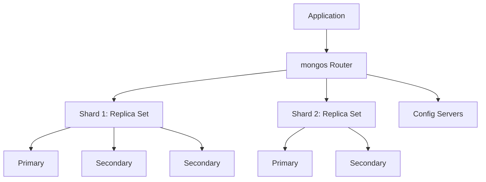

## What is MongoDB?
MongoDB is a document-oriented NoSQL database used to store large amounts of data as documents. It has collections similar to tables in relational databases. It has no schema. We can use JSON objects to store data, but behind the scenes, the MongoDB server stores this JSON in binary format.

```
MongoDB Architecture Overview:

  Client (mongosh / Driver)
       │
       ▼
  ┌──────────────┐
  │   mongos     │  ← Query router (for sharded clusters)
  └──────┬───────┘
         │
  ┌──────▼───────────────────────────────┐
  │         mongod (Server Process)       │
  │  ┌─────────────────────────────────┐ │
  │  │  Database                       │ │
  │  │  ├── Collection (≈ table)       │ │
  │  │  │   ├── Document (≈ row)       │ │
  │  │  │   │   └── BSON (binary JSON) │ │
  │  │  │   ├── Document               │ │
  │  │  │   └── ...                    │ │
  │  │  ├── Collection                 │ │
  │  │  └── ...                        │ │
  │  └─────────────────────────────────┘ │
  │  Storage Engine: WiredTiger          │
  └──────────────────────────────────────┘
```

**When to use MongoDB:**

| Good Fit | Not Ideal |
|----------|-----------|
| Flexible/evolving schemas | Complex multi-table JOINs |
| Document-oriented data (JSON-like) | Strict relational integrity |
| High write throughput | Heavy aggregation across tables |
| Horizontal scaling (sharding) | Small dataset with fixed schema |
| Real-time analytics, IoT, catalogs | Banking transactions (though multi-doc ACID is supported since 4.0) |

**SQL vs MongoDB Terminology:**

| SQL | MongoDB |
|-----|---------|
| Database | Database |
| Table | Collection |
| Row | Document |
| Column | Field |
| Index | Index |
| JOIN | `$lookup` / embedded documents |
| PRIMARY KEY | `_id` (auto-generated ObjectId) |

### What is `mongod`?
It is an executable file used to start the MongoDB server locally.

### What is `mongosh`?
It is a MongoDB shell used to connect to MongoDB to execute queries.

We can specify the location where we want to save our data locally. It should have `data` and `logs` folders inside it. Then start the server like the following:
```
mongod --dbpath /path/data --logpath /path/logs/mongo.log
```

### Connect to MongoDB Shell
```sh
mongosh // connects to mongodb://127.0.0.1:27017 by default
mongosh "mongodb+srv://cluster-name.abcde.mongodb.net/<dbname>" --username <username> // MongoDB Atlas
mongosh --host <host> --port <port> --authenticationDatabase admin -u <user> -p <pwd> # omit the password if you want a prompt
mongosh "mongodb://<user>:<password>@192.168.1.1:27017"
mongosh "mongodb://192.168.1.1:27017"
mongosh "mongodb+srv://cluster-name.abcde.mongodb.net/<dbname>" --apiVersion 1 --username <username> # MongoDB Atlas
```

## Install MongoDB

[Install MongoDB Community Edition](https://www.mongodb.com/docs/manual/installation/)

### Windows 

How do I start/stop MongoDB from running in the background in Windows?

In Windows, there is an option to start MongoDB as a service so it will be running all the time in the background. One-liner to start or stop MongoDB service using the command line in Windows:

- To start the service use: `NET START MONGODB`
- To stop the service use: `NET STOP MONGODB`

###  MacOS/Linux

How do I start/stop MongoDB from running in the background in macOS/Linux?

The `--fork` option is used to run MongoDB in the background.
```sh
mongod --port 8888 --dbpath /Users/Shared/data/db --logpath /Users/Shared/log/mongo.log --fork
```
We can shut down MongoDB by first switching to the `admin` database, then use this command:
```js
db.shutdownServer()
```

### Docker

How do I start/stop mongodb from docker
```sh
docker run \
  --rm \
  --name mongodb \
  -v ~/mongodb-data:/data/db \
  -e MONGO_INITDB_ROOT_USERNAME=admin \
  -e MONGO_INITDB_ROOT_PASSWORD=password \
  -p 27017:27017 \
  mongo
```

### Prod deployments

We can create production level [Replica Set](https://www.mongodb.com/developer/products/mongodb/cheat-sheet/#replica-set) and [Sharded Cluster](https://www.mongodb.com/developer/products/mongodb/cheat-sheet/#sharded-cluster)


## Common Commands

### Setup

MongoDB uses `BSON` instead of `JSON` to store data. The maximum size of a document can be `16 MB`.

**Show all databases:**
```sh
show dbs
```

**Create or use a database:**
```sh
use <db_name>
```

**Remove the database:**
```js
db.dropDatabase()
```

**Show all collections:**
```sh
show collections
```

**Create collections:**
```sh
db.createCollection("coll") // creates the collection `coll`
```

**Drop collections:**
```sh
db.coll.drop()    // removes the collection `coll`
```

**Create a collection with a `$jsonschema` validator:**
```js
// Create collection with a $jsonschema
db.createCollection("hosts", {
    validator: {$jsonSchema: {
        bsonType: "object",
        required: ["email"], // required fields
        properties: {
            // All possible fields
            phone: {
                bsonType: "string",
                description: "must be a string and is required"
            },
            email: {
                bsonType: "string",
                pattern: "@mongodb\.com$",
                description: "must be a string and match the regular expression pattern"
            },
        }
    }}
})

db.createCollection("contacts", {
   validator: {$jsonSchema: {
      bsonType: "object",
      required: ["phone"],
      properties: {
         phone: {
            bsonType: "string",
            description: "must be a string and is required"
         },
         email: {
            bsonType: "string",
            pattern: "@mongodb\.com$",
            description: "must be a string and match the regular expression pattern"
         },
         status: {
            enum: [ "Unknown", "Incomplete" ],
            description: "can only be one of the enum values"
         }
      }
   }}
})
```

**Run JavaScript File:**
```js
load("script.js")
```

**Get collection statistics:**
```js
db.coll.stats()
```

**Get collection storage size:**
```js
db.coll.storageSize()
```

**Get total index size of a collection:**
```js
db.coll.totalIndexSize()
```

**Get total size of a collection:**
```js
db.coll.totalSize()
```

**Validate a collection:**
```js
db.coll.validate({full: true})
```

**Rename a collection:**
```js
db.coll.renameCollection("new_coll", true) // 2nd parameter to drop the target collection if exists
```

### Insert

**Insert one document into a collection:**
```js
db.products.insertOne({
    name: "Abhishek Ghosh", 
    age: 24
})
```
This will create a document in the `products` collection. After inserting one document, it will give an `id` and acknowledgment. We can also insert nested documents.

**Insert many documents into a collection:**
```js
db.coll.insertMany([
    {name: "Navi", age: 25}, 
    {name: "Alice", age: 30}
])
```

By default, MongoDB adds a unique `ObjectId` to every document, and we can search items with that. MongoDB also creates a default index with this `_id` by default. We can also add our `_id` like the following:
```js
db.products.insertOne({_id: "abhishek-test-0001", name: "Abhishek Ghosh"})
```

### Find

**Show all documents in a collection:**
```js
db.products.find()
```

**List all documents with name "Navi" and age 25, and return only one document:**
```js
db.coll.find({
    name: "Navi", 
    age: 25
}).limit(1)
```

**Show documents in a JSON structure:**
```js
db.products.find().pretty()
```

**Search any document using `_id`:**
```js
db.products.find({_id: ObjectId('62a6ff6edb132197c5e887a0')})
```

**Count all documents in 'coll' collection:**
```js
db.coll.count()
```

**Count all documents with name "Navi":**
```js
db.coll.count({name: "Navi"})
```

**Find document and show execution stats:**
```js
db.coll.find({name: "Navi"}).explain("executionStats")
```

### Update

**Update all documents with name "Navi" and set age to 26:**
```js
db.coll.update({name: "Navi"}, {$set: {age: 26}})
```

**Update all documents with name "Navi" and increment age by 1:**
```js
db.coll.update({name: "Navi"}, {$inc: {age: 1}})
```

**Update all documents with name "Navi" and set age to null:**
```js
db.coll.update({name: "Navi"}, {$unset: {age: 1}})
```

**Remove age field from all documents with age field:**
```js
db.coll.updateMany({age: {$exists: true}}, {$unset: {age: ""}})
```

### Delete

**Remove all documents with name "Navi":**
```js
db.coll.deleteMany({name: "Navi"})
```

**Remove one document with name "Navi":**
```js
db.coll.deleteOne({name: "Navi"})
```

### Indexes

**List indexes:**
```js
db.coll.getIndexes()
```

**List index keys:**
```js
db.coll.getIndexKeys()
```

**Create index:**
```js
db.coll.createIndex({"name": 1})
```

**Create a compound index:**
```js
db.coll.createIndex({"name": 1, "date": 1})
```

**Drop index:**
```js
db.coll.dropIndex("name_1")
```

## ACID Compliance in MongoDB

| ACID Property | MongoDB Implementation |
|---------------|----------------------------------------------------------------------------------------------------------------------------------------------------------------------------------------------------------------------------------------------------------------------------------------------------------------------------------------------------------------------------------------------------|
| Atomicity     | MongoDB ensures atomicity at the single-document level, meaning changes to a single document are always atomic. Starting with version 4.0, MongoDB provides multi-document transactions and guarantees the atomicity of the transactions. |
| Consistency    | MongoDB uses schema validation, a feature that allows you to define the specific structure of documents in each MongoDB collection. If the document structure deviates from the defined schema, MongoDB will return an error. This is how MongoDB enforces its version of consistency, however, it's optional and less rigid than in traditional SQL databases. |
| Isolation      | MongoDB isolates write operations on a per-document level. By default, clients do not wait for acknowledgement of write operations. However, users can configure write concern to guarantee a desired level of isolation. Multi-document transactions in MongoDB are isolated across participating nodes for the duration of each transaction. |
| Durability     | MongoDB allows you to specify the level of durability when writing documents. You can choose to wait until the data is written to a certain number of servers, or even to the disk. This is configurable by setting the write concern when writing data. |

## Tutorials

### Website
- [neetcode](https://neetcode.io/courses/lessons/mongodb)
- [MongoDB Developer](https://www.mongodb.com/developer/products/mongodb/cheat-sheet/)

### YouTube
- [MongoDB Crash Course](https://www.youtube.com/watch?v=QPFlGswpyJY)

### Udemy
- [MongoDB - The Complete Developer's Guide](https://www.udemy.com/course/mongodb-the-complete-developers-guide/)
- [MongoDB: A Complete Database Administration Course](https://www.udemy.com/course/mongodb-a-complete-course-on-database-administration/)

---

## MongoDB Fundamentals


### What is MongoDB?

MongoDB is a document-oriented, general-purpose NoSQL database that stores data as flexible, JSON-like documents (BSON internally) rather than rows and columns. It was designed to handle large volumes of unstructured or semi-structured data with high availability and horizontal scalability through replication and sharding. MongoDB is developed and maintained by MongoDB Inc. and is available in Community and Enterprise editions, as well as a fully managed cloud offering called Atlas.

In production, teams choose MongoDB when the data model is naturally hierarchical (e.g., a product catalog with nested attributes, or a user profile with embedded addresses) and when schema flexibility is needed to iterate quickly without expensive migrations.

```javascript
// Connect via mongosh and insert a simple document
use myAppDb
db.users.insertOne({ name: "Alice", email: "alice@example.com", roles: ["admin"] })
```

**Advantages:**
- Flexible schema allows rapid iteration
- Horizontal scaling via sharding
- Rich query language and aggregation framework
- Native support for high availability via replica sets

**Disadvantages:**
- No native multi-document ACID transactions across shards before certain limits/performance costs
- Denormalized data can lead to duplication and update complexity
- Less mature tooling for complex joins compared to relational databases

**Interview Questions:**
- What is MongoDB and how does it differ from traditional databases? — MongoDB is a document-oriented NoSQL database that stores data as flexible, JSON-like BSON documents rather than rows and columns, enabling schema flexibility and horizontal scaling via sharding, whereas traditional relational databases enforce fixed schemas and rely primarily on vertical scaling.
- What problems was MongoDB designed to solve? — MongoDB was designed to handle large volumes of unstructured or semi-structured data with high availability and horizontal scalability, addressing the rigidity and scaling difficulty of traditional relational databases for rapidly evolving, high-throughput applications.
- What are the core building blocks of MongoDB (database, collection, document)? — A MongoDB deployment is organized into databases, which contain collections (analogous to tables), which in turn contain documents (analogous to rows) stored as BSON key-value structures.
- When would you NOT choose MongoDB for a project? — MongoDB is a poor fit when the application requires complex multi-table joins with strict referential integrity, such as heavy financial reporting systems, or when data is inherently tabular with a stable, well-defined schema best served by a relational database.

### NoSQL Databases

NoSQL ("Not Only SQL") databases are a broad category of non-relational data stores designed for flexible schemas, horizontal scalability, and high performance on large or fast-changing datasets. The four common categories are document stores (MongoDB), key-value stores (Redis), wide-column stores (Cassandra), and graph databases (Neo4j). Unlike relational databases, most NoSQL systems relax strict ACID guarantees in favor of availability and partition tolerance (per the CAP theorem), though modern MongoDB supports multi-document ACID transactions as well.

NoSQL databases are typically used for use cases like content management, real-time analytics, IoT data ingestion, and catalogs where the data shape varies or scale requirements exceed what a single relational server can handle efficiently.

**Differences:**

| Aspect | SQL (Relational) | NoSQL |
|---|---|---|
| Schema | Fixed, predefined | Flexible/dynamic |
| Scaling | Primarily vertical | Primarily horizontal |
| Data model | Tables with rows/columns | Documents, key-value, columnar, graph |
| Transactions | Strong ACID by default | Varies; MongoDB supports ACID multi-document transactions |
| Joins | Native, optimized | Limited or application-side |

**Interview Questions:**
- What are the main categories of NoSQL databases? — The four common categories are document stores (MongoDB), key-value stores (Redis), wide-column stores (Cassandra), and graph databases (Neo4j).
- How does the CAP theorem relate to NoSQL database design? — Per the CAP theorem, a distributed system can only guarantee two of Consistency, Availability, and Partition tolerance simultaneously, and most NoSQL systems relax strict consistency in favor of availability and partition tolerance, unlike relational databases which typically prioritize consistency.
- Why might a team pick a NoSQL database over a relational one? — Teams pick NoSQL databases like MongoDB for flexible schemas that support rapid iteration, horizontal scalability for large or fast-changing datasets, and suitability for use cases like content management, real-time analytics, or IoT ingestion.
- Can NoSQL databases guarantee ACID transactions? Explain with MongoDB as an example. — Many NoSQL databases traditionally relax ACID guarantees for availability, but modern MongoDB supports full ACID multi-document transactions, allowing consistent, atomic updates across multiple documents and collections when needed.

### Document-Oriented Database

A document-oriented database stores data as self-contained documents (in MongoDB's case, BSON) that can contain nested objects and arrays, rather than normalizing data across multiple tables. Each document can have its own structure, meaning different documents in the same collection do not need identical fields. This model maps naturally to objects in application code, reducing the "object-relational impedance mismatch" common with relational databases.

For example, an e-commerce order with line items, shipping address, and payment info can be stored as a single document, avoiding multiple joins to reconstruct the order at read time.

```json
{
  "_id": "ORD1001",
  "customer": { "name": "Bob", "email": "bob@example.com" },
  "items": [
    { "sku": "A1", "qty": 2, "price": 19.99 },
    { "sku": "B2", "qty": 1, "price": 49.99 }
  ],
  "status": "SHIPPED"
}
```

**Interview Questions:**
- What does "document-oriented" mean in the context of MongoDB? — It means data is stored as self-contained BSON documents that can contain nested objects and arrays, with each document able to have its own structure rather than requiring identical fields across the collection.
- How does storing nested data in one document compare to normalizing it across tables? — Storing nested data in one document avoids joins by co-locating related data for single-read retrieval, whereas normalizing across tables reduces duplication but requires joins to reconstruct related data at query time.
- What are the trade-offs of embedding related data inside a single document? — Embedding improves read performance and atomicity for data accessed together, but can lead to document growth, duplication across documents, and more complex updates when the embedded data changes independently of its parent.

### BSON vs JSON

BSON (Binary JSON) is the binary-encoded serialization format MongoDB uses internally to store documents. It extends JSON's data model with additional types not natively supported by JSON, such as `Date`, `ObjectId`, `Binary Data`, `Decimal128`, and 64-bit integers, while also being more efficient to parse and traverse than text-based JSON. Applications interact with MongoDB using JSON-like syntax (e.g., in mongosh or driver code), but the data is stored and transmitted as BSON.

**Differences:**

| Aspect | JSON | BSON |
|---|---|---|
| Format | Text-based | Binary |
| Data types | String, Number, Boolean, Array, Object, Null | Adds Date, ObjectId, Binary, Decimal128, Int32/Int64, Timestamp, etc. |
| Parsing speed | Slower (text parsing) | Faster (binary, length-prefixed) |
| Size on disk | Typically smaller as text | Slightly larger due to type/length metadata, but faster to traverse |
| Human readability | Readable | Not directly readable |

**Interview Questions:**
- Why did MongoDB choose BSON over plain JSON internally? — BSON extends JSON's data model with additional types like Date, ObjectId, Binary Data, and Decimal128, and its binary, length-prefixed encoding is faster to parse and traverse than text-based JSON.
- What extra data types does BSON support that JSON does not? — BSON adds Date, ObjectId, Binary Data, Decimal128, distinct Int32/Int64 integer types, and Timestamp, none of which exist natively in JSON.
- Is BSON always more compact than JSON? Explain. — Not always; BSON can be slightly larger on disk than equivalent JSON text due to embedded type and length metadata, but it trades a small size overhead for significantly faster parsing and traversal.

### MongoDB Architecture

MongoDB's architecture centers on a `mongod` process that manages data storage, a storage engine (WiredTiger by default) that handles on-disk data structures and concurrency, and optionally `mongos` routers for sharded clusters. In a replica set, one primary node handles writes and multiple secondary nodes replicate data asynchronously via the oplog, providing high availability and read scaling. Sharded clusters distribute data across multiple shards (each potentially a replica set) using a shard key, with config servers storing cluster metadata.



**Interview Questions:**
- What is the role of `mongod` versus `mongos`? — `mongod` is the core database process that manages data storage, indexing, and replication, while `mongos` is a lightweight query router used in sharded clusters to direct client requests to the appropriate shard(s).
- How does data flow from a client write request to disk in a replica set? — A client sends a write to the primary node, which applies it to its data set and records the operation in its oplog; secondaries then asynchronously replicate and apply that oplog entry to reach eventual consistency.
- What is the purpose of config servers in a sharded cluster? — Config servers store the cluster's metadata, including the mapping of shard key ranges to shards, which `mongos` routers use to determine where to route queries and writes.
- What storage engine does MongoDB use by default and what does it provide? — MongoDB uses the WiredTiger storage engine by default, which provides document-level concurrency control, compression, and efficient on-disk data structures.

### MongoDB Use Cases

MongoDB is well-suited for content management systems, product catalogs, user profiles, real-time analytics, IoT sensor data, and mobile/web application backends where data shapes evolve frequently. Its flexible schema and horizontal scalability make it a good fit for rapidly growing startups and applications with large write throughput. It is less ideal for workloads that require complex multi-table joins with strict referential integrity, such as heavy financial reporting systems traditionally built on relational databases.

**Interview Questions:**
- What kinds of applications benefit most from MongoDB? — Content management systems, product catalogs, user profiles, real-time analytics, IoT sensor data, and mobile/web backends benefit most, since these workloads have frequently evolving data shapes and require high write throughput and horizontal scale.
- Give an example of a workload where MongoDB would be a poor fit. — Heavy financial reporting systems requiring complex multi-table joins and strict referential integrity across normalized tables are traditionally better served by a relational database.
- How does schema flexibility influence MongoDB's suitability for a use case? — Schema flexibility lets applications add or change fields without expensive migrations, making MongoDB well suited to rapidly evolving applications, but less suited to workloads needing strict, enforced structure across all records.

### MongoDB vs Relational Databases

MongoDB and relational databases (like PostgreSQL or MySQL) differ fundamentally in data modeling, schema enforcement, and scaling strategy. Relational databases normalize data into tables connected via foreign keys and joins, enforcing a fixed schema and strong ACID guarantees by default. MongoDB favors denormalized, document-based models that reduce the need for joins, offers flexible schemas, and scales horizontally via sharding, while still supporting ACID transactions across documents when needed.

**Differences:**

| Aspect | Relational Database | MongoDB |
|---|---|---|
| Data unit | Row in a table | Document in a collection |
| Schema | Fixed, enforced by DDL | Flexible, optionally validated |
| Relationships | Foreign keys + joins | Embedding or manual references |
| Scaling | Mostly vertical (harder to shard) | Built-in horizontal sharding |
| Query language | SQL | MongoDB Query Language (MQL) / Aggregation Framework |
| Transactions | ACID by default | ACID supported (single and multi-document) |

**Interview Questions:**
- What are the core modeling differences between MongoDB and a relational database? — Relational databases normalize data into tables connected by foreign keys and joins with a fixed, DDL-enforced schema, whereas MongoDB models data as denormalized documents within collections, using embedding or manual references instead of joins, with an optionally validated flexible schema.
- When would you choose a relational database over MongoDB? — A relational database is preferable when the application needs complex, ad hoc multi-table joins, strict referential integrity, and a stable, well-understood tabular schema, such as in traditional accounting or ERP systems.
- How do joins in SQL compare to `$lookup` in MongoDB's aggregation framework? — SQL joins are a native, highly optimized relational operation performed across normalized tables, while `$lookup` is an aggregation pipeline stage that performs a left outer join-like operation between collections, generally less optimized for very large cross-collection joins than native SQL joins.

### MongoDB Editions (Community vs Enterprise)

MongoDB Community Edition is the free, open-source version providing the core database engine, replication, and sharding. MongoDB Enterprise Advanced adds features such as LDAP/Kerberos authentication, encryption at rest with an external key management integration, auditing, in-memory storage engine, and Ops Manager for on-premises operational tooling. MongoDB Atlas, the managed cloud service, is built on Enterprise-grade features and removes the operational burden of provisioning and maintaining servers.

**Differences:**

| Aspect | Community Edition | Enterprise Advanced |
|---|---|---|
| Cost | Free | Licensed/paid |
| Authentication | Basic (SCRAM, x.509) | Adds LDAP, Kerberos |
| Auditing | Not included | Included |
| Encryption at rest | Manual/filesystem-level | Native with KMIP integration |
| Support | Community forums | Official MongoDB support |

**Interview Questions:**
- What is the difference between MongoDB Community and Enterprise editions? — Community Edition is the free, open-source core database engine with replication and sharding, while Enterprise Advanced adds features like LDAP/Kerberos authentication, auditing, an in-memory storage engine, encryption at rest with KMIP integration, and Ops Manager, backed by official support.
- What advanced security features does Enterprise Edition add? — Enterprise Edition adds LDAP and Kerberos authentication, auditing, and native encryption at rest with external key management (KMIP) integration, beyond Community's basic SCRAM and x.509 authentication.
- How does MongoDB Atlas relate to Community and Enterprise editions? — Atlas is MongoDB's fully managed cloud database service, built on Enterprise-grade features, which removes the operational burden of provisioning, patching, and maintaining servers that self-hosted Community or Enterprise deployments require.
