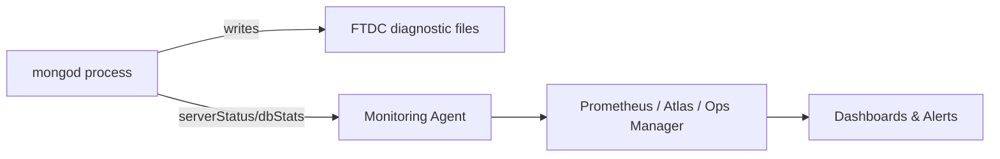

# Monitoring

## MongoDB Profiler

The database profiler collects detailed performance data about read and write operations, cursor operations, and database commands executed against a MongoDB instance. It can be enabled at different levels (0 = off, 1 = slow operations only, 2 = all operations) and stores its output in the `system.profile` capped collection within each database.

In production, teams typically enable level 1 profiling with a slow-operation threshold (e.g. 100ms) to capture only problematic queries without incurring the overhead of profiling every operation, then use the captured data to identify missing indexes or inefficient aggregation pipelines.

```javascript
// Enable profiling for operations slower than 100ms
db.setProfilingLevel(1, { slowms: 100 })

// Check current profiling status
db.getProfilingStatus()

// Query the profile collection for the slowest operations
db.system.profile.find().sort({ millis: -1 }).limit(5).pretty()
```

**Advantages:**
- Captures real query shapes and timings directly from production traffic
- Configurable granularity (off / slow-only / all)
- No application code changes required

**Disadvantages:**
- Level 2 profiling adds noticeable overhead and disk usage
- Capped collection can roll over quickly under heavy load, losing older samples
- Requires manual analysis unless paired with tools like Compass or Atlas Performance Advisor

**Interview Questions:**
- What are the different MongoDB profiler levels and when would you use each? — Level 0 (off) is used when profiling isn't needed, level 1 (slow operations only) is the safe default for production to capture problematic queries, and level 2 (all operations) is reserved for short, targeted debugging sessions due to its overhead.
- Where is profiler data stored and what are the risks of leaving profiling on in production? — Profiler data is stored in the per-database `system.profile` capped collection; leaving level 2 profiling on in production risks meaningful performance overhead and rapid rollover of the capped collection, losing historical data.
- How would you use the profiler output to identify a missing index? — Look for slow operations in `system.profile` with a high ratio of documents scanned (`docsExamined`) to documents returned (`nreturned`), which indicates the query is scanning far more data than needed and would likely benefit from a supporting index.
- What is the performance impact of enabling profiling level 2 on a busy cluster? — Level 2 logs every single operation, adding CPU and I/O overhead proportional to the cluster's total operation throughput, which can measurably slow down a busy production cluster and should only be enabled briefly and deliberately.

## Server Status

The `serverStatus` command returns a comprehensive snapshot of the current state of a `mongod` or `mongos` instance, including memory usage, connection counts, opcounters, replication lag, journaling stats, and WiredTiger cache metrics. It's the primary building block for most external monitoring integrations (Atlas, Ops Manager, Prometheus exporters).

```javascript
// Get a full server status document
db.serverStatus()

// Inspect just the connection and opcounters sections
db.serverStatus().connections
db.serverStatus().opcounters
```

**Interview Questions:**
- What key sections of `serverStatus()` would you check first when diagnosing a performance incident? — Typically check `connections` (for pool exhaustion), `opcounters` (for traffic spikes), `wiredTiger.cache` (for cache pressure/eviction), and replication-related fields (for lag) as a fast first pass.
- How can `serverStatus()` help detect connection pool exhaustion? — The `connections` section reports current, available, and total connections; a `current` value approaching the configured maximum, combined with rising queued/rejected connections, indicates the pool is being exhausted.
- What WiredTiger metrics in `serverStatus()` indicate cache pressure? — High `wiredTiger.cache` eviction rates (pages evicted per second) and a cache usage percentage close to the configured cache size both indicate the working set is outgrowing available cache memory.

## Database Statistics

The `dbStats` command reports storage-level metrics for a single database, such as total data size, storage size, index size, and object/collection counts. It's useful for capacity planning and tracking storage growth trends over time.

```javascript
use myDatabase
db.stats()
```

**Interview Questions:**
- What is the difference between `dataSize` and `storageSize` in `dbStats()` output? — `dataSize` reflects the logical (uncompressed) size of the data, while `storageSize` reflects the actual space allocated on disk, which can be smaller due to WiredTiger compression or larger due to fragmentation.
- How would you use `dbStats()` to plan disk capacity for a growing collection? — Track `storageSize` and `indexSize` over time to observe growth trends, then project future storage needs and provision disk capacity with sufficient headroom before the current trend exhausts available space.

## Collection Statistics

The `collStats` command (or `db.collection.stats()`) provides detailed size, document count, average object size, and index size information for a specific collection, plus sharding-specific data (like chunk distribution) when run against a sharded collection.

```javascript
db.orders.stats()

// Sharding-aware stats
db.orders.stats({ scale: 1024 * 1024 })
```

**Interview Questions:**
- How do you find the average document size of a collection and why does it matter? — The `avgObjSize` field in `collStats()`/`db.collection.stats()` output reports this directly; it matters because it affects storage planning, network transfer costs, and whether documents are approaching the 16MB BSON limit.
- What extra information does `collStats` return for a sharded collection compared to an unsharded one? — For a sharded collection, `collStats` additionally reports per-shard document counts, sizes, and chunk distribution, revealing whether data is balanced evenly across shards.

## Index Statistics

The `$indexStats` aggregation stage returns usage statistics for each index on a collection, including how many times each index has been used to serve a query since the last server restart. This is the primary tool for identifying unused indexes that can be safely dropped to save write overhead and storage.

```javascript
db.orders.aggregate([{ $indexStats: {} }])
```

**Advantages:**
- Directly identifies dead/unused indexes
- Low overhead to query

**Disadvantages:**
- Counters reset on server restart or failover, so long observation windows are needed before drawing conclusions

**Interview Questions:**
- How would you identify and safely remove unused indexes from a large production collection? — Query `$indexStats` over a representative time period (covering peak and off-peak traffic and spanning any recent failovers) and drop indexes showing consistently zero or negligible usage counts.
- Why might `$indexStats` counters be misleading right after a replica set election? — Usage counters are maintained in memory per `mongod` process and reset on restart or failover, so a newly elected primary/secondary will show artificially low counts until it has been running long enough to reflect real usage patterns.

## Performance Metrics

Beyond individual commands, MongoDB exposes performance metrics through `serverStatus().metrics`, FTDC (Full Time Diagnostic Data Capture) files, and integrations like MongoDB Atlas charts or Prometheus/Grafana dashboards. Key metrics to track include query targeting ratio (scanned vs. returned documents), replication lag, cache eviction rate, and queue lengths for reads/writes.



**Interview Questions:**
- Which metrics best indicate that a collection is missing a critical index? — A high query targeting ratio (documents scanned per document returned) is the clearest signal, often paired with rising `COLLSCAN` counts in `opcounters`/profiler data and elevated query latency.
- What is FTDC and how is it used for post-incident diagnostics? — FTDC (Full Time Diagnostic Data Capture) is a lightweight background mechanism that continuously records diagnostic metrics to compact binary files on disk, which engineers can later decode and analyze to reconstruct exactly what the server was doing before, during, and after an incident.
- How would you set up alerting for replication lag in a production cluster? — Feed replication lag metrics (from `rs.status()` or `serverStatus()`) into a monitoring system like Prometheus/Grafana or Atlas, and configure an alert to fire when lag exceeds a threshold that would risk stale reads or violate SLA commitments.

## Mongostat and Mongotop

`mongostat` provides a `vmstat`-like, per-second view of key server counters (inserts, queries, updates, deletes, connections, cache metrics) directly in the terminal, useful for a quick live health check. `mongotop` shows the amount of time each collection spends performing read and write operations, helping to quickly spot which collection is the hot spot.

```bash
# Live server-wide counters refreshed every second
mongostat --host localhost:27017

# Per-collection read/write time, refreshed every 5 seconds
mongotop 5
```

**Interview Questions:**
- When would you reach for `mongostat` versus a full monitoring dashboard? — `mongostat` is ideal for a quick, live terminal-based health check during an active incident or ad hoc troubleshooting session, while a full dashboard (Atlas, Grafana) is better for historical trend analysis, alerting, and long-term capacity planning.
- How does `mongotop` help you identify a hot collection during an incident? — `mongotop` shows the time each collection spends on reads versus writes per interval, making it immediately obvious which collection is consuming a disproportionate share of server activity during a performance incident.
