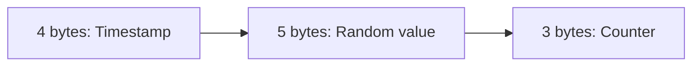

# ObjectId

## Structure of ObjectId

An `ObjectId` is a 12-byte value composed of a 4-byte timestamp (seconds since Unix epoch), a 5-byte random value unique to a machine/process, and a 3-byte incrementing counter, initialized to a random value. This structure guarantees a very high probability of uniqueness across distributed inserts without requiring coordination between servers, while still being roughly sortable by creation time due to the leading timestamp.



**Interview Questions:**
- What are the three components that make up an `ObjectId`? — An `ObjectId` is composed of a 4-byte timestamp (seconds since the Unix epoch), a 5-byte random value unique to a machine/process, and a 3-byte incrementing counter initialized to a random value.
- Why is the timestamp placed as the leading bytes of an `ObjectId`? — Placing the timestamp first makes `ObjectId` values roughly sortable by creation time when compared or indexed as byte strings, since earlier-created documents naturally sort before later ones.
- How does the random value component help avoid collisions across different machines? — The 5-byte random value is unique per machine/process, so even if two processes generate an `ObjectId` within the same second, they are extremely unlikely to produce identical values, avoiding coordination between distributed nodes.

## Automatic ID Generation

If a document is inserted without an explicit `_id` field, the MongoDB driver automatically generates an `ObjectId` client-side before sending the insert to the server. This client-side generation avoids a round trip to the server just to obtain an ID and allows the application to know the ID immediately after calling insert.

```javascript
const result = db.users.insertOne({ name: "Eve" })
print(result.insertedId) // auto-generated ObjectId
```

**Interview Questions:**
- Where is the default `ObjectId` generated — on the client/driver or the server? — The default `ObjectId` is generated client-side by the driver before the insert is sent to the server, avoiding an extra round trip just to obtain an ID.
- What is the benefit of generating the `_id` before sending the insert to the server? — Generating the `_id` client-side lets the application know the document's identifier immediately after calling insert, without waiting for a server round trip, and allows the ID to be used in related operations right away.

## Custom IDs

Applications can supply their own value for `_id` instead of relying on the auto-generated `ObjectId`, as long as the value is unique within the collection. Common alternatives include natural keys (e.g., an email or SKU), UUIDs, or application-specific sequence numbers. Using a custom `_id` avoids a separate unique index if the natural key is already guaranteed unique and frequently queried.

```javascript
db.products.insertOne({ _id: "SKU-1001", name: "Keyboard" })
```

**Interview Questions:**
- Can you use your own value for `_id` instead of `ObjectId`? What are the constraints? — Yes, any BSON value can be used for `_id` as long as it is unique within the collection; common choices include natural keys like an email or SKU, UUIDs, or application-specific sequence numbers.
- What are the trade-offs of using a natural key as `_id` versus an auto-generated `ObjectId`? — A natural key avoids needing a separate unique index and can simplify lookups by that key, but it requires the application to guarantee uniqueness itself and may not be as compact or naturally sortable by creation time as `ObjectId`.
- What happens if you try to insert a document with a duplicate `_id`? — MongoDB rejects the insert with a duplicate key error, since `_id` is automatically indexed with a unique constraint.

## ObjectId Advantages

Using `ObjectId` as the default identifier provides distributed, coordination-free uniqueness generation, rough time-ordering (useful for natural sort by creation time), and a compact 12-byte representation compared to a 36-character UUID string. Because it embeds a timestamp, you can even extract the approximate creation time of a document directly from its `_id` without a separate `createdAt` field.

```javascript
const id = ObjectId("64f1a2b3c4d5e6f7a8b9c0d1")
print(id.getTimestamp())
```

**Advantages:**
- No central coordination needed to guarantee uniqueness
- Roughly sortable by creation time
- Compact (12 bytes) compared to string UUIDs (16 bytes raw / 36 chars as text)

**Interview Questions:**
- What advantages does `ObjectId` provide over a simple auto-incrementing integer in a distributed system? — `ObjectId` can be generated independently on any client or server node without a central coordinator handing out sequential values, avoiding the bottleneck and single point of failure an auto-incrementing counter would introduce in a distributed system.
- How can you derive a document's approximate creation timestamp from its `ObjectId`? — Since the leading 4 bytes of an `ObjectId` encode seconds since the Unix epoch, calling a method like `.getTimestamp()` on the `ObjectId` extracts that value to give the document's approximate creation time.
- Why is `ObjectId` more compact than a UUID string representation? — `ObjectId` is a fixed 12-byte binary value, while a UUID is typically 16 bytes raw but commonly represented as a 36-character hyphenated string, making `ObjectId` more compact both in storage and as a textual representation.
