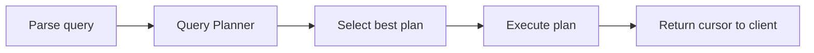

## Introduction

**Read operations** retrieve documents from a MongoDB collection. MongoDB provides a rich query language with operators for filtering, comparing, matching arrays, and combining conditions.

```
Read Query Flow:

  db.collection.find(filter, projection)
       │              │          │
       │              │          └── Which fields to return
       │              └───────────── Which documents to match
       ↓
  ┌──────────────────────────────────────┐
  │ 1. Query Planner evaluates indexes   │
  │ 2. Choose winning plan (IXSCAN or   │
  │    COLLSCAN)                         │
  │ 3. Execute query                     │
  │ 4. Apply projection (field filter)   │
  │ 5. Return cursor (batches of 20)     │
  └──────────────────────────────────────┘
```

**Following are the components of mongodb reads**

- Methods, Filters and Operators
- Query Selectors
- Projection Operators


**There are two methods**

- `find`: returns all the documents which satisfies the criteria (basically it returns the cursor object)
- `findOne`: it returns a first document that satisfies the criteria

find method gives a cursor of 20 objects

Examples
```js
> db.products.findOne({age:24}) ->  to get the document where age is 24
> db.products.findOne({age:{$gt:24}}) -> to get the document where age is greater than 24
```


Operators are reserved fields started with dollar like $gt, $gte, $lt, $lte

---

### Query Selectors

Query selectors determine **how** documents are matched. They fall into these categories:

**Query Selectors**

- Comparison
- Evaluation
- Logical
- Array
- Element
- Comments
- Geospatial

| Category | Operators | Purpose |
|----------|-----------|---------|
| **Comparison** | `$eq, $gt, $gte, $lt, $lte, $ne, $in, $nin` | Compare field values |
| **Logical** | `$and, $or, $not, $nor` | Combine multiple conditions |
| **Element** | `$exists, $type` | Check field presence/data type |
| **Evaluation** | `$regex, $expr, $text, $mod` | Pattern match, cross-field comparison |
| **Array** | `$all, $elemMatch, $size` | Query array contents |
| **Geospatial** | `$near, $geoWithin, $geoIntersects` | Location-based queries |

For detailed operator reference with examples, see [Operators](operators.md).

---

### Projection Operators

Projection controls which fields are included in the output:

**Projection Operator**

- $
- $elemMatch
- $meta
- $slice

| Operator | Purpose | Example |
|----------|---------|---------|
| `$` | Returns the first matching array element | `{"scores.$": 1}` |
| `$elemMatch` | Returns the first array element matching a condition | `{scores: {$elemMatch: {$gte: 90}}}` |
| `$meta` | Returns metadata (e.g., text search score) | `{score: {$meta: "textScore"}}` |
| `$slice` | Returns a subset of an array | `{comments: {$slice: 5}}` (first 5) |

---

## Comparison Operators

first it will search the document where name is "Under the Dome" then it only return name, type and language
```js
db.infos.find({"name": "Under the Dome"},{"name":1,"type":1,"language":1})
```

runtime equal to 60, both of them will work same
```js
db.infos.findOne({runtime:60})

db.infos.findOne({runtime:{$eq:60}})
```

runtime not equal to 60
```js
db.infos.findOne({runtime:{$ne:60}}) 
```

runtime greater than 60
```js
db.infos.findOne({runtime:{$gt:60}})
```

runtime greater than equal to 60
```js
db.infos.findOne({runtime:{$gte:60}})
```

runtime less than 60
```js
db.infos.findOne({runtime:{$lt:60}})
```

runtime less than equal to 60
```js
db.infos.findOne({runtime:{$lte:60}}) 
```

it will find all the documents where runtime is either 30 or 42
```js
db.infos.find({runtime: {$in: [30,42]}}) 
```

it will find all the documents where runtime is neither 30 nor 42
```js
db.infos.find({runtime: {$nin: [30,42]}}) 
```

---

## Querying Nested Documents

average is a field which is inside of rating, so to querying anything in average we can use something like this layer1.layer2.layer3.targetField then our query operator
```js
db.infos.findOne({"rating.average": {$gt: 9}}) 
```

**Intent**: Use **dot notation** to access fields inside embedded documents. This works at any depth level.

```js
// Query nested field
db.users.findOne({"address.city": "Berlin"})

// Query deeply nested field
db.orders.find({"shipping.address.zipcode": "10001"})

// Combine with comparison operators
db.products.find({"specs.weight": {$lt: 2.5}})
```

here genres is a array. If we search for this, it will not equate as a string it will check that genres contain Drama or not
```js
db.infos.findOne({"genres": "Drama"}) 
```

---

## Logical Operators

`$or` operator takes an array of queries. Here average is either greater than 8 or less than 7. We can combine more than two queries.
```js
db.infos.find({$or: [{"rating.average": {$gt: 8}}, {"rating.average": {$lt: 7}}]}) 
```

`$nor` operator takes an array of queries. Here average is neither greater than 8 nor less than 7. We can combine more than two queries.
```js
db.infos.find({$nor : [{"rating.average": {$gt: 8}}, {"rating.average": {$lt: 7}}]}) 
```

`$and` operator takes an array of queries. Here average is less than 8 and greater than 7. We can combine more than two queries. We have a short cut for and query.
```js
db.infos.find({$and : [{"rating.average": {$lt:8}},{"rating.average": {$gt:7}}]}) 
```

these two queries are same as mongodb by default does the and operation and equal to operation
```js
db.infos.find({$and : [{"rating.average": {$lt:8}},{"runtime": {$gte:60}}]})

db.infos.find({"rating.average": {$lt:8}, "runtime": {$gte:60}})
```

we have also `$not` operator that we can use like this. `$not` is just like another wrapper to the existing query

not of this query `db.infos.find({"rating.average": {$lt: 8}}).count()` will be `db.infos.find({"rating.average": {$not :{$lt: 8}}}).count()`

---

## Element Operators ($exists and $type)

There are two element type operators `$exist` and `$type`

**Intent**: Since MongoDB is schema-less, documents in the same collection can have different fields. Element operators help query based on whether a field **exists** or what **data type** it holds.

As mongodb is schemaless so sometimes there may be a case a **field** may or may not be **exist** so we can check that a field is exist or not like this:

age field exists
```js
db.users.findOne({"age": {$exists: true}})
```

We can use exists with another query as well

age field exists and greater than 30
```js
db.users.findOne({"age": {$exists: true, $gte: 30}})
```

age field exists and not equal to null
```js
db.users.findOne({"age": {$exists: true, $ne: null}}) 
```

As mongodb is schemaless so sometimes there may be a case a field may or may not have the same data type for all the document so we can check that a field has the datatype or not with `$type`

phone no is double in which document
```js
db.users.findOne({"phoneNo": {$type: "double"}}) 
```

phone no is string in which document
```js
db.users.findOne({"phoneNo": {$type: "string"}}) 
```

phone no is string or double in which document. We can use array. It will act as OR operator here
```js
db.users.findOne({"phoneNo": {$type: ["double", "string"]}})
```

---

## Evaluation Operators ($regex, $expr)

It will use regex to search any document have the musical word in the summary or not. But it is not that efficient better to use text indexing
```js
db.infos.find({summary: {$regex: /musical/}}) 
```

```js
// Case-insensitive regex
db.infos.find({name: {$regex: /^john/i}})

// Regex with options parameter
db.infos.find({summary: {$regex: "musical", $options: "i"}})
```

it will search all the documents where weight is greater that runtime. We can use $expr like this where it will take the query inside it. 
```js
db.infos.find({$expr: {$gt: ["$weight", "$runtime"]}}) 
```


We can use if, then an inside $cond and the $expr will evaluate everything.

```js
// $expr with $cond — conditional logic
db.orders.find({
    $expr: {
        $gt: [
            "$total",
            { $cond: {
                if: { $eq: ["$type", "premium"] },
                then: 1000,
                else: 500
            }}
        ]
    }
})
// Finds premium orders > $1000 and regular orders > $500
```


## Querying to Arrays

Let's say experience is an array having many fields like college name, company name, start date end date etc

it will search the document where in experiences array there will be a object in which companyName field will be Kreeti
```js
db.products.find({"experiences.companyName": "Kreeti"}) 
```

We can use dot operator with array and embedded documents

find all the documents where experience is length of 3
```js
db.products.find({"experiences": {$size: 3}}) 
```

`$size` operator takes only equality it will not work with `$gt` or `$lt` like the following query

It will give us the exception.
```js
db.products.find({"experiences": {$size: {$gt: 2}}}) 
```

It will only search for the documents where genres is `["Drama", "Crime", "Thriller"]` particularly in this order but if the order does not matter for us then we can use `$all`
```js
db.infos.find({genres: ["Drama", "Crime", "Thriller"]}) 
```

It will search for all the documents where these three items `["Drama", "Crime", "Thriller"]` are there in the genres array.
```js
db.infos.find({genres: {$all: ["Drama", "Crime", "Thriller"]}}) 
```

Certainly, these two queries will not give us the same result:
```js
db.infos.find({genres: {$all: ["Drama", "Crime"]}}).count() -> 47

db.infos.find({genres: ["Drama", "Crime"]}).count() -> 12
```

Find how many persons are working in TCS or not. Probable answers are :
```js
db.products.find({"experiences.companyName": "TCS","experiences.currentlyInHere": true}).count()

db.products.find({$and: [{"experiences.companyName": "TCS"}, {"experiences.currentlyInHere": true}]}).count()
```

If we use this query ideally it should return `1` as there is only one document where in one `experience` item `companyName` is `TCS` and `currentlyHere` is `true` but this query does not work like that it will check in the `arrays` that if any object has the `companyName` as `TCS` and `currentlyHere` is `true`. It does not need to be the same object in the array. Here we could use the `$elemMatch`. It will search for all the queries in the same item of the array.

We can achieve our requirement of any person who is currently working in TCS or not with the below query:
`$elemMatch` will match all the queries for every element in the array.
```js
db.products.find({experiences: {$elemMatch: {companyName: "TCS",currentlyInHere: true}}}).count()
```

## Cursor

In `MongoDB`, the `find()` method return the `cursor`, now to access the document we need to iterate the `cursor`. In the `mongo shell`, if the `cursor` is not assigned to a `var` keyword then the `mongo shell` automatically iterates the `cursor` up to `20` documents. `MongoDB` also allows you to iterate cursor manually. So, to iterate a cursor manually simply assign the cursor return by the `find()` method to the `var` keyword or JavaScript variable.

**Note**: If a `cursor` inactive for `10 min`, then `MongoDB` server will automatically close that cursor.

**Cursor Methods Overview:**

| Method | Purpose | Returns |
|--------|---------|---------|
| `.pretty()` | Format output for readability | Cursor |
| `.toArray()` | Convert all documents to array | Array |
| `.count()` | Count matching documents | Number |
| `.hasNext()` | Check if more documents exist | Boolean |
| `.next()` | Get next document | Document |
| `.forEach(fn)` | Iterate with callback | void |
| `.sort(obj)` | Sort results | Cursor |
| `.skip(n)` | Skip first n documents | Cursor |
| `.limit(n)` | Limit to n documents | Cursor |
| `.map(fn)` | Transform each document | Array |

**Execution order**: Regardless of the order you chain methods, MongoDB always executes: **sort → skip → limit**

It will fetch the `cursor` of first 20 elements.
```js
db.infos.find().pretty() 
```

It will exhaust the `cursor` and make all the documents as `array` of objects
```js
db.infos.find().toArray()
```

It give us the `count` of all the element
```js
db.infos.find().count() 
```

it will say if the `cursor` has exhausted or not
```js
db.infos.find().hasNext()
```

it will give the current `20` elements of the `cursor`
```js
db.infos.find().next() 
```

`printjson` is a method in `shell`. `forEach` is a function on the `cursor`
```js
db.infos.find().forEach((doc) => printjson(doc)) 
```

It will `sort` all the elements on `average` element on rating.
```js
db.infos.find().sort({"rating.average" :1}) 
```

It will `sort` all the elements on `average` element on rating and then runtime but backwards
```js
db.infos.find().sort({"rating.average" :1, "runtime": -1})
```

It will sort all the elements on `average` element on rating then skip the first 10 elements
```js
db.infos.find().sort({"rating.average" :1}).skip(10)  
```

It will sort all the elements on `average` element on rating then only show the first `2` elements
```js
db.infos.find().sort({"rating.average" :1}).limit(2) 
```

It will sort all the elements on `average` element on rating then `skip 2 elements` and show only `2` elements
```js
db.infos.find().sort({"rating.average" :1}).skip(2).limit(2) 
```

**Pagination Pattern using skip + limit:**
```js
// Page 1 (items 1-10)
db.products.find().sort({_id: 1}).skip(0).limit(10)
// Page 2 (items 11-20)
db.products.find().sort({_id: 1}).skip(10).limit(10)
// Page 3 (items 21-30)
db.products.find().sort({_id: 1}).skip(20).limit(10)

// ⚠️ skip() is slow for large offsets (must scan and discard skipped documents)
// For large datasets, use range-based pagination instead:
// Page 1
db.products.find().sort({_id: 1}).limit(10)
// Page 2 (using last _id from page 1)
db.products.find({_id: {$gt: lastId}}).sort({_id: 1}).limit(10)
```

It will show only the `name` and the `_id` of first `20` documents. `_id` is shown by default.
```js
db.infos.find({},{name: 1}) 
```

It will show only the name of first `20` documents.
```js
db.infos.find({},{_id: 0, name: 1}) 
```

It will show only the `name` and `schedule` object with only `time` field and the `_id` of first `20` documents.
```js
db.infos.find({},{name: 1, "schedule.time": 1}) 
```

It will first search for the documents with `genres` with `Thriller` then with `projection` it will show only the `first` element of genres array
```js
db.infos.find({genres: "Thriller"},{"genres.$": 1}) 
```

It will first search for the documents with genres array with `Drama and Action` then with projection it will show only the `first` element of genres array
```js
db.infos.find({genres: {$all : ["Drama","Action"]}},{"genres.$": 1}) 
```

Here Querying and projecting works independently. First it will search for genres array with `Drama and Action` then with `projection` it will show only the array with `Horror` present or not.
```js
db.infos.find({genres: {$all : ["Drama","Action"]}},{"genres" : {$elemMatch: {$eq: "Horror"}}}) 
```

`$slice` only works array while projection. `{$slice: 2}` will slice the first `2` elements of the array.
```js
db.infos.find({}, {genres: {$slice: 2}, name: 1}) 
```

`{$slice: [1,3]}` will slice the `1st` to `3rd` elements of the array.
```js
db.infos.find({},{genres: {$slice: [1,3]},name: 1}) 
```


## More Examples 

**Find one document:**
```js
db.coll.findOne()
```

**Find all documents (returns a cursor - show 20 results - "it" to display more):**
```js
db.coll.find()
```

**Find all documents and pretty print:**
```js
db.coll.find().pretty()
```

**Find documents with specific criteria (implicit logical "AND"):**
```js
db.coll.find({name: "Max", age: 32})
```

**Find documents with a specific date:**
```js
db.coll.find({date: ISODate("2020-09-25T13:57:17.180Z")})
```

**Find documents with specific criteria and explain execution stats:**
```js
db.coll.find({name: "Max", age: 32}).explain("executionStats")
```

**Find distinct values for a field:**
```js
db.coll.distinct("name")
```

**Count documents with specific criteria (accurate count):**
```js
db.coll.countDocuments({age: 32})
```

**Estimate document count based on collection metadata:**
```js
db.coll.estimatedDocumentCount()
```

**Find documents with comparison operators:**
```js
db.coll.find({"year": {$gt: 1970}})
db.coll.find({"year": {$gte: 1970}})
db.coll.find({"year": {$lt: 1970}})
db.coll.find({"year": {$lte: 1970}})
db.coll.find({"year": {$ne: 1970}})
db.coll.find({"year": {$in: [1958, 1959]}})
db.coll.find({"year": {$nin: [1958, 1959]}})
```

**Find documents with logical operators:**
```js
db.coll.find({name: {$not: {$eq: "Max"}}})
db.coll.find({$or: [{"year": 1958}, {"year": 1959}]})
db.coll.find({$nor: [{price: 1.99}, {sale: true}]})
db.coll.find({
  $and: [
    {$or: [{qty: {$lt :10}}, {qty :{$gt: 50}}]},
    {$or: [{sale: true}, {price: {$lt: 5 }}]}
  ]
})
```

**Find documents with element operators:**
```js
db.coll.find({name: {$exists: true}})
db.coll.find({"zipCode": {$type: 2 }})
db.coll.find({"zipCode": {$type: "string"}})
```

**Aggregation Pipeline:**
```js
db.coll.aggregate([
  {$match: {status: "A"}},
  {$group: {_id: "$cust_id", total: {$sum: "$amount"}}},
  {$sort: {total: -1}}
])
```

**Text search with a "text" index:**
```js
db.coll.find({$text: {$search: "cake"}}, {score: {$meta: "textScore"}}).sort({score: {$meta: "textScore"}})
```

**Find documents with regex:**
```js
db.coll.find({name: /^Max/})   // regex: starts by letter "M"
db.coll.find({name: /^Max$/i}) // regex case insensitive
```

**Find documents with array operators:**
```js
db.coll.find({tags: {$all: ["Realm", "Charts"]}})
db.coll.find({field: {$size: 2}}) // impossible to index - prefer storing the size of the array & update it
db.coll.find({results: {$elemMatch: {product: "xyz", score: {$gte: 8}}}})
```

**Projections:**
```js
db.coll.find({"x": 1}, {"actors": 1})               // actors + _id
db.coll.find({"x": 1}, {"actors": 1, "_id": 0})     // actors
db.coll.find({"x": 1}, {"actors": 0, "summary": 0}) // all but "actors" and "summary"
```

**Sort, skip, limit:**
```js
db.coll.find({}).sort({"year": 1, "rating": -1}).skip(10).limit(3)
```

**Read Concern:**
```js
db.coll.find().readConcern("majority")
```

Since shell is made of JS so we can use JS function
For reference: [Cursor Methods](https://www.mongodb.com/docs/manual/reference/method/js-cursor/)

---

## Read Operations — Concepts and Interview Q&A


Read operations retrieve documents using `find()` (returns a cursor over multiple matching documents) or `findOne()` (returns the first match). Query filters use MongoDB Query Language operators (`$eq`, `$gt`, `$in`, etc.), and results can be shaped further with projections, sorting, and pagination via `sort()`, `limit()`, and `skip()`.

```javascript
db.orders.find({ total: { $gte: 50 } }, { customerId: 1, total: 1, _id: 0 })
  .sort({ total: -1 })
  .limit(10)
```

**Interview Questions:**
- What is the difference between `find()` and `findOne()`? — `find()` returns a cursor over all documents matching the filter, allowing further chaining like `sort()` and `limit()`, while `findOne()` returns only the first matching document directly (or null if none match).
- How do projections improve query performance and network efficiency? — Projections limit the fields returned from a query to only what's needed, reducing the amount of data transferred over the network and the memory/CPU needed to serialize and deserialize documents.
- Why can `skip()` become inefficient for pagination over large datasets, and what's an alternative? — `skip()` still requires the server to scan and discard all skipped documents before returning results, making it increasingly slow at large offsets; a more efficient alternative is range-based (keyset) pagination using a query filter on the last seen sort key, such as `{ _id: { $gt: lastId } }`.

---

## Query Processing


### Query Execution

Query execution is the process by which MongoDB takes a parsed query, consults the query planner to select an execution plan, and then runs that plan against the storage engine to produce a result cursor. It involves stages such as index scans, document fetches, filtering, sorting, and projection, each represented as a node in the execution plan tree.



**Interview Questions:**
- What are the high-level steps MongoDB takes from receiving a query to returning results? — MongoDB parses the query, consults the query planner to select an execution plan from candidate indexes/access paths, executes that plan against the storage engine (index scans, fetches, filtering, sorting, projection), and returns a result cursor to the client.
- What is a cursor and how does it relate to query execution? — A cursor is a pointer to the result set of a query that the server returns incrementally in batches rather than all at once, allowing the client to iterate through potentially large results without loading everything into memory at once.

### Query Planner

The query planner evaluates candidate indexes and access paths for a given query shape, running short trial executions of each candidate plan and selecting the most efficient one based on the fewest documents examined/work done. The winning plan is cached for reuse on subsequent queries with the same shape.

**Interview Questions:**
- How does the query planner choose between multiple candidate indexes? — The query planner runs a short trial execution of each candidate plan and selects the one that does the least work (fewest documents/keys examined) to satisfy the query, then caches that winning plan for the query's shape.
- What is a "query shape" and why does it matter for plan caching? — A query shape is the structural signature of a query (its filter fields, sort, and projection) independent of literal values, and MongoDB caches one winning plan per shape so future queries with the same shape skip the planning competition.
- When does MongoDB invalidate or re-evaluate a cached query plan? — A cached plan is invalidated and re-evaluated when indexes are added or dropped, the collection changes significantly, the server restarts, or after enough writes/executions have occurred since the plan was cached.

### Execution Plans

An execution plan is a tree of stages (e.g., `IXSCAN`, `COLLSCAN`, `FETCH`, `SORT`, `PROJECTION`) describing exactly how MongoDB will retrieve and process data for a query. Understanding this tree is essential for diagnosing slow queries.

```javascript
db.orders.find({ status: "SHIPPED" }).sort({ createdAt: -1 }).explain("executionStats");
```

**Interview Questions:**
- What does an `IXSCAN` stage indicate versus a `COLLSCAN` stage? — `IXSCAN` indicates MongoDB traversed an index to find candidate documents, while `COLLSCAN` indicates a full collection scan reading every document, which is typically much slower for selective queries.
- What does a `FETCH` stage do, and why is minimizing fetched documents important? — A `FETCH` stage retrieves the full document from disk/cache after an index scan identifies a candidate, and minimizing fetches (ideally via a covered query) is important because fetching documents is significantly more expensive than reading compact index entries.
- What does a `SORT` stage appearing in the plan (rather than being satisfied by an index) imply about performance? — A `SORT` stage means MongoDB had to sort results in memory after retrieval rather than relying on an index's natural order, which is slower and can hit memory limits on large result sets, indicating a missing or poorly ordered index for that sort.

### Explain Plans

The `explain()` method reveals how a query was (or would be) executed, with three verbosity modes: `queryPlanner` (chosen plan only), `executionStats` (actual runtime stats like documents examined/returned), and `allPlansExecution` (stats for all candidate plans considered).

```javascript
db.orders.find({ status: "SHIPPED" }).explain("executionStats");
```

**Interview Questions:**
- What is the difference between `queryPlanner`, `executionStats`, and `allPlansExecution` modes? — `queryPlanner` shows only the chosen plan without executing it, `executionStats` executes the query and reports actual runtime statistics like documents examined and returned, and `allPlansExecution` additionally reports stats for all candidate plans that were considered.
- What key metrics would you check in `executionStats` to detect an inefficient query (e.g., `totalDocsExamined` vs `nReturned`)? — Compare `totalDocsExamined` and `totalKeysExamined` against `nReturned` — a large gap indicates the query is examining far more documents/index entries than it actually returns, signaling an inefficient or missing index.
- How would you use `explain()` to confirm a covered query? — Check that the execution plan has no `FETCH` stage and that `totalDocsExamined` is 0, confirming all data was served directly from the index.

### Query Optimization

Query optimization is the practice of restructuring queries and indexes so MongoDB examines the minimum number of documents/index entries needed to satisfy a request. Techniques include adding appropriate indexes, following the ESR rule for compound indexes, using projections to limit returned fields, and avoiding unselective regex or `$where` queries.

**Advantages:**
- Reduces latency and server resource consumption
- Improves throughput under concurrent load

**Interview Questions:**
- What is the ratio between `nReturned` and `totalDocsExamined` telling you about query efficiency? — A ratio close to 1 indicates an efficient query that examines roughly as many documents as it returns, while a low ratio (examining far more documents than returned) signals a missing or poor index requiring optimization.
- Why are unanchored regular expressions (e.g., `/abc/`) generally bad for query performance? — Unanchored regex patterns can match anywhere within a string, so MongoDB cannot use an index range scan and typically must examine every document's field value, resulting in a full collection or full index scan.
- How would you optimize a query that currently triggers a full collection scan? — Analyze the query's filter and sort fields with `explain()`, then create an appropriate single-field or compound index (following the ESR rule) covering those fields so the query can use an `IXSCAN` instead of a `COLLSCAN`.

### Projection

Projection controls which fields are included or excluded from query results, reducing network payload size and, when combined with a covering index, avoiding document fetches entirely. Projections can use inclusion (`{ field: 1 }`) or exclusion (`{ field: 0 }`), but generally not both (except for `_id`).

```javascript
db.users.find({ status: "ACTIVE" }, { name: 1, email: 1, _id: 0 });
```

**Interview Questions:**
- Can you mix inclusion and exclusion in the same projection document? — Generally no, a projection must be either all-inclusion or all-exclusion, with the one exception being `_id`, which can be explicitly excluded (`_id: 0`) even in an otherwise inclusion-based projection.
- How does projection interact with covered queries? — A projection that only requests fields already present in the index used for the query (and excludes `_id` unless it's also indexed) allows MongoDB to serve results entirely from the index without fetching documents, forming a covered query.
- What is the default behavior for the `_id` field in projections? — By default, `_id` is included in query results even if not explicitly mentioned in an inclusion projection, unless it's explicitly excluded with `_id: 0`.

### Pagination

Pagination retrieves data in pages/chunks rather than all at once. MongoDB supports offset-based pagination (`skip()`/`limit()`) and cursor/range-based ("keyset") pagination using a sort field and `$gt`/`$lt` filters. Keyset pagination scales far better for deep pages since `skip()` still has to walk over skipped documents internally.

```javascript
// Offset-based (slow for large skip values)
db.products.find().sort({ _id: 1 }).skip(1000).limit(20);

// Keyset/range-based (efficient, uses index)
db.products.find({ _id: { $gt: lastSeenId } }).sort({ _id: 1 }).limit(20);
```

**Differences:**

| Aspect | Offset (`skip`/`limit`) | Keyset (range-based) |
|---|---|---|
| Performance at scale | Degrades with larger skip values | Consistent, index-driven |
| Random page access | Yes (jump to page N) | No (sequential only) |
| Implementation complexity | Simple | Requires tracking last seen key |

**Interview Questions:**
- Why does `skip()` become slow for large offsets even with an index? — Even with an index, `skip()` must still internally walk over and discard every skipped document before returning results, so the work grows linearly with the offset regardless of indexing.
- How would you implement keyset (cursor-based) pagination in MongoDB? — Track the sort key value of the last document seen on the current page, then query for documents beyond that value (e.g., `{ _id: { $gt: lastSeenId } }`) combined with the same `sort()` and `limit()`, letting the index directly seek to the right starting point.
- What are the tradeoffs of keyset pagination versus offset pagination? — Keyset pagination scales much better for deep pages since it's index-driven and doesn't degrade with offset, but it only supports sequential navigation and can't jump directly to an arbitrary page number like offset pagination can.

### Sorting

Sorting orders query results by one or more fields, either using an index (fast, no extra memory) or, if no suitable index exists, an in-memory sort (subject to a 100MB memory limit unless `allowDiskUse` is enabled in aggregation). Compound indexes matching the sort fields (in the ESR order) avoid expensive in-memory sorts.

```javascript
db.orders.createIndex({ status: 1, createdAt: -1 });
db.orders.find({ status: "SHIPPED" }).sort({ createdAt: -1 }); // index-based sort
```

**Interview Questions:**
- What happens when MongoDB cannot satisfy a sort using an index? — MongoDB performs an in-memory sort of the result set, which is slower and subject to a 100MB memory limit unless `allowDiskUse` is enabled for aggregation pipelines.
- What is the 100MB in-memory sort limit, and how can it be worked around in aggregation pipelines? — MongoDB caps in-memory sort operations at 100MB of RAM by default; in aggregation pipelines, this can be worked around by enabling `allowDiskUse: true`, which lets MongoDB spill intermediate sort data to disk.
- How does field order in a compound index affect whether it can support a sort? — A compound index can satisfy a sort only if the sort fields (and directions, accounting for reversal) match a prefix of the index's field order following any equality filters, per the ESR rule; mismatched order forces an in-memory sort.

### Cursors

A cursor is a pointer to the result set of a query, allowing the client to iterate through results in batches instead of loading everything into memory at once. Cursors are lazily evaluated on the server and can time out if left idle (unless configured otherwise), and methods like `sort()`, `limit()`, and `skip()` can be chained onto them before iteration begins.

```javascript
const cursor = db.orders.find({ status: "SHIPPED" }).batchSize(100);
while (cursor.hasNext()) {
  printjson(cursor.next());
}
```

**Interview Questions:**
- How does `batchSize()` affect network round trips when iterating a cursor? — `batchSize()` controls how many documents the server sends per network round trip; a larger batch size reduces the number of round trips needed to iterate the full result set at the cost of more memory used per batch.
- What causes a cursor to time out, and how can you prevent it for long-running operations? — A cursor times out if left idle on the server for too long (default ~10 minutes) without being iterated; this can be prevented by using `noCursorTimeout()` (with care to always close it) or by iterating the cursor promptly.
- How do cursors relate to pagination strategies in an application? — Cursors provide the underlying mechanism for streaming results in batches, which applications build pagination on top of, either by tracking cursor position/batches directly or by combining `sort()`/`limit()`/`skip()` or keyset filters with a fresh cursor per page request.
